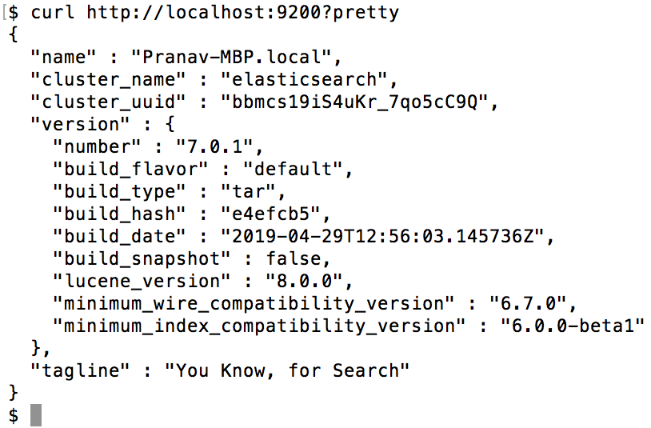

Lab 1. Introducing Elastic Stack
---------------------------------------------


In this lab, we will cover the following topics:


-   What is Elasticsearch, and why use it?
-   A brief history of Elasticsearch and Apache Lucene
-   Elastic Stack components
-   Use cases of Elastic Stack


### Running Elasticsearch


Elasticsearch can be downloaded as a ZIP, TAR, DEB, or RPM package. We will use the ZIP format as it is the least intrusive and the easiest
for development purposes

1. Elasticsearch has been already downloaded at following path: `/elasticstack/elasticsearch-7.12.1` and bin folder is added to `PATH` variable.
2. Important: Switch to `elasticsearch` user as we cannot run elkastic as **root** user and type elasticsearch to start from /elasticstack/logstash-7.12.1/bin.

```
    $  su elasticsearch
    $  elasticsearch
```

3.  Run `curl http://localhost:9200` or open the URL in Midori browser (launch from Desktop).


You should see an output like this:





Congratulations! You have just set up a single-node Elasticsearch cluster.

### Running Kibana


Kibana can be downloaded as a ZIP, TAR, DEB, or RPM package. We will use the ZIP format as it is the least intrusive and the easiest
for development purposes.

1. Kibana has been already downloaded at following path: `/elasticstack/kibana-7.12.1-linux-x86_64` and bin folder added to `PATH` variable.
2. Important: Switch to `elasticsearch` user and type `kibana` to start the service.

```
    $  su elasticsearch
    $  kibana
```


3.  Open `http://localhost:5601` in Midori browser. We will use Kibana in the next lab.


Congratulations! You have a working setup of Elasticsearch and Kibana.


Summary
-------------------------


In this lab, we started Elasticsearch and Kibana to begin the journey of learning about the Elastic Stack.

In the next lab, we will understand the core concepts of
Elasticsearch. We will learn about indexes, types, shards, datatypes,
mappings, and other fundamentals. We will also interact with
Elasticsearch by using **Create**, **Read**, **Update,** and **Delete** (CRUD) operations, and learn the basics of searching.
