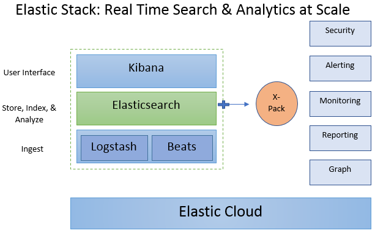

Lab 1. Introducing Elastic Stack
---------------------------------------------


The emergence of the web, mobiles, social networks, blogs, and photo
sharing has created a massive amount of data in recent years. These new
data sources create information that cannot be handled using traditional
data storage technology, typically relational databases. As an
application developer or business intelligence developer, your job is to
fulfill the search and analytics needs of the application.

A number of data stores, capable of big data scale, have emerged in the
last few years. These include Hadoop ecosystem projects, several NoSQL
databases, and search and analytics engines such as Elasticsearch. 

The Elastic Stack is a rich ecosystem of components serving as a full
search and analytics stack. The main components of the Elastic Stack are
Kibana, Logstash, Beats, X-Pack, and Elasticsearch.

Elasticsearch is at the heart of the Elastic Stack, providing storage,
search, and analytical capabilities. Kibana, also referred to as a
[**window**] into the Elastic Stack, is a user interface for
the Elastic Stack with great visualization capabilities. Logstash and
Beats help get the data into the Elastic Stack. X-Pack provides powerful
features including monitoring, alerting, security, graph, and machine
learning to make your system production-ready. Since Elasticsearch is at
the heart of the Elastic Stack, we will cover the stack inside-out,
starting from the heart and moving on to the surrounding components.

In this lab, we will cover the following topics:


-   What is Elasticsearch, and why use it?
-   A brief history of Elasticsearch and Apache Lucene
-   Elastic Stack components
-   Use cases of Elastic Stack


We will look at what Elasticsearch is and why you should consider it as
your data store. Once you know the key strengths of Elasticsearch, we
will look at the history of Elasticsearch and its underlying technology,
Apache Lucene. We will then look at some use cases of the Elastic Stack,
and provide an overview of the Elastic Stack\'s components.


------------------------------------------------------------------------


Since you are reading this book, you probably
already know what Elasticsearch is. For the sake of completeness, let\'s define Elasticsearch:

> [*Elasticsearch is a real-time, distributed search and analytics
> engine that is horizontally scalable and capable of solving a wide
> variety of use cases. At the heart of the Elastic Stack, it centrally
> stores your data so you can discover the expected and uncover the
> unexpected.*] 


Elasticsearch is at the core of the Elastic Stack, playing the central
role of a search and analytics engine. Elasticsearch is built on a
radically different technology, Apache Lucene. This fundamentally
different technology in Elasticsearch sets it apart from traditional
relational databases and other NoSQL solutions. Let\'s look at the key
benefits of using Elasticsearch as your data store:


-   Schemaless, document-oriented
-   Searching
-   Analytics
-   Rich client library support and the REST API
-   Easy to operate and easy to scale
-   Near real-time
-   Lightning-fast
-   Fault-tolerant


Let\'s look at each benefit one by one.


### Schemaless and document-oriented


Elasticsearch does not impose a
strict structure on your data; you can store
any JSON documents. JSON documents are first-class citizens in
Elasticsearch as opposed to rows and columns in a relational database. A
document is roughly equivalent to a record in a relational database
table. Traditional relational databases require a schema to be defined
beforehand to specify a fixed set of columns and their data types and
sizes. Often the nature of data is very dynamic, requiring support for
new or dynamic columns. JSON documents naturally support this type of
data. For example, take a look at the following document:

```
{
 "name": "John Smith",
 "address": "121 John Street, NY, 10010",
 "age": 40
}
```

This document may represent a customer\'s record. Here the record has
the `name`, `address`, and `age` fields of
the customer. Another record may look like the following:

```
{
 "name": "John Doe",
 "age": 38,
 "email": "john.doe@company.org"
}
```

Note that the second customer doesn\'t have the `address`
field but, instead, has an `email` address. In fact, other
customer documents may have completely different sets of fields. This
provides a tremendous amount of flexibility in terms of what can be
stored.

### Searching capability


The core strength of Elasticsearch lies in its text-processing
capabilities. Elasticsearch is great at
searching, especially full-text searches. Let\'s understand what a
full-text search is:

[**Full-text search **]means searching through all the terms of
all the documents available in the database. This requires the entire
contents of all documents to be parsed and
stored beforehand. When you hear full-text search, think of Google
Search[*. *] You can enter any search term and Google looks
through all of the web pages on the internet to find the best-matching
web pages. This is quite different from simple SQL queries run against
columns of type `string` in relational databases. Normal SQL
queries with a `WHERE` clause and an equals (`=`)
or `LIKE`[* *] clause try to do an exact or wildcard
match with underlying data. SQL queries can, at best, just match the
search term to a sub-string within the text column.

When you want to perform a search similar to a Google search on your own
data, Elasticsearch is your best bet. You can index emails, text
documents, PDF files, web pages, or practically any unstructured text
documents and search across all your documents with search terms.

At a high level, Elasticsearch breaks up text data into
terms and makes every term searchable by
building Lucene indexes. You can build your own fast and flexible
Google-like search for your application.

In addition to supporting text data, Elasticsearch also supports
other data types such as numbers, dates, geolocations, IP addresses, and
many more. We will take an in-depth look at searching in Lab 3,
[*Searching-What is Relevant*] .

### Analytics


Apart from searching, the second most
important [**functional**] strength of Elasticsearch is
analytics. Yes, what was originally known as just a full-text search
engine is now used as an analytics engine in a variety of use cases.
Many organizations are running analytics solutions powered by
Elasticsearch in production.

Conducting a search is like zooming in and finding a needle in a
haystack, that is, locating precisely what is needed within huge amounts
of data. Analytics is exactly the opposite of a search; it is
about zooming out and taking a look at the bigger picture. For example,
you may want to know how many visitors on your website are from the
United States as opposed to every other country, or you may want to know
how many of your website\'s visitors use macOS, Windows, or Linux.

Elasticsearch supports a wide variety of aggregations for analytics.
Elasticsearch aggregations are quite powerful and can be applied to
various data types. We will take a look at the analytics capabilities of
Elasticsearch in Lab 4, [*Analytics with Elasticsearch*] .

### Rich client library support and the REST API


Elasticsearch has very rich client library
support to make it accessible to many
programming languages. There are client libraries available for Java,
C\#, Python, JavaScript, PHP, Perl, Ruby, and many more. Apart from the
official client libraries, there are community-driven libraries for 20
plus programming languages. 

Additionally, Elasticsearch has a very rich [**REST**]
([**Representational State Transfer**]) API, which works on the
HTTP protocol. The REST API is very well
documented and quite comprehensive, making all operations available over
HTTP.

All this means that Elasticsearch is very easy to integrate into any
application to fulfill your search and analytics needs.

### Easy to operate and easy to scale 


Elasticsearch can run on a single node and easily scale out to hundreds of nodes. It is very easy to start a
single node instance of Elasticsearch; it works out of the box without any
configuration changes and scales to hundreds
of nodes.


### Note

[**Horizontal scalability **]is the ability to scale a
system horizontally by starting up multiple instances of the same type
rather than making one instance more and more powerful. [**Vertical
scaling **]is about upgrading a single instance by adding more
processing power (by increasing the number of CPUs or CPU cores),
memory, or storage capacity. There is a practical limit to how much a
system can be scaled vertically due to cost and other factors, such as
the availability of higher-end hardware. 


Unlike most traditional databases that only allow vertical scaling,
Elasticsearch can be scaled horizontally. It can run on tens or hundreds
of commodity nodes instead of one extremely expensive server. Adding a
node to an existing Elasticsearch cluster is as easy as starting up a
new node in the same network, with virtually no extra configuration. The
client application doesn\'t need to change, whether it is running
against a single-node or a hundred-node cluster.

### Near real-time capable


Typically, data is available for queries within a second after being indexed (saved). Not all big data storage
systems are real-time capable. Elasticsearch allows you to index
thousands to hundreds of thousands of documents per second and makes
them available for searching almost immediately.

### Lightning--fast


Elasticsearch uses Apache Lucene as its
underlying technology.By default, Elasticsearch indexes all the fields
of your documents. This is extremely invaluable as you can query or
search by any field in your records. You will never be in a situation in
which you think, [*If only I had chosen to create an index on this
field*] . Elasticsearch contributors have leveraged Apache
Lucene to its best advantage, and there are other optimizations that
make it lightning-fast.

### Fault-tolerant


Elasticsearch clusters can keep running even
when there are hardware failures such as node failure and network
failure. In the case of node failure, it replicates all the data on the
failed node to another node in the cluster. In the case of network
failure, Elasticsearch seamlessly elects master replicas to keep the
cluster running. Whether it is a case of node or network failure, you
can rest assured that your data is safe.

Now that you know when and why Elasticsearch could be a great choice,
let\'s take a high-level view of the ecosystem -- the Elastic Stack.


Exploring the components of the Elastic Stack
---------------------------------------------------------------


The Elastic Stack components are shown in the
following diagram. It is not necessary to include all of them in your
solution. Some components are general-purpose and can be used outside
the Elastic Stack without using any other components.

Let\'s look at the purpose of each component and how they fit into the
stack:




### Elasticsearch


[**Elasticsearch**] is at the heart
of the Elastic Stack. It stores all your data and provides search and
analytic capabilities in a scalable way.We have already looked at the strengths of Elasticsearch and why you would
want to use it. Elasticsearch can be used without using any other
components to power your application in terms of search and analytics.
We will cover Elasticsearch in great detail in Lab 2, [*Getting
Started with Elasticsearch*], Lab 3, [*Searching-What is
Relevant*], and Lab 4, [*Analytics with
Elasticsearch*] .

### Logstash


[**Logstash**] helps centralize event data such as logs,metrics, or any other data in any format.
It can perform a number of transformations before sending it to a stash of your choice.It is a key component of the
Elastic Stack, used to centralize the collection and transformation
processes in your data pipeline.

Logstash is a server-side component. Its role is to
centralize the collection of data from a wide
number of input sourcesin a scalable way, and transform and send the
data to an output of your choice. Typically, the output is sent to
Elasticsearch, but Logstash is capable of sending it to a wide variety
of outputs. Logstash has a plugin-based, extensible architecture. It
supports three types of plugin: input plugins, filter plugins, and
output plugins. Logstash has a collection of 200+ supported plugins and
the count is ever increasing.

Logstash is an excellent general-purpose data flow engine that helps in
building real-time, scalable data pipelines.

### Beats


[**Beats **]is a platform of open source lightweight data shippers. Its role is complementary
to Logstash. Logstash is a server-side component, whereas Beats has a
role on the client side. Beats consists of a
core library, `libbeat`, which provides an API for shipping
data from the source, configuring the input options, and implementing
logging. Beats is installed on machines that are not part of server-side
components such as Elasticsearch, Logstash, or Kibana. These agents
reside on non-cluster nodes, which are sometimes called [**edge nodes**].

Many Beat components have already been built by the Elastic team and the
open source community. The Elastic team has built Beats
including Packetbeat, Filebeat, Metricbeat, Winlogbeat, Audiobeat, and
Heartbeat.[* *] 

Filebeat is a single-purpose Beat built to ship log files from your
servers to a centralized Logstash server or Elasticsearch
server. Metricbeat[* *] is a server monitoring agent that
periodically collects metrics from the operating systems and services
running on your servers. There are already around 40 community Beats
built for specific purposes, such as monitoring Elasticsearch,
Cassandra, the Apache web server, JVM performance, and so on. You can
build your own beat using `libbeat`,[* *] if you
don\'t find one that fits your needs.


### Kibana


Kibana is the visualization tool for the Elastic Stack, and can
help you gain powerful insights about your
data in Elasticsearch. It is often called a window into the Elastic
Stack. It offers many visualizations
includinghistograms,maps, line charts, time series, and more. You can
build visualizations with just a few clicks and interactively explore
data. It lets you build beautiful dashboards by combining different
visualizations, sharing with others, and exporting high-quality reports.

Kibana also has management and development tools. You can manage
settings and configure X‑Pack security features for Elastic Stack.
Kibana also has development tools that enable developers to build and
test REST API requests.

We will explore Kibana in Lab 7, [*Visualizing Data with
Kibana*] .

### X-Pack


X-Pack adds essential features to make the
Elastic Stack production-ready. It adds
[**security**], [**monitoring**],
[**alerting**], [**reporting**], [**graph**],
and [**machine learning capabilities**] to the Elastic Stack.


#### Security


The security plugin within X-Pack adds
authentication and authorization capabilities to Elasticsearch and
Kibana so that only authorized people can access data, and they can only
see what they are allowed to. The security plugin works across
components seamlessly, securing access to Elasticsearch and Kibana.

The security extension also lets you configure fields and document-level
security with the licensed version.

#### Monitoring


You can monitor your Elastic Stack components so that there is no downtime. The monitoring component in X-Pack
lets you monitor your Elasticsearch clusters and Kibana.

You can monitor clusters, nodes, and index-level metrics. The monitoring
plugin maintains a history of performance so you can compare current
metrics with past metrics. It also has a capacity planning feature.

#### Reporting


The reporting plugin within X-Pack allows for
generating printable, high-quality reports from Kibana visualizations.
The reports can be scheduled to run periodically or on a per-event
basis.

#### Alerting


X-Pack has sophisticated alerting capabilities that can alert you in multiple possible ways when certain
conditions are met. It gives tremendous flexibility in terms of when,
how, and who to alert. 

You may be interested in detecting security breaches, such as when
someone has five login failures within an hour from different locations
or finding out when your product is trending on social media. You can
use the full power of Elasticsearch queries to check when complex
conditions are met.

Alerting provides a wide variety of options in terms of how alerts are
sent. It can send alerts via email, Slack, Hipchat, and PagerDuty.

#### Graph


Graph lets you explore relationships in your
data. Data in Elasticsearch is generally perceived as a flat list of
entities without connections to other entities. This relationship opens
up the possibility of new use cases. Graph can surface relationships
among entities that share common properties such as people, places,
products, or preferences. 

Graph consists of the Graph API and a UI within Kibana, that let you
explore this relationship. Under the hood, it leverages distributed
querying, indexing at scale, and the relevance capabilities of
Elasticsearch.

#### Machine learning


X-Pack has a machine learning module, which is for
learning from patterns within data. Machine
learning is a vast field that includes supervised learning, unsupervised
learning, reinforcement learning, and other specialized areas such as
deep learning. The machine learning module within X-Pack is limited to
anomaly detection in time series data, which falls under the
unsupervised learning branch of machine learning.

We will look at some X-Pack components in Lab
8, [*Elastic X-Pack*] .


### Elastic Cloud


Elastic Cloud is the cloud-based, hosted, and managed
setup of the Elastic Stack components. The
service is provided by Elastic (<https://www.elastic.co/>), which is
behind the development of Elasticsearch and
other Elastic Stack components. All Elastic Stack components
are open source except X-Pack (and Elastic
Cloud). Elastic, the company, provides services for Elastic Stack
components including training, development, support, and cloud hosting.

Apart from Elastic Cloud, other hosted solutions are available for
Elasticsearch, including one from [**Amazon Web Services**] ([**AWS**]). The advantage of Elastic
Cloud is that it is developed and maintained by the original creators of
Elasticsearch and other Elastic Stack components.


Use cases of Elastic Stack
--------------------------------------------


Elastic Stack components have a variety of practical use cases, and new
use cases are emerging as more plugins are
added to existing components. As mentioned earlier, you may use a subset
of the components for your use case. The following list of example use
cases is by no means exhaustive, but highlights some of the most common
ones:


-   Log and security analytics
-   Product search
-   Metrics analytics
-   Web searches and website searches


Let\'s look at each use case.


### Log and security analytics


The Elasticsearch, Logstash, and Kibana trio was, previously, very
popular as a stack. The presence of
Elasticsearch, Logstash, and Kibana (also known as [**ELK**])
makes the Elastic Stack an excellent stack
for aggregating and analyzing logs in a central place.

Application support teams face a great challenge in administering and
managing large numbers of applications deployed across tens or hundreds
of servers. The application infrastructure could have the following
components:


-   Web servers
-   Application servers
-   Database servers
-   Message brokers


Typically, enterprise applications have all,
or most, of the types of servers described
earlier, and there are multiple instances of each server. In the event
of an error or production issue, the support team has to log in to
individual servers and look at the errors. It is quite inefficient to
log in to individual servers and look at the raw log files. The Elastic
Stack provides a complete toolset to collect, centralize, analyze,
visualize, alert, and report errors as they occur. Each component can be
used to solve this problem as follows:


-   The Beats framework, Filebeat in particular, can run as a
    lightweight agent to collect and forward logs.
-   Logstash can centralize events received from Beats, and parse and
    transform each log entry before sending it to the Elasticsearch
    cluster.
-   Elasticsearch indexes logs. It enables both search and analytics on
    the parsed logs.
-   Kibana then lets you create visualizations based on errors,
    warnings, and other information logs. It lets you create dashboards
    on which you can centrally monitor events as they occur, in real
    time.
-   With X-Pack, you can secure the solution, configure alerts, get
    reports, and analyze relationships in data.


As you can see, you can get a complete log aggregation and monitoring
solution using Elastic Stack.

A security analytics solution would be very similar to this; the logs
and events being fed into the system would pertain to firewalls,
switches, and other key network elements.

### Product search


A product search involves searching for the
most relevant product from thousands or tens of thousands of products
and presenting the most relevant products at the top of the list before
other, less relevant, products. You can directly relate this problem to
e-commerce websites, which sell huge numbers of products sold by many
vendors or resellers.

Elasticsearch\'s full-text and relevance search
capabilities can find the best-matching
results. Presenting the best matches on the first page has great value
as it increases the chances of the customer actually buying the product.
Imagine a customer searching for the iPhone 7, and the results on the
first page showing different cases, chargers, and accessories for
previous iPhone versions. Text analysis capabilities backed by Lucene,
and innovations added by Elasticsearch, ensure that the search shows
iPhone 7 chargers and cases as the best match.

This problem, however, is not limited to e-commerce websites. Any
application that needs to find the most relevant item from millions, or
billions, of items, can use Elasticsearch to solve this problem.

### Metrics analytics


Elastic Stack has excellent analytics
capabilities, thanks to the rich Aggregations
API in Elasticsearch. This makes it a perfect tool for analyzing data
with lots of metrics. Metric data consists of numeric values as opposed
to unstructured text such as documents and web pages. Some examples are
data generated by sensors, [**Internet of Things**] ([**IoT**]) devices, metrics generated by
mobile devices, servers, virtual machines, network routers, switches,
and so on. The list is endless.

Metric data is, typically, also time series; that is, values or measures
are recorded over a period of time. Metrics that are recorded are
usually related to some entity. For example, a temperature reading
(which is a metric) is recorded for a particular sensor device with a
certain identifier. The type, name of the building, department, floor,
and so on are the dimensions associated with the metric. The dimensions
may also include the location of the sensor device, that is, the
longitude and latitude.

Elasticsearch and Kibana allow for slicing and dicing metric data along
different dimensions to provide a deep insight into your data.
Elasticsearch is very powerful at handling time series and geospatial
data, which means you can plot your metrics on line charts and area
charts aggregating millions of metrics. You can also conduct geospatial
analysis on a map.

We will build a metrics analytics application using the Elastic Stack in
Lab 9, [*Building a Sensor Data Analytics Application*] .

### Web search and website search


Elasticsearch can serve as a search engine
for your website and perform a Google-like search across the entire
content of your site. GitHub, Wikipedia, and many other platforms power their searches using Elasticsearch.

Elasticsearch can be leveraged to build content aggregation platforms.
[*What is a content aggregator or a content aggregation
platform*] ? Content aggregators scrape/crawl multiple
websites, index the web pages, and provide a search functionality on the
underlying content. This is a powerful way to build domain-specific,
aggregated platforms. 

Apache Nutch, an open source, large-scale web
crawler, was created by [**Doug Cutting**], the original
creator of Apache Lucene. Apache Nutch crawls the web, parses HTML
pages, stores them, and also builds indexes to make the content
searchable. Apache Nutch supports indexing into Elasticsearch or Apache
Solr for its search engine.

As is evident, Elasticsearch and the Elastic Stack have many practical
use cases. The Elastic Stack is a platform with a complete set of tools
to build end-to-end search and analytics solutions. It is a very
approachable platform for developers, architects, business intelligence
analysts, and system administrators. It is possible to put together an
Elastic Stack solution with almost zero coding and only configuration.
At the same time, Elasticsearch is very customizable, that is,
developers and programmers can build powerful applications using its
rich programming language support and REST API.


Downloading and installing
--------------------------------------------


Now that we have enough motivation and reasons to learn about
Elasticsearch and the Elastic Stack, let\'s
start by downloading and installing the key components. Firstly, we will
download and install Elasticsearch and
Kibana. We will install the other components as we need them on the
course of our journey. We also need Kibana because, apart from
visualizations, it also has a UI for developer tools and for interacting
with Elasticsearch.

Starting from Elastic Stack 5.x, all Elastic Stack components are now
released together; they share the same version and are tested for
compatibility with each other. This is also true for Elastic Stack 6.x
components. 

At the time of writing, the current version of Elastic Stack is 7.0.0.
We will use this version for all components.


### Installing Elasticsearch


Elasticsearch can be downloaded as a ZIP,
TAR, DEB, or RPM package. If you are on Ubuntu, Red Hat, or CentOS
Linux, it can be directly installed using `apt` or
`yum`.

We will use the ZIP format as it is the least intrusive and the easiest
for development purposes:


1.  Go to <https://www.elastic.co/downloads/elasticsearch> and download
    the ZIP distribution. You can also download an older version if you
    are looking for an exact version. 
2.  Extract the file and change your directory to the top-level
    extracted folder. Run `bin/elasticsearch` or
    `bin/elasticsearch.bat`.
3.  Run `curl http://localhost:9200` or open the URL in your
    favorite browser.


You should see an output like this:


Congratulations! You have just set up a single-node Elasticsearch
cluster.

### Installing Kibana


Kibana is also available in a variety of
packaging formats such as ZIP, TAR.GZ, RMP, and DEB for 32-bit and
64-bit architecture machines: 


1.  Go to <https://www.elastic.co/downloads/kibana> and download the ZIP
    or TAR.GZ distribution for the platform that you are on. 
2.  Extract the file and change your directory to the top-level
    extracted folder. Run `bin/kibana` or
    `bin/kibana.bat`.
3.  Open `http://localhost:5601` in your favorite browser.


Congratulations! You have a working setup of Elasticsearch and Kibana.


Summary
-------------------------


In this lab, we started by understanding the motivations of various
search and analytics technologies other than relational databases and
NoSQL stores. We looked at the strengths of Elasticsearch, which is at
the heart of the Elastic Stack. We then looked at the rest of the
components of the Elastic Stack and how they fit into the ecosystem. We
also looked at real-world use cases of the Elastic Stack. We
successfully downloaded and installed Elasticsearch and Kibana to begin
the journey of learning about the Elastic Stack.

In the next lab, we will understand the core concepts of
Elasticsearch. We will learn about indexes, types, shards, datatypes,
mappings, and other fundamentals. We will also interact with
Elasticsearch by using [**Create**], [**Read**],
[**Update,**] and [**Delete**] ([**CRUD**])
operations, and learn the basics of searching.
