Lab 10. Building a Sensor Data Analytics Application
-----------------------------------------------------------------


In the previous lab, we saw how you can take an Elastic Stack
application to production. Armed with all the knowledge of the Elastic
Stack and the techniques for taking applications to production, we are
ready to apply these concepts in a real-world application. In this
lab, we will build one such application using the Elastic Stack that
can handle a large amount of data, applying the techniques that we have
learned so far.

We will cover the following topics as we build a sensor-data analytics
application:


-   Introduction to the application
-   Modeling data in Elasticsearch
-   Setting up the metadata database
-   Building the Logstash data pipeline
-   Sending data to Logstash over HTTP
-   Visualizing the data in Kibana


Let\'s go through the topics.


Introduction to the application
-------------------------------------------------


The internet of things ([**IoT**])  has found a
wide range of applications in modern times. IoT can be defined as follows:


> [*The Internet of things (IoT) is the collective web of connected
> smart devices that can sense and communicate with each other by
> exchanging data via the Internet.*] 


IoT devices are connected to the internet;
they [**sense**] and [**communicate**].
They are equipped with different types of sensors that collect the data
they observe and transmit it over the internet. This data can be stored,
analyzed, and often acted upon in near-real time. The number of such
connected devices is projected to rise rapidly; according to Wikipedia,
there will be an estimated 30 billion connected devices by 2020. Since
each device can capture the current value of a metric and transmit it
over the internet, this can result in massive amounts of data.

A plethora of different types of sensors have emerged in recent times
for temperature, humidity, light, motion, and airflow; these can be used
in different types of applications. Each sensor can be programmed to
take a current reading and send it over the internet.

Let\'s consider the following diagram for our
understanding:


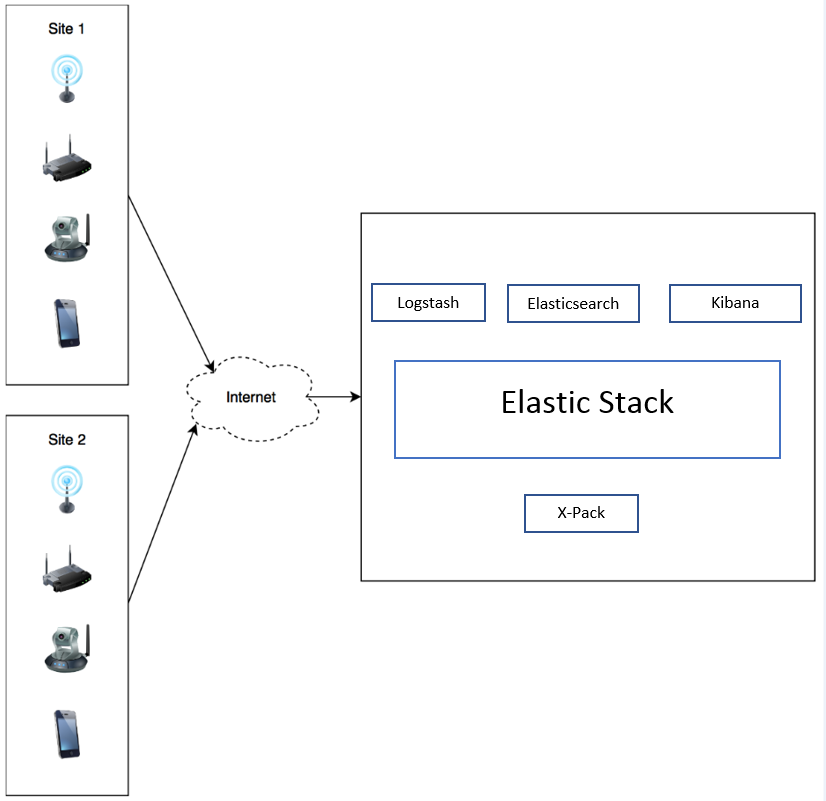


Figure 10.1: Connected devices and sensors sending data to Elastic Stack

Figure 10.1 provides an idea of the high-level
architecture of the system that we will
discuss in this lab. The left-hand side of the figure depicts
various types of devices equipped with sensors. These devices are
capable of capturing different metrics and sending them over the
internet for long-term storage and analysis. In the right half of the
figure, you see the server-side components on the other side of the
internet. The server-side components primarily consist of the Elastic
Stack.

In this lab, we will look at an application in which we want to
store and analyze sensor data from two types of sensors: temperature and
humidity sensors, placed at various locations.

Sensors can be deployed across multiple sites or locations, with each
site connected to the internet as shown in the figure. Our example
demonstrates two types of sensors, temperature, and humidity, but the
application can be extended to support any kind of sensor data.

We will cover the following points about the system in this section:


-   Understanding the sensor-generated data
-   Understanding the sensor metadata
-   Understanding the final stored data


Let\'s go deep into the application by understanding each topic one by
one.


### Understanding the sensor-generated data


What does the data look like when it is generated by the sensor? The
sensor sends JSON-format data over the
internet and each reading looks like the following:

```
{
  "sensor_id": 1,
  "time": 1511935948000,
  "value": 21.89
} 
```

Here, we can see the following:


-   The `sensor_id` field is the unique identifier of the
    sensor that has emitted the record.
-   The `time` field is the time of the reading in
    milliseconds since the epoch, that is, 00:00:00 on January 1, 1970.
-   The `value` field is the actual metric value emitted by
    the sensor.


This type of JSON payload is generated every minute by all the sensors
in the system. Since all sensors are registered in the system, the
server-side system has the associated metadata with each sensor. Let\'s
look at the sensor-related metadata that is available to us on the
server side in a database.

### Understanding the sensor metadata


The metadata about all the sensors across all locations is
available to us in a relational database. In
our example, we have stored it in MySQL. This type of metadata can be
stored in any relational database other than MySQL. It can also be
stored in Elasticsearch in an index. 

The metadata about sensors primarily contains the following details:


-   [**Type of sensor**]: What type of sensor is it? It can be
    a temperature sensor, a humidity sensor, and so on.
-   [**Location-related metadata**]: Where is the sensor with
    the given sensor ID physically located? Which customer is it
    associated with?


This information is stored in the following three tables in MySQL:


-   `sensor_type`: Defines various sensor types and
    their `sensor_type_id`:


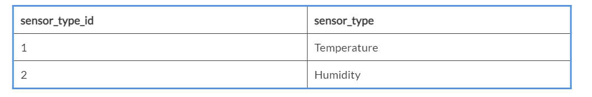


-   `location`: This defines locations with their latitude/longitude and address within a physical
    building:


-   `sensors`:[** **]This
    maps `sensor_id` with sensor types and locations:


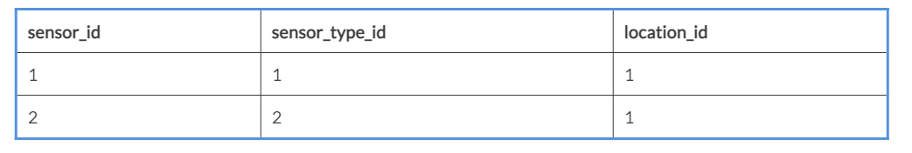


Given this database design, it is possible to look up all of the
metadata associated with the given `sensor_id` using the
following SQL query:

```
select 
    st.sensor_type as sensorType,
    l.customer as customer,
    l.department as department,
    l.building_name as buildingName,
    l.room as room,
    l.floor as floor,
    l.location_on_floor as locationOnFloor,
    l.latitude,
    l.longitude
from
    sensors s
        inner join
    sensor_type st ON s.sensor_type_id = st.sensor_type_id
        inner join
    location l ON s.location_id = l.location_id
where
    s.sensor_id = 1; 
```

The result of the previous query will look like this:

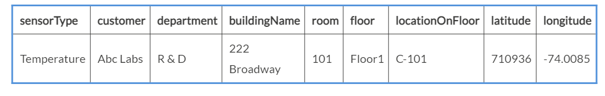

 

Up until now, we have seen the format of
incoming sensor data from the client side. We
have also established a mechanism to look up the associated metadata for
the given sensor.

Next, we will see what the final enriched record should look like.

### Understanding the final stored data


By combining the data that is coming from the
client side and contains the sensor\'s metric
value for a given metric at a given time, we can construct an enriched
record of the following fields:


-   `sensorId`
-   `sensorType`
-   `customer`
-   `department`


-   `buildingName`
-   `room`
-   `floor`
-   `locationOnFloor`
-   `latitude`
-   `longitude`
-   `time`
-   `reading`


Field numbers 1, 11, and 12 are present in the payload sent by the
sensor to our application. The remaining fields are looked up or
enriched using the SQL query that we saw in the previous section --
using the `sensorId`. This way, we can generate a denormalized
sensor reading record for every sensor for every minute. 

We have understood what the application is about and what the data
represents. As we start developing the application, we will start the
solution from the inside out. It is better to attack the problem at hand
at the very heart and try to piece together its core. Elasticsearch is
at the core of the Elastic Stack, so we will start defining our solution
from it\'s very heart by first building the data model in Elasticsearch.
Let\'s do that in the next section.


Modeling data in Elasticsearch
------------------------------------------------


We have seen the structure of the final
record after enriching the data. That should
help us model the data in Elasticsearch. Given that our data is time
series data, we can apply some of the techniques mentioned in Lab
9, [*Running the Elastic Stack in Production*], to model the
data:


-   Defining an index template
-   Understanding the mapping


Let\'s look at the index template that we will define.


### Defining an index template


Since we are going to be storing time series
data that is immutable, we do not want to
create one big monolithic index. We\'ll use the techniques discussed
in the [*Modeling time series data*]  section in Lab
9, [*Running the Elastic Stack in Production*] .

The source code of the application in this lab is within the GitHub
repository
at <https://github.com/fenago/elasticsearch/tree/v7.0/lab-10>.
As we go through the lab, we will perform the steps mentioned in
the `README.md` file located at that path.

Please create the index template mentioned in [*Step 1*]  of
the `README.md` file or execute the following script in your
Kibana Dev Tools Console:

```
POST _template/sensor_data_template
{
  "index_patterns": [
    "sensor_data*"
  ],
  "settings": {
    "number_of_replicas": "1",
    "number_of_shards": "5"
  },
  "mappings": {
    "properties": {
      "sensorId": {
        "type": "integer"
      },
      "sensorType": {
        "type": "keyword",
        "fields": {
          "analyzed": {
            "type": "text"
          }
        }
      },
      "customer": {
        "type": "keyword",
        "fields": {
          "analyzed": {
            "type": "text"
          }
        }
      },
      "department": {
        "type": "keyword",
        "fields": {
          "analyzed": {
            "type": "text"
          }
        }
      },
      "buildingName": {
        "type": "keyword",
        "fields": {
          "analyzed": {
            "type": "text"
          }
        }
      },
      "room": {
        "type": "keyword",
        "fields": {
          "analyzed": {
            "type": "text"
          }
        }
      },
      "floor": {
        "type": "keyword",
        "fields": {
          "analyzed": {
            "type": "text"
          }
        }
      },
      "locationOnFloor": {
        "type": "keyword",
        "fields": {
          "analyzed": {
            "type": "text"
          }
        }
      },
      "location": {
        "type": "geo_point"
      },
      "time": {
        "type": "date"
      },
      "reading": {
        "type": "double"
      }
    }
  }
}
```

This index template will create a new index with the name
`sensor_data-YYYY.MM.dd` when any client attempts to index the
first record in this index. We will see later in this lab how this
can be done from Logstash under [*Building the Logstash data
pipeline*]  section.

### Understanding the mapping


The mapping that we defined in the index
template contains all the fields that will be
present in the denormalized record after lookup. A few things to notice
in the index template mapping are as follows:


-   All the fields that contain a `text` type of data are
    stored as the `keyword` type; additionally, they are
    stored as `text` in an analyzed field. For example, please
    have a look at the `customer` field.
-   The latitude and longitude fields that we had in the enriched data
    are now mapped to a `geo_point` type of field with the
    field name of `location`[**.**]


At this point, we have defined an index template that will trigger the
creation of an index with the mapping we defined in the template. 


Setting up the metadata database
--------------------------------------------------


We need to have a database that has metadata about the sensors. This database will hold the tables that we
discussed in the [*Introduction to the application*]  section.

We are storing the data in a relational database MySQL, but you can use
any other relational database equally well. Since we are using MySQL, we
will be using the MySQL JDBC driver to connect to the database. Please
ensure that you have the following things set up on your system:


1.  MySQL database community version 5.5, 5.6, or 5.7. You can use an
    existing database if you already have it on your system.
2.  Install the downloaded MySQL database and log in with the root user.
    Execute the script
    available  <https://github.com/fenago/elasticsearch/tree/v7.0/lab-10/files/create_sensor_metadata.sql>.
3.  Log in to the newly created `sensor_metadata` database and
    verify that the three
    tables, `sensor_type`, `locations`,
    and` sensors`, exist in the database.


You can verify that the database was created and populated successfully
by executing the following query:

```
select 
    st.sensor_type as sensorType,
    l.customer as customer,
    l.department as department,
    l.building_name as buildingName,
    l.room as room,
    l.floor as floor,
    l.location_on_floor as locationOnFloor,
    l.latitude,
    l.longitude
from
    sensors s
        inner join
    sensor_type st ON s.sensor_type_id = st.sensor_type_id
        inner join
    location l ON s.location_id = l.location_id
where
    s.sensor_id = 1; 
```

The result of the previous query will look like this:

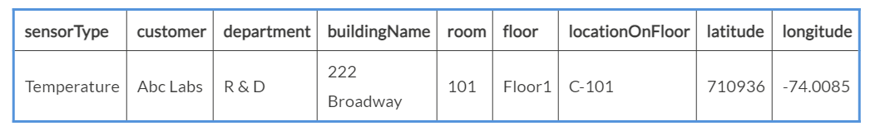

 

Our `sensor_metadata` database is ready to look up the
necessary sensor metadata. In the next section, we will build the
Logstash data pipeline.


Building the Logstash data pipeline
-----------------------------------------------------


Having set up the mechanism to automatically
create the Elasticsearch index and the metadata database, we can now
focus on building the data pipeline using Logstash. What should our data
pipeline do? It should perform the following steps:


-   Accept JSON requests over the web (over HTTP).
-   Enrich the JSON with the metadata we have in the MySQL database.
-   Store the resulting documents in Elasticsearch.


These three main functions that we want to perform correspond exactly
with the Logstash data pipeline\'s input, filter, and output plugins,
respectively. The full Logstash configuration file for this data
pipeline is in the code base
at <https://github.com/fenago/elasticsearch/tree/v7.0/lab-10/files/logstash_sensor_data_http.conf>.

Let us look at how to achieve the end goal of our data pipeline by
following the aforementioned steps. We will start with accepting JSON
requests over the web (over HTTP).


### Accepting JSON requests over the web


This function is achieved by the input
plugin. Logstash has support for the `http` input plugin,
which does precisely that. It builds an HTTP interface using different
types of payloads that can be submitted to Logstash as an input.

The relevant part from `logstash_sensor_data_http.conf`, which
has the input filter, is as follows:

```
input {
  http {
    id => "sensor_data_http_input"
  }
}
```

Here, the `id` field is a string that can uniquely identify
this input filter later in the file if needed. We will not need to
reference this name in the file; we just choose the name
`sensor_data_http_input`.

The reference documentation of the HTTP input plugin is available
at: <https://www.elastic.co/guide/en/logstash/current/plugins-inputs-http.html>. In
this instance, since we are using the default configuration of
the `http` input plugin, we have just
specified `id`. We should secure this HTTP endpoint as it will be exposed over the internet to allow
sensors to send data from anywhere. We can
configure `user` and `password` parameters to
protect this endpoint with the desired username and password, as
follows:

```
input {
  http {
    id => "sensor_data_http_input"
    user => "sensor_data"
    password => "sensor_data"
  }
}
```

When Logstash is started with this input plugin, it starts an HTTP
server on port `8080`, which is secured using basic
authentication with the given username and password. We can send a
request to this Logstash pipeline using a `curl` command, as
follows:

```
curl -XPOST -u sensor_data:sensor_data --header "Content-Type: application/json" "http://localhost:8080/" -d '{"sensor_id":1,"time":1512102540000,"reading":16.24}'
```

Let\'s see how we will enrich the JSON payload with the metadata we have
in MySQL.

### Enriching the JSON with the metadata we have in the MySQL database


The enrichment and other processing parts of the data pipeline can be done using filter plugins. We have
built a relational database that contains the tables and necessary
lookup data for enriching the incoming JSON requests.

Logstash has a `jdbc_streaming` filter plugin that can be used
to do lookups from any relational database and enrich the incoming JSON
documents. Let\'s zoom into the filter plugin section in our Logstash
configuration file:

```
filter {
  jdbc_streaming {
    jdbc_driver_library => "/path/to/mysql-connector-java-5.1.45-bin.jar"
    jdbc_driver_class => "com.mysql.jdbc.Driver"
    jdbc_connection_string => "jdbc:mysql://localhost:3306/sensor_metadata"
    jdbc_user => "root"
    jdbc_password => "<password>"
    statement => "select st.sensor_type as sensorType, l.customer as customer, l.department as department, l.building_name as buildingName, l.room as room, l.floor as floor, l.location_on_floor as locationOnFloor, l.latitude, l.longitude from sensors s inner join sensor_type st on s.sensor_type_id=st.sensor_type_id inner join location l on s.location_id=l.location_id where s.sensor_id= :sensor_identifier"
    parameters => { "sensor_identifier" => "sensor_id"}
    target => lookupResult
  }

  mutate {
    rename => {"[lookupResult][0][sensorType]" => "sensorType"}
    rename => {"[lookupResult][0][customer]" => "customer"}
    rename => {"[lookupResult][0][department]" => "department"}
    rename => {"[lookupResult][0][buildingName]" => "buildingName"}
    rename => {"[lookupResult][0][room]" => "room"}
    rename => {"[lookupResult][0][floor]" => "floor"}
    rename => {"[lookupResult][0][locationOnFloor]" => "locationOnFloor"}
    add_field => {
      "location" => "%{[lookupResult][0][latitude]},%{[lookupResult][0][longitude]}"
    }
    remove_field => ["lookupResult", "headers", "host"]
  }

}
```

As you will notice, there are two filter plugins used in the file:


-   `jdbc_streaming`
-   `mutate`


Let\'s see what each filter plugin is doing.


#### The jdbc\_streaming plugin 


We essentially specify the whereabouts of the database that we want to connect to, the
username/password, the JDBC driver `.jar` file, and the class.
We already created the database in the [*Setting up the metadata
database*]  section[*.*]  

Download the latest MySQL JDBC Driver, also known
as [**Connector**]/[**J**],
from <https://dev.mysql.com/downloads/connector/j/>. At the time of
writing this book, the latest version is 5.1.45, which works with MySQL
5.5, 5.6, and 5.7. Download the `.tar`/`.zip` file
containing the driver and extract it into your system. The path of this
extracted `.jar` file should be updated in
the `jdbc_driver_library` parameter.

To summarize, you should review and update the following parameters in
the Logstash configuration to point to your database and
driver `.jar` file:


-   `jdbc_connection_string`
-   `jdbc_password`
-   `jdbc_driver_library`


The `statement` parameter has the same SQL query that we saw
earlier. It looks up the metadata for the given `sensor_id`. A
successful query will fetch all additional fields for
that `sensor_id`. The result of the lookup query is stored in
a new field, `lookupResult`, as specified by
the `target` parameter.

The resulting document, up to this point,
should look like this:

```
{
  "sensor_id": 1,
  "time": 1512113760000,
  "reading": 16.24,
  "lookupResult": [
    {
      "buildingName": "222 Broadway",
      "sensorType": "Temperature",
      "latitude": 40.710936,
      "locationOnFloor": "Desk 102",
      "department": "Engineering",
      "floor": "Floor 1",
      "room": "101",
      "customer": "Linkedin",
      "longitude": -74.0085
    }
  ],
  "@timestamp": "2019-05-26T05:23:22.618Z",
  "@version": "1",
  "host": "0:0:0:0:0:0:0:1",
  "headers": {
    "remote_user": "sensor_data",
    "http_accept": "*\/*",
    ...
  }
}
```

As you can see, the `jdbc_streaming` filter plugin added some
fields apart from the `lookupResult` field. These fields were
added by Logstash and the `headers` field was added by the
HTTP input plugin.

In the next section, we will use the `mutate` filter plugin to
modify this JSON to the desired end result that we want in
Elasticsearch. 

#### The mutate plugin


As we have seen in the previous section, the
output of
the `jdbc_streaming` filter plugin has some undesired aspects.
Our JSON payload needs the following modifications:


-   Move the looked-up fields that are
    under `lookupResult` directly into the JSON file.
-   Combine the latitude and longitude fields under
    `lookupResult` as a location field.
-   Remove the unnecessary fields.


```
mutate {
    rename => {"[lookupResult][0][sensorType]" => "sensorType"}
    rename => {"[lookupResult][0][customer]" => "customer"}
    rename => {"[lookupResult][0][department]" => "department"}
    rename => {"[lookupResult][0][buildingName]" => "buildingName"}
    rename => {"[lookupResult][0][room]" => "room"}
    rename => {"[lookupResult][0][floor]" => "floor"}
    rename => {"[lookupResult][0][locationOnFloor]" => "locationOnFloor"}
    add_field => {
      "location" => "%{lookupResult[0]latitude},%{lookupResult[0]longitude}"
    }
    remove_field => ["lookupResult", "headers", "host"]
  }
```

Let\'s see how the `mutate` filter plugin achieves these
objectives.


##### Moving the looked-up fields that are under lookupResult directly in JSON


As we have seen, `lookupResult` is an array with just one element: the element at index `0`
in the array. We need to move all the fields under this array element
directly under the JSON payload. This is done field by field using
the `rename` operation.

For example, the following operation renames the
existing `sensorType` field directly under the JSON payload:

```
rename => {"[lookupResult][0][sensorType]" => "sensorType"}
```

We do this for all the looked-up fields that are returned by the SQL
query.

##### Combining the latitude and longitude fields under lookupResult as a location field


Remember when we defined the index template
mapping for our index? We defined the `location` field to be
of `geo_point` type. The `geo_point` type accepts a
value that is formatted as a string with latitude and longitude appended
together, separated by a comma.

This is achieved by using the `add_field` operation to
construct the `location` field, as follows:

```
 add_field => {
  "location" => "%{[lookupResult][0][latitude]},%{[lookupResult][0][longitude]}"
 }
```

By now, we should have a new field called `location` added to
our JSON payload, exactly as desired. Next, we will remove the
undesirable fields.

##### Removing the unnecessary fields


After moving all the elements from
the `lookupResult` field directly in the JSON, we don\'t need
that field anymore. Similarly, we don\'t want to store
the `headers` or the `host` fields
in the Elasticsearch index, so we remove them all at once using the
following operation:

```
remove_field => ["lookupResult", "headers", "host"]
```

We finally have the JSON payload in the structure that we want in the
Elasticsearch index. Next, let us see how to send it to Elasticsearch.


### Store the resulting documents in Elasticsearch


We use the Elasticsearch output plugin that
comes with Logstash to send data to Elasticsearch. The usage is very
simple; we just need to have `elasticsearch` under the output
tag, as follows:

```
output {
  elasticsearch {
    hosts => ["localhost:9200"]
    index => "sensor_data-%{+YYYY.MM.dd}"
  }
}
```

We have specified `hosts` and `index` to send the
data to the right index within the right cluster. Notice that the index
name has `%{YYYY.MM.dd}`. This calculates the index name to be
used by using the event\'s current time and formats the time in this
format.

Remember that we had defined an index template with the index
pattern `sensor_data*`. When the first event is sent on May
26, 2019, the output plugin defined here will send the event to
index `sensor_data-2019.05.26`.

If you want to send events to a secured Elasticsearch cluster as we did
when we used X-Pack in Lab 8, [*Elastic X-Pack*], you can
configure the `user` and `password` parameters as
follows:

```
output {
  elasticsearch {
    hosts => ["localhost:9200"]
    index => "sensor_data-%{+YYYY.MM.dd}"
    user => "elastic"
    password => "elastic"
  }
}
```

This way, we will have one index for every day, where each day\'s data
will be stored within its index. We had learned the index per time frame
in Lab 9[*, Running the Elastic Stack in Production.*] 

Now that we have our Logstash data pipeline ready, let\'s send some
data.


Sending data to Logstash over HTTP
----------------------------------------------------


At this point, sensors can start sending their readings to the Logstash data
pipeline that we have created in the previous section. They just need to
send the data as follows:

```
curl -XPOST -u sensor_data:sensor_data --header "Content-Type: application/json" "http://localhost:8080/" -d '{"sensor_id":1,"time":1512102540000,"reading":16.24}'
```

Since we don\'t have real sensors, we will simulate the data by sending
these types of requests. The simulated data and script that send this
data are incorporated in the code
at <https://github.com/fenago/elasticsearch/tree/master/lab-10/data>.

If you are on Linux or macOS, open the Terminal and change the
directory to your Learning Elasticstack
workspace that was checked out from GitHub.


### Note

If your machine has a Windows operating system, you will need a
Linux-like shell that supports the `curl` command and
basic [**BASH**] ([**Bourne Again SHell**]) commands.
As you may already have a GitHub workspace checked out, you may be
using [*Git for Windows, *] which has Git
BASH.[* *] This can be used to run the script that loads data.
If you don\'t have Git BASH, please download and install [*Git for
Windows*]  from <https://git-scm.com/download/win> and launch
Git BASH[* *] to run the commands mentioned in this section.


Now, go to
the `lab-10/data` directory and execute `load_sensor_data.sh`:

```
$ pwd
~/Desktop/elasticsearch
$ cd lab-10/data
$ ls
load_sensor_data.sh sensor_data.json
$ ./load_sensor_data.sh 
```

The `load_sensor_data.sh` script reads
the `sensor_data.json` line by line and submits to Logstash
using the curl command we just saw. 

We have just played one day\'s worth of sensor readings and taken every
minute from different sensors across a few geographical locations to
Logstash. The Logstash data pipeline that we built earlier should have
enriched and sent the data to our Elasticsearch.

It is time to switch over to Kibana and get some insights from the data.


Visualizing the data in Kibana
------------------------------------------------


We have successfully set up the Logstash data
pipeline and loaded some data using the
pipeline into Elasticsearch. It is time to explore the data and build a
dashboard that will help us gain some insights into the data.

Let\'s start by doing a sanity check to see if the data is loaded
correctly. We can do so by going to Kibana **`Dev Tools`** and executing
the following query:

```
GET /sensor_data-*/_search?size=0&track_total_hits=true
{
  "query": {"match_all": {}}
}
```

This query will search data across all indices matching
the `sensor_data-*` pattern. There should be a good number of
records in the index if the data was indexed correctly.

We will cover the following topics:


-   Set up an index pattern in Kibana
-   Build visualizations
-   Create a dashboard using the visualizations


Let\'s go through each step.


### Setting up an index pattern in Kibana


Before we can start building visualizations,
we need to set up the index pattern for all indexes that we will
potentially have for the Sensor Data Analytics application. We need to
do this because our index names are dynamic. We will have one index per
day, but we want to be able to create visualizations and dashboards that work across multiple indices of sensor data
even when there are multiple indices. To do this, click on the [**Index Patterns**] link under
the **`Manage and Administer the Elastic Stack`** section, as follows:


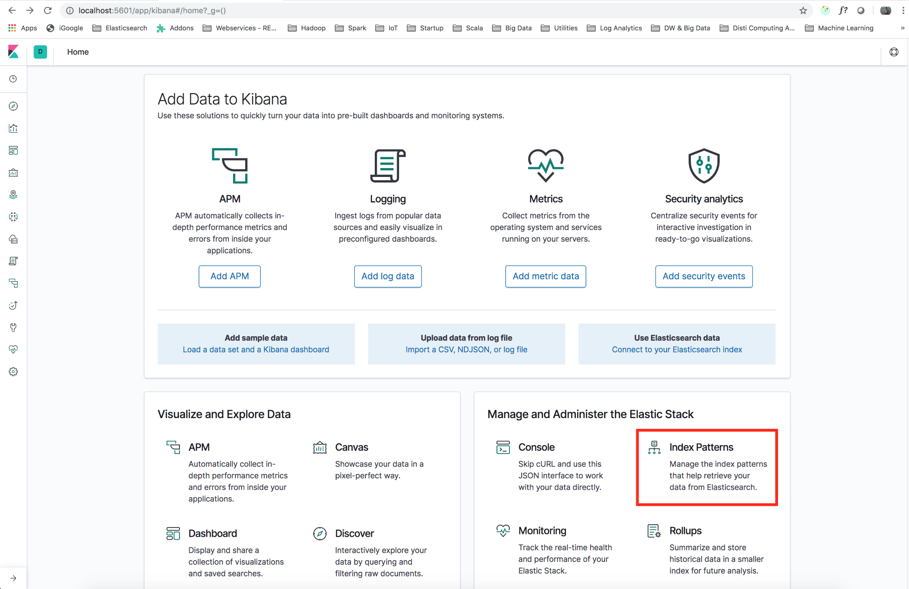


Figure 10.2: Creating an index pattern

In the **`Index pattern`** field, type
in  `sensor_data*` index pattern, as shown in the following
screenshot, and click **`Next step`**:


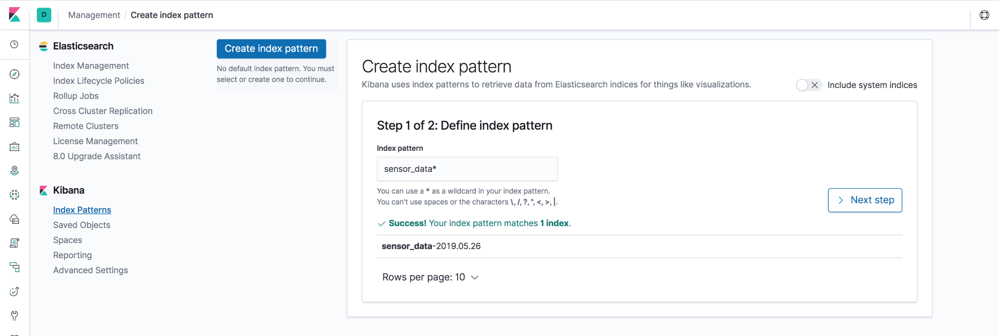


Figure 10.3: Creating an index pattern

On the next screen,
in **`Time Filter Field Name`**, choose the [**time**] field as
follows and click
on **`Create index pattern`**:


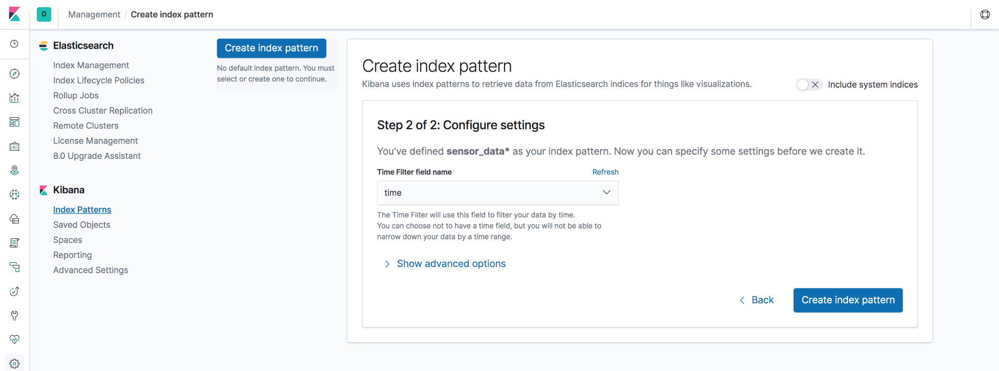


Figure 10.4: Choose Time Filter field name field for the index pattern

We have successfully created the index pattern for our sensor data.
Next, we will start building some visualizations.

### Building visualizations


Before we embark on an analytics project, we often already have some
questions that we want to get answered quickly from visualizations.
These visualizations, which answer different questions, may be packaged
as a dashboard or may be used as, and when, needed. We will also start
with some questions and try to build
visualizations to get answers to those questions.

We will try to answer the following questions:


-   How does the average temperature change over time?
-   How does the average humidity change over time?
-   How do temperature and humidity change at each location over time?
-   Can I visualize temperature and humidity over a map?
-   How are the sensors distributed across departments?


Let\'s build visualizations to get the answers, starting with the first
question.


#### How does the average temperature change over time?


Here, we are just looking for an aggregate statistic. We want to know
the average temperature across all temperature sensors regardless of
their location or any other criteria. As we saw in Lab
7, [*Visualizing Data with Kibana*], we should go to
the **`Visualize`** tab to create new visualizations and click on the button with
a [****`+ Create a Visualization`****] button.

Choose **`Line Chart`**, and then choose
the `sensor_data*` index pattern as the source for the new
visualization. On the next screen, to configure the line chart, follow
steps 1 to 5, as shown in the following screenshot:


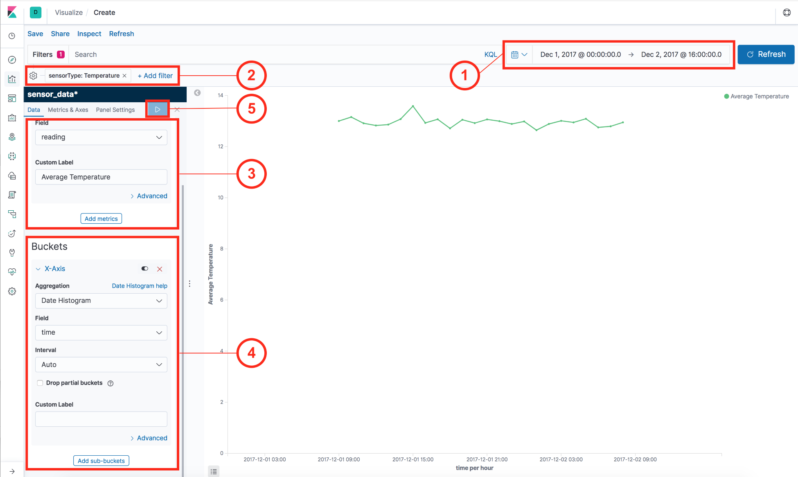


Figure 10.5: Creating the visualization for average temperature over
time


1.  Click on the time range selection fields near the top-right corner,
    choose [**Absolute**], and select the date range as
    [**December 1, 2017**] to [**December 2, 2017**].
    We have to do this because our simulated sensor data is from
    [**December 1, 2017**].


2.  Click on **`Add a filter`** as shown in Figure-10.5 and choose
    the [**Filter**] as follows:
    [**sensorType:Temperature**]. Click on
    the **`Save`** button. We have two types of sensors,
    **`Temperature`** and **`Humidity`**. In the current
    visualization that we are building, we
    are only interested in the temperature readings. This is why we\'ve
    added this filter.
3.  From the [**Metrics**] section, choose the values shown in
    Figure 10.5. We are interested in the average value of the readings.
    We have also modified the label to
    be `Average Temperature`.
4.  From the [**Buckets**] section, choose the [**Date
    Histogram**] aggregation and the [**time**] field,
    with the other options left as they are.
5.  Click on the triangular **`Apply changes`** button.


The result is the average temperature across all temperature sensors
over the selected time period. This is what we were looking for when we
started building this visualization. From the preceding graph, we can
quickly see that on December 1, 2017 at 15:00 IST, the temperature
became unusually high. The time may be different on your machine. We may
want to find out which underlying sensors reported the
higher-than-normal temperatures that caused this peak.

We can click on the **`Save`** link at the top bar and give this
visualization a name. Let\'s call it
`Average temperature over time`. Later, we will use this
visualization in a dashboard.

Let\'s proceed to the next question.

#### How does the average humidity change over time?


This question is very similar to the previous
question. We can reuse the previous visualization, make a slight
modification, and create another copy to answer this question. We will
start by opening the first visualization, which we saved
with the name `Average temperature over time`.

Execute the steps as follows to update the visualization:


1.  Click on the filter with the  [**sensorType:
    Temperature**] label and click on the [**Edit
    Filter**] action.
2.  Change the **`Filter`** value
    from [**Temperature**] to [**Humidity**] and
    click on **`Save.`**


3.  Modify **`Custom Label`** from `Average Temperature` to `Average Humidity` and
    click on the **`Apply changes`** button, as shown in the following
    screenshot.


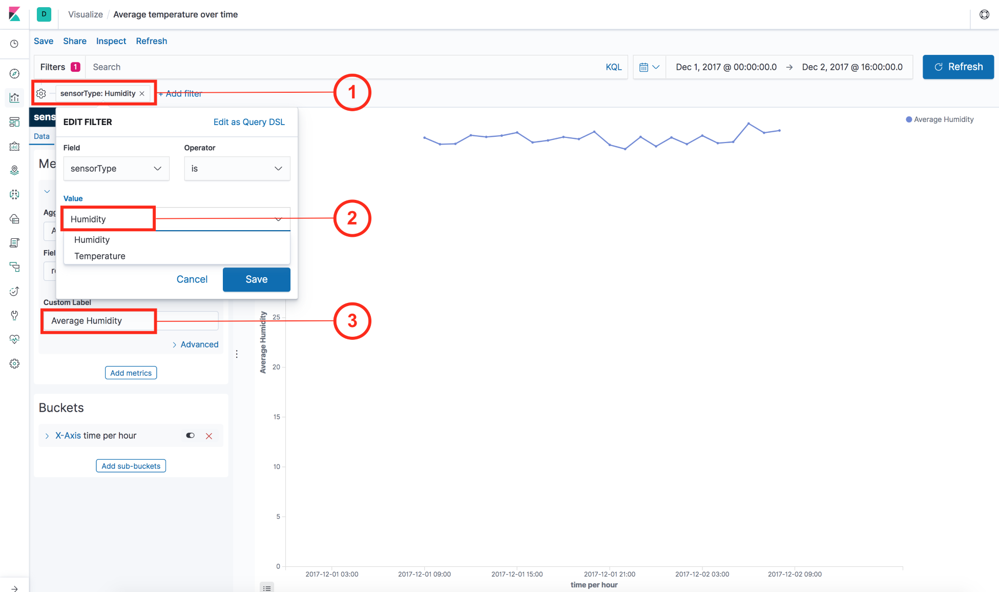


Figure 10.6: Creating the visualization for average humidity over time

As you will see, the chart gets updated for the Humidity sensors. You
can click on the [**Save**] link at the top navigation bar. You
can give a new name to the visualization, such
as[** **]`Average humidity over time`, check
the **`Save as a new visualization`** box, and click on **`Save`**. This
completes our second visualization and answers our second question.

#### How do temperature and humidity change at each location over time?


This time, we are looking to get more details than the first two questions. We want to know how the temperature and
humidity vary at each location over time. We will solve it for
temperature. 

Go to the **`Visualizations`** tab in Kibana and create a
new **`Line`** chart visualization, the same as before:


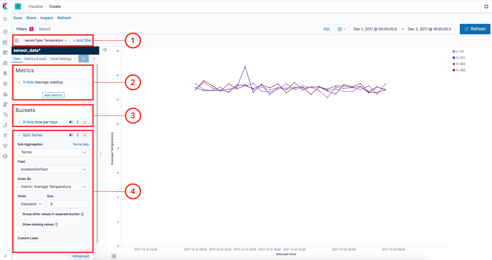


Figure 10.7: Creating the visualization for temperature at locations
over time


1.  Add a filter for [**sensorType: Temperature**] as we did
    before.
2.  Set up the [**Metrics**] section exactly same as the first
    chart that we created, that
    is `Average Temperature over time` on
    the `reading`[* *] field.
3.  Since we are aggregating the data over
    the [**time**] field, we need to choose the [**Date
    Histogram**] aggregation in the **`Buckets`** section.
    Here, we should choose the [**time**] field and leave the
    aggregation **`Interval`** as [**Auto**]**`. `**
4.  Up to this point, this visualization is the same
    as `Average temperature over time`. We don\'t just want to
    see the average temperature over time; we want to see it
    per [**locationOnFloor**], which is our most fine-grained
    unit of identifying a location. This is why we are splitting the
    series using the [**Terms**] aggregation on the
     [**locationOnFloor**] in this step. We select [**Order
    By**] as [**metric: Average Temperature**], keep
    **`Order`** as [**Descend**], and [**Size**] to
    be `5` to retain only the top five locations.


We have now built a visualization that shows
how the temperature changes for each value
of [**locationOnFloor**] field in our data. You can clearly see
that there is a spike in [**O-201**] on
[**December 1, 2017**] at [**15:00 IST**]. Because of
this spike, we had seen the average temperature in our first
visualization spike at that time. This is an important insight that we
have uncovered. Save this visualization
as[** **]`Temperature at locations over time`.

A visualization for humidity can be created by following the same steps
but just replacing `Temperature with Humidity`.

#### Can I visualize temperature and humidity over a map?


We can visualize temperature and humidity over the map using the [**Coordinate Map**] visualization.
Create a new **`Coordinate Map`** visualization by going to the
[**Visualize**] tab and clicking the [**+**] icon to
create a new visualization, and perform the following steps as shown in
the following screenshot:


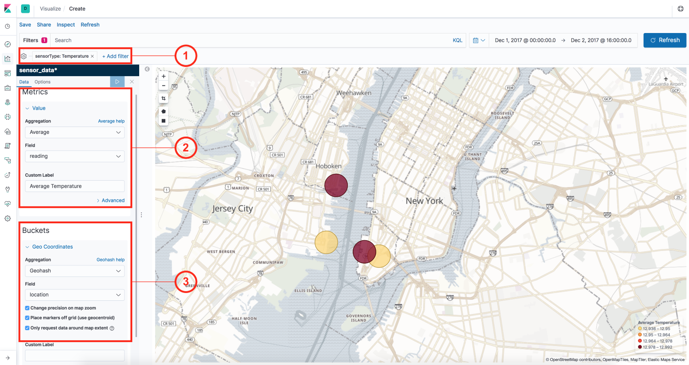


Figure 10.8: Creating a visualization to view sensor locations over a map


1.  As in previous visualizations, add a
    filter for the [**sensorType: Temperature**].
2.  In the **`Metrics`** section,
    choose [**Average**] aggregation on the **`reading`** field
    as done previously.


3.  Since this is a **`Coordinate Map`**, we need to choose
    the [**GeoHash**] grid aggregation and then select
    the **`geo_point`** field that we have in our data.
    The [**location**] is the field to aggregate.


As you can see, it helps in visualizing our data on the map. We can
immediately see the average temperature at each site when we hover over
a specific location. Focus on the relevant part of the map and save the
visualization with the name `Temperature over locations`.

You can create a similar [**Coordinate Map**] visualization for
the Humidity sensors.

#### How are the sensors distributed across departments?


What if we want to see how the sensors
distributed across different departments? Remember, we have
the `department` field in our data, which we obtained after
enriching the data using the `sensor_id`. Pie charts are
particularly useful to visualize how data is distributed across multiple
values of a `keyword` type field, such
as `department`. We will start by creating a
new **`pie`** chart visualization. 

Follow the steps as shown in the following screenshot:


Figure 10.9: Creating a visualization for locations across departments


1.  In the **`Metrics`** section, choose [**Unique
    Count**] aggregation and 
    the [**locationOnFloor**] field. You may modify
    the **`Custom Label`** to `Number of locations`.
2.  In the **`Buckets`** section, we need to
    choose [**Terms**] aggregation on the
    `department` field as we want to aggregate the data across
    different departments.


Click on **`Apply changes`** and save this visualization
as `Locations across departments`. You can also create another
similar visualization to visualize locations across different buildings.
Let\'s call that visualization `Locations across buildings`.
This will help us see how many locations are being monitored in each
building. 

Next, we will create a dashboard to bring together all the
visualizations we have built.


### Creating a dashboard


A dashboard lets you organize multiple visualizations together, save
them, and share them with other people. The ability to look at multiple
visualizations has its own benefits. You can filter the data using some
criteria and all visualizations will show the data filtered by the same criteria. This ability lets you
uncover some powerful insights. It can also answer more complex
questions.

Let us build a dashboard from the visualizations that we have created so
far. Please click on the **`Dashboard`** tab from the left-hand-side
navigation bar in Kibana. Click on
the **`+ Create new dashboard`** button to create a new dashboard.

Click on the [**Add**] link to add visualizations to your newly
created dashboard. As you click, you will see all the visualizations we
have built in a dropdown selection. You can add all the visualizations
one by one and drag/resize to create a dashboard that suits your
requirements.

Let us see what a dashboard may look like for the
application that we are building:


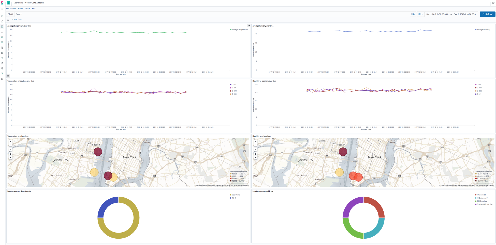


Figure 10.10: Dashboard for sensor data analytics application

With the dashboard, you can add filters by
clicking on the [**Add filter**] link near the top-left corner
of the dashboard. The selected filter will be applied to all the
charts. 

The visualizations are interactive; for example, clicking on one of the
pies of the donut charts will apply that filter globally. Let\'s see how
this can be helpful.

When you click on the pie for 222 Broadway building in the donut chart
at the bottom-right corner, you will see the filter
for `buildingName: "222 Broadway"` added to the filters. This
lets you see all of the data from the perspective of all the sensors in
that building:


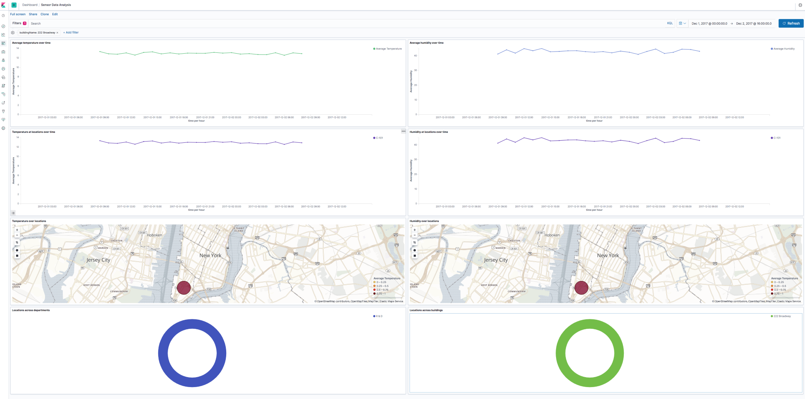


Figure 10.11: Interacting with the visualizations in a dashboard

Let us delete that filter by hovering over the [**buildingName: \"222
Broadway\"**] filter by clicking on the trash icon. Next, we
will try to interact with one of the line charts, that is,
the `Temperature at locations over time` visualization.

As we observed earlier, there was a spike on
December 1, 2017 at 15:00 IST. It is possible to zoom in to a particular
time period by clicking, dragging, and drawing a rectangle around the
time interval that we want to zoom in to within any line chart. In other
words, just draw a rectangle around the spike, dragging your mouse while
it is clicked. The result is that the time filter applied on the entire
dashboard (which is displayed in the top-right corner) is changed.

Let\'s see whether we get any new insights
from this simple operation to focus on that time period:


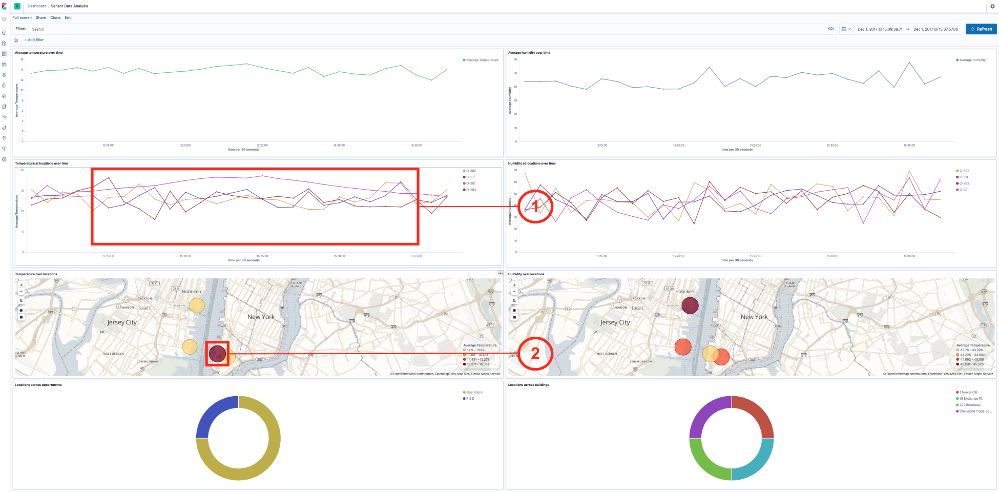


Figure 10.12: Zooming into a time interval from a line chart

We uncover the following facts:


1.  The temperature sensor at location [**O-201**] (pink legend
    in fig-10.12) is steadily rising around this time. 
2.  In the [**Coordinate Map**] visualization, you can see that
    the highlighted circle is red, compared to the other locations,
    which are yellow. This highlights that the location has an
    abnormally high temperature compared to the other locations.


Interacting with charts and applying different filters can provide
powerful insights like the ones we just saw.

This concludes our application and demonstration of what we can do using
the Elastic Stack components.


Summary
-------------------------


In this lab, we built a sensor data analytics application that has a
wide variety of applications, as it is related to the emerging field of
IoT. We understood the problem domain and the data model, including
metadata related to sensors. We wanted to build an analytics application
using only the components of the Elastic Stack, without using any other
tools and programming languages, to obtain a powerful tool that can
handle large volumes of data.

We started at the very core by designing the data model for
Elasticsearch. Then, we designed a data pipeline that is secured and can
accept data over the internet using HTTP. We enriched the incoming data
using the metadata that we had in a relational database and stored in
Elasticsearch. We sent some test data over HTTP just like those that
real sensors send over the internet. We built some meaningful
visualizations that will give answers to some typical questions. We then
put together all visualizations in a powerful, interactive dashboard.

In Lab 11, [*Monitoring Server Infrastructure*], we will
build another real-world application in which the Elastic Stack excels.
