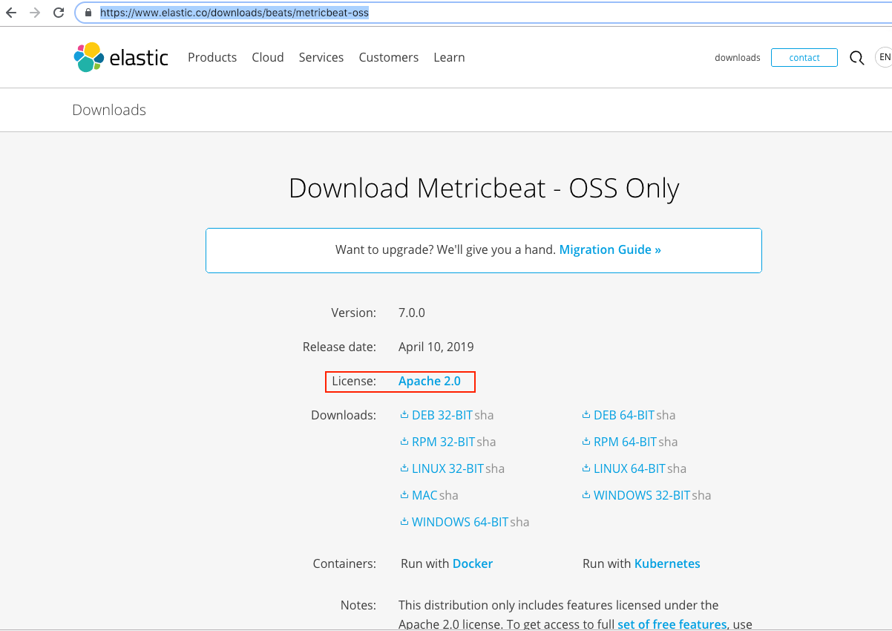
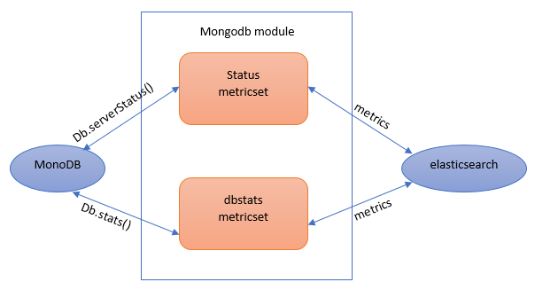
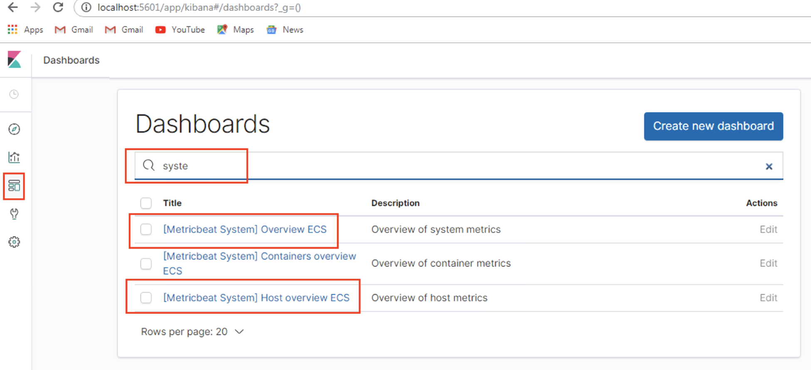
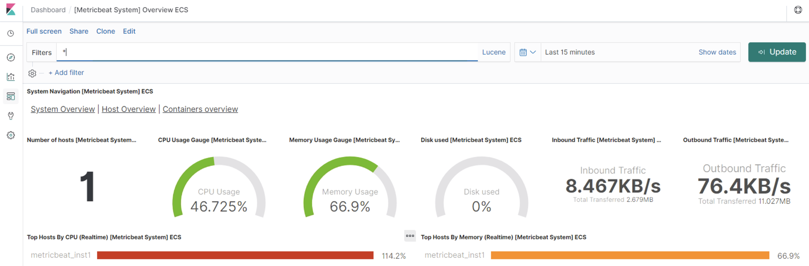
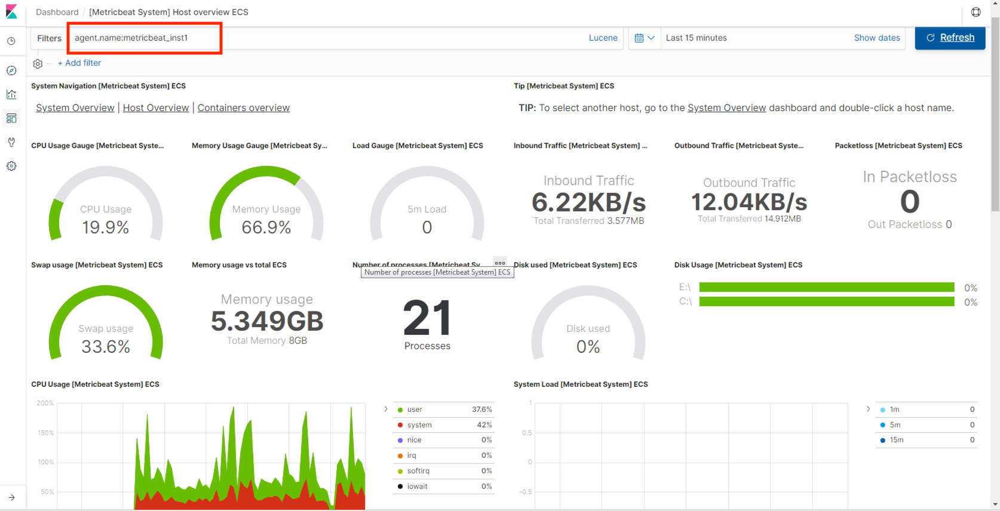
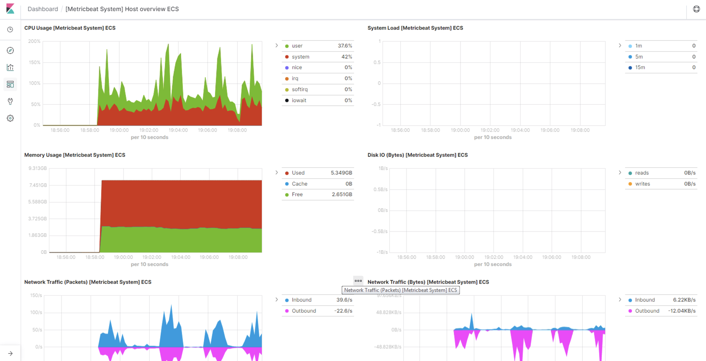
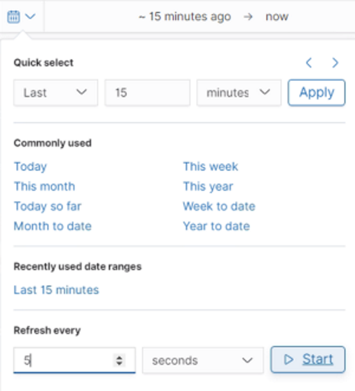
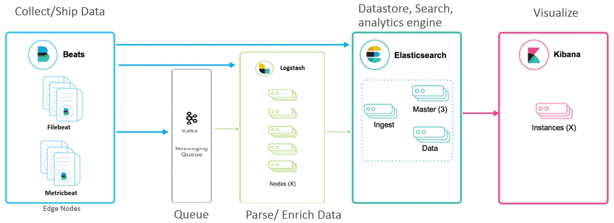

Lab 11. Monitoring Server Infrastructure
-----------------------------------------------------


In the previous lab, we covered how to effectively run the Elastic
Stack in a production environment, and the best practices to follow when
running the Elastic Stack in production.

In this lab, we will be covering how to use the Beats platform to
monitor server infrastructure. We will learn about Metricbeat in detail,
a Beat that helps IT administrators and application support teams
monitor their applications and server infrastructure and respond to
infrastructure outages in a timely manner. 

In this lab, we will cover the following topics:


-   Metricbeat
-   Configuring Metricbeat
-   Capturing system metrics
-   Deployment architecture


### Downloading and installing Metricbeat


Navigate to <https://www.elastic.co/downloads/beats/metricbeat-oss> and,
depending on your operating system, download the ZIP/TAR file, as shown in the following screenshot. The installation of
Metricbeat is simple and straightforward as follows:





### Note

For this tutorial, we\'ll use the Apache 2.0 version of Metricbeat.
Beats version 7.0.x is compatible with Elasticsearch 6.7.x and 7.0.x,
and Logstash 6.7.x and 7.0.x. The compatibility matrix can be found
at <https://www.elastic.co/support/matrix#matrix_compatibility>. When
you come across Elasticsearch and Logstash examples, or scenarios using
Beats in this lab, make sure that you have compatible versions of
Elasticsearch and Logstash installed.

#### Installing on Windows


Unzip the downloaded file and navigate to
the extracted location, as follows:

```
E:>cd E:\metricbeat-7.0.0-windows-x86_64
```

To install Metricbeat as a service on Windows, perform the following
steps:


1.  Open Windows PowerShell as an administrator and navigate to the
    extracted location.
2.   Run the following commands to install Metricbeat as a Windows
    service from the PowerShell prompt as follows:


```
PS >cd E:\metricbeat-7.0.0-windows-x86_64
PS >E:\metricbeat-7.0.0-windows-x86_64>.\install-service-metricbeat.ps1
```

You need to set the execution policy for the current session to allow
the script to run if script execution is disabled.For
example, `PowerShell.exe -ExecutionPolicy UnRestricted -File .\install-service-metricbeat.ps1`.

#### Installing on Linux


Unzip the `tar.gz` package and navigate to the newly created folder, as shown in the following code snippet:

```
$>tar -xzf metricbeat-7.0.0-linux-x86_64.tar.gz
$>cd metricbeat
```


### Note

To install using dep/rpm, execute the appropriate commands in the
Terminal as follows:

**deb:`curl -L -O https://artifacts.elastic.co/downloads/beats/metricbeat/metricbeat-7.0.0-amd64.deb``sudo dpkg -i metricbeat-7.0.0-amd64.deb`

**rpm:`curl -L -O https://artifacts.elastic.co/downloads/beats/metricbeat/metricbeat-7.0.0-x86_64.rpm``sudo rpm -vi metricbeat-7.0.0-x86_64.rpm`

Metricbeat will be installed in the `/usr/share/metricbeat`
directory. The configuration files will be present
in `/etc/metricbeat`. The `init` script will be
present in `/etc/init.d/metricbeat`. The log files will be
present within the `/var/log/metricbeat` directory.


### Architecture


Metricbeat is made up of two components: one
is called **modules** and the other is called
**metricsets**. A Metricbeat module defines the basic logic of collecting data from a
specific service, such as MongoDB, Apache,
and so on. The module specifies details about the service, including how
to connect, how often to collect metrics, and which metrics to collect.

Each module has one or more metricsets. A metricset is the component
that collects a list of related metrics from services or the operating
system using a single request. It structures event data and ships it to
the configured outputs, such as Elasticsearch or Logstash. 

Metricbeat collects metrics periodically, based on the interval
specified in the `metricbeat.yml` configuration file, and
publishes the event to the configured output asynchronously. Since the
events are published asynchronously, just like in Filebeat, which
guarantees delivery at least once, if the configured output is not
available, the events will be lost. 

For example, the MongoDB module provides the `status` and
`dbstats` metricsets, which collect information and statistics
by parsing the returned response obtained from running the
`db.serverStatus()` and `db.stats()` commands on
MongoDB, as shown in the following diagram:





The key benefits of Metricbeat are as follows: 


-   **Metricbeat sends error events, too**: When
    the service is not reachable or is down,
    Metricbeat will still send events that contain full error messages
    obtained when they are fetching information  from the host systems.
    This is beneficial for troubleshooting or identifying the reason
    behind the outage of the service. 
-   **Combines multiple related metrics into a single
    event**: Metricbeat fetches all related metrics from the
    host system, making a single request rather than making multiple
    requests for fetching each metric one by one, thus resulting in less
    load on the services/host systems. Fetched metrics are combined into
    a single event and sent to the configured output.
-   **Sends metadata information**: Metrics sent by
    Metricbeat contain both numbers as well as strings for contacting
    the status information. It also ships basic metadata information
    about each metric as part of each event. This is helpful for mapping
    appropriate data types during storage and helps with
    querying/filtering data, identifying events based on metadata
    information, and so on.
-   **Sends raw data as it is**: Metricbeat sends obtained
    raw data as-is without performing any processing or any aggregation
    operations on it, thus reducing its complexity.

#### Event structure


Metricbeat sends two types of event:


-   Regular events containing the fetched metrics
-   Error events when the service is down/unreachable


Irrespective of the type of event, all events have the same basic
structure and contain the following fields as a minimum, irrespective of
the type of module that\'s enabled:


-   `@timestamp`: Time when the event was captured
-   `host.hostname`: Hostname of the server on which Beat is
    running
-   `host.os`: Operating system details of the server where
    Beat is running
-   `agent.type`: Name given to Beat 
-   `agent.version`: The Beat version
-   `event.module`: Name of the module that the data is from
-   `event.dataset`: Name of the metricset that the data is
    from


In the case of error events, an error field such
as `error.message`, containing the error message, code, and
type, will be appended to the event. 

An example of a regular event is as follows:

```
{"@timestamp" : "2019-04-22T12:40:16.608Z",
"service" : {
  "type" : "system"
},
"system" : {
  "uptime" : {
    "duration" : {
      "ms" : 830231705
    }
  }
},
"event" : {
  "module" : "system",
  "duration" : 221012700,
  "dataset" : "system.uptime"
},
"metricset" : {
  "name" : "uptime"
},
"agent" : {
  "type" : "metricbeat",
  "ephemeral_id" : "1956888d-7da0-469f-9a38-ab8b9ad52e07",
  "hostname" : "madsh01-I21350",
  "id" : "5b28d885-1389-4e32-a3a9-3c5e8f9063b0",
  "version" : "7.0.0"
},
"ecs" : {
  "version" : "1.0.0"
},
"host" : {
  "name" : "madsh01-I21350",
  "os" : {
    "kernel" : "6.1.7601.24408 (win7sp1_ldr_escrow.190320-1700)",
    "build" : "7601.24411",
    "platform" : "windows",
    "version" : "6.1",
    "family" : "windows",
    "name" : "Windows 7 Enterprise"
  },
  "id" : "254667db-4667-46f9-8cf5-0d52ccf2beb9",
  "hostname" : "madsh01-I21350",
  "architecture" : "x86_64"
}
}
```

An example of an error event when `mongodb` is not reachable
is as follows: 

```
{
  "@timestamp": "2019-04-02T11:53:08.056Z",
  "metricset": {
    "host": "localhost:27017",
    "rtt": 1003057,
    "module": "mongodb",
    "name": "status"
  },
"error": {
    "message": "no reachable servers"
  },
  "mongodb": {
    "status": {}
}
```

Along with the minimum fields (the basic structure of the event) that Metricbeat ships with, it ships fields
related to the modules that are enabled. The complete list of fields it
ships with per module can be obtained
at <https://www.elastic.co/guide/en/beats/metricbeat/current/exported-fields.html>.


Configuring Metricbeat
----------------------------------------


The configurations related to Metricbeat are stored in a configuration file named `metricbeat.yml`,
which uses YAML syntax. 

The `metricbeat.yml` file contains the following:


-   Module configuration
-   General settings
-   Output configuration 
-   Processor configuration 
-   Path configuration
-   Dashboard configuration 
-   Logging configuration


Let\'s explore some of these sections.


### Note

The location of the `metricbeat.yml` file will be present in
the installation directory if `.zip` or `.tar` files
are used for installation. If `.dep` or `.rpm` files
are used for installation, then it will be present in the
`/etc/metricbeat` location.

### Module configuration


Metricbeat comes bundled with various modules
to collect metrics from the system and applications, such as Apache,
MongoDB, Redis, MySQL, and so on.

Metricbeat provides two ways of enabling modules and metricsets as
follows:


-   Enabling module configs in the `modules.d` directory
-   Enabling module configs in the `metricbeat.yml` file

#### Enabling module configs in the modules.d directory


The `modules.d` directory contains default configurations for
all the modules that are available in Metricbeat. The configuration
that\'s specific to a module is stored in a `.yml` file, with
the name of the file being the name of the
module. For example, the configuration related to the MySQL module will
be stored in the `mysql.yml` file. By default, except for the
`system` module, all other modules are disabled. To list the
modules that are available in Metricbeat, execute the following command:

```
Windows:
E:\metricbeat-7.0.0-windows-x86_64>metricbeat.exe modules list

Linux:
[locationOfMetricBeat]$./metricbeat modules list
```

The `modules list` command displays all the available modules
and also lists which modules are currently enabled/disabled. 


### Note

If a module is disabled, then in the `modules.d` directory,
the configuration related to the module will be stored with the
`.disabled` extension.


Since each module comes with default configurations, make the
appropriate changes in the module configuration file.

The basic configuration for the `mongodb` module will look as
follows:

```
- module: mongodb
  metricsets: ["dbstats", "status"]
  period: 10s
  hosts: ["localhost:27017"]
  username: user
  password: pass
```

To enable it, execute the `modules enable` command, passing
one or more module names. For example:

```
Windows:
E:\metricbeat-7.0.0-windows-x86_64>metricbeat.exe modules enable redis mongodb

Linux:
[locationOfMetricBeat]$./metricbeat modules enable redis mongodb
```

Similar to disabling modules, execute
the `modules disable` command, passing one or more module
names to it. For example: 

```
Windows:
E:\metricbeat-7.0.0-windows-x86_64>metricbeat.exe modules disable redis mongodb

Linux:
[locationOfMetricBeat]$./metricbeat modules disable redis mongodb
```


### Note

To enable dynamic config reloading, set `reload.enabled` to
true and specify a frequency with which to look for config file changes.
Set the `reload.period` parameter under
the `metricbeat.config.modules` property.

**For example**:

`#metricbeat.yml``metricbeat.config.modules:``path: ${path.config}/modules.d/*.yml``reload.enabled: true``reload.period: 20s`


#### Enabling module configs in the metricbeat.yml file


If you\'re used to using earlier versions of Metricbeat, you can enable
the appropriate modules and metricsets in the
`metricbeat.yml` file directly by adding entries to the
`metricbeat.modules` list. Each entry in the list begins
with a dash (`-`) and is followed
by the settings for that module. For example:

```
metricbeat.modules:
#------------------ Memcached Module -----------------------------
- module: memcached
  metricsets: ["stats"]
  period: 10s
  hosts: ["localhost:11211"]

#------------------- MongoDB Module ------------------------------
- module: mongodb
  metricsets: ["dbstats", "status"]
  period: 5s
```


### Note

It is possible to specify a module multiple times and specify a
different period one or more metricsets should be used for. For
example:`#------- Couchbase Module -----------------------------``- module: couchbase``metricsets: ["bucket"]``period: 15s``hosts: ["localhost:8091"]``- module: couchbase``metricsets: ["cluster", "node"]``period: 30s``hosts: ["localhost:8091"]`


### General settings


This section contains configuration options and some general settings to control the behavior of Metricbeat.

Some of these configuration options/settings are as follows:


-   `name`: The name of the shipper that
    publishes the network data. By default, the hostname is used for
    this field, as follows:


```
name: "dc1-host1"
```


-   `tags`: A list of tags that will be
    included in the `tags` field of every event Metricbeat
    ships. Tags make it easy to group servers by different logical
    properties and are useful when filtering events in Kibana and
    Logstash, as follows:


```
tags: ["staging", "web-tier","dc1"]
```


-   `max_procs`: The maximum number of CPUs
    that can be executing simultaneously. The default is the number of
    logical CPUs available in the system:


```
max_procs: 2
```


### Output configuration 


This section is all about configuring outputs where the events need to be shipped. Events can be sent to single
or multiple outputs simultaneously. The allowed outputs are
Elasticsearch, Logstash, Kafka, Redis, file, and console. Some outputs
that can be configured are as follows:


-   `elasticsearch`: This is used to send events directly to
    Elasticsearch. A sample Elasticsearch output configuration is shown
    in the following code snippet:


```
output.elasticsearch:
  enabled: true  
  hosts: ["localhost:9200"]
```

Using the `enabled` setting, you can enable or disable the
output. `hosts` accepts one or more Elasticsearch
node/servers. Multiple hosts can be defined for failover purposes. When
multiple hosts are configured, the events are distributed to these nodes
in a round-robin order. If Elasticsearch is secure, then credentials can
be passed using the `username` and
`password` settings, as follows:

```
output.elasticsearch:
  enabled: true  
  hosts: ["localhost:9200"]
  username: "elasticuser"
  password: "password"
```

To ship events to the Elasticsearch ingest node pipeline so that they
can be preprocessed before being stored in Elasticsearch, pipeline
information can be provided using the `pipleline` setting, as
follows:

```
output.elasticsearch:
  enabled: true  
  hosts: ["localhost:9200"]
  pipeline: "ngnix_log_pipeline"
```

The default index the data gets written to is in the
`metricbeat-%{[beat.version]}-%{+yyyy.MM.dd}` format. This
will create a new index every day. For example, if today is April 02,
2019, then all the events are placed in the
`metricbeat-7.0.0-2019-04-02` index. You can override the
index name or the pattern using the `index` setting. In the
following configuration snippet, a new index is created for every month,
as follows:

```
output.elasticsearch:
hosts: ["http://localhost:9200"]
  index: "metricbeat-%{[beat.version]}-%{+yyyy.MM}"
```

Using the `indices` setting, you can conditionally place the
events in the appropriate index that matches the specified condition. In
the following code snippet, if the message contains
the `DEBUG` string, it will be placed in the
`debug-%{+yyyy.MM.dd}` index. If the message contains
the `ERR` string, it will be placed in
the `error-%{+yyyy.MM.dd}` index. If the message contains
neither of these strings, then those events will be pushed to
the `logs-%{+yyyy.MM.dd}` index, as specified in the
`index` parameter, as follows:

```
output.elasticsearch:
hosts: ["http://localhost:9200"]
  index: "logs-%{+yyyy.MM.dd}"indices:
-index: "debug-%{+yyyy.MM.dd}"
      when.contains:
message: "DEBUG"-index: "error-%{+yyyy.MM.dd}"
      when.contains:
message: "ERR"
```


### Note

When the `index` parameter is overridden, disable templates
and dashboards by adding the following settings:

`setup.dashboards.enabled: false``setup.template.enabled: false`

Alternatively, provide the values for
`setup.template.name` and
`setup.template.pattern` in the
`metricbeat.yml` configuration file; otherwise, Metricbeat
will fail to run.


-   `logstash`: This is used to send events to Logstash.


### Note

To use Logstash as output, Logstash needs to be configured with the
Beats input plugin so it can receive incoming Beats events.


A sample Logstash output configuration is as follows:

```
output.logstash:
  enabled: true  
  hosts: ["localhost:5044"]
```

Using the `enabled` setting, you can enable or disable the
output. `hosts` accepts one or more Logstash servers. Multiple
hosts can be defined for failover purposes. If the configured host is
unresponsive, then the event will be sent to one of the other configured
hosts. When multiple hosts are configured,events are distributed in a
random order. To enable load-balancing events across the Logstash hosts,
use the `loadbalance` flag, set
to `true`, as follows:

```
output.logstash:
hosts: ["localhost:5045", "localhost:5046"]
  loadbalance: true
```


-   `console`: This is used to send events to
    `stdout`. These events are written in JSON format. This is
    useful during debugging or testing.


A sample console configuration is as follows:

```
output.console:
  enabled: true
pretty: true
```


### Logging


This section contains the options for configuring the Metricbeat logging
output. The logging system can write logs to syslog or rotate log files.
If logging is not explicitly configured, file output is
used on Windows systems, and syslog output is
used on Linux and OS X.

A sample configuration is as follows:

```
logging.level: debug
logging.to_files: true
logging.files:
 path: C:\logs\metricbeat
 name: metricbeat.log 
 keepfiles: 10
```

Some of the available configuration options are as follows:


-   `level`: To specify the logging level.
-   `to_files`: To write all logging output to files. The
    files are subject to file rotation. This is the default value.


-   `to_syslog`: To write logging output to syslogs if this
    setting is set to `true`.
-   `files.path`, `files.name`,
    and `files.keepfiles`: These are used to
    specify the location of the file, the name of the file, and the
    number of recently rotated log files to keep on the disk.


Capturing system metrics
------------------------------------------


In order to monitor and capture metrics
related to servers, Metricbeat provides the `system` module.
The `system` module provides the following metricsets to
capture server metrics, as follows:


-   `core`: This metricset provides usage statistics for each
    CPU core.
-   `cpu`: This metricset provides CPU statistics.
-   `diskio`: This metricset provides disk IO metrics
    collected from the operating system. One event is created for each
    disk mounted on the system.
-   `filesystem`: This metricset provides filesystem
    statistics. For each file system, one event is created.
-   `process`: This metricset provides process statistics. One
    event is created for each process.
-   `process_summary`: This metricset collects high-level
    statistics about the running processes.
-   `fsstat`: This metricset provides overall filesystem
    statistics.
-   `load:` This metricset provides load statistics.
-   `memory`: This metricset provides memory statistics.
-   `network`: This metricset provides network IO metrics
    collected from the operating system. One event is created for each
    network interface.
-   `socket`: This metricset reports an event for each new TCP
    socket that it sees. This metricset is available on Linux only and
    requires kernel 2.6.14 or newer.


Some of these metricsets provide configuration options for fine-tuning
returned metrics. For example, the `cpu` metricset provides
a `cpu.metrics` configuration to control the CPU metrics that
are reported. However, metricsets such
as `memory` and `diskio` don\'t provide any
configuration options. Unlike other modules, which can be monitored from
other servers by configuring the hosts appropriately (not a highly
recommended approach), `system` modules are local to the
server and can collect the metrics of
underlying hosts.


### Note

A complete list of fields per metricset that are exported by the
`system` module can be found
at <https://www.elastic.co/guide/en/beats/metricbeat/current/exported-fields-system.html>.

### Running Metricbeat with the system module


Let\'s make use of Metricbeat
and capture system metrics.

Make sure that Kibana 7.0 and Elasticsearch 7.0 are running:


1.  Replace the content of `metricbeat.yml` with the following
    configuration and save the file:


```
############### Metricbeat Configuration Example ################
#============== Modules configuration =========================

metricbeat.config.modules:
  # Glob pattern for configuration loading
  path: ${path.config}/modules.d/*.yml

  # Set to true to enable config reloading
  reload.enabled: false

  # Period on which files under path should be checked for changes
  #reload.period: 10s

#=========== Elasticsearch template setting =================

setup.template.settings:
  index.number_of_shards: 1
  index.codec: best_compression
  #_source.enabled: false

#=================== General  Settings===============================
name: metricbeat_inst1

tags: ["system-metrics", "localhost"]

fields:
  env: test-env

#============================== Dashboards ===========================
setup.dashboards.enabled: true

#============================== Kibana Settings ===========================
setup.kibana:
  host: "localhost:5601"
  #username: "elastic"
  #password: "changeme"

#-------------------------- Elasticsearch output Settings ---------------------
output.elasticsearch:
  # Array of hosts to connect to.
  hosts: ["localhost:9200"]
  #username: "elastic"
  #password: "changeme"
```


### Note

The `setup.dashboards.enabled: true` setting loads sample
dashboards to the Kibana index during startup, which are loaded via the
Kibana API. If Elasticsearch and Kibana are secured, make sure that you
uncomment the `username` and `password` parameters
and set the appropriate values.


2.  By default, the `system` module is enabled. Make sure that
    it is enabled by executing the following command:


```
Windows:
E:\metricbeat-7.0.0-windows-x86_64>metricbeat.exe modules enable system
Module system is already enabled

Linux:
[locationOfMetricBeat]$./metricbeat modules enable system
Module system is already enabled
```


3.  You can verify the metricsets that are enabled for the
    `system` module by opening
    the `system.yml` file, which can be found under
    the `modules.d` directory, as follows:


```
#system.yml
- module: system
  period: 10s
  metricsets:
    - cpu
    #- load
    - memory
    - network
    - process
    - process_summary
    #- socket_summary
    #- core
    #- diskio
    #- socket
  processes: ['.*']
  process.include_top_n:
    by_cpu: 5 # include top 5 processes by CPU
    by_memory: 5 # include top 5 processes by memory

- module: system
  period: 1m
  metricsets:
    - filesystem
    - fsstat
  processors:
  - drop_event.when.regexp:
      system.filesystem.mount_point: '^/(sys|cgroup|proc|dev|etc|host|lib)($|/)'
```

As seen in the preceding code, the configuration module is defined
twice, with different periods to use for a set of
metricsets. The `cpu`, `memory`,
`network`, `process`, `process_summary`,
`filesystem`, and `fsstats` metricsets are enabled. 


4.  Start Metricbeat by executing the following command:


```
Windows:
E:\metricbeat-7.0.0-windows-x86_64>metricbeat.exe -e


Linux:
[locationOfMetricBeat]$./metricbeat -e
```

Once Metricbeat is started, it loads sample Kibana dashboards and
starts shipping metrics to Elasticsearch. To
validate this, execute the following command:

```
curl -X GET 'http://localhost:9200/_cat/indices?v=&format=json' 

Sample Response:
[
    {
        "health": "yellow",
        "status": "open",
        "index": "metricbeat-7.0.0-2019.04.02",
        "uuid": "w2WoP2IhQ9eG7vSU_HmgnA",
        "pri": "1",
        "rep": "1",
        "docs.count": "29",
        "docs.deleted": "0",
        "store.size": "45.3kb",
        "pri.store.size": "45.3kb"
    },
    {
        "health": "yellow",
        "status": "open",
        "index": ".kibana",
        "uuid": "sSzeYu-YTtWR8vr2nzKrbg",
        "pri": "1",
        "rep": "1",
        "docs.count": "108",
        "docs.deleted": "59",
        "store.size": "289.3kb",
        "pri.store.size": "289.3kb"
    }
]

curl -X GET 'http://localhost:9200/_cat/indices?v' 

health status index uuid pri rep docs.count docs.deleted store.size pri.store.size
yellow open metricbeat-7.0.0-2019.04.02 w2WoP2IhQ9eG7vSU_HmgnA 1 1 29 0 45.3kb 45.3kb
yellow open .kibana sSzeYu-YTtWR8vr2nzKrbg 1 1 108 59 289.3kb 289.3kb
```


### Specifying aliases


Elasticsearch allows the user to create an alias---a virtual index
name that can be used to refer to an index or
multiple indices.The Elasticsearch index API aliases an index with a
name. This enables all the APIs to automatically convert their alias
names into the actual index name. 

Say, for example, that we want to query against a set of similar
indexes. Rather than specifying each of the index names in the query, we
can make use of aliases and execute the query
against the alias. The alias will internally point to all the indexes
and perform a query against them. This will be highly beneficial if we
added certain indexes dynamically on a regular basis, so that one
application/user performing the query need not worry about including
those indexes in the query as long as the index is updated with the
alias (which can be done manually by an admin or specified during index
creation). 

Let\'s say the IT admin creates an alias pointing to all the indexes
containing the metrics for a specific month. For example, as shown in
the following code snippet, an alias called
`april_04_metrics` is created for all the indexes of the
`metricbeat-7.0.0-2019.04.*` pattern, that is, those
Metricbeats indexes that are created on a daily basis in the month of
April 2019:

```
curl -X POST   http://localhost:9200/_aliases  -H 'content-type: application/json' -d '
{
 "actions":
 [
   {"add":{ "index" : "metricbeat-7.0.0-2019.04.*", "alias": "april_04_metrics"} }
   ]
}'
```

Now, using the `april_04_metrics` alias name, the query can be
executed against all the indexes of
the`metricbeat-7.0.0-2019.04.*` pattern as follows:

```
curl -X GET http://localhost:9200/april_04_metrics/_search  
```

In the following example, the `sales` alias is created against
the `it_sales` and `retail_sales` indexes. In the
future, if a new sales index gets created, then that index can also
point to the `sales` index so that the end user/application
can always make use of the `sales` endpoint to query all sales
data, as follows:

```
curl -X POST   http://localhost:9200/_aliases -d '{
"actions":[
    {"add":{"index":"it_sales","alias":"sales"}},
    {"add":{"index":"retail_sales","alias":"sales"}}
]}
```

To remove an alias from an index, use the `remove` action of
the aliases API, as follows:

```
curl -X POST   http://localhost:9200/_aliases -d '
{"actions":[{"remove":{"index":"retail_sales","alias":"sales"}}]}
```


### Visualizing system metrics using Kibana


To visualize the system metrics using Kibana,
execute the following steps:


1.  Navigate to `http://localhost:5601` and open up Kibana.
2.  Click on the `Dashboard` link found in the left navigation menu
    and select either
    `[Metricbeat System] Overview ECS`  or
    `[Metricbeat System] Host Overview ECS` from the dashboard, as
    shown in the following screenshot:





**\[Metricbeat System\] Overview Dashboard ECS:** This
dashboard provides an overview of all the systems that are being
monitored. Since we are monitoring only a single host, we see that the
**Number of hosts** is **1**, as shown in the
following screenshot:





**\[Metricbeat Host\] Overview
Dashboard:** This dashboard is useful for
finding the detailed metrics of individual systems/hosts. In order to
filter metrics based on a particular host, enter the search/filter
criterion in the search/query bar. In the following screenshot, the
filter criterion is **agent.name:metricbeat\_inst1**. Any
attribute that uniquely identifies a system/host can be used; for
example, you can filter based on**host.hostname**, as
follows:





Since the `diskio` and`load` metricsets were
disabled in the system module configuration, we will see empty
visualizations for the **Disk IO** and **System Load** visualizations, as shown in the
following screenshot:





To see the dashboard refresh in real time, in
the top right corner select the time and
enter the appropriate refresh interval. Then, click
the `Start `button as shown in the following screenshot:





### Note

To view the dashboard in full-screen mode, click
the `Full screen` button on the top left navigation bar. This hides
the browser and the top navigation bar. To exit full-screen mode, hover
over and click the `Kibana` button on the lower left-hand side of
the page, or simply press the [*Esc*]  key.


### Note

Refer to Lab 7, [*Visualizing Data with Kibana,*]  to
learn how to effectively use Kibana and the different sections of Kibana
to gain insights into your data. 


Deployment architecture
-----------------------------------------


The following diagram depicts the commonly
used Elastic Stack deployment architecture:





This diagram depicts three possible architectures:


-   **Ship the operation metrics directly to Elasticsearch**:
    As seen in the preceding diagram, you will install various types of
    **Beats**, such as **Metricbeat**,
    **Filebeat**, **Packetbeat**, and so on, on
    the edge servers from which you would like to ship the operation
    metrics/logs. If no further processing is required, then the
    generated events can be shipped directly to the Elasticsearch
    cluster. Once the data is present in Elasticsearch, it can then be
    visualized/analyzed using Kibana. In this architecture, the flow of
    events would be **Beats → Elasticsearch → Kibana**. 


-   **Ship the operation metrics to Logstash**: The operation
    metrics/logs that are captured by Beats and installed on edge
    servers is sent to Logstash for further processing, such as parsing
    the logs or enriching log events. Then, the parsed/enriched events
    are pushed to Elasticsearch. To increase the processing capacity,
    you can scale up Logstash instances, for example, by configuring a
    set of Beats to send data toLogstash instance 1 and configuring
    another set of Beats to send data to Logstash instance 2, and so on.
    In this architecture, the flow of events would be **Beats →
    Logstash → Elasticsearch → Kibana**. 
-   **Ship the operation metrics to a resilient queue**: If
    the generated events are at a very high rate and if Logstash is
    unable to cope with the load or to prevent loss of data/events when
    Logstash is down, you can go for resilient queues such as Apache
    Kafka so that events are queued. Then, Logstash can process them at
    its own speed, thus avoiding the loss of operation metrics/logs
    captured by Beats. In this architecture, the flow of events would
    be **Beats → Kafka → Logstash → Elasticsearch →
    Kibana**. 


### Note

Starting with Logstash 5.x, you can make use of the persistent queue
settings of Logstash and make use of it as queue, too. However, it
doesn\'t offer a high degree of resilience like Kafka. 


In the aforementioned architectures, you can easily scale up/scale down instances of Elasticsearch, Logstash,
and Kibana based on the use case at hand.


Summary
-------------------------


In this lab, we covered another Beat library called Metricbeat in
detail. We covered how to install and configure Metricbeat so that it
can send operational metrics to Elasticsearch. We also covered the
various deployment architectures for building real-time monitoring
solutions using Elasticsearch Stack in order to monitor servers and
applications. This helps IT administrators and application support
personnel gain insights into the behavior of applications and servers,
and allows them to respond in a timely manner in the event of an
infrastructure outage.
