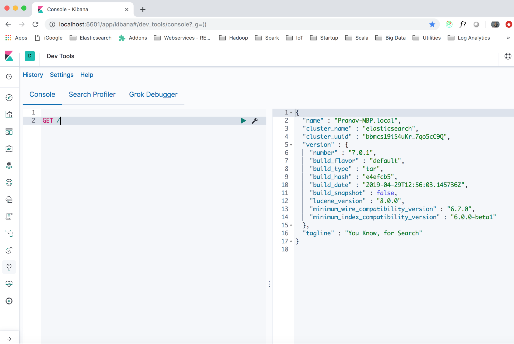
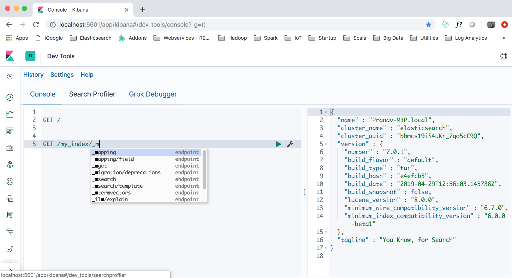
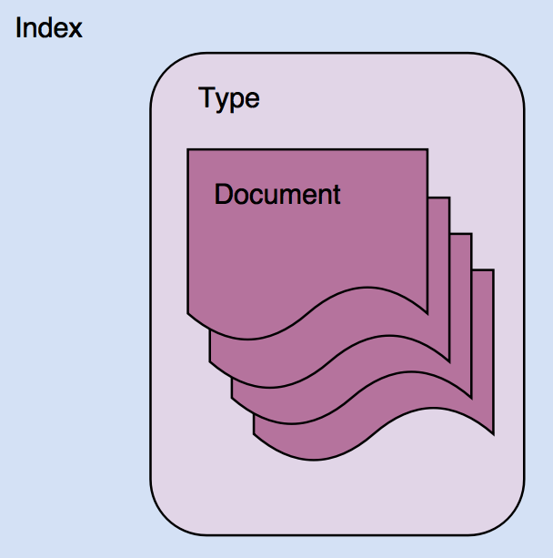
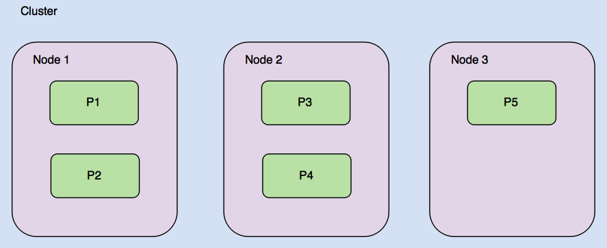
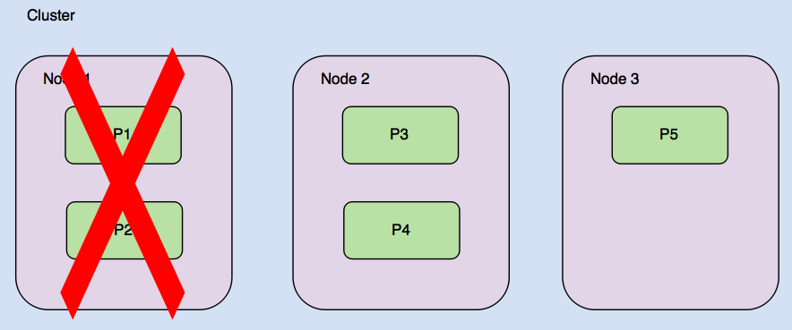
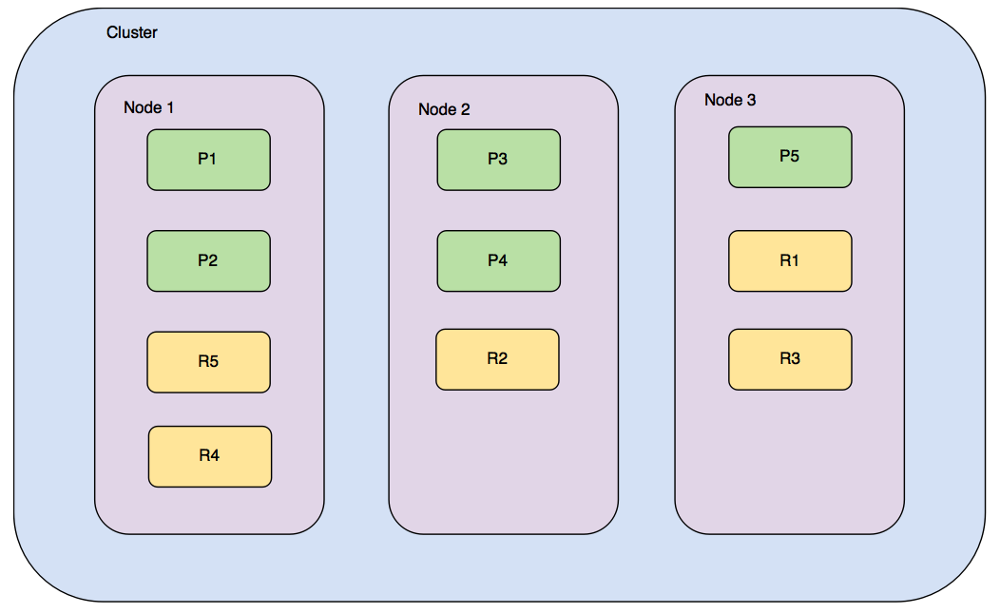

Lab 2. Getting Started with Elasticsearch
------------------------------------------------------


In the first lab, we looked at the reasons for learning about and
using the Elastic Stack, and the use cases of the Elastic Stack.

In this lab, we will start our journey of learning about the Elastic
Stack by looking at the core of the Elastic Stack -- Elasticsearch.
Elasticsearch is the search and analytics engine behind the Elastic
Stack. We will learn about the core concepts of Elasticsearch while
doing some hands-on practice, where we will learn about querying,
filtering, and searching.

We will cover the following topics in this lab:


-   Using the Kibana Console UI
-   Core concepts of Elasticsearch
-   CRUD operations
-   Creating indexes and taking control of mapping
-   REST API overview


Using the Kibana Console UI
---------------------------------------------


Before we start writing our first queries to
interact with Elasticsearch, we should familiarize ourselves with a very
important tool: Kibana Console. This is important because Elasticsearch
has a very rich REST API, allowing you to do all sorts of operations
with Elasticsearch. Kibana Console has an editor that is very capable
and aware of the REST API. It allows for auto completion, and for the
formatting of queries as you write them.


### Note

What is a REST API? **REST** stands for **Representational
State Transfer**. It is an architectural style that\'s used to
make systems inter operate and interact with each other. REST has
evolved along with the HTTP protocol, and almost all REST-based systems
use HTTP as their protocol. HTTP supports different methods,
including `GET`, `POST`, `PUT`,
`DELETE`, `HEAD`, and more, which are used for
different semantics. For example, `GET` is used for getting
or searching for something, `POST` is used for creating a new
resource, `PUT` may be used for creating or updating an
existing resource, and `DELETE` may be used for deleting a
resource permanently.


In Lab 1, we successfully
installed Kibana and launched the UI at
`http://localhost:5601`. As we mentioned previously, Kibana is
the window into the Elastic Stack. It not only provides insight into the
data through visualizations, but it also has developer tools such as the **`Console`**. The following diagram shows
the **`Console`** UI:





Figure 2.1: Kibana Console

In Kibana 7.0, you can navigate to the **`Console`** by first clicking
on **`Console`** under **`Manage and Administer the Elastic Stack`**.
The Console is divided into two parts: the editor pane and the results
pane. You can type the REST API command and press the green
triangle-like icon, which sends the query to the Elasticsearch instance
(or cluster).

 

Here, we have simply sent the `GET /` query. This is
equivalent to the `curl` command that we sent to Elasticsearch
for testing the setup, that
is, `curl http://localhost:9200`[*.*] As you can
see, the length of the command that\'s sent via the Console is already
more concise than the `curl` command. You don\'t need to type
`http` followed by the host and port of the Elasticsearch
node, that is, `http://localhost:9200`. However, as we
mentioned earlier, there is much more to it than just skipping the host
and port with every request. As you start typing in the **`Console`**
editor, you will get an autosuggestion dropdown, as displayed
in the following screenshot:





Figure 2.2: Kibana Dev Tools Console autosuggestions

Now that we have the right tool to generate and send queries to
Elasticsearch, let\'s continue learning about the core concepts.


Core concepts of Elasticsearch
------------------------------------------------


Relational databases have concepts such as rows, columns, tables, and
schemas. Elasticsearch and other document-oriented stores are based
on different abstractions. Elasticsearch is a document-oriented store.
JSON documents are first-class citizens in Elasticsearch. These JSON
documents are organized within different types and indexes. We will look
at the following core abstractions of
Elasticsearch:


-   Indexes
-   Types
-   Documents
-   Clusters
-   Nodes
-   Shards and replicas
-   Mappings and types
-   Inverted indexes


Let\'s start learning about these with an example:

```
PUT /catalog/_doc/1
{
   "sku": "SP000001",
   "title": "Elasticsearch for Hadoop",
   "description": "Elasticsearch for Hadoop",
   "author": "Vishal Shukla",
   "ISBN": "1785288997",
   "price": 26.99
}
```

Copy and paste this example into the editor of your Kibana Console UI
and execute it. This will index a document that represents a product in
the product catalog of a system. All of the examples that are written
for the Kibana Console UI can be very easily converted into
`curl` commands that can be executed from the command line.
The following is the curl version of the previous Kibana Console UI
command:

```
curl -XPUT http://localhost:9200/catalog/_doc/1 -H 'content-type: application/json' -d '{ "sku": "SP000001", "title": "Elasticsearch for Hadoop", "description": "Elasticsearch for Hadoop", "author": "Vishal Shukla", "ISBN": "1785288997", "price": 26.99}'
```

We will use this example to understand the following concepts: indexes,
types, and documents.

 

In the previous code block, the first line
is `PUT /catalog/_doc/1`, which is followed by a JSON
document.

`PUT` is the `HTTP` method that\'s
used to index a new document. `PUT` is among the other
`HTTP` methods we covered earlier. Here,
`catalog` is the name of the index,
`_doc` is the name of the type where the document will be
indexed (more on this later; each index in Elasticsearch 7.0 should
create just one type), and `1` is the ID[* *] to be
assigned to the document after it is indexed.

The following sections explain each concept in depth.


### Indexes


An **index** is a container that
stores and manages documents of a single type
in Elasticsearch. We will look at type in the next section. An index can
contain documents of a single **Type**, as depicted in the
following diagram:





Figure 2.3: Organization of Index, Type, and Document

An index is a logical container of a type. Some configuration parameters
are defined at the index level, while other configuration parameters are
defined at the type level, as we will see later in this lab.

The concept of index in
Elasticsearch is roughly analogous to the
database schema in a relational database. Going by that analogy, a type
in Elasticsearch is equivalent to a table, and a document is
equivalent to a record in the table. But please keep in mind that this
analogy is just for ease of understanding. Unlike relational database
schemas, which almost always contain multiple tables, one index can just
contain one type. 

 


### Note

Prior to Elasticsearch 6.0, one index could contain multiple types. This
has been changed since 6.0 to allow only one type within
an index[*.*]  If you have an existing index with multiple
types created prior to 6.0 and you are upgrading to Elasticsearch 6.0,
you can still use your old index. You cannot create a new index with
more than one type in Elasticsearch 6.0 and above.


With Elasticsearch 7.0, one index can strictly contain only one type by
default. Attempting to create a second type would result in the
following error: **`Rejecting mapping update to [index1]`** as the final
mapping would have more than 1 type: **`[type1, type2]`**. 

### Types


In our example of a product catalog, the document that
was indexed was of the product type. Each document stored in
the product[* *] type represents one product. Since the same
index cannot have other types, such as customers, orders, and order line
items, and more, types help in logically grouping or organizing the same
kind of documents within an index. 

Typically, documents with mostly common sets of fields are grouped under
one type. Elasticsearch is schemaless,[* *] allowing you to
store any JSON document with any set of fields into a type. In practice,
we should avoid mixing completely different entities, such as customers
and products, into a single type.[* *] It makes sense to store
them in separate types within separate indexes. 

The following code is for the index for customers:

```
PUT /customers/_doc/1
{
 "firstName": "John",
 "lastName": "Smith",
 "contact": {
 "mobile": "212-xxx-yyyy"
 },
 ...
}
```

 

 

The following code is for the index for products:

```
PUT /products/_doc/1
{
 "title": "Apple iPhone Xs (Gold, 4GB RAM, 64GB Storage, 12 MP Dual Camera, 458 PPI Display)",
 "price": 999.99,
 ...
}
```

As you can see, different types of documents are better handled in
different indexes since they may have different sets of
fields/attributes.

### Documents


As we mentioned earlier, JSON documents are
first-class citizens in Elasticsearch. A document consists of multiple
fields and is the basic unit of information that\'s stored in
Elasticsearch. For example, you may have a document representing a
single product, a single customer, or a single order line item.

As depicted in the preceding diagram, which shows the relationship
between indexes, types, and documents, documents are contained within
indexes and types.

Documents contain multiple fields. Each field
in the JSON document is of a particular type. In the product catalog
example that we saw earlier, these fields
were `sku`, `title`, `description`,
and `price`. Each field and its value can be seen as a
key-value pair in the document, where
`key` is the field name and `value` is the field
value. The field name is similar to a column name in a relational
database. The field value can be thought of as a value of the column for
a given row, that is, the value of a given cell in the table.

In addition to the fields that are sent by the user in the document,
Elasticsearch maintains internal metafields[*.*]  These fields
are as follows:


-   `_id`: This is the unique identifier of the document
    within the type, just like a primary key in a database table. It can
    be autogenerated or specified by the user.
-   `_type`: This field contains the type of the document. 
-   `_index`: This field contains the index name of the
    document.


 

 

### Nodes


Elasticsearch is a distributed system. It consists of multiple processes running across different machines in a
network that communicate with the other processes. In Lab 1, we downloaded, installed, and started
Elasticsearch. It started what is called a single node of Elasticsearch, or a single node Elasticsearch cluster.

An Elasticsearch node is a single server of Elasticsearch, which may be
part of a larger cluster of nodes. It participates in indexing,
searching, and performing other operations that are supported by
Elasticsearch. Every Elasticsearch node is assigned a unique ID and name
when it is started. A node can also be
assigned a static name via the `node.name` parameter in the
Elasticsearch configuration file, `config/elasticsearch.yml`.


### Note

Every Elasticsearch node or instance has a main configuration file,
which is located in the `config` subdirectory. The file is in
YML format (which stands for **YAML Ain\'t Markup
Language). This configuration file can be used to change
defaults such as the node name, port, and cluster name.


At the lowest level, a node corresponds to one instance of the
Elasticsearch process. It is responsible for managing its share of data.

### Clusters


A cluster hosts one or more indexes and is
responsible for providing operations such as searching, indexing, and
aggregations. A cluster is formed by one or
more nodes. Every Elasticsearch node is always part of a cluster, even
if it is just a single node cluster. By default, every Elasticsearch
node tries to join a cluster with the name Elasticsearch. If you start
multiple nodes on the same network without modifying
the `cluster.name` property
in `config/elasticsearch.yml`,[* *] they form a
cluster automatically.


### Note

It is advisable to modify
the `cluster.name`[* *] property in the
Elasticsearch configuration file to avoid joining another cluster in the
same network. Since the default behavior of a node is to join an
existing cluster within the network, your local node may try to join
another node and form a cluster. This can happen in developer machines
and also in other environments as long as the nodes are in the same
network.


A cluster consists of multiple nodes, where each node takes
responsibility for storing and managing its share of data. One cluster
can host one or more indexes. An index is a logical grouping of related
types of documents.

 

### Shards and replicas


The process of dividing the data among shards
is called **sharding**. Sharding is inherent in Elasticsearch
and is a way of scaling and parallelizing, as follows:


-   It helps in utilizing storage across different nodes of the cluster
-   It helps in utilizing the processing power of different nodes of the
    cluster


By default, every index is configured to have five shards in
Elasticsearch. At the time of creating the index, you can specify the
number of shards from which the data will be divided for your index.
Once an index is created, the number of shards cannot be modified. 

The following diagram illustrates how five shards of one index may be distributed
on a three-node cluster:





Figure 2.4: Organization of shards across the nodes of a cluster

The shards are named **P1** to **P5** in the
preceding diagram. Each shard contains roughly one fifth of the total
data stored in the index. When a query is made against this index,
Elasticsearch takes care of going through all the shards and
consolidating the result.

 

Now, imagine that one of the nodes (Node 1) goes down.
With **Node 1**, we also lose the share of data, which
was stored in shards **P1** and **P2**:





Figure 2.5: Failure of one node, along with the loss of its shards

Distributed systems such as Elasticsearch are expected to run in spite of hardware failure. This issue is addressed
by **replica
shards**[* *] or **replicas**. Each shard
in an index can be configured to have zero or
more replica shards. Replica shards are extra copies of the original or
primary shard and provide a high availability of data.

For example, with one replica of each shard, we will have one extra copy
of each replica. In the following diagram, we have five primary shards,
with one replica of each shard:





Figure 2.6: Organization of shards with replicas on cluster nodes

Primary shards are depicted in green and replica shards are depicted in
yellow. With the replicas in place, if **Node 1** goes down,
we still have all the shards available in **Node 2** and
**Node 3**[*. *] Replica shards may be promoted to
primary shards when the corresponding primary shard fails.

Apart from providing high availability and failover, replica shards also
enable the querying workload to be executed over replicas. Read
operations such as search, query[*,*]  and aggregations can be
executed on replicas as well. Elasticsearch transparently distributes
the execution of queries across nodes of the cluster where the required
shards or replicas are located.

To summarize, nodes get together to form a cluster. Clusters provide a
physical layer of services on which multiple indexes can be created. An
index may contain one or more types, with
each type containing millions or billions of documents. Indexes are
split into shards, which are partitions of underlying data within an
index. Shards are distributed across the nodes of a cluster. Replicas
are copies of primary shards and provide high
availability and failover.

### Mappings and datatypes


Elasticsearch is schemaless, meaning that you
can store documents with any number of fields
and types of fields. In a real-world scenario, data is never completely
schemaless or unstructured. There are always some sets of fields that
are common across all documents in a type. In
fact, types within the indexes should be created based on common fields.
Typically, one type of document in an index shares some common fields.

Relational databases impose a strict structure. In a relational
database, you need to define the structure of the table with column
names and datatypes for each column at the time of creating the table.
You cannot insert a record with a new column or a different datatype
column at runtime. 

It is important to understand the datatypes supported by Elasticsearch.


#### Datatypes


Elasticsearch supports a wide variety of datatypes for different scenarios where you want to store text data,
numbers, booleans, binary objects, arrays, objects, nested types,
geo-points, geo-shapes, and many other specialized datatypes, such as
IPv4 and IPv6 addresses.

In a document, each field has a datatype associated with it. A summary
of the datatypes supported by Elasticsearch is discussed in the
following sections.

 


##### Core datatypes


The core datatypes supported by Elasticsearch
are as follows:


-   **String data****types**:
    
    -   `text`: The `text` datatype is useful for
        supporting full-text search for fields that contain a
        description or lengthy text values. These fields[]{#id326261854
        .indexterm} are analyzed before indexing to support full-text
        search.
    -   `keyword`: The `keyword` type enables
        analytics on string fields. Fields of this type support sorting,
        filtering, and aggregations.
    
-   **Numeric data****types**: 
    
    -   `byte`, `short`, `integer`, and
        `long`: Signed integers
        with 8-bit, 16-bit, 32-bit, and 64-bit precision, respectively
    -   `float` and `double`: IEEE 754
        floating-point numbers with single-precision 32-bit and
        double-precision 64-bit representations
    -   `half_float`: IEEE 754 floating-point number with
        half-precision 16-bit representation
    -   `scaled_float`: Floating-point number backed by a long
        and fixed scaling factor
    
-   **Date data****type**:
    
    -   `date`: Date with an optional[]{#id326263577
        .indexterm} timestamp component that\'s capable of storing
        precision timestamps down to the millisecond
    
-   **Boolean data****type**:
    
    -   `boolean`: The `boolean` datatype
        that is common in all programming
        languages
    
-   **Binary data****type**:
    
    -   `binary`: Allows you to store arbitrary[]{#id326263629
        .indexterm} binary values after performing Base64 encoding
    
-   **Range data****types**: 
    
    -   `integer_range`, `float_range`,
        `long_range`, `double_range`,
        and `date_range`: Defines ranges of integers, floats,
        longs, and more
    


### Note

`scaled_float` is a very useful datatype for
storing something such as price, which always has a precision of a
limited number of decimal places. Price can be stored with a scaling
factor of 100, so a price of \$10.98 would be internally stored as 1,098
cents and can be treated as an integer. Internally,
`scaled_float` is much more storage efficient since integers
can be compressed much better.


 

##### Complex datatypes


The complex datatypes supported by
Elasticsearch are as follows:


-   **Array datatype**: Arrays of the
    same types of instances. For example,
    arrays of strings, integers, and more. Doesn\'t allow for the mixing
    of datatypes in arrays.
-   **Object datatype**: Allows inner
    objects within JSON documents.
-   **Nested datatype**: Useful for
    supporting arrays of inner objects, where
    each inner object needs to be independently queriable.


##### Other datatypes


The other datatypes supported by
Elasticsearch are as follows:


-   **Geo-point
    data****type**: Allows the
    storing of geo-points as longitude and latitude. The geo-point
    datatype enables queries such as searching across all ATMs within a
    distance of 2 km from a point[*.*] 
-   **Geo-shape
    data****type**: Allows you
    to store geometric shapes such as
    polygons, maps, and more. Geo-shape enables queries such as
    searching for all items within a shape.
-   **IP data****type**: Allows you
    to store IPv4 and IPv6 addresses.


#### Mappings


To understand mappings, let\'s add another product to the product catalog:

```
PUT /catalog/_doc/2
{
    "sku": "SP000002",
    "title": "Google Pixel Phone 32GB - 5 inch display",
    "description": "Google Pixel Phone 32GB - 5 inch display (Factory Unlocked US Version)",
    "price": 400.00,
    "resolution": "1440 x 2560 pixels",
    "os": "Android 7.1"
}
```

Copy and paste this example into the editor of your Kibana Console UI
and execute it.

As you can see, the product has many different fields, as it is of a
completely different category. Yet, there are some fields that are
common in all products. The common fields are the reason why all of these documents are called
**products**[*.*]  

 

 

 

 

 

 

 

 

Remember, unlike relational databases, we didn\'t have to define the
fields that would be part of each document. In fact, we didn\'t even
have to create an index with the name catalog[*. *] When the
first document about the product type was indexed in the index catalog,
the following tasks were performed by Elasticsearch:


-   Creating an index with the name catalog
-   Defining the mappings for the type of documents that will be stored
    in the index\'s default type -- `_doc`

##### Creating an index with the name catalog


The first step involves creating an index, because the
index doesn\'t exist already. The index is
created using the default number of shards. We will look at a
concept called **index
templates** -- you can create templates for any new indexes.
Sometimes, an index needs to be created on the fly, just like in this
case, where the insertion of the first document triggers the creation of
a new index. The index template kicks in and provides the matching
template for the index while creating the new index. This helps in
creating indexes in a controlled way, that is, with desired defaults,
like the number of shards and type mappings for the types within them.

An index can be created beforehand as well. Elasticsearch
has a separate index API
(<https://www.elastic.co/guide/en/elasticsearch/reference/current/indices.html>)
that deals with index-level operations. This includes create, delete,
get, create mapping, and many more advanced operations. 

##### Defining the mappings for the type of product


The second step involves defining the mappings for the type of product.[* *] This step is
executed because the type catalog did not exist before the first
document was indexed. Remember the analogy of type with a relational
database table.[* *] The table needs to exist before any row
can be inserted. When a table is created in an **RDBMS**
(Relational Database Management System), we define the
fields (columns) and their datatypes in the `CREATE TABLE`
statement.

When the first document is indexed within a type that doesn\'t exist
yet, Elasticsearch tries to infer**[* *] **the
datatypes of all the fields. This feature is called the **dynamic
mapping** of types. By default, the dynamic mapping of types
is enabled in Elasticsearch.

To see the mappings of the product[* *] type in the
catalog[* *] index, execute the following command in the
Kibana Console UI:

```
GET /catalog/_mapping
```

This is an example of a `GET`
mapping API
(<https://www.elastic.co/guide/en/elasticsearch/reference/current/indices-get-mapping.html>).
You can request mappings of a specific type, all the types within an
index, or within multiple indexes.

The response should look like the following:

```
{
  "catalog" : {
    "mappings" : {
      "properties" : {
        "ISBN" : {
          "type" : "text",
          "fields" : {
            "keyword" : {
              "type" : "keyword",
              "ignore_above" : 256
            }
          }
        },
        "author" : {
          "type" : "text",
          "fields" : {
            "keyword" : {
              "type" : "keyword",
              "ignore_above" : 256
            }
          }
        },
        "description" : {
          "type" : "text",
          "fields" : {
            "keyword" : {
              "type" : "keyword",
              "ignore_above" : 256
            }
          }
        },
        "os" : {
          "type" : "text",
          "fields" : {
            "keyword" : {
              "type" : "keyword",
              "ignore_above" : 256
            }
          }
        },
        "price" : {
          "type" : "float"
        },
        "resolution" : {
          "type" : "text",
          "fields" : {
            "keyword" : {
              "type" : "keyword",
              "ignore_above" : 256
            }
          }
        },
        "sku" : {
          "type" : "text",
          "fields" : {
            "keyword" : {
              "type" : "keyword",
              "ignore_above" : 256
            }
          }
        },
        "title" : {
          "type" : "text",
          "fields" : {
            "keyword" : {
              "type" : "keyword",
              "ignore_above" : 256
            }
          }
        }
      }
    }
  }
}
```

At the top level of the JSON
response, `catalog`[* *] is the index for which we
requested mappings. The `mappings` child
product[* *] signifies the fact that these are mappings for
the product type. The actual datatype mappings for each field are under
the `properties` element. 

 

The actual type mappings that are returned will be slightly different
from the ones shown in the preceding code. It has been simplified
slightly. As you can see, only `price` is of the
`float` datatype; the other fields were mapped to the
`text` type. In reality, each `text` datatype field
is mapped as follows:

```
"field_name": {
"type": "text",
"fields": {
"keyword": {
"type": "keyword",
"ignore_above": 256
}
  }
}
```

As you may have noticed, each field that was sent as a string is
assigned the `text` datatype. The `text` datatype
enables full-text search on a field. Additionally, the same field is
also stored as a multi-field,[* *] and it is also stored as
a `keyword` type[*.*]  This effectively enables
full-text search and analytics (such as sorting, aggregations, and
filtering) on the same field. We will look at both search and analytics
in the upcoming labs of this book.


### Inverted indexes


An **inverted index** is the core
data structure of Elasticsearch and any other system supporting
full-text search. An inverted index is similar to the
index that you see at the end of any book. It
maps the terms that appear in the documents to the documents.

For example, you may build an inverted index from the following strings:


 
Elasticsearch builds a data structure from the three documents that have
been indexed. The following data structure is called an **inverted
index**:


 

Notice the following things:


-   Documents were broken down into terms after removing punctuation and
    placing them in lowercase.
-   Terms are sorted alphabetically.
-   The **Frequency** column captures how many times the term
    appears in the entire document set.
-   The third column captures the documents in which the term was found.
    Additionally, it may also contain the exact locations (offsets
    within the document) where the term was found.


When searching for terms in the documents, it is blazingly fast to
locate the documents in which the given term appears. If the user
searches for the term `sunday`, then looking up
`sunday` from the **Term** column will be really
fast, because the terms are sorted in the index. Even if there were
millions of terms, it is quick to look up terms when they are sorted.

Subsequently, consider a scenario in which the user searches for two
words, for example, `last sunday`. The inverted index can be
used to individually search for the occurrence of `last` and
`sunday`; document **2** contains both terms, so it
is a better match than document **1**, which contains only
one term.

The inverted index is the building block for
performing fast searches. Similarly, it is
easy to look up how many occurrences of terms are present in the index.
This is a simple count aggregation. Of course, Elasticsearch uses lots
of innovation on top of the bare inverted index we\'ve explained here.
It caters to both search and analytics.

By default, Elasticsearch builds an inverted index on all the fields in
the document, pointing back to the Elasticsearch document in which the
field was present. 


CRUD operations
---------------------------------


In this section, we will look at how to perform basic CRUD operations,
which are the most fundamental operations required by any data store.
Elasticsearch has a very well-designed REST
API, and the CRUD operations are targeted at documents. 

To understand how to perform CRUD operations,
we will cover the following APIs. These APIs fall under the category of
document APIs, which deal with documents:


-   Index API
-   Get API
-   Update API
-   Delete API

### Index API


In Elasticsearch terminology, adding (or creating) a
document to a type within an index of
Elasticsearch is called an **indexing operation**.
Essentially, it involves adding the document to the index by parsing all
the fields within the document and building
the inverted index. This is why this operation is known as
an **indexing operation**.

There are two ways we can index a document:


-   Indexing a document by providing an ID
-   Indexing a document without providing an ID

#### Indexing a document by providing an ID


We have already seen this version of the
indexing operation. The user can provide the ID of the document using
the `PUT` method.

The format of this request is `PUT /<index>/<type>/<id>`, with
the JSON document as the body of the request:

```
PUT /catalog/_doc/1
{
    "sku": "SP000001",
    "title": "Elasticsearch for Hadoop",
    "description": "Elasticsearch for Hadoop",
    "author": "Vishal Shukla",
    "ISBN": "1785288997",
    "price": 26.99
}
```


#### Indexing a document without providing an ID


If you don\'t want to control the ID
generation for the documents, you can use the `POST` method.

The format of this request is `POST /<index>/<type>`, with the
JSON document as the body of the request:

```
POST /catalog/_doc
{
    "sku": "SP000003",
    "title": "Mastering Elasticsearch",
    "description": "Mastering Elasticsearch",
    "author": "Bharvi Dixit",
    "price": 54.99
}
```

The ID, in this case, will be generated by Elasticsearch. It is a hash
string, as highlighted in the response:

```
{
  "_index" : "catalog",
  "_type" : "_doc",
  "_id" : "1ZFMpmoBa_wgE5i2FfWV",
  "_version" : 1,
  "result" : "created",
  "_shards" : {
    "total" : 2,
    "successful" : 1,
    "failed" : 0
  },
  "_seq_no" : 4,
  "_primary_term" : 1
}
```


### Note

As per pure REST conventions, `POST` is used for creating a
new resource and `PUT` is used for updating an existing
resource. Here, the usage of `PUT` is equivalent to saying [*I
know the ID that I want to assign, so use this ID while indexing this
document*] . 


### Get API


The get API is useful for retrieving a document when you already know the ID of the document. It is essentially a
get by primary key[* *] operation, as follows:

```
GET /catalog/_doc/1ZFMpmoBa_wgE5i2FfWV
```

The format of this request is `GET /<index>/<type>/<id>`. The
response would be as expected:

```
{
  "_index" : "catalog",
  "_type" : "_doc",
  "_id" : "1ZFMpmoBa_wgE5i2FfWV",
  "_version" : 1,
  "_seq_no" : 4,
  "_primary_term" : 1,
  "found" : true,
  "_source" : {
    "sku" : "SP000003",
    "title" : "Mastering Elasticsearch",
    "description" : "Mastering Elasticsearch",
"author": "Bharvi Dixit",
    "price": 54.99
}
}
```


### Update API


The update API is useful for updating the existing document by ID.

The format of an update request
is `POST <index>/<type>/<id>/_update`, with a JSON request as
the body:

```
POST /catalog/_update/1
{
"doc": {
"price": "28.99"
}
}
```

The properties specified under the `doc` element are merged
into the existing document. The previous version of this document with
an ID of `1` had a price of `26.99`. This update
operation just updates the price and leaves the other fields of the
document unchanged. This type of update means that `doc` is
specified and used as a partial document to merge with an existing
document; there are other types of updates supported.

The response of the update request is as follows:

```
{
"_index": "catalog",
"_type": "_doc",
"_id": "1",
"_version": 2,
"result": "updated",
"_shards": {
"total": 2,
"successful": 1,
"failed": 0
}
}
```

Internally, Elasticsearch maintains the version of each document.
Whenever a document is updated, the version number is incremented.

The partial update that we saw in the preceding code will work only if
the document existed beforehand. If the document with the given
ID[* *] did not exist, Elasticsearch will return an error
saying that the document is missing. Let\'s understand how to do an
`upsert` operation using the update API. The term
**upsert** loosely means update or
insert, that is, update the document if it exists, otherwise, insert the
new document.

The `doc_as_upsert` parameter checks whether the document with the given ID already exists and merges the
provided `doc` with the existing document. If the document
with the given ID doesn\'t exist, it inserts a new document with the
given document contents.

 

 

The following example uses `doc_as_upsert` to merge into the
document with an ID of `3` or insert a new document if it
doesn\'t exist:

```
POST /catalog/_update/3
{
"doc": {
    "author": "Albert Paro",
    "title": "Elasticsearch 5.0 Cookbook",
    "description": "Elasticsearch 5.0 Cookbook Third Edition",
"price": "54.99"
},
"doc_as_upsert": true
}
```

We can update the value of a field based on the existing value of that
field or another field in the document. The following update uses an
inline script to increase the price by two for a specific product:

```
POST /catalog/_update/1ZFMpmoBa_wgE5i2FfWV
{
  "script": {
    "source": "ctx._source.price += params.increment",
    "lang": "painless",
    "params": {
      "increment": 2
    }
  }
}
```

Scripting support allows you to read the existing value, increment the
value by a variable, and store it in a single operation. The inline
script that\'s used here is Elasticsearch\'s own painless scripting
language. The syntax for incrementing an existing variable is similar to
most other programming languages.

### Delete API


The delete API lets you delete a document by ID:

```
DELETE /catalog/_doc/1ZFMpmoBa_wgE5i2FfWV
```

 

 

The response of the delete operation is as
follows:

```
{
  "_index" : "catalog",
  "_type" : "_doc",
  "_id" : "1ZFMpmoBa_wgE5i2FfWV",
  "_version" : 4,
  "result" : "deleted",
  "_shards" : {
    "total" : 2,
    "successful" : 1,
    "failed" : 0
  },
  "_seq_no" : 9,
  "_primary_term" : 1
}
```

This is how basic CRUD operations are performed with Elasticsearch.
Please bear in mind that Elasticsearch maintains data in a completely
different data structure, that is, an inverted index, using the
capabilities of Apache Lucene. A relational database builds and
maintains B-trees, which are more suitable for typical CRUD operations.


Creating indexes and taking control of mapping
----------------------------------------------------------------


In the previous section, we learned how to
perform CRUD operations with Elasticsearch. In the process, we saw how
indexing the first document to an index that
doesn\'t yet exist, results in the creation of the new index and the
mapping of the type.

Usually, you wouldn\'t want to let things happen automatically, as you
would want to control how indexes are created and also how mapping is
created. We will see how you can take control of this process in this
section and we will look at the following:


-   Creating an index
-   Creating a mapping
-   Updating a mapping


 


### Creating an index


You can create an index and specify the
number of shards and replicas to create:

```
PUT /catalog
{
  "settings": {
    "index": {
      "number_of_shards": 5,
      "number_of_replicas": 2
    }
  }
}
```

It is possible to specify a mapping for a type at the time of index
creation. The following command will create an index called catalog,
with five shards and two replicas. Additionally, it also defines a type
called `my_type` with two fields, one of the `text`
type and another of the `keyword` type:

```
PUT /catalog1
{
  "settings": {
    "index": {
      "number_of_shards": 5,
      "number_of_replicas": 2
    }
  },
  "mappings": {
    "properties": {
      "f1": {
        "type": "text"
      },
      "f2": {
        "type": "keyword"
      }
    }
  }
}
```


### Creating type mapping in an existing index


With Elasticsearch 7.0, indexes contain strictly one type, and hence it is generally recommended that you
create the index and the default type within that index at index
creation time. The default type name is `_doc`.

 

 

In the earlier versions of Elasticsearch (6.0 and before), it was
possible to define an index and then add multiple types to that index as
needed. This is still possible but it is a deprecated feature. A type
can be added within an index after the index
is created using the following code. The mappings for the type can be
specified as follows:

```
PUT /catalog/_mapping
{
  "properties": {
    "name": {
      "type": "text"
    }
  }
}
```

This command creates a type called `_doc`, with one field of
the `text` type in the existing index catalog. Let\'s add a
couple of documents after creating the new type:

```
POST /catalog/_doc
{
"name": "books"
}
POST /catalog/_doc
{
"name": "phones"
}
```

After a few documents are indexed, you realize that you need to add
fields in order to store the description of the category. Elasticsearch
will assign a type automatically based on the value that you insert for
the new field. It only takes into consideration the first value that it
sees to guess the type of that field:

```
POST /catalog/_doc
{
 "name": "music",
 "description": "On-demand streaming music"
}
```

When the new document is indexed with fields, the field is assigned a
datatype based on its value in the initial document. Let\'s look at the
mapping after this document is indexed:

```
{
  "catalog" : {
    "mappings" : {
      "properties" : {
        "description" : {
          "type" : "text",
          "fields" : {
            "keyword" : {
              "type" : "keyword",
              "ignore_above" : 256
            }
          }
        },
        "name" : {
          "type" : "text"
        }
      }
    }
  }
}
```

The field description has been assigned
the `text` datatype, with a field with the `name`
keyword, which is of the `keyword` type. What this means is
that, logically, there are two
fields, `description` and `description.keyword`. The `description` field
is analyzed at the time of indexing, whereas
the `description.keyword` field is not analyzed and is stored
as is without any analysis. By default,
fields that are indexed with double quotes for the first time are stored
as both `text` and `keyword` types.

If you want to take control of the type, you should define the mapping
for the field before the first document containing that field is
indexed. A field\'s type cannot be changed after one or more documents
are indexed within that field. Let\'s see how to update the mapping to
add a field with the desired type.

### Updating a mapping


Mappings for new fields can be added after a type has been created. A mapping can be updated for a type with
the `PUT` mapping API. Let\'s add a `code` field,
which is of the `keyword` type, but with no analysis:

```
PUT /catalog/_mapping
{
  "properties": {
    "code": {
      "type": "keyword"
    }
  }
}
```

 

 

 

This mapping is merged into the existing mappings of the
`_doc` type. The mapping looks like the following after it is
merged:

```
{
  "catalog" : {
    "mappings" : {
      "properties" : {
        "code" : {
          "type" : "keyword"
        },
        "description" : {
          "type" : "text",
          "fields" : {
            "keyword" : {
              "type" : "keyword",
              "ignore_above" : 256
            }
          }
        },
        "name" : {
          "type" : "text"
        }
      }
    }
  }
}
```

Any subsequent documents that are indexed
with the `code` field are assigned the right datatype:

```
POST /catalog/_doc
{
"name": "sports",
"code": "C004",
"description": "Sports equipment"
}
```

This is how we can take control of the index creation and type mapping
process, and add fields after the type is created.


REST API overview
-----------------------------------


We just looked at how to perform basic CRUD
operations. Elasticsearch supports a wide variety of operation types.
Some operations deal with documents, that is, creating, reading,
updating, deleting, and more. Some operations provide search and
aggregations, while other operations are for providing cluster-related
operations, such as monitoring health. Broadly, the APIs that deal with
Elasticsearch are categorized into the following types of APIs:


-   Document APIs
-   Search APIs
-   Aggregation APIs
-   Indexes APIs
-   Cluster APIs
-   cat APIs


The Elasticsearch reference documentation has documented these APIs very
nicely. In this book, we will not go into the APIs down to the last
detail. We will conceptually understand, with examples, how the APIs can
be leveraged to get the best out of Elasticsearch and the other
components of the Elastic Stack.

We will look at the search and aggregation APIs in [*Lab
3, Searching -- What is Relevant*], and Lab 4[*,
Analytics with Elasticsearch*], respectively.

In the following section, we will cover the common API conventions that
are applicable to all REST APIs.


### Common API conventions


All Elasticsearch REST APIs share some common
features. They can be used across almost all APIs. In this section, we
will cover the following features:


-   Formatting the JSON response
-   Dealing with multiple indexes


Let\'s look at each item, one by one, in the following sections.

 


#### Formatting the JSON response


By default, the response of all the requests
is not formatted. It returns an unformatted JSON string in a single
line:

```
curl -XGET http://localhost:9200/catalog/_doc/1
```

The following response is not formatted:

```
{"_index":"catalog","_type":"product","_id":"1","_version":3,"found":true,"_source":{
 "sku": "SP000001",
 "title": "Elasticsearch for Hadoop",
 "description": "Elasticsearch for Hadoop",
 "author": "Vishal Shukla",
 "ISBN": "1785288997",
 "price": 26.99
}}
```

Passing `pretty=true` formats the response:

```
curl -XGET http://localhost:9200/catalog/_doc/1?pretty=true
{
 "_index" : "catalog",
 "_type" : "product",
 "_id" : "1",
 "_version" : 3,
 "found" : true,
 "_source" : {
 "sku" : "SP000001",
 "title" : "Elasticsearch for Hadoop",
 "description" : "Elasticsearch for Hadoop",
 "author" : "Vishal Shukla",
 "ISBN" : "1785288997",
 "price" : 26.99
 }
}
```

When you are using the Kibana Console UI, all responses are formatted by
default. 

 

 

#### Dealing with multiple indexes


Operations such as search and aggregations
can run against multiple indexes in the same query. It is possible to
specify which indexes should be searched by using different URLs in the
`GET` request. Let\'s understand how the URLs can be used to
search in different indexes and the types within them. We cover the
following scenarios when dealing with multiple indexes within a cluster:


-   Searching all documents in all indexes
-   Searching all documents in one index
-   Searching all documents of one type in an index
-   Searching all documents in multiple indexes
-   Searching all documents of a particular type in all indexes


The following query matches all documents. The documents that are
actually returned by the query will be limited to 10 in this case. The
default size of the result is 10, unless specified otherwise in the
query:

```
GET /_search
```

This will return all the documents from all the indexes of the cluster.
The response looks similar to the following, and it is truncated to
remove the unnecessary repetition of documents:

```
{
"took": 3,
"timed_out": false,
"_shards": {
"total": 16,
"successful": 16,
    </span>"failed": 0
},
"hits": {
"total": 4,
"max_score": 1,
"hits": [
      {
        "_index": ".kibana",
        "_type": "doc",
        "_id": "config:7.0.0",
        "_score": 1,
        "_source": {
          "type": "config",
          "config": {
            "buildNum": 16070
          }
        }
      },
      ...
      ...
    ]
  }
}
```

Clearly, this is not a very useful operation, but let\'s use it to
understand the search response:


-   `took`: The number of milliseconds taken by
    the cluster to return the result.
-   `timed_out`: `false`: This means that the
    operation completed successfully without timing out.
-   `_shards`: Shows the summary of how many
    shards across the entire cluster were searched for successfully, or
    failed.
-   `hits`: Contains the actual documents that matched. It
    contains `total`, which signifies the total documents that
    matched the search criteria across all indexes. The
    `max_score` displays the score of the best matching
    document from the search hits. The `hits` child of this
    element contains the actual document list. 


### Note

The hits list contained within an array doesn\'t contain all matched
documents. It would be wasteful to return everything that matched the
search criteria, as there could be millions or billions of such matched
documents. Elasticsearch truncates the hits by `size`, which
can be optionally specified as a request parameter using
`GET /_search?size=100`. The default value for the
`size` is 10, hence the search hits array will contain up to
10 records by default.

##### Searching all documents in one index


The following code will search for all
documents, but only within the catalog index:

```
GET /catalog/_search
```

You can also be more specific and include the type in addition to the
index name, like so:

```
GET /catalog/_doc/_search
```

The version with the `_doc` type name produces a deprecation
warning because each index is supposed to contain only one type.

 

##### Searching all documents in multiple indexes


The following will search for all the documents within the `catalog` index and an index named
`my_index`:

```
GET /catalog,my_index/_search
```


##### Searching all the documents of a particular type in all indexes


The following will search all the indexes in
the cluster, but only documents of the product type will be searched:

```
GET /_all/_doc/_search
```

This feature can be quite handy when you have multiple indexes, with
each index containing the exact same type. This type of query can help
you query data for that type from all indexes.


Summary
-------------------------


In this lab, we learned about the essential Kibana Console UI and
curl commands that we can use to interact with Elasticsearch with the
REST API. Then, we looked at the core concepts of Elasticsearch. We
performed customary CRUD operations, which are required as support for
any data store. We took a closer look at how to create indexes, and how
to create and manage mappings. We ended this lab with an overview of
the REST API in Elasticsearch, and the common conventions that are used
in most APIs.

In the next lab, we will take a deep dive into the search
capabilities of Elasticsearch to understand the maximum benefits of
Elasticsearch as a search engine.
