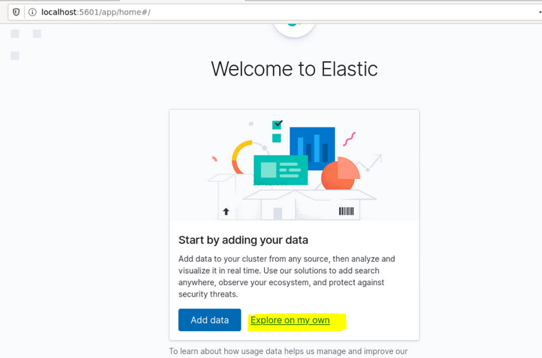
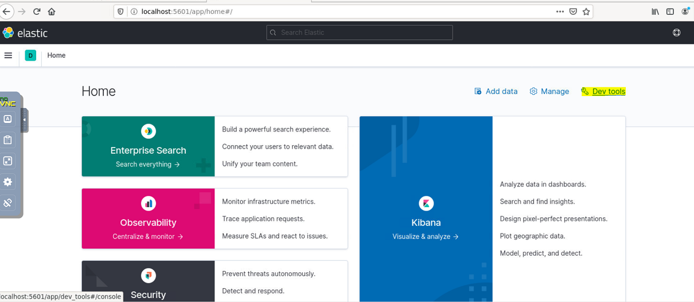
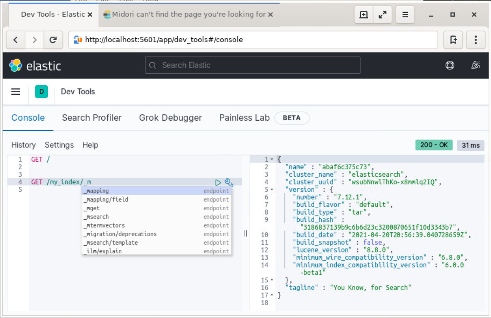

Lab 2. Getting Started with Elasticsearch
------------------------------------------------------

We will cover the following topics in this lab:


-   Using the Kibana Console UI
-   Core concepts of Elasticsearch
-   CRUD operations
-   Creating indexes and taking control of mapping
-   REST API overview


Using the Kibana Console UI
---------------------------------------------


In Lab 1, we successfully installed Kibana and launched the UI at
`http://localhost:5601`. As we mentioned previously, Kibana is
the window into the Elastic Stack. It not only provides insight into the
data through visualizations, but it also has developer tools such as the `Console`. The following diagram shows
the `Console` UI:







The Console is divided into two parts: the editor pane and the results
pane. You can type the REST API command and press the green
triangle-like icon, which sends the query to the Elasticsearch instance
(or cluster).


Here, we have simply sent the `GET /` query. This is
equivalent to the `curl` command that we sent to Elasticsearch
for testing the setup, that
is, `curl http://localhost:9200`. As you can
see, the length of the command that\'s sent via the Console is already
more concise than the `curl` command. You don\'t need to type
`http` followed by the host and port of the Elasticsearch
node, that is, `http://localhost:9200`. However, as we
mentioned earlier, there is much more to it than just skipping the host
and port with every request. As you start typing in the `Console`
editor, you will get an autosuggestion dropdown, as displayed
in the following screenshot:




Now that we have the right tool to generate and send queries to
Elasticsearch, let\'s continue learning about the core concepts.


Core concepts of Elasticsearch
------------------------------------------------

Let's look at the following core abstractions of Elasticsearch:


-   Indexes
-   Types
-   Documents
-   Clusters
-   Nodes
-   Shards and replicas
-   Mappings and types
-   Inverted indexes


Let\'s start learning about these with an example:

```
PUT /catalog/_doc/1
{
   "sku": "SP000001",
   "title": "Elasticsearch for Hadoop",
   "description": "Elasticsearch for Hadoop",
   "author": "Vishal Shukla",
   "ISBN": "1785288997",
   "price": 26.99
}
```

Copy and paste this example into the editor of your Kibana Console UI
and execute it. This will index a document that represents a product in
the product catalog of a system. All of the examples that are written
for the Kibana Console UI can be very easily converted into
`curl` commands that can be executed from the command line.
The following is the curl version of the previous Kibana Console UI
command:

```
curl -XPUT http://localhost:9200/catalog/_doc/1 -H 'content-type: application/json' -d '{ "sku": "SP000001", "title": "Elasticsearch for Hadoop", "description": "Elasticsearch for Hadoop", "author": "Vishal Shukla", "ISBN": "1785288997", "price": 26.99}'
```

We will use this example to understand the following concepts: indexes,
types, and documents.

 

In the previous code block, the first line
is `PUT /catalog/_doc/1`, which is followed by a JSON
document.

`PUT` is the `HTTP` method that\'s
used to index a new document. `PUT` is among the other
`HTTP` methods we covered earlier. Here,
`catalog` is the name of the index,
`_doc` is the name of the type where the document will be
indexed (more on this later; each index in Elasticsearch 7.0 should
create just one type), and `1` is the ID to be
assigned to the document after it is indexed.


### Types

Typically, documents with mostly common sets of fields are grouped under
one type. Elasticsearch is schemaless, allowing you to
store any JSON document with any set of fields into a type. In practice,
we should avoid mixing completely different entities, such as customers
and products, into a single type. It makes sense to store
them in separate types within separate indexes. 

The following code is for the index for customers:

```
PUT /customers/_doc/1
{
 "firstName": "John",
 "lastName": "Smith",
 "contact": {
 "mobile": "212-xxx-yyyy"
 }

}
```
 

The following code is for the index for products:

```
PUT /products/_doc/1
{
 "title": "Apple iPhone Xs (Gold, 4GB RAM, 64GB Storage, 12 MP Dual Camera, 458 PPI Display)",
 "price": 999.99
}
```

As you can see, different types of documents are better handled in
different indexes since they may have different sets of
fields/attributes.


#### Mappings


To understand mappings, let\'s add another product to the product catalog:

```
PUT /catalog/_doc/2
{
    "sku": "SP000002",
    "title": "Google Pixel Phone 32GB - 5 inch display",
    "description": "Google Pixel Phone 32GB - 5 inch display (Factory Unlocked US Version)",
    "price": 400.00,
    "resolution": "1440 x 2560 pixels",
    "os": "Android 7.1"
}
```

Copy and paste this example into the editor of your Kibana Console UI and execute it.

As you can see, the product has many different fields, as it is of a
completely different category. Yet, there are some fields that are
common in all products. The common fields are the reason why all of these documents are called **products**. 


##### Defining the mappings for the type of product

To see the mappings of the product type in the
catalog index, execute the following command in the
Kibana Console UI:

```
GET /catalog/_mapping
```

This is an example of a `GET`
mapping API
(<https://www.elastic.co/guide/en/elasticsearch/reference/current/indices-get-mapping.html>).
You can request mappings of a specific type, all the types within an
index, or within multiple indexes.

The response should look like the following:

```
{
  "catalog" : {
    "mappings" : {
      "properties" : {
        "ISBN" : {
          "type" : "text",
          "fields" : {
            "keyword" : {
              "type" : "keyword",
              "ignore_above" : 256
            }
          }
        },
        "author" : {
          "type" : "text",
          "fields" : {
            "keyword" : {
              "type" : "keyword",
              "ignore_above" : 256
            }
          }
        },
        "description" : {
          "type" : "text",
          "fields" : {
            "keyword" : {
              "type" : "keyword",
              "ignore_above" : 256
            }
          }
        },
        "os" : {
          "type" : "text",
          "fields" : {
            "keyword" : {
              "type" : "keyword",
              "ignore_above" : 256
            }
          }
        },
        "price" : {
          "type" : "float"
        },
        "resolution" : {
          "type" : "text",
          "fields" : {
            "keyword" : {
              "type" : "keyword",
              "ignore_above" : 256
            }
          }
        },
        "sku" : {
          "type" : "text",
          "fields" : {
            "keyword" : {
              "type" : "keyword",
              "ignore_above" : 256
            }
          }
        },
        "title" : {
          "type" : "text",
          "fields" : {
            "keyword" : {
              "type" : "keyword",
              "ignore_above" : 256
            }
          }
        }
      }
    }
  }
}
```

At the top level of the JSON
response, `catalog` is the index for which we
requested mappings. The `mappings` child
product signifies the fact that these are mappings for
the product type. The actual datatype mappings for each field are under
the `properties` element. 


The actual type mappings that are returned will be slightly different
from the ones shown in the preceding code. It has been simplified
slightly. As you can see, only `price` is of the
`float` datatype; the other fields were mapped to the
`text` type. In reality, each `text` datatype field
is mapped as follows:

```
"field_name": {
"type": "text",
"fields": {
"keyword": {
"type": "keyword",
"ignore_above": 256
}
  }
}
```


CRUD operations
---------------------------------


To understand how to perform CRUD operations,
we will cover the following APIs. These APIs fall under the category of
document APIs, which deal with documents:


-   Index API
-   Get API
-   Update API
-   Delete API


#### Indexing a document by providing an ID


We have already seen this version of the
indexing operation. The user can provide the ID of the document using
the `PUT` method.

The format of this request is `PUT /<index>/<type>/<id>`, with
the JSON document as the body of the request:

```
PUT /catalog/_doc/1
{
    "sku": "SP000001",
    "title": "Elasticsearch for Hadoop",
    "description": "Elasticsearch for Hadoop",
    "author": "Vishal Shukla",
    "ISBN": "1785288997",
    "price": 26.99
}
```


#### Indexing a document without providing an ID


If you don\'t want to control the ID
generation for the documents, you can use the `POST` method.

The format of this request is `POST /<index>/<type>`, with the
JSON document as the body of the request:

```
POST /catalog/_doc
{
    "sku": "SP000003",
    "title": "Mastering Elasticsearch",
    "description": "Mastering Elasticsearch",
    "author": "Bharvi Dixit",
    "price": 54.99
}
```

The ID, in this case, will be generated by Elasticsearch. It is a hash
string, as highlighted in the response:

```
{
  "_index" : "catalog",
  "_type" : "_doc",
  "_id" : "UpdateIdHere",
  "_version" : 1,
  "result" : "created",
  "_shards" : {
    "total" : 2,
    "successful" : 1,
    "failed" : 0
  },
  "_seq_no" : 4,
  "_primary_term" : 1
}
```

<span style="color:red;">Copy "_id" field value and save it, we will use its value in the next steps.</span>


### Note

As per pure REST conventions, `POST` is used for creating a
new resource and `PUT` is used for updating an existing
resource. Here, the usage of `PUT` is equivalent to saying [*I know the ID that I want to assign, so use this ID while indexing this document*] . 


### Get API


The get API is useful for retrieving a document when you already know the ID of the document. It is essentially a get by primary key operation, as follows:

```
GET /catalog/_doc/UpdateIdHere
```

**Note:** Replace `UpdateIdHere` with your "_id" value.

The format of this request is `GET /<index>/<type>/<id>`. The
response would be as expected:

```
{
  "_index" : "catalog",
  "_type" : "_doc",
  "_id" : "UpdateIdHere",
  "_version" : 1,
  "_seq_no" : 4,
  "_primary_term" : 1,
  "found" : true,
  "_source" : {
    "sku" : "SP000003",
    "title" : "Mastering Elasticsearch",
    "description" : "Mastering Elasticsearch",
"author": "Bharvi Dixit",
    "price": 54.99
}
}
```


### Update API


The update API is useful for updating the existing document by ID.

The format of an update request
is `POST <index>/<type>/<id>/_update`, with a JSON request as
the body:

```
POST /catalog/_update/1
{
"doc": {
"price": "28.99"
}
}
```

The properties specified under the `doc` element are merged
into the existing document. The previous version of this document with
an ID of `1` had a price of `26.99`. This update
operation just updates the price and leaves the other fields of the
document unchanged. This type of update means that `doc` is
specified and used as a partial document to merge with an existing
document; there are other types of updates supported.

The response of the update request is as follows:

```
{
  "_index" : "catalog",
  "_type" : "_doc",
  "_id" : "1",
  "_version" : 4,
  "result" : "updated",
  "_shards" : {
    "total" : 2,
    "successful" : 1,
    "failed" : 0
  },
  "_seq_no" : 6,
  "_primary_term" : 1
}

```

Internally, Elasticsearch maintains the version of each document.
Whenever a document is updated, the version number is incremented.

The partial update that we saw in the preceding code will work only if
the document existed beforehand. If the document with the given
ID did not exist, Elasticsearch will return an error
saying that the document is missing. Let\'s understand how to do an
`upsert` operation using the update API. The term
**upsert** loosely means update or
insert, that is, update the document if it exists, otherwise, insert the
new document.

The `doc_as_upsert` parameter checks whether the document with the given ID already exists and merges the
provided `doc` with the existing document. If the document
with the given ID doesn\'t exist, it inserts a new document with the
given document contents.


The following example uses `doc_as_upsert` to merge into the
document with an ID of `3` or insert a new document if it
doesn\'t exist:

```
POST /catalog/_update/3
{
"doc": {
    "author": "Albert Paro",
    "title": "Elasticsearch 7",
    "description": "Elasticsearch 7 Course",
"price": "54.99"
},
"doc_as_upsert": true
}
```

We can update the value of a field based on the existing value of that
field or another field in the document. The following update uses an
inline script to increase the price by two for a specific product:

```
POST /catalog/_update/UpdateIdHere
{
  "script": {
    "source": "ctx._source.price += params.increment",
    "lang": "painless",
    "params": {
      "increment": 2
    }
  }
}
```


### Delete API


The delete API lets you delete a document by ID:

```
DELETE /catalog/_doc/UpdateIdHere
```

The response of the delete operation is as follows:

```
{
  "_index" : "catalog",
  "_type" : "_doc",
  "_id" : "UpdateIdHere",
  "_version" : 4,
  "result" : "deleted",
  "_shards" : {
    "total" : 2,
    "successful" : 1,
    "failed" : 0
  },
  "_seq_no" : 9,
  "_primary_term" : 1
}
```

This is how basic CRUD operations are performed with Elasticsearch.
Please bear in mind that Elasticsearch maintains data in a completely
different data structure, that is, an inverted index, using the
capabilities of Apache Lucene. A relational database builds and
maintains B-trees, which are more suitable for typical CRUD operations.


Creating indexes and taking control of mapping
----------------------------------------------------------------

In this section, we will look at the following:


-   Creating an index
-   Creating a mapping
-   Updating a mapping


### Creating an index


You can create an index and specify the number of shards and replicas to create:

```
PUT /catalog_abc
{
  "settings": {
    "index": {
      "number_of_shards": 5,
      "number_of_replicas": 2
    }
  }
}
```

It is possible to specify a mapping for a type at the time of index
creation. The following command will create an index called catalog,
with five shards and two replicas. Additionally, it also defines a type
called `my_type` with two fields, one of the `text`
type and another of the `keyword` type:

```
PUT /catalog1
{
  "settings": {
    "index": {
      "number_of_shards": 5,
      "number_of_replicas": 2
    }
  },
  "mappings": {
    "properties": {
      "f1": {
        "type": "text"
      },
      "f2": {
        "type": "keyword"
      }
    }
  }
}
```


### Creating type mapping in an existing index


In the earlier versions of Elasticsearch (6.0 and before), it was
possible to define an index and then add multiple types to that index as
needed. This is still possible but it is a deprecated feature. A type
can be added within an index after the index
is created using the following code. The mappings for the type can be
specified as follows:

```
PUT /catalog/_mapping
{
  "properties": {
    "name": {
      "type": "text"
    }
  }
}
```

This command creates a type called `_doc`, with one field of
the `text` type in the existing index catalog. Let\'s add a
couple of documents after creating the new type:

```
POST /catalog/_doc
{
"name": "books"
}
POST /catalog/_doc
{
"name": "phones"
}
```

After a few documents are indexed, you realize that you need to add
fields in order to store the description of the category. Elasticsearch
will assign a type automatically based on the value that you insert for
the new field. It only takes into consideration the first value that it
sees to guess the type of that field:

```
POST /catalog/_doc
{
 "name": "music",
 "description": "On-demand streaming music"
}
```

When the new document is indexed with fields, the field is assigned a
datatype based on its value in the initial document. Let\'s look at the
mapping after this document is indexed:

```
{
  "catalog" : {
    "mappings" : {
      "properties" : {
        "description" : {
          "type" : "text",
          "fields" : {
            "keyword" : {
              "type" : "keyword",
              "ignore_above" : 256
            }
          }
        },
        "name" : {
          "type" : "text"
        }
      }
    }
  }
}
```

The field description has been assigned
the `text` datatype, with a field with the `name`
keyword, which is of the `keyword` type. What this means is
that, logically, there are two
fields, `description` and `description.keyword`. The `description` field
is analyzed at the time of indexing, whereas
the `description.keyword` field is not analyzed and is stored
as is without any analysis. By default,
fields that are indexed with double quotes for the first time are stored
as both `text` and `keyword` types.


### Updating a mapping


Mappings for new fields can be added after a type has been created. A mapping can be updated for a type with
the `PUT` mapping API. Let\'s add a `code` field,
which is of the `keyword` type, but with no analysis:

```
PUT /catalog/_mapping
{
  "properties": {
    "code": {
      "type": "keyword"
    }
  }
}
```


This mapping is merged into the existing mappings of the
`_doc` type. The mapping looks like the following after it is
merged:

```
{
  "catalog" : {
    "mappings" : {
      "properties" : {
        "code" : {
          "type" : "keyword"
        },
        "description" : {
          "type" : "text",
          "fields" : {
            "keyword" : {
              "type" : "keyword",
              "ignore_above" : 256
            }
          }
        },
        "name" : {
          "type" : "text"
        }
      }
    }
  }
}
```

Any subsequent documents that are indexed
with the `code` field are assigned the right datatype:

```
POST /catalog/_doc
{
"name": "sports",
"code": "C004",
"description": "Sports equipment"
}
```

This is how we can take control of the index creation and type mapping
process, and add fields after the type is created.


REST API overview
-----------------------------------

In the following section, we will cover the common API conventions that
are applicable to all REST APIs.


#### Formatting the JSON response


By default, the response of all the requests
is not formatted. It returns an unformatted JSON string in a single
line:

```
curl -XGET http://localhost:9200/catalog/_doc/1
```

The following response is not formatted:

```
{"_index":"catalog","_type":"product","_id":"1","_version":3,"found":true,"_source":{
 "sku": "SP000001",
 "title": "Elasticsearch for Hadoop",
 "description": "Elasticsearch for Hadoop",
 "author": "Vishal Shukla",
 "ISBN": "1785288997",
 "price": 26.99
}}
```

Passing `pretty=true` formats the response:

```
curl -XGET http://localhost:9200/catalog/_doc/1?pretty=true
{
 "_index" : "catalog",
 "_type" : "product",
 "_id" : "1",
 "_version" : 3,
 "found" : true,
 "_source" : {
 "sku" : "SP000001",
 "title" : "Elasticsearch for Hadoop",
 "description" : "Elasticsearch for Hadoop",
 "author" : "Vishal Shukla",
 "ISBN" : "1785288997",
 "price" : 26.99
 }
}
```

When you are using the Kibana Console UI, all responses are formatted by
default. 

 

 

#### Dealing with multiple indexes


The following query matches all documents. The documents that are
actually returned by the query will be limited to 10 in this case. The
default size of the result is 10, unless specified otherwise in the
query:

```
GET /_search
```

This will return all the documents from all the indexes of the cluster.
The response looks similar to the following, and it is truncated to
remove the unnecessary repetition of documents:

```
{
"took": 3,
"timed_out": false,
"_shards": {
"total": 16,
"successful": 16,
    </span>"failed": 0
},
"hits": {
"total": 4,
"max_score": 1,
"hits": [
      {
        "_index": ".kibana",
        "_type": "doc",
        "_id": "config:7.0.0",
        "_score": 1,
        "_source": {
          "type": "config",
          "config": {
            "buildNum": 16070
          }
        }
      },
      ...
      ...
    ]
  }
}
```


### Note

Elasticsearch truncates the hits by `size`, which
can be optionally specified as a request parameter using
`GET /_search?size=100`. The default value for the
`size` is 10, hence the search hits array will contain up to
10 records by default.


##### Searching all documents in one index


The following code will search for all
documents, but only within the catalog index:

```
GET /catalog/_search
```

You can also be more specific and include the type in addition to the
index name, like so:

```
GET /catalog/_doc/_search
```

The version with the `_doc` type name produces a deprecation
warning because each index is supposed to contain only one type.


##### Searching all documents in multiple indexes


The following will search for all the documents within the `catalog` index and an index named `my_index`:

```
GET /catalog,my_index/_search
```

**Task:** create new index named `my_index`. Otherwise, execute following query in Kibana Console UI:

```
GET /catalog,catalog/_search
```


##### Searching all the documents of a particular type in all indexes


The following will search all the indexes in
the cluster, but only documents of the product type will be searched:

```
GET /_all/_doc/_search
```

This feature can be quite handy when you have multiple indexes, with
each index containing the exact same type. This type of query can help
you query data for that type from all indexes.


Summary
-------------------------


In this lab, we learned about the essential Kibana Console UI and
curl commands that we can use to interact with Elasticsearch with the
REST API. Then, we looked at the core concepts of Elasticsearch. We
performed customary CRUD operations, which are required as support for
any data store. We took a closer look at how to create indexes, and how
to create and manage mappings. We ended this lab with an overview of
the REST API in Elasticsearch, and the common conventions that are used
in most APIs.

In the next lab, we will take a deep dive into the search
capabilities of Elasticsearch to understand the maximum benefits of
Elasticsearch as a search engine.
