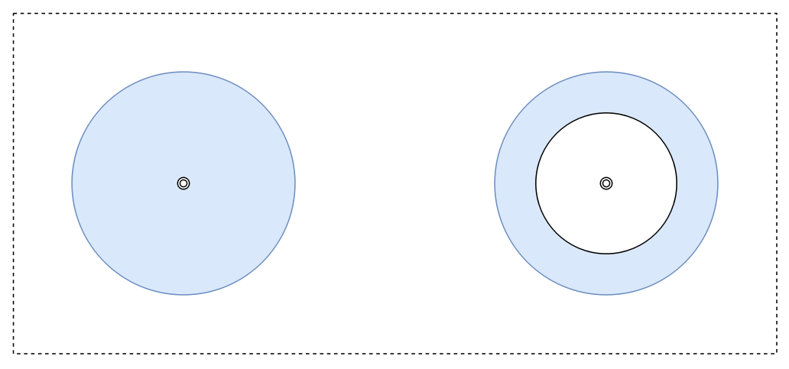

Lab 4. Analytics with Elasticsearch
------------------------------------------------


On our journey of learning about Elastic Stack 7.0, we have gained a
strong understanding of Elasticsearch. We learned about the strong
foundations of Elasticsearch in the previous two labs and gained an
in-depth understanding of its search use cases.

The underlying technology, Apache Lucene, was originally developed for
text search use cases. Due to innovations in Apache Lucene and
additional innovations in Elasticsearch, it has also emerged as a very
powerful analytics engine. In this lab, we will look at how
Elasticsearch can serve as our analytics engine. We will cover the
following topics:


-   The basics of aggregations
-   Preparing data for analysis
-   Metric aggregations
-   Bucket aggregations
-   Pipeline aggregations


We will learn about all of this by using a real-world dataset. Let\'s
start by looking at the basics of aggregations.


The basics of aggregations
--------------------------------------------


In contrast to searching, analytics deals
with the bigger picture. Searching addresses the need for zooming in to
a few records, whereas analytics address the need for zooming out and
slicing the data in different ways.

While learning about searching, we used the following API:

```
POST /<index_name>/_search
{
  "query": 
  {
    ... type of query ...
  }
}
```

All aggregation queries take a common form. Let\'s go over the
structure.

The aggregations, or `aggs`, element allows us to aggregate
data. All aggregation requests take the following form:

```
POST /<index_name>/_search
{  
  "aggs": {                                 
    ... type of aggregation ...
          },
  "query": {  ... type of query ... },              //optional query part
  "size": 0                                         //size typically set to 0
}
```

The `aggs`[* *] element should contain the actual
aggregation query. The body depends on the
type of aggregation that we want to do. We will cover these aggregations
later in this lab. 

The optional `query` element defines the context of the
aggregation. The aggregation considers all of the documents in the given
index and type if the `query` element is not specified (you
can imagine it as equivalent to the `match_all` query when no
query is present). If we want to limit the context of the aggregation,
it can be done by specifying the `query`. For example, we may
not want to consider all the data for aggregation, but only certain
documents that satisfy a particular condition. This query filters the
documents to be fed to the actual `aggs` query.

The `size` element specifies how many of the search hits
should be returned in the response. The default value
of `size` is 10. If `size` is not specified, the
response will contain 10 hits from the context under the query.
Typically, if we are only interested in getting aggregation results, we
should set the `size` element to `0`, to avoid
getting any results, along with the aggregation result.

Broadly, there are four types of aggregations that Elasticsearch
supports:


-   Bucket aggregations
-   Metric aggregations
-   Matrix aggregations
-   Pipeline aggregations

### Bucket aggregations


Bucket aggregations segment the data in
question (defined by the `query` context) into various buckets
that are identified by the buckets key. Bucket aggregation
evaluates each document in the context by
deciding which bucket it falls into. At the end, bucket aggregation has
a set of distinct buckets with their respective bucket keys and
documents that fall into those buckets.

For people who are coming from an SQL background, a query that has
`GROUP BY`, such as the following query,does the following
withbucket aggregations:

```
SELECT column1, count(*) FROM table1 GROUP BY column1;
```

This query divides the table by the different values of
`column 1` and returns a count of documents within each value
of `column 1`. This is an example of bucket aggregation. There
are many different types of bucket aggregation supported by
Elasticsearch, all of which we will go through in this lab.

Bucket aggregations can be present on the top or outermost level in an
aggregation query. Bucket aggregations can also be nested inside other
bucket aggregations. 

### Metric aggregations


Metric aggregations work on numerical fields.
They compute the aggregate value of a numerical field in the given
context. For example, let\'s suppose that we have a table containing the results of a student\'s examination. Each
record contains marks obtained by the student. A metric aggregation can
compute different aggregates of that numerical score column. Some
examples are sum, average, minimum, maximum, and so on.

In SQL terms, the following query gives a rough analogy of what a metric
aggregation may do:

```
SELECT avg(score) FROM results;
```

This query computes the average score in the given context. Here, the
context is the whole table, that is, all students.

Metric aggregation can be placed on the top or outermost level in the
aggregations query. Metric aggregations can also be nested inside bucket
aggregations. Metric aggregations cannot nest other types of
aggregations inside of them.

### Matrix aggregations


Matrix aggregations were introduced with
Elasticsearch version 5.0. Matrix aggregations work on multiple fields
and compute matrices across all the documents
within the query context.

Matrix aggregations can be nested inside bucket aggregations, but bucket
aggregations cannot be nested inside of matrix aggregations. This is
still a relatively new feature. Coverage of matrix aggregations is not
within the scope of this book.

### Pipeline aggregations


Pipeline aggregations are higher order
aggregations that can aggregate the output of other aggregations. These
are useful for computing something, such as derivatives. We will look at
some pipeline aggregations later in this
lab.

This was an overview about the different types of aggregations supported
by Elasticsearch at a high level. Pipeline aggregations and matrix
aggregations are relatively new and have fewer use cases compared to
metric and bucket aggregations. We will look at metric and bucket
aggregations in greater depth later in this lab.

In the next section, we will load and prepare data so that we can look
at these aggregations in more detail.


Preparing data for analysis
---------------------------------------------


We will consider an example of network
traffic data generated from Wi-Fi routers.
Throughout this lab, we will analyze the data from this example. It
is important to understand what the records in the underlying system
look like, and what they represent.

We will cover the following topics while we prepare and load the data
into the local Elasticsearch instance:


-   Understanding the structure of the data
-   Loading the data using Logstash

### Understanding the structure of the data


The following diagram depicts the design of
the system, in order to help you gain a better understanding of the
problem and the structure of the data that\'s collected:


Fig 4.1: Network traffic and bandwidth usage data for Wi-Fi traffic and
storage in Elasticsearch

The data is collected by the system with the
following objectives:


-   On the left half of the diagram, there are multiple squares,
    representing one customer\'s premises as well as the Wi-Fi routers
    deployed on that site, along with all of the devices connected to
    those Wi-Fi routers. The connected devices include laptops, mobile
    devices, desktop computers, and so on. Each device has a unique MAC
    address and a user associated with it.
-   The right half of the diagram represents the centralized system,
    which collects and stores data from multiple customers into a
    centralized Elasticsearch cluster. Our focus will be on how to
    design this centralized Elasticsearch cluster and the index to gain
    meaningful insight.
-   The routers at each customer site collect additional metrics for
    each connected device, such as data downloaded, data uploaded, and
    URLs or domain names accessed by the client in a specific time
    interval. The Wi-Fi routers collect such metrics and send them to
    the centralized API server periodically, for long-term storage and
    analysis.
-   When the data is sent by the Wi-Fi routers, it contains fewer
    fields: mainly the metrics captured by the Wi-Fi routers and the MAC
    address of the end device for which those metrics are collected. The
    API server looks up and enriches the records with more information,
    which is useful for analytics, before storing it in Elasticsearch.
    The MAC address is looked up to find out the username of the user
    that the device is assigned to. It
    also looks up additional dimensions, such
    as the department of the user. 


### Note

**What are metrics and dimensions**?

**Metric** is a common term used in the
analytics world to represent a numerical measure. A common example of a
metric is the amount of data downloaded or uploaded in a given time
period. The term **dimension** is usually used to refer to
extra/auxiliary information, usually of the string datatype. In this
example, we are using a MAC address to look up auxiliary information
related to that MAC address, namely the username of the user that the
device is assigned to in the system. The name of the department the user
belongs to is another example of a dimension.


Finally, the enriched records are stored in Elasticsearch in a flat data
structure. One record looks as follows:

```
"_source": {
  "customer": "Google"         // Customer to which the WiFi router and device belongs to
  "accessPointId": "AP-59484", // Identifier of the WiFi router or Access Point
  "time": 1506148631061,       // Time of the record in milliseconds since Epoch Jan 1, 1970
  "mac": "c6:ec:7d:c6:3d:8d",  // MAC address of the client device

  "username": "Pedro Harrison", // Name of the user to whom the device is assigned
  "department": "Operations",   // Department of the user to which the device belongs to

  "application": "CNBC",        // Application name or domain name for which traffic is reported
  "category": "News",           // Category of the application

  "networkId": "Internal",      // SSID of the network
  "band": "5 GHz", // Band 5 GHz or 2.4 GHz

  "location": "23.102789,72.595381", // latitude & longitude separated by comma

  "uploadTotal": 1340,      // Bytes uploaded since the last report
  "downloadTotal": 2129,    // Bytes downloaded since the last report
  "usage": 3469,            // Total bytes downloaded and uploaded in current period

  "uploadCurrent": 22.33,   // Upload speed in bytes/sec in current period
  "downloadCurrent": 35.48, // Download speed in bytes/sec in current period
  "bandwidth": 57.82,       // Total speed in bytes/sec (Upload speed + download speed)

  "signalStrength": -25,    // Signal strength between WiFi router and device
  ...
}
```

One record contains various metrics for the given end client device at
the given time.


### Note

Please note that all the data included in this example is synthetic.
Although the names of customers, users, and MAC addresses look
realistic, the data was generated using a simulator. The data doesn\'t
belong to any real customers.


Now that we know what our data represents and what each record
represents, let\'s load the data in our local instance.

### Loading the data using Logstash


To import the data, please follow the
instructions in this book\'s accompanying
source code repository on GitHub,
at [https://github.com/fenago/elasticsearch](https://github.com/fenago/elasticsearch/tree/v7.0).
This can be found in the v7.0 branch.

Please clone or download the repository from GitHub. The instructions
for importing data are at the following path within the
project: [lab-04/README.md](https://github.com/fenago/elasticsearch/blob/master/lab-04/README.md).
Once you have cloned the repository, check out the v7.0 branch.

Once you have imported the data, verify that your data has been imported
with the following query:

```
GET /bigginsight/_search
{
  "query": {
    "match_all": {}
   },
  "size": 1
}
```

You should see a response similar to the following:

```
{
  ...
  "hits": 
    {
    "total" : {
      "value" : 10000,
      "relation" : "gte"
    },
    "max_score": 1,
    "hits": [
            {
        "_index": "bigginsight",
        "_type": "_doc",
        "_id": "AV7Sy4FofN33RKOLlVH0",
        "_score": 1,
        "_source": {
          "inactiveMs": 1316,
          "bandwidth": 51.03333333333333,
          "signalStrength": -58,
          "accessPointId": "AP-1D7F0",
          "usage": 3062,
          "downloadCurrent": 39.93333333333333,
          "uploadCurrent": 11.1,
          "mac": "d2:a1:74:28:c0:5a",
          "tags": [],
          "@timestamp": "2017-09-30T12:38:25.867Z",
          "application": "Dropbox",
          "downloadTotal": 2396,
          "@version": "1",
          "networkId": "Guest",
          "location": "23.102900,72.595611",
          "time": 1506164775655,
          "band": "2.4 GHz",
          "department": "HR",
          "category": "File Sharing",
          "uploadTotal": 666,
          "username": "Cheryl Stokes",
          "customer": "Microsoft"
        }
      }
    ]
  }
}
```

Now that we have the data that we want, we can get started and learn
about different types of aggregations from the data that we just loaded.
You can find all the queries that are used in this lab in
the accompanying source code in the GitHub
repository, at the location
[lab-04/queries.txt](https://github.com/fenago/elasticsearch/blob/master/lab-04/queries.txt).
The queries can be run directly in Kibana Dev Tools, as we have seen
previously in this book.

One thing to note here is the `hits.total` in
the response. It has values of
`10,000` and `"relation"="gte"`. There are
actually 242,835 documents in the index, all of which we have
created. Before version 7.0 was released, `hits.total` always
used to represent the actual count of documents that matched the query
criteria. With Elasticsearch version 7.0, `hits.total` is not
calculated if the `hits` are greater than `10,000`.
This is to avoid the unnecessary overhead of calculating the exact
matching documents for the given query. We can force the calculation of
exact `hits` by passing `track_total_hits=true` as a
request parameter. 


Metric aggregations
-------------------------------------


Metric aggregations work with numerical data, computing one or more
aggregate metrics within the given context. The context can be a query,
filter, or no query, to include the whole
index/type. Metric aggregations can also be nested inside other bucket
aggregations. In this case, these metrics will be computed for each
bucket in the bucket aggregations.

We will start with simple metric aggregations, without nesting them
inside bucket aggregations. When we learn about bucket aggregations
later in this lab, we will also learn how to use metric aggregations
inside bucket aggregations.

In this section, we will go over the following metric aggregations:


-   Sum, average, min, and max aggregations
-   Stats and extended stats aggregations
-   Cardinality aggregations


Let\'s learn about them, one by one.


### Sum, average, min, and max aggregations


Finding the sum of a field, the minimum value
for a field, the maximum value for a field, or an average, are very
common operations. For people who are familiar with SQL, the query to
find the sum is as follows:

```
SELECT sum(downloadTotal) FROM usageReport;
```

The preceding query will calculate the sum of the
`downloadTotal` field across all the records in
the table. This requires going through all the records of the table or
all the records in the given context and adding the values of the given
fields.

In Elasticsearch, a similar query can be written using the sum
aggregation. Let\'s look at the sum aggregation first.


#### Sum aggregation


Here is how to write a simple sum
aggregation:

```
GET bigginsight/_search?track_total_hits=true
{
 "aggregations": {                     1
    "download_sum": {                  2
      "sum": {                         3
        "field": "downloadTotal"       4
      }      
    }
  },
  "size": 0                            5
}
```

The key parts from the preceding code are
explained in the following points:


-   The `aggs` or `aggregations` element at the top
    level should wrap any aggregation.
-   Give a name to the aggregation; here, we are doing the sum
    aggregation on the `downloadTotal` field, and hence, the
    name we chose was `download_sum`. You can
    name it anything. This field will be useful while looking up this
    particular aggregation\'s result in the response.
-   We are doing a sum aggregation; hence, we have
    the `sum` element.
-   We want to do `terms` aggregation on the
    `downloadTotal` field.
-   Specify `size = 0` to prevent raw search results from
    being returned. We just want aggregation results, and not the search
    results, in this case. Since we haven\'t specified any top-level
    `query` elements, it matches all documents. We do not want
    any raw documents (or search hits) in the result.


The response should look like the following:

```
{
  "took": 92,
  ...
  "hits": {
    "total" : {
      "value" : 242836,          1
      "relation" : "eq"
    },             1
    "max_score": 0,
    "hits": []
  },
  "aggregations": {              2
    "download_sum": {            3
      "value": 2197438700        4
    }
  }
}
```

Let\'s go over the key aspects of the response. The key parts are
numbered 1, 2, 3, and so on, and are explained in the following points:


-   The`hits.total` element shows the number of
    documents that were considered or were in
    the context of the query. If there was no additional query or filter
    specified, it will include all of the documents in the type or
    index. We passed `?track_total_hits=true` in the
    request, and hence, you will see the
    exact count of total hits in the index.


-   Just like the request, this response is wrapped
    inside `aggregations` to indicate them.
-   The response of the aggregation we requested was
    named `download_sum`; hence, we get our response from the
    sum aggregation inside an element with the same name.
-   This is the actual value after applying the sum aggregation.


The average, min, and max aggregations are very similar. Let\'s look at
them briefly.

#### Average aggregation


The average aggregation finds an average across all the documents in the querying context:

```
GET bigginsight/_search
{
 "aggregations": {                     
    "download_average": {                  1
      "avg": {                             2
        "field": "downloadTotal"       
      }      
    }
  },
  "size": 0                            
}
```

The only notable differences from the sum aggregation are as follows:


-   We chose a different
    name, `download_average`, to make it
    apparent that the aggregation is trying to compute the average.
-   The type of aggregation that we are doing is `avg`,
    instead of the `sum` aggregation that we were doing
    earlier.


The response structure is identical, but the value field will now
represent the average of the requested field.

The min and max aggregations are exactly the same.

#### Min aggregation


The min aggregation is how we will
find the minimum value of
the `downloadTotal` field in the entire index/type:

```
GET bigginsight/_search
{
 "aggregations": {                    
    "download_min": {                  
      "min": {                         
        "field": "downloadTotal"       
      }      
    }
  },
  "size": 0                            
}
```

Now, let\'s take a look at max aggregation.

#### Max aggregation


Here\'s how we will find the maximum value of
the `downloadTotal` field in the entire index/type:

```
GET bigginsight/_search
{
 "aggregations": {                    
    "download_max": {                  
      "max": {                         
        "field": "downloadTotal"       
      }      
    }
  },
  "size": 0                            
}
```

These aggregations were really simple. Now, let\'s look at some more
advanced stats and extended stats[* *] aggregations.


### Stats and extended stats aggregations


These aggregations compute some common statistics in a
single request, without having to issue
multiple requests. This saves resources on the Elasticsearch side, as
well, because the statistics are computed in
a single pass, rather than being requested multiple times. The client
code also becomes simpler if you are interested in more than one of
these statistics. Let\'s look at stats aggregation first.


#### Stats aggregation


Stats aggregation computes the sum, average,
min, max, and count of documents in a single
pass:

```
GET bigginsight/_search
{
 "aggregations": {
    "download_stats": {
      "stats": {
        "field": "downloadTotal"
      }
    }
  },
  "size": 0
}
```

The structure of the stats request is the same as the other metric
aggregations we have looked at so far, so nothing special is going on
here.

The response should look like the following:

```
{
  "took": 4,
  ...,
  "hits": {
    "total" : {
      "value" : 10000,
      "relation" : "gte"
    },
    "max_score": 0,
    "hits": []
  },
  "aggregations": {
    "download_stats": {
      "count": 242835,
      "min": 0,
      "max": 241213,
      "avg": 9049.102065188297,
      "sum": 2197438700
    }
  }
}
```

As you can see, the response with
the `download_stats` element contains `count`,
`min`, `max`, `average`, and
`sum`; everything is included in the same response. This is
very handy, as it reduces the overhead of
multiple requests, and also simplifies the client code.

Let\'s look at the extended stats aggregation.

#### Extended stats aggregation


The `extended stats` aggregation returns a few
more statistics in addition to the ones returned by the `stats` aggregation:

```
GET bigginsight/_search
{
 "aggregations": {
    "download_estats": {
      "extended_stats": {
        "field": "downloadTotal"
      }
    }
  },
  "size": 0
}
```

The response looks like the following:

```
{
  "took": 15,
  "timed_out": false,
  ...,
  "hits": {
    "total" : {
      "value" : 10000,
      "relation" : "gte"
    },
    "max_score": 0,
    "hits": []
  },
  "aggregations": {
    "download_estats": {
      "count": 242835,
      "min": 0,
      "max": 241213,
      "avg": 9049.102065188297,
      "sum": 2197438700,
      "sum_of_squares": 133545882701698,
      "variance": 468058704.9782911,
      "std_deviation": 21634.664429528162,
      "std_deviation_bounds": {
        "upper": 52318.43092424462,
        "lower": -34220.22679386803
      }
    }
  }
}
```

It also returns the sum of `squares`, `variance`,
`standard deviation`, and
`standard deviation bounds`.


### Cardinality aggregation


Finding the count of unique elements can be done with the cardinality aggregation. It is similar to finding the result of a query such as the following:

```
select count(*) from (select distinct username from usageReport) u;
```

Finding the cardinality, or the number of unique values, for a specific
field is a very common requirement. If you have a click stream from the
different visitors on your website, you may want to find out how many
unique visitors you had in a given day, week, or month.

Let\'s look at how we can find out the count of unique users for which
we have network traffic data:

```
GET bigginsight/_search
{
 "aggregations": {
    "unique_visitors": {
      "cardinality": {
        "field": "username"
      }
    }
  },
  "size": 0
}
```

The cardinality aggregation response is just like the other metric
aggregations:

```
{
  "took": 110,
  ...,
  "hits": {
    "total" : {
      "value" : 10000,
      "relation" : "gte"
    },
    "max_score": 0,
    "hits": []
  },
  "aggregations": {
    "unique_visitors": {
      "value": 79
    }
  }
}
```

Now that we have covered the simplest forms of aggregations, we can look
at some of the bucket aggregations. 


Bucket aggregations
-------------------------------------


Bucket aggregations are useful to analyze how the whole relates to its parts, so that we can gain better
insight on the data. They help in segmenting the data into smaller
parts. Each type of bucket aggregation slices the data into different
segments, or buckets. Bucket aggregations are the most common type of
aggregation used in any analysis process.

In this section, we will cover the following topics, keeping the network
traffic data example at the center:


-   Bucketing on string data
-   Bucketing on numerical data
-   Aggregating filtered data
-   Nesting aggregations
-   Bucketing on custom conditions
-   Bucketing on date/time data
-   Bucketing on geospatial data

### Bucketing on string data


Sometimes, we may need to bucket the data, or
segment the data, based on a field that has a `string`
datatype, which is typically `keyword` typed fields in
Elasticsearch. This is very common. Some examples of scenarios in which
you may want to segment the data by a string typed field are as follows:


-   Segmenting the network traffic data per department
-   Segmenting the network traffic data per user
-   Segmenting the network traffic data per application, or per category


The most common way to bucket or segment your string typed data is by
using terms aggregation[*. *] Let\'s take a look at terms
aggregation.


#### Terms aggregation


Terms aggregation is probably the most widely
used aggregation. It is useful for segmenting
or grouping the data by a given field\'s distinct values. Suppose that,
in the network traffic data example that we have loaded, we have the
following question:

Which are the
top categories[*,*] **[* *] **that
is, [*categories that are surfed the most by users?*] 

We are interested in the most surfed categories -- not in terms of the
bandwidth used, but just in terms of counts (record counts). In a
relational database, we could write a query like the following:

```
SELECT category, count(*) FROM usageReport GROUP BY category ORDER BY count(*) DESC;
```

The Elasticsearch aggregation query, which would do a similar job, can
be written as follows:

```
GET /bigginsight/_search
{
  "aggs": {                           1
    "byCategory": {                   2
      "terms": {                      3
        "field": "category"           4
      }
    }
  },
  "size": 0                           5
}
```

Let\'s look at the terms of the aggregation
query here. Notice the numbers that refer to
different parts of the query:


-   The `aggs` or
    `aggregations` element at the top level
    should wrap any aggregation.
-   Give a name to the aggregation. Here, we are doing `terms`
    aggregation by the category field, and hence, the name we chose is
    `byCategory`.
-   We are doing a `terms` aggregation, and hence, we have
    the `terms` element.
-   We want to do a `terms` aggregation on
    the `category` field.
-   Specify `size = 0` to prevent raw search results from
    being returned. We just want aggregation results, and not the search
    results, in this case. Since we haven\'t specified any top-level
    `query` element, it matches all documents. We do not want
    any raw documents (or search hits) in the result.


The response looks like the following:

```
{
  "took": 11,
  "timed_out": false,
  "_shards": {
    "total": 5,
    "successful": 5,
    "failed": 0
  },
  "hits": {
    "total" : {
      "value" : 10000,                            1
      "relation" : "gte"
    },                              
    "max_score": 0,
    "hits": []                                    2
  },
  "aggregations": {                               3
    "byCategory": {                               4
      "doc_count_error_upper_bound": 0,           5
      "sum_other_doc_count": 0,                   6
      "buckets": [                                8
        {
          "key": "Chat",                          9
          "doc_count": 52277                      10
        },
        {
          "key": "File Sharing",
          "doc_count": 46912
        },
        {
          "key": "Other HTTP",
          "doc_count": 38535
        },
        {
          "key": "News",
          "doc_count": 25784
        },
        {
          "key": "Email",
          "doc_count": 21003
        },
        {
          "key": "Gaming",
          "doc_count": 19578
        },
        {
          "key": "Jobs",
          "doc_count": 19429
        },
        {
          "key": "Blogging",
          "doc_count": 19317
        }
      ]
    }
  }
}
```

Please note the following in the response,
and notice the numbers that are annotated as
well:


-   The `total` element
    under `hits` (we will refer to this as
    `hits.total`, navigating the path from the top JSON
    element) is greater than `10000`. This is the total number
    of documents considered in this aggregation. As we mentioned
    previously, if you want the exact total hits to be returned, you
    need to pass an extra parameter in the request.
-   The `hits.hits` array is empty. This is because we
    specified `"size": 0`, so as to not include any search
    hits here. What we were interested in was the aggregations, and not
    the search results.
-   The `aggregations` element at the top level in the JSON
    response contains all the aggregation results.


-   The name of the aggregation is `byCategory`. This is the
    name that was given by us to this `terms` aggregation.
    This name helps us to relate the response to the request, since the
    request can be generated for several aggregations at once.
-   `doc_count_error_upper_bound` is the measure of error
    while doing this aggregation. Data is distributed in shards; if each
    shard sends data for all bucket keys, this results in too much data
    being sent across the network. Elasticsearch only sends the top
    [*n*]  buckets across the network if the aggregation was
    requested for the top [*n*]  items. Here, [*n*] 
    is the number of aggregation buckets determined by
    the `size` parameter to the bucket aggregation. We will
    look at bucket aggregation\'s size parameter later in this lab.
-   `sum_other_doc_count` is the total count of documents that
    are not included in the buckets that are returned. By default,
    the `terms` aggregations returns the top 10 buckets if
    there are more than 10 distinct buckets. The remaining documents,
    other than these 10 buckets, are summed and returned in this field.
    In this case, there are only eight categories, and hence, this field
    is set to zero.
-   The list of buckets returned by the aggregation.
-   The key of one of the buckets, that is, the category of
    `Chat`.
-   The count of documents in the bucket.


As you can see, there are only eight distinct buckets in the results of
the query. 

Next, we want to find out the top applications in terms of the maximum
number of records for each application:

```
GET /bigginsight/_search?size=0
{
  "aggs": {
    "byApplication": {
      "terms": {
        "field": "application"
      }
    }
  }
}
```

Note that we have added `size=0` as a request parameter in the
URL itself. 

This returns a response like the following:

```
{
  ...,
  "aggregations": {
    "byApplication": {
      "doc_count_error_upper_bound": 6339,
      "sum_other_doc_count": 129191,
      "buckets": [
        {
          "key": "Skype",
          "doc_count": 26115
        },
        ...
}
```

Note
that `sum_other_doc_count`[* *] **has a
big value, `129191`. This is a big number that\'s relative to
the total hits; as we saw in the previous query, there are around
242,000 documents in the index. The reason for this is that the
`terms` aggregation only returns 10 buckets, by default. In
the current setting, the top 10 buckets with the highest
documents are returned in descending order.
The remaining documents that are not covered in the top 10 buckets are
indicated in `sum_other_doc_count`. There are
actually 30 different applications for which we have
network traffic data. The number in
`sum_other_doc_count` is the sum of the counts for the
remaining 20 applications that were not included in the buckets list.

To get the top [*n *] buckets instead of the default 10, we
can use the[* *] `size` parameter inside the
`terms` aggregation:

```
GET /bigginsight/_search?size=0
{
  "aggs": {
    "byApplication": {
      "terms": {
        "field": "application",
        "size": 15
      }
    }
  }
}
```

Notice that this `size` (specified inside the
`terms` aggregation) is different from the `size`
specified at the top level. At the top level,
the `size`[* *] parameter is used to prevent any
search hits, whereas the `size` parameter being used inside
the `terms` aggregation denotes the maximum number of term
buckets to be returned. 

Terms aggregation is very useful for generating data for pie charts or
bar charts, where we may want to analyze the relative counts of string
typed fields in a set of documents. In Lab 7, [*Visualizing Data
with Kibana*], you will learn that Kibana terms aggregation
is useful for generating pie and bar charts.

Next, we will look at how to do bucketing on `numerical` types
of fields[*.*] 


### Bucketing on numerical data


Another common scenario is when we want to
segment or slice the data into various buckets, based on a numerical
field. For example, we may want to slice the product data by different
price ranges, such as up to \$10, \$10 to \$50, \$50 to \$100, and so
on. You may want to segment the data by age group, employee count, and
so on.

We will look at the following aggregations in this section:


-   Histogram aggregation
-   Range aggregation

#### Histogram aggregation


Histogram aggregation can slice the data into
different buckets based on one numerical field. The range of each slice,
also called the interval, can be specified in the input of the query.

Here, we have some records of network traffic usage data.
The `usage` field tells us about the number of bytes that are
used for uploading or downloading data. Let\'s try to divide or slice
all the data based on the usage:

```
POST /bigginsight/_search?size=0
{
 "aggs": {
 "by_usage": {
 "histogram": {
 "field": "usage",
 "interval": 1000
 }
 }
 }
}
```

The preceding aggregation query will slice all the data into the
following buckets:


-   **0 to 999**: All records that have usage \>= 0 and \<
    1,000 will fall into this bucket
-   **1,000 to 1,999**: All records that have usage \>= 1,000
    and \< 2,000 will fall into this bucket
-   **2,000 to 2,999**: All records that have usage \>= 2,000
    and \< 3,000 will fall into this bucket


The response should look like the following (truncated for brevity):

```
{
  ...,
  "aggregations": {
    "by_usage": {
      "buckets": [
        {
          "key": 0.0,
          "doc_count": 30060
        },
        {
          "key": 1000.0,
          "doc_count": 42880
        },
        {
          "key": 2000.0,
          "doc_count": 42041
        },
...
}
```

This is how the histogram aggregation creates
buckets of equal ranges by using the `interval` specified in
the query. By default, it includes all buckets with the given interval,
regardless of whether there are any documents in that bucket. It is
possible to get back only those buckets that have at least some
documents. This can be done by using the `min_doc_count`
parameter. If specified, the histogram aggregation only returns those
buckets that have, at the very least, the specified number of documents.

Let\'s look at another aggregation, range aggregation, which can be used
on numerical data.

#### Range aggregation


What if we don\'t want all the buckets to have the same interval? It\'s possible to create unequal sized
buckets by using the `range` aggregation.

The following `range` aggregation slices the data into three buckets: up to 1 KB, 1 KB to 100 KB, and 100
KB or more. Notice that we can
specify `from` and `to` in the ranges.
Both `from` and `to` are optional in the range. If
only `to` is specified, that bucket includes all the documents
up to the specified value in that bucket. The `to` value is
exclusive, and is not included in the current bucket\'s range:

```
POST /bigginsight/_search?size=0
{
  "aggs": {
    "by_usage": {
      "range": {
        "field": "usage",
        "ranges": [
          { "to": 1024 },
          { "from": 1024, "to": 102400 },
          { "from": 102400 }
        ]
      }
    }
  }
}
```

The response of this request will look similar to the following:

```
{
  ...,
  "aggregations": {
    "by_usage": {
      "buckets": [
        {
          "key": "*-1024.0",
          "to": 1024,
          "doc_count": 31324
        },
        {
          "key": "1024.0-102400.0",
          "from": 1024,
          "to": 102400,
          "doc_count": 207498
        },
        {
          "key": "102400.0-*",
          "from": 102400,
          "doc_count": 4013
        }
      ]
    }
  }
}
```

It is possible to specify custom `key` labels for the range
buckets, as follows:

```
POST /bigginsight/_search?size=0
{
  "aggs": {
    "by_usage": {
      "range": {
        "field": "usage",
        "ranges": [
          { "key": "Upto 1 kb", "to": 1024 },
          { "key": "1 kb to 100 kb","from": 1024, "to": 102400 },
          { "key": "100 kb and more", "from": 102400 }
        ]
      }
    }
  }
}
```

The resulting buckets will have the keys set
with each bucket. This is helpful for looking up the relevant bucket
from the response without iterating through all the buckets.

There are more aggregations available for numerical data, but covering
all of these aggregations is beyond the scope of this book. 

Next, we will look at a couple of important concepts related to bucket
aggregation and aggregations in general.


### Aggregations on filtered data


In our quest to learn about different bucket
aggregations, let\'s take a very short detour to understand how to apply
aggregations on filtered data. So far, we have been applying all of our
aggregations on all the data of the given index/type. In the real world,
you will almost always need to apply some filters before applying
aggregations (either metric or bucket aggregations).

Let\'s revisit the example that we looked at in the [*Terms
aggregation*]  section[*.*]  We found out the top
categories in the whole index and type. Now, what we want to do is find
the top category for a specific customer, not for all of the customers:

```
GET /bigginsight/_search?size=0&track_total_hits=true
{
  "query": {
    "term": {
      "customer": "Linkedin"
    }
  },
  "aggs": {                           
    "byCategory": {                   
      "terms": {                      
        "field": "category"           
      }
    }
  }                        
}
```

We modified the original query, which found the top categories, with an
additional query (highlighted in the preceding query in bold). We added
a query, and inside that query, we added a term filter for a specific
customer that we were interested in. 

This type of query, when used with any type of aggregation, changes the
context of the data on which aggregations are calculated. The
query/filter decides the data that the aggregations will be run on.

Let\'s look at the response of this query to understand this better:

```
{
  "took": 18,
  ...,
  "hits": {
"total" : {
      "value" : 76607,
      "relation" : "eq"
    },
    "max_score": 0,
    "hits": []
  },
  ...
}
```

The `hits.total` element in the response is now much smaller than the earlier aggregation query, which was
run on the whole index and type. We may also want to apply more filters
to limit the query to a smaller time window.

The following query applies multiple filters and makes the scope of the
aggregation more specific. It does this for a customer, and within some
subset of the time interval:

```
GET /bigginsight/_search?size=0
{
  "query": {
    "bool": {
      "must": [
        {"term": {"customer": "Linkedin"}}, 
        {"range": {"time": {"gte": 1506277800000, "lte": 1506294200000}}}
      ]
    }
  },
  "aggs": {
    "byCategory": {
      "terms": {
        "field": "category"
      }
    }
  }
}
```

This is how the scope of aggregation can be modified using filters. Now,
we will continue on our detour of learning about different bucket
aggregations and look at how to nest metric aggregations inside bucket
aggregations.

### Nesting aggregations


Bucket aggregations split the context into
one or more buckets. We can restrict the context of the
aggregation by specifying the query element,
as we saw in the previous section.

When a metric aggregation is nested inside a bucket aggregation, the
metric aggregation is computed within each bucket. Let\'s go over this
by considering the following question, which we may want to get an
answer for:

[*What is the total bandwidth consumed by each user, or a specific
customer, on a given day? *] 

We have to take the following steps:


1.  First, filter the overall data for the given customer and for the
    given day. This can be done using a global query element of
    the `bool` type.
2.  Once we have the filtered data, we will want to create some buckets
    per user.
3.  Once we have one bucket for each user, we will want to compute the
    sum metric aggregation on the total usage field (which includes
    upload and download).


The following query does exactly this. Please refer to the annotated
numbers, which correspond to the three main objectives of the the
following query:

```
GET /bigginsight/usageReport/_search?size=0
{
  "query": {                                      1
    "bool": {
      "must": [
        {"term": {"customer": "Linkedin"}}, 
        {"range": {"time": {"gte": 1506257800000, "lte": 1506314200000}}}
      ]
    }
  },
  "aggs": {
    "by_users": {                                 2
      "terms": {
        "field": "username"
      },
      "aggs": {
        "total_usage": {                          3
          "sum": { "field": "usage" }
        }
      }
    }
  }
}
```

The thing to notice here is that the top level `by_users`
aggregation, which is a `terms` aggregation, contains another
`aggs` element with the `total_usage` metric
aggregation inside it.

The response should look like the following:

```
{
  ...,
  "aggregations": {
    "by_users": {
      "doc_count_error_upper_bound": 0,
      "sum_other_doc_count": 453,
      "buckets": [
        {
          "key": "Jay May",
          "doc_count": 2170,
          "total_usage": {
            "value": 6516943
          }
        },
        {
          "key": "Guadalupe Rice",
          "doc_count": 2157,
          "total_usage": {
            "value": 6492653
          }
        },
   ...
}
```

As you can see, each of the `terms` aggregation buckets contains a `total_usage` child, which has
the metric aggregation value. The buckets are
sorted by the number of documents in each bucket, in descending order.
It is possible to change the order of buckets by specifying the order
parameter within the bucket aggregation.

Please see the following partial query, which has been modified to sort
the buckets in descending order of the `total_usage` metric:

```
GET /bigginsight/usageReport/_search
{
  ...,
  "aggs": {
    "by_users": {                                 
      "terms": {
        "field": "username",
"order": { "total_usage": "desc"}
      },
      "aggs": {
        ...
...
}
```

The highlighted order clause sorts the buckets using
the `total_usage` nested aggregation, in descending order. 

Bucket aggregations can be nested inside other bucket aggregations.
Let\'s considering this by getting an answer to the following question:

[*Who are the top two users in each department, given the total
bandwidth consumed by each user?*] 

The following query will help us get that answer:

```
GET /bigginsight/usageReport/_search?size=0
{
  "query": {                                                  1
    "bool": {
      "must": [
        {"term": {"customer": "Linkedin"}}, 
        {"range": {"time": {"gte": 1506257800000, "lte": 1506314200000}}}
      ]
    }
  },
  "aggs": {
    "by_departments": {                                       2
      "terms": { "field": "department" },               
      "aggs": {
        "by_users": {                                         3
          "terms": {
            "field": "username",
            "size": 2,                                        
            "order": { "total_usage": "desc"}
          },
          "aggs": {
            "total_usage": {"sum": { "field": "usage" }}      4
          }
        }
      }
    }
  }
}
```

Please see the following explanation of the annotated numbers in the
query:


-   This is a query that filters the specific customer and time range.
-   The top-level terms aggregation to get a bucket for each department.
-   The second-level terms aggregation to get the top two users (note
    that `size = 2`) within each bucket.
-   The metric aggregation that has the sum of usage within its parent
    bucket. The immediate parent bucket of the `total_usage`
    aggregation is the `by_users` aggregation, which causes
    the sum of usage to be calculated for each user.


This is how we can nest bucket and metric aggregations to answer complex
questions in a very fast and efficient way, regarding big data stored in
Elasticsearch.

### Bucketing on custom conditions


Sometimes, what we want is more control over
how the buckets are created. The aggregations that we have looked at so
far have dealt with a single type of field. If the given field that we
want to slice data from is of the `string` type, we generally
use the `terms` aggregation. If the field is of
the `numerical` type, we have a few choices, including
histogram, range aggregation, and others, to slice the data into
different segments.

The following aggregations allow us to create one or more buckets, based
on the queries/filters that we choose:


-   Filter aggregation
-   Filters aggregation


Let\'s look at them, one by one.


#### Filter aggregation


Why would you want to use filter
aggregation[*?*]  Filter aggregation[* *] allows you
to create a single bucket using any arbitrary filter and computes the
metrics within that bucket. 

For example, if we wanted to create a bucket of all the records for the
`Chat` category, we could use a term filter. Here, we want to
create a bucket of all records that have `category = Chat`:

```
POST /bigginsight/_search?size=0
{
 "aggs": {
   "chat": {
     "filter": {
       "term": {
         "category": "Chat"
       }
     }
   }
 }
}
```

The response should look like the following:

```
{
  "took": 4,
  ...,
  "hits": {
    "total" : {
      "value" : 10000,
      "relation" : "gte"
    },
    "max_score": 0,
    "hits": []
  },
  "aggregations": {
    "chat": {
      "doc_count": 52277
    }
  }
}
```

As you can see, the `aggregations` element contains just one
item, corresponding to the `Chat` category. It has
`52277` documents. This response can be seen as a subset of
the `terms` aggregation response,
which contained all the categories, apart from `Chat`.

Let\'s look at filters aggregation next, which allows you to bucket on
more than one custom filter.

#### Filters aggregation


With filters aggregation, you can create
multiple buckets, each with its own specified
filter that will cause the documents satisfying that filter to fall into
the related bucket. Let\'s look at an example.

Suppose that we want to create multiple buckets to understand how much
of the network traffic was caused by the `Chat` category. At
the same time, we want to understand how much of it was caused by the
Skype application, versus other applications in the `Chat`
category. This can be achieved by using filters aggregation, as it
allows us to write arbitrary filters to create buckets:

```
GET bigginsight/_search?size=0
{
  "aggs": {
    "messages": {
      "filters": {
        "filters": {
          "chat": { "match": { "category": "Chat" }},              
          "skype": { "match": { "application": "Skype" }},         
          "other_than_skype": {                                    
            "bool": {
              "must": {"match": {"category": "Chat"}},
              "must_not": {"match": {"application": "Skype"}}
            }
          }
        }
      }
    }
  }
}
```

We created three filters for the three buckets that we want, as follows:


-   **Bucket with`chat`key**: Here,
    we specify the `category = Chat` filter. Remember that the
    `match` query that we have used is a high-level query that
    understands the mapping of the underlying field. The underlying
    field category is a keyword field, and hence, the `match`
    query looks for the exact term, that is, `Chat`.
-   **Bucket with`skype`key**: Here,
    we specify the `application = Skype` filter and
    only include Skype traffic.
-   **Bucket
    with `other_than_skype`key**:
    Here, we use a `bool` query to filter documents that are
    in the `Chat` category, but not Skype.


As you can see, filters aggregation is very powerful when you want
custom buckets using different filters. It allows you to take full
control of the bucketing process. You can choose your own fields and
your own conditions to create the buckets of your choice, in order to
segment the data in customized ways.

Next, we will look at how to slice data on a `date` type
column, so that we can slice it into different time intervals.


### Bucketing on date/time data


So far, you have seen how to bucket (or
segment, or slice) your data on different types of columns/fields. The
analysis of data across the time dimension is another very common
requirement. We may have questions such as the following, which require
the aggregation of data on the time dimension:


-   How are sales volumes growing over a period of time?
-   How is profit changing from month to month?


In the context of the network traffic example that we are going through,
the following questions can be answered through time series analysis of
the data:


-   How are the bandwidth requirements changing for my organization over
    a period of time?
-   Which are the top applications, over a period of time, in terms of
    bandwidth usage?


Elasticsearch has a very powerful Date Histogram aggregation that can
answer questions like these. Let\'s look at how we can get answers to
these questions.


#### Date Histogram aggregation


Using Date Histogram aggregation, we will see
how we can create buckets on a date field. In
the process, we will go through the following stages:


-   Creating buckets across time periods
-   Using a different time zone
-   Computing other metrics within sliced time intervals
-   Focusing on a specific day and changing intervals

##### Creating buckets across time periods


The following query will slice the data into
intervals of one day. Just like how we were able to create buckets on
different values of strings, the following query will create buckets on
different values of time, grouped by one-day intervals:

```
GET /bigginsight/_search?size=0                   1
{
  "aggs": {
    "counts_over_time": {
      "date_histogram": {                         2
        "field": "time",
        "interval": "1d"                          3
      }
    }
  }
}
```

The key points from the preceding code are explained as follows:


-   We have specified `size=0` as a request parameter, instead
    of specifying it in the request body.
-   We are using the `date_histogram` aggregation.
-   We want to slice the data by day; that\'s why we specify the
    `interval` for slicing the data as `1d` (for one
    day). Intervals can take values like `1d` (one day),
    `1h` (one hour), `4h` (four hours),
    `30m` (30 minutes), and so on. This gives tremendous
    flexibility when specifying a dynamic criteria. 


The response to the request should look like the following:

```
{
  ...,
  "aggregations": {
    "counts_over_time": {
      "buckets": [
        {
          "key_as_string": "2017-09-23T00:00:00.000Z",
          "key": 1506124800000,
          "doc_count": 62493
        },
        {
          "key_as_string": "2017-09-24T00:00:00.000Z",
          "key": 1506211200000,
          "doc_count": 5312
        },
        {
          "key_as_string": "2017-09-25T00:00:00.000Z",
          "key": 1506297600000,
          "doc_count": 175030
        }
      ]
    }
  }
}
```

As you can see, the simulated data that we
have in our index is only for a three-day period. The returned buckets
contain keys in two forms, `key` and
`key_as_string`. The `key` field is in milliseconds
since the epoch (January 1st 1970), and `key_as_string` is the
beginning of the time interval in UTC. In our case, we have chosen the
interval of one day. The first bucket with
the `2017-09-23T00:00:00.000Z` key is the bucket that has
documents between September 23, 2017 UTC, and September 24, 2017 UTC.

##### Using a different time zone


We actually want to slice the data by the IST
time zone, rather than slicing it according to the UTC time zone. This
is possible by specifying the `time_zone` parameter. We need
to separate the offset of the required time zone from the UTC time zone.
In this case, we need to provide `+05:30` as the offset, since
IST is 5 hours and 30 minutes ahead of UTC:

```
GET /bigginsight/_search?size=0
{
  "aggs": {
    "counts_over_time": {
      "date_histogram": {
        "field": "time",
        "interval": "1d",
        "time_zone": "+05:30"
      }
    }
  }
}
```

The response now looks like the following:

```
{
  ...,
  "aggregations": {
    "counts_over_time": {
      "buckets": [
        {
          "key_as_string": "2017-09-23T00:00:00.000+05:30",
          "key": 1506105000000,
          "doc_count": 62493
        },
        {
          "key_as_string": "2017-09-24T00:00:00.000+05:30",
          "key": 1506191400000,
          "doc_count": 0
        },
        {
          "key_as_string": "2017-09-25T00:00:00.000+05:30",
          "key": 1506277800000,
          "doc_count": 180342
        }
      ]
    }
  }
}
```

As you can see, the `key` and `key_as_string` for
all the buckets have changed. The keys are now at the beginning of the
day, in the IST time zone. There are no documents for September 24,
2017, now, since it is a Sunday.

##### Computing other metrics within sliced time intervals


So far, we have just sliced the data across
time by using the Date Histogram to create the buckets on the time
field. This gave us the document counts in each bucket. Next, we will
try to answer the following question:

[*What is the day-wise total bandwidth usage for a given
customer?*] 

The following query will provide us with an answer for this:

```
GET /bigginsight/_search?size=0
{
  "query": { "term": {"customer": "Linkedin"} },
  "aggs": {
    "counts_over_time": {
      "date_histogram": {
        "field": "time",
        "interval": "1d",
        "time_zone": "+05:30"
      },
      "aggs": {
        "total_bandwidth": {
          "sum": { "field": "usage" }
        }
      }
    }
  }
}
```

We added a term filter to consider only one customer\'s data. Within
the `date_histogram` aggregation, we nested another metric
aggregation, that is, sum aggregation, to count the sum of the usage
field within each bucket. This is how we will get the total data
consumed each day. The following is the shortened response to the query:

```
{
  ..,
  "aggregations": {
    "counts_over_time": {
      "buckets": [
        {
          "key_as_string": "2017-09-23T00:00:00.000+05:30",
          "key": 1506105000000,
          "doc_count": 18892,
          "total_bandwidth": {
            "value": 265574303
          }
        },
        ...
      ]
    }
  }
}
```


##### Focusing on a specific day and changing intervals


Next, we will look at how to focus on a
specific day by filtering the data for the other time periods and
changing the value of the interval to a smaller value. We are trying to get an hourly breakdown of data
usage for September 25, 2017.

What we are doing is also called drilling down in the data. Often, the
result of the previous query is displayed as a line chart, with time on
the [*x*]  axis and data used on the [*y*]  axis. If
we want to zoom in on a specific day from that line chart, the following
query can be useful:

```
GET /bigginsight/_search?size=0
{
  "query": {
    "bool": {
      "must": [
        {"term": {"customer": "Linkedin"}}, 
        {"range": {"time": {"gte": 1506277800000}}}
      ]
    }
  },
  "aggs": {
    "counts_over_time": {
      "date_histogram": {
        "field": "time",
        "interval": "1h",
        "time_zone": "+05:30"
      },
      "aggs": {
        "hourly_usage": {
          "sum": { "field": "usage" }
        }
      }
    }
  }
}
```

The shortened response would look like the following:

```
{
  ...,
  "aggregations": {
    "counts_over_time": {
      "buckets": [
        {
          "key_as_string": "2017-09-25T00:00:00.000+05:30",
          "key": 1506277800000,
          "doc_count": 465,
          "hourly_usage": {
            "value": 1385524
          }
        },
        {
          "key_as_string": "2017-09-25T01:00:00.000+05:30",
          "key": 1506281400000,
          "doc_count": 478,
          "hourly_usage": {
            "value": 1432123
          }
        },
   ...
}
```

As you can see, we have buckets for one-hour intervals, with data for
those hours aggregated within each bucket.

The Date Histogram aggregation allows you to do many powerful time
series analyses. As you have seen in these examples, aggregating from a
one-day interval to a one-hour interval is extremely easy. You can slice
your data in the required interval on demand, without planning it in
advance. You can do this with big data; there are hardly any other data
stores that can provide this type of flexibility with big data.


### Bucketing on geospatial data


Another powerful feature of bucket aggregation is the ability to do
geospatial analysis on the data. If your data contains fields of the
geo-point datatype, where the coordinates are
captured, you can perform some interesting analysis, which can be
rendered on a map to give you better insight into the data.

We will cover two types of geospatial aggregations in this section:


-   Geodistance aggregation
-   GeoHash grid aggregation

#### Geodistance aggregation


Geodistance aggregation helps in creating
buckets of distances from a given geo-point.
This can be better illustrated using a diagram:





Fig 4.2 Geodistance aggregation with only to specified (left), and both
to and from specified (right)

The shaded area in blue represents the area included in the geodistance
aggregation.

The following aggregation will form a bucket with all the documents
within the given distance from the given geo-point. This corresponds to
the first (left) circle in the preceding diagram. The shaded area is
from the center up to the given radius, forming a circle:

```
GET bigginsight/_search?size=0
{
  "aggs": {
    "within_radius": {
      "geo_distance": {
        "field": "location",
        "origin": {"lat": 23.102869,"lon": 72.595692},
        "ranges": [{"to": 5}]
      }
    }
  }
}
```

As you can see, the `ranges` parameter is similar to the
`range` aggregation that we saw earlier. It includes all the
points up to 5 meters away from the given `origin` specified.
This is helpful in aggregations like getting the counts of things that
are within 2 kilometers from a given location, and is often used on many
websites. This is a good way to find all businesses within a given
distance of your location (such as all coffee shops or hospitals within
2 km).

The default unit of distance is meters, but you can specify
the `unit` parameter as km, mi, and so on, to switch to
different units.

Now, let\'s look at what happens if you specify both `from`
and `to`[* *] in the geodistance aggregation. This
will correspond to the right circle in the preceding diagram:

```
GET bigginsight/_search?size=0
{
  "aggs": {
    "within_radius": {
      "geo_distance": {
        "field": "location",
        "origin": {"lat": 23.102869,"lon": 72.595692},
        "ranges": [{"from": 5, "to": 10}]
      }
    }
  }
}
```

Here, we are bucketing the points that are at least 5 meters away, but
less than 10 meters away, from the given point. Similarly, it is
possible to form a bucket of a point which is at least [*x*] 
units away from the given origin, by only specifying
the `from` parameter.

Now, let\'s look at GeoHash grid aggregation.

#### GeoHash grid aggregation


GeoHash grid aggregation uses the GeoHash
mechanism to divide the map into smaller
units. You can read about GeoHash
at <https://en.wikipedia.org/wiki/Geohash>. The GeoHash system divides
the world map into a grid of rectangular
regions of different precisions. Lower values of precision represent
larger geographical areas, while higher values represent smaller, more
precise geographical areas:

```
GET bigginsight/_search?size=0
{
  "aggs": {
    "geo_hash": {
      "geohash_grid": {
        "field": "location",
        "precision": 7
      }
    }
  }
}
```

The data that we have in our network traffic example is spread over a
very small geographical area, so we have used a `precision` of
`7`. The supported values for precision are from 1 to 12.
Let\'s look at the response to this request:

```
{
  ...,
  "aggregations": {
    "geo_hash": {
      "buckets": [
        {
          "key": "ts5e7vy",
          "doc_count": 161893
        },
        {
          "key": "ts5e7vw",
          "doc_count": 80942
        }
      ]
    }
  }
}
```

After aggregating the data onto GeoHash blocks of
`"precision": 7`, all the documents fell into two
GeoHash regions, with the respective document counts seen in the
response. We can zoom in on this map or request the data to be
aggregated on smaller hashes, by increasing the value of the precision.

When you try a `precision` value of `9`, you will
see the following response:

```
{
  ...,
  "aggregations": {
    "geo_hash": {
      "buckets": [
        {
          "key": "ts5e7vy80k",
          "doc_count": 131034
        },
        {
          "key": "ts5e7vwrdb",
          "doc_count": 60953
        },
        {
          "key": "ts5e7vy84c",
          "doc_count": 30859
        },
        {
          "key": "ts5e7vwxfn",
          "doc_count": 19989
        }
      ]
    }
  }
}
```

As you can see, the GeoHash grid aggregation
allows you to slice or aggregate the data over geographical regions of
different sizes/precisions, which is quite powerful. This data can be
visualized in Kibana, or it can be used in your application with a
library that can render the data on a map.

We have covered a wide variety of bucket aggregations that let us slice
and dice data on fields of various datatypes. We also looked at how to
aggregate over text data, numerical data, dates/times, and geospatial
data. Next, we will look at what pipeline aggregations are.


Pipeline aggregations
---------------------------------------


Pipeline aggregations, as their name suggests, allow you to aggregate over the results of another aggregation. They
let you pipe the results of an aggregation as input to another
aggregation. Pipeline aggregations are a relatively new feature, and
they are still experimental. At a high level, there are two types of
pipeline aggregation:


-   **Parent pipeline** aggregations have the
    pipeline aggregation nested inside other
    aggregations
-   **Sibling pipeline** aggregations have the
    pipeline aggregation as the sibling of
    the original aggregation from which pipelining is done


Let\'s look at how the pipeline aggregations work by considering one
example of cumulative sum aggregation, which is a parent of pipeline
aggregation.


### Calculating the cumulative sum of usage over time


While discussing Date Histogram aggregation, in the [*Focusing on a
specific day and changing intervals*] [* *] section,
we looked at the aggregation that\'s used to compute hourly bandwidth usage for one particular day. After
completing that exercise, we had data for September 24, with hourly
consumption between 12:00 am to 1:00 am, 1:00 am to 2:00 am, and so on.
Using cumulative sum aggregation, we can also compute the cumulative
bandwidth usage at the end of every hour of the day. Let\'s look at the
query and try to understand it:

```
GET /bigginsight/_search?size=0
{
  "query": {
    "bool": {
      "must": [
        {"term": {"customer": "Linkedin"}}, 
        {"range": {"time": {"gte": 1506277800000}}}
      ]
    }
  },
  "aggs": {
    "counts_over_time": {
      "date_histogram": {
        "field": "time",
        "interval": "1h",
        "time_zone": "+05:30"
      },
      "aggs": {
        "hourly_usage": {
          "sum": { "field": "usage" }
        },
        "cumulative_hourly_usage": {            1
          "cumulative_sum": {                   2
              "buckets_path": "hourly_usage"    3 
          }
        }
      }
    }
  }
}
```

Only the part highlighted in bold is the new addition over the query
that we saw previously. What we wanted was to calculate the cumulative
sum over the buckets generated by the previous aggregation. Let\'s go
over the newly added code, which has been annotated with numbers:


-   This gives an easy to understand name to this aggregation and places
    it inside the parent Date Histogram aggregation, which is the bucket
    aggregation containing this aggregation.
-   We are using the cumulative sum aggregation, and hence, we refer to
    its name, `cumulative_sum`, here.
-   The `buckets_path` element refers to the metric over which
    we want to do the cumulative sum. In our case, we want to sum over
    the `hourly_usage`[* *] metric that was created
    previously.


The response should look as follows. It has
been truncated for brevity:

```
{
  ...,
  "aggregations": {
    "counts_over_time": {
      "buckets": [
        {
          "key_as_string": "2017-09-25T00:00:00.000+05:30",
          "key": 1506277800000,
          "doc_count": 465,
          "hourly_usage": {
            "value": 1385524
          },
"cumulative_hourly_usage": {
            "value": 1385524
          }
        },
        {
          "key_as_string": "2017-09-25T01:00:00.000+05:30",
          "key": 1506281400000,
          "doc_count": 478,
          "hourly_usage": {
            "value": 1432123
          },
"cumulative_hourly_usage": 
           {
            "value": 2817647
           }
}
```

As you can see, `cumulative_hourly_usage` contains the sum of
`hourly_usage`, so far. In the first bucket, the hourly usage
and the cumulative hourly usage are the same. From the second bucket
onward, the cumulative hourly usage has the sum of all the hourly
buckets we\'ve seen so far.

Pipeline aggregations are powerful. They can compute derivatives, moving
averages, the average over other buckets (as well as the min, max, and
so on), and the average over previously calculated aggregations. 


Summary
-------------------------


In this lab, you learned how to use Elasticsearch to build powerful
analytics applications. We covered how to slice and dice the data to get
powerful insight. We started with metric aggregation and dealt with
numerical datatypes. We then covered bucket aggregation in order to find
out how to slice the data into buckets or segments, in order to drill
down into specific segments.

We also went over how pipeline aggregations work. We did all of this
while dealing with a real-world-like dataset of network traffic data. We
illustrated how flexible Elasticsearch is as an analytics engine.
Without much additional data modeling and extra effort, we can analyze
any field, even when the data is on a big data scale. This is a rare
capability that\'s not offered by many data stores. As you will see in
Lab 7, [*Visualizing Data with Kibana*], Kibana leverages
many of the aggregations that we learned about in this lab.

This concludes the labs on Elasticsearch, the core of Elastic Stack,
in this book. You now have a very strong foundation to learn about the
rest of the ecosystem of Elastic Stack. Starting with the next lab,
we will shift our focus to learning about Logstash, which primarily
deals with getting data into Elasticsearch from a variety of sources.
