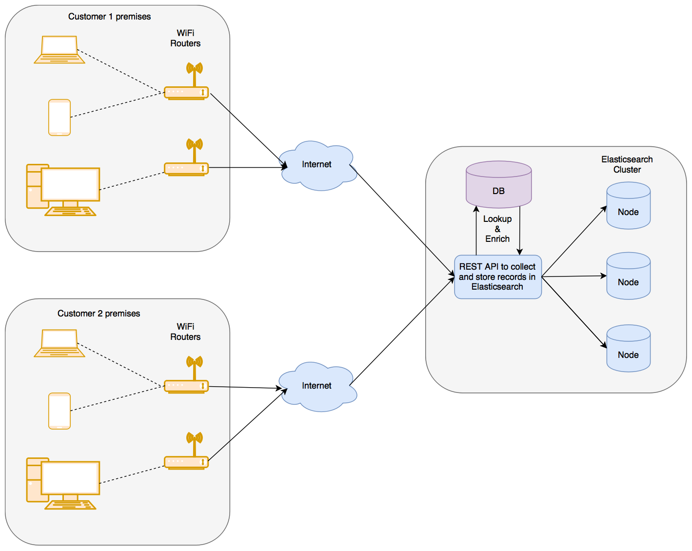

Lab 4. Analytics with Elasticsearch
------------------------------------------------


In this lab, we will look at how
Elasticsearch can serve as our analytics engine. We will cover the
following topics:


-   Preparing data for analysis
-   Metric aggregations
-   Bucket aggregations
-   Pipeline aggregations


We will learn about all of this by using a real-world dataset.


Preparing data for analysis
---------------------------------------------


We will cover the following topics while we prepare and load the data
into the local Elasticsearch instance:


-   Understanding the structure of the data
-   Loading the data using Logstash

### Understanding the structure of the data


The following diagram depicts the design of
the system, in order to help you gain a better understanding of the
problem and the structure of the data that\'s collected:




The enriched records are stored in Elasticsearch in a flat data
structure. One record looks as follows:

```
"_source": {
  "customer": "Google"         // Customer to which the WiFi router and device belongs to
  "accessPointId": "AP-59484", // Identifier of the WiFi router or Access Point
  "time": 1506148631061,       // Time of the record in milliseconds since Epoch Jan 1, 1970
  "mac": "c6:ec:7d:c6:3d:8d",  // MAC address of the client device

  "username": "Pedro Harrison", // Name of the user to whom the device is assigned
  "department": "Operations",   // Department of the user to which the device belongs to

  "application": "CNBC",        // Application name or domain name for which traffic is reported
  "category": "News",           // Category of the application

  "networkId": "Internal",      // SSID of the network
  "band": "5 GHz", // Band 5 GHz or 2.4 GHz

  "location": "23.102789,72.595381", // latitude & longitude separated by comma

  "uploadTotal": 1340,      // Bytes uploaded since the last report
  "downloadTotal": 2129,    // Bytes downloaded since the last report
  "usage": 3469,            // Total bytes downloaded and uploaded in current period

  "uploadCurrent": 22.33,   // Upload speed in bytes/sec in current period
  "downloadCurrent": 35.48, // Download speed in bytes/sec in current period
  "bandwidth": 57.82,       // Total speed in bytes/sec (Upload speed + download speed)

  "signalStrength": -25,    // Signal strength between WiFi router and device
  ...
}
```

One record contains various metrics for the given end client device at
the given time.


Now that we know what our data represents and what each record represents, let\'s load the data in our local instance.


### Loading the data using Logstash

To import the data, please follow these instructions:

**Import network traffic data to learn Analytics capabilities of Elasticsearch**

1. Switch user from terminal: `su elasticsearch`
2. Logstash has been already downloaded at following path: `/elasticstack/logstash-7.12.1`.
3. Files have been already copied at path `/elasticstack/logstash-7.12.1/files_lab4` . The structure of files should look like -

```
/elasticstack/logstash-7.12.1/files_lab4/network_traffic_data.json
/elasticstack/logstash-7.12.1/files_lab4/logstash_network_traffic_data.conf
```

6. Create the following index by executing the command in the your Kibana - Dev Tools.

```
PUT /bigginsight
{
  "settings": {
    "index": {
      "number_of_replicas": "1",
      "number_of_shards": "5"
    }
  },
  "mappings": {
    "properties": {
      "accessPointId": {
        "type": "keyword",
        "fields": {
          "analyzed": {
            "type": "text"
          }
        }
      },
      "application": {
        "type": "keyword",
        "fields": {
          "analyzed": {
            "type": "text"
          }
        }
      },
      "band": {
        "type": "keyword",
        "fields": {
          "analyzed": {
            "type": "text"
          }
        }
      },
      "bandwidth": {
        "type": "double"
      },
      "category": {
        "type": "keyword",
        "fields": {
          "analyzed": {
            "type": "text"
          }
        }
      },
      "customer": {
        "type": "keyword",
        "fields": {
          "analyzed": {
            "type": "text"
          }
        }
      },
      "department": {
        "type": "keyword",
        "fields": {
          "analyzed": {
            "type": "text"
          }
        }
      },
      "downloadCurrent": {
        "type": "double"
      },
      "downloadTotal": {
        "type": "integer"
      },
      "inactiveMs": {
        "type": "integer"
      },
      "location": {
        "type": "geo_point"
      },
      "mac": {
        "type": "keyword",
        "fields": {
          "analyzed": {
            "type": "text"
          }
        }
      },
      "networkId": {
        "type": "keyword",
        "fields": {
          "analyzed": {
            "type": "text"
          }
        }
      },
      "signalStrength": {
        "type": "integer"
      },
      "time": {
        "type": "date",
        "format": "strict_date_optional_time||epoch_millis"
      },
      "uploadCurrent": {
        "type": "double"
      },
      "uploadTotal": {
        "type": "integer"
      },
      "usage": {
        "type": "double"
      },
      "username": {
        "type": "keyword",
        "fields": {
          "analyzed": {
            "type": "text"
          }
        }
      }
    }
  }
}
```


7. Run logstash from command line, using the following commands

```
cd /elasticstack/logstash-7.12.1
logstash -f files_lab4/logstash_network_traffic_data.conf
```

<span style="color:red;">Note: Logstash will take few minutes to import the data. Please wait for import to complete</span>


#### Verify Data Import

Once you have imported the data, verify that your data has been imported with the following query:

```
GET /bigginsight/_search
{
  "query": {
    "match_all": {}
   },
  "size": 1
}
```

You should see a response similar to the following:

```
{
  ...
  "hits": 
    {
    "total" : {
      "value" : 10000,
      "relation" : "gte"
    },
    "max_score": 1,
    "hits": [
            {
        "_index": "bigginsight",
        "_type": "_doc",
        "_id": "AV7Sy4FofN33RKOLlVH0",
        "_score": 1,
        "_source": {
          "inactiveMs": 1316,
          "bandwidth": 51.03333333333333,
          "signalStrength": -58,
          "accessPointId": "AP-1D7F0",
          "usage": 3062,
          "downloadCurrent": 39.93333333333333,
          "uploadCurrent": 11.1,
          "mac": "d2:a1:74:28:c0:5a",
          "tags": [],
          "@timestamp": "2017-09-30T12:38:25.867Z",
          "application": "Dropbox",
          "downloadTotal": 2396,
          "@version": "1",
          "networkId": "Guest",
          "location": "23.102900,72.595611",
          "time": 1506164775655,
          "band": "2.4 GHz",
          "department": "HR",
          "category": "File Sharing",
          "uploadTotal": 666,
          "username": "Cheryl Stokes",
          "customer": "Microsoft"
        }
      }
    ]
  }
}
```

Now that we have the data that we want, we can get started and learn
about different types of aggregations from the data that we just loaded.
You can find all the queries that are used in this lab in following directory:

```
/root/Desktop/elasticsearch/Lab04/queries.txt
```


Metric aggregations
-------------------------------------


In this section, we will go over the following metric aggregations:


-   Sum, average, min, and max aggregations
-   Stats and extended stats aggregations
-   Cardinality aggregations


Let\'s learn about them, one by one.


### Sum, average, min, and max aggregations


Finding the sum of a field, the minimum value
for a field, the maximum value for a field, or an average, are very
common operations. For people who are familiar with SQL, the query to
find the sum is as follows:

```
SELECT sum(downloadTotal) FROM usageReport;
```

The preceding query will calculate the sum of the
`downloadTotal` field across all the records in
the table. This requires going through all the records of the table or
all the records in the given context and adding the values of the given
fields.

In Elasticsearch, a similar query can be written using the sum
aggregation. Let\'s look at the sum aggregation first.


#### Sum aggregation

Here is how to write a simple sum aggregation:

```
GET bigginsight/_search?track_total_hits=true
{
 "aggregations": {                     
    "download_sum": {                  
      "sum": {                         
        "field": "downloadTotal"       
      }      
    }
  },
  "size": 0                            
}
```


The response should look like the following:

```
{
  "took": 92,
  ...
  "hits": {
    "total" : {
      "value" : 242836,          1
      "relation" : "eq"
    },             1
    "max_score": 0,
    "hits": []
  },
  "aggregations": {              2
    "download_sum": {            3
      "value": 2197438700        4
    }
  }
}
```

Let\'s go over the key aspects of the response. The key parts are
numbered 1, 2, 3, and so on, and are explained in the following points:


-   The `hits.total` element shows the number of
    documents that were considered or were in
    the context of the query. If there was no additional query or filter
    specified, it will include all of the documents in the type or
    index. We passed `?track_total_hits=true` in the
    request, and hence, you will see the
    exact count of total hits in the index.
-   Just like the request, this response is wrapped
    inside `aggregations` to indicate them.
-   The response of the aggregation we requested was
    named `download_sum`; hence, we get our response from the
    sum aggregation inside an element with the same name.
-   This is the actual value after applying the sum aggregation.


The average, min, and max aggregations are very similar. Let\'s look at them briefly.

#### Average aggregation


The average aggregation finds an average across all the documents in the querying context:

```
GET bigginsight/_search
{
 "aggregations": {                     
    "download_average": {                
      "avg": {                           
        "field": "downloadTotal"       
      }      
    }
  },
  "size": 0                            
}
```

The only notable differences from the sum aggregation are as follows:


-   We chose a different
    name, `download_average`, to make it
    apparent that the aggregation is trying to compute the average.
-   The type of aggregation that we are doing is `avg`,
    instead of the `sum` aggregation that we were doing
    earlier.


The response structure is identical, but the value field will now
represent the average of the requested field.

The min and max aggregations are exactly the same.

#### Min aggregation


The min aggregation is how we will
find the minimum value of
the `downloadTotal` field in the entire index/type:

```
GET bigginsight/_search
{
 "aggregations": {                    
    "download_min": {                  
      "min": {                         
        "field": "downloadTotal"       
      }      
    }
  },
  "size": 0                            
}
```

Now, let\'s take a look at max aggregation.

#### Max aggregation


Here\'s how we will find the maximum value of
the `downloadTotal` field in the entire index/type:

```
GET bigginsight/_search
{
 "aggregations": {                    
    "download_max": {                  
      "max": {                         
        "field": "downloadTotal"       
      }      
    }
  },
  "size": 0                            
}
```

These aggregations were really simple. Now, let\'s look at some more advanced stats and extended stats aggregations.


#### Stats aggregation


Stats aggregation computes the sum, average,
min, max, and count of documents in a single
pass:

```
GET bigginsight/_search
{
 "aggregations": {
    "download_stats": {
      "stats": {
        "field": "downloadTotal"
      }
    }
  },
  "size": 0
}
```

The structure of the stats request is the same as the other metric
aggregations we have looked at so far, so nothing special is going on
here.

The response should look like the following:

```
{
  "took": 4,
  ...,
  "hits": {
    "total" : {
      "value" : 10000,
      "relation" : "gte"
    },
    "max_score": 0,
    "hits": []
  },
  "aggregations": {
    "download_stats": {
      "count": 242835,
      "min": 0,
      "max": 241213,
      "avg": 9049.102065188297,
      "sum": 2197438700
    }
  }
}
```

Let\'s look at the extended stats aggregation.

#### Extended stats aggregation


The `extended stats` aggregation returns a few
more statistics in addition to the ones returned by the `stats` aggregation:

```
GET bigginsight/_search
{
 "aggregations": {
    "download_estats": {
      "extended_stats": {
        "field": "downloadTotal"
      }
    }
  },
  "size": 0
}
```

The response looks like the following:

```
{
  "took": 15,
  "timed_out": false,
  ...,
  "hits": {
    "total" : {
      "value" : 10000,
      "relation" : "gte"
    },
    "max_score": 0,
    "hits": []
  },
  "aggregations": {
    "download_estats": {
      "count": 242835,
      "min": 0,
      "max": 241213,
      "avg": 9049.102065188297,
      "sum": 2197438700,
      "sum_of_squares": 133545882701698,
      "variance": 468058704.9782911,
      "std_deviation": 21634.664429528162,
      "std_deviation_bounds": {
        "upper": 52318.43092424462,
        "lower": -34220.22679386803
      }
    }
  }
}
```

It also returns the sum of `squares`, `variance`,
`standard deviation`, and
`standard deviation bounds`.


### Cardinality aggregation


Finding the count of unique elements can be done with the cardinality aggregation. It is similar to finding the result of a query such as the following:

```
select count(*) from (select distinct username from usageReport) u;
```

Finding the cardinality, or the number of unique values, for a specific
field is a very common requirement. If you have a click stream from the
different visitors on your website, you may want to find out how many
unique visitors you had in a given day, week, or month.

Let\'s look at how we can find out the count of unique users for which
we have network traffic data:

```
GET bigginsight/_search
{
 "aggregations": {
    "unique_visitors": {
      "cardinality": {
        "field": "username"
      }
    }
  },
  "size": 0
}
```

The cardinality aggregation response is just like the other metric
aggregations:

```
{
  "took": 110,
  ...,
  "hits": {
    "total" : {
      "value" : 10000,
      "relation" : "gte"
    },
    "max_score": 0,
    "hits": []
  },
  "aggregations": {
    "unique_visitors": {
      "value": 79
    }
  }
}
```

Now that we have covered the simplest forms of aggregations, we can look
at some of the bucket aggregations. 


#### Terms aggregation


We are interested in the most surfed categories -- not in terms of the
bandwidth used, but just in terms of counts (record counts). In a
relational database, we could write a query like the following:

```
SELECT category, count(*) FROM usageReport GROUP BY category ORDER BY count(*) DESC;
```

The Elasticsearch aggregation query, which would do a similar job, can
be written as follows:

```
GET /bigginsight/_search
{
  "aggs": {                           
    "byCategory": {                   
      "terms": {                      
        "field": "category"           
      }
    }
  },
  "size": 0                           
}
```

Let\'s look at the terms of the aggregation
query here. Notice the numbers that refer to
different parts of the query:


-   The `aggs` or
    `aggregations` element at the top level
    should wrap any aggregation.
-   Give a name to the aggregation. Here, we are doing `terms`
    aggregation by the category field, and hence, the name we chose is
    `byCategory`.
-   We are doing a `terms` aggregation, and hence, we have
    the `terms` element.
-   We want to do a `terms` aggregation on
    the `category` field.
-   Specify `size = 0` to prevent raw search results from
    being returned. We just want aggregation results, and not the search
    results, in this case. Since we haven\'t specified any top-level
    `query` element, it matches all documents. We do not want
    any raw documents (or search hits) in the result.


The response looks like the following:

```
{
  "took": 11,
  "timed_out": false,
  "_shards": {
    "total": 5,
    "successful": 5,
    "failed": 0
  },
  "hits": {
    "total" : {
      "value" : 10000,                            1
      "relation" : "gte"
    },                              
    "max_score": 0,
    "hits": []                                    2
  },
  "aggregations": {                               3
    "byCategory": {                               4
      "doc_count_error_upper_bound": 0,           5
      "sum_other_doc_count": 0,                   6
      "buckets": [                                8
        {
          "key": "Chat",                          9
          "doc_count": 52277                      10
        },
        {
          "key": "File Sharing",
          "doc_count": 46912
        },
        {
          "key": "Other HTTP",
          "doc_count": 38535
        },
        {
          "key": "News",
          "doc_count": 25784
        },
        {
          "key": "Email",
          "doc_count": 21003
        },
        {
          "key": "Gaming",
          "doc_count": 19578
        },
        {
          "key": "Jobs",
          "doc_count": 19429
        },
        {
          "key": "Blogging",
          "doc_count": 19317
        }
      ]
    }
  }
}
```


As you can see, there are only eight distinct buckets in the results of the query. 

Next, we want to find out the top applications in terms of the maximum
number of records for each application:

```
GET /bigginsight/_search?size=0
{
  "aggs": {
    "byApplication": {
      "terms": {
        "field": "application"
      }
    }
  }
}
```

Note that we have added `size=0` as a request parameter in the
URL itself. 

This returns a response like the following:

```
{
  ...,
  "aggregations": {
    "byApplication": {
      "doc_count_error_upper_bound": 6339,
      "sum_other_doc_count": 129191,
      "buckets": [
        {
          "key": "Skype",
          "doc_count": 26115
        },
        ...
}
```


To get the top *n* buckets instead of the default 10, we
can use the `size` parameter inside the
`terms` aggregation:

```
GET /bigginsight/_search?size=0
{
  "aggs": {
    "byApplication": {
      "terms": {
        "field": "application",
        "size": 15
      }
    }
  }
}
```

Notice that this `size` (specified inside the
`terms` aggregation) is different from the `size`
specified at the top level. At the top level,
the `size` parameter is used to prevent any
search hits, whereas the `size` parameter being used inside
the `terms` aggregation denotes the maximum number of term
buckets to be returned. 

Terms aggregation is very useful for generating data for pie charts or
bar charts, where we may want to analyze the relative counts of string
typed fields in a set of documents. In Lab 7, you will learn that Kibana terms aggregation
is useful for generating pie and bar charts.

Next, we will look at how to do bucketing on `numerical` types of fields.


#### Histogram aggregation


Here, we have some records of network traffic usage data.
The `usage` field tells us about the number of bytes that are
used for uploading or downloading data. Let\'s try to divide or slice
all the data based on the usage:

```
POST /bigginsight/_search?size=0
{
 "aggs": {
 "by_usage": {
 "histogram": {
 "field": "usage",
 "interval": 1000
 }
 }
 }
}
```

The preceding aggregation query will slice all the data into the
following buckets:


-   **0 to 999**: All records that have usage \>= 0 and \<
    1,000 will fall into this bucket
-   **1,000 to 1,999**: All records that have usage \>= 1,000
    and \< 2,000 will fall into this bucket
-   **2,000 to 2,999**: All records that have usage \>= 2,000
    and \< 3,000 will fall into this bucket


The response should look like the following (truncated for brevity):

```
{
  ...,
  "aggregations": {
    "by_usage": {
      "buckets": [
        {
          "key": 0.0,
          "doc_count": 30060
        },
        {
          "key": 1000.0,
          "doc_count": 42880
        },
        {
          "key": 2000.0,
          "doc_count": 42041
        },
...
}
```


Let\'s look at another aggregation, range aggregation, which can be used on numerical data.

#### Range aggregation


The following `range` aggregation slices the data into three buckets: up to 1 KB, 1 KB to 100 KB, and 100
KB or more. Notice that we can
specify `from` and `to` in the ranges.
Both `from` and `to` are optional in the range. If
only `to` is specified, that bucket includes all the documents
up to the specified value in that bucket. The `to` value is
exclusive, and is not included in the current bucket\'s range:

```
POST /bigginsight/_search?size=0
{
  "aggs": {
    "by_usage": {
      "range": {
        "field": "usage",
        "ranges": [
          { "to": 1024 },
          { "from": 1024, "to": 102400 },
          { "from": 102400 }
        ]
      }
    }
  }
}
```

The response of this request will look similar to the following:

```
{
  ...,
  "aggregations": {
    "by_usage": {
      "buckets": [
        {
          "key": "*-1024.0",
          "to": 1024,
          "doc_count": 31324
        },
        {
          "key": "1024.0-102400.0",
          "from": 1024,
          "to": 102400,
          "doc_count": 207498
        },
        {
          "key": "102400.0-*",
          "from": 102400,
          "doc_count": 4013
        }
      ]
    }
  }
}
```

It is possible to specify custom `key` labels for the range
buckets, as follows:

```
POST /bigginsight/_search?size=0
{
  "aggs": {
    "by_usage": {
      "range": {
        "field": "usage",
        "ranges": [
          { "key": "Upto 1 kb", "to": 1024 },
          { "key": "1 kb to 100 kb","from": 1024, "to": 102400 },
          { "key": "100 kb and more", "from": 102400 }
        ]
      }
    }
  }
}
```

The resulting buckets will have the keys set
with each bucket. This is helpful for looking up the relevant bucket
from the response without iterating through all the buckets.


Next, we will look at a couple of important concepts related to bucket
aggregation and aggregations in general.


### Aggregations on filtered data


Let\'s revisit the example that we looked at in the *Terms aggregation*  section. We found out the top
categories in the whole index and type. Now, what we want to do is find
the top category for a specific customer, not for all of the customers:

```
GET /bigginsight/_search?size=0&track_total_hits=true
{
  "query": {
    "term": {
      "customer": "Linkedin"
    }
  },
  "aggs": {                           
    "byCategory": {                   
      "terms": {                      
        "field": "category"           
      }
    }
  }                        
}
```


This type of query, when used with any type of aggregation, changes the
context of the data on which aggregations are calculated. The
query/filter decides the data that the aggregations will be run on.

Let\'s look at the response of this query to understand this better:

```
{
  "took": 18,
  ...,
  "hits": {
"total" : {
      "value" : 76607,
      "relation" : "eq"
    },
    "max_score": 0,
    "hits": []
  },
  ...
}
```

The `hits.total` element in the response is now much smaller than the earlier aggregation query, which was
run on the whole index and type. We may also want to apply more filters
to limit the query to a smaller time window.

The following query applies multiple filters and makes the scope of the
aggregation more specific. It does this for a customer, and within some
subset of the time interval:

```
GET /bigginsight/_search?size=0
{
  "query": {
    "bool": {
      "must": [
        {"term": {"customer": "Linkedin"}}, 
        {"range": {"time": {"gte": 1506277800000, "lte": 1506294200000}}}
      ]
    }
  },
  "aggs": {
    "byCategory": {
      "terms": {
        "field": "category"
      }
    }
  }
}
```

This is how the scope of aggregation can be modified using filters. Now,
we will continue on our detour of learning about different bucket
aggregations and look at how to nest metric aggregations inside bucket
aggregations.


### Nesting aggregations

We have to take the following steps:


1.  First, filter the overall data for the given customer and for the
    given day. This can be done using a global query element of
    the `bool` type.
2.  Once we have the filtered data, we will want to create some buckets
    per user.
3.  Once we have one bucket for each user, we will want to compute the
    sum metric aggregation on the total usage field (which includes
    upload and download).


The following query does exactly this. Please refer to the annotated
numbers, which correspond to the three main objectives of the the
following query:

```
GET /bigginsight/_search?size=0
{
  "query": {                                      
    "bool": {
      "must": [
        {"term": {"customer": "Linkedin"}}, 
        {"range": {"time": {"gte": 1506257800000, "lte": 1506314200000}}}
      ]
    }
  },
  "aggs": {
    "by_users": {                                 
      "terms": {
        "field": "username"
      },
      "aggs": {
        "total_usage": {                          
          "sum": { "field": "usage" }
        }
      }
    }
  }
}
```

The thing to notice here is that the top level `by_users`
aggregation, which is a `terms` aggregation, contains another
`aggs` element with the `total_usage` metric
aggregation inside it.

The response should look like the following:

```
{
  ...,
  "aggregations": {
    "by_users": {
      "doc_count_error_upper_bound": 0,
      "sum_other_doc_count": 453,
      "buckets": [
        {
          "key": "Jay May",
          "doc_count": 2170,
          "total_usage": {
            "value": 6516943
          }
        },
        {
          "key": "Guadalupe Rice",
          "doc_count": 2157,
          "total_usage": {
            "value": 6492653
          }
        },
   ...
}
```

As you can see, each of the `terms` aggregation buckets contains a `total_usage` child, which has
the metric aggregation value. The buckets are
sorted by the number of documents in each bucket, in descending order.
It is possible to change the order of buckets by specifying the order
parameter within the bucket aggregation.

Please see the following partial query, which has been modified to sort
the buckets in descending order of the `total_usage` metric:

```
GET /bigginsight/usageReport/_search
{
  ...,
  "aggs": {
    "by_users": {                                 
      "terms": {
        "field": "username",
"order": { "total_usage": "desc"}
      },
      "aggs": {
        ...
...
}
```

The highlighted order clause sorts the buckets using
the `total_usage` nested aggregation, in descending order. 

Bucket aggregations can be nested inside other bucket aggregations.
Let\'s considering this by getting an answer to the following question:

[*Who are the top two users in each department, given the total
bandwidth consumed by each user?*] 

The following query will help us get that answer:

```
GET /bigginsight/_search?size=0
{
  "query": {                                                  
    "bool": {
      "must": [
        {"term": {"customer": "Linkedin"}}, 
        {"range": {"time": {"gte": 1506257800000, "lte": 1506314200000}}}
      ]
    }
  },
  "aggs": {
    "by_departments": {                                       
      "terms": { "field": "department" },               
      "aggs": {
        "by_users": {                                         
          "terms": {
            "field": "username",
            "size": 2,                                        
            "order": { "total_usage": "desc"}
          },
          "aggs": {
            "total_usage": {"sum": { "field": "usage" }}      
          }
        }
      }
    }
  }
}
```


This is how we can nest bucket and metric aggregations to answer complex
questions in a very fast and efficient way, regarding big data stored in
Elasticsearch.


### Bucketing on custom conditions


The following aggregations allow us to create one or more buckets, based
on the queries/filters that we choose:

-   Filter aggregation
-   Filters aggregation


Let\'s look at them, one by one.


#### Filter aggregation


Why would you want to use filter
aggregation[*?*]  Filter aggregation allows you
to create a single bucket using any arbitrary filter and computes the
metrics within that bucket. 

For example, if we wanted to create a bucket of all the records for the
`Chat` category, we could use a term filter. Here, we want to
create a bucket of all records that have `category = Chat`:

```
POST /bigginsight/_search?size=0
{
 "aggs": {
   "chat": {
     "filter": {
       "term": {
         "category": "Chat"
       }
     }
   }
 }
}
```

The response should look like the following:

```
{
  "took": 4,
  ...,
  "hits": {
    "total" : {
      "value" : 10000,
      "relation" : "gte"
    },
    "max_score": 0,
    "hits": []
  },
  "aggregations": {
    "chat": {
      "doc_count": 52277
    }
  }
}
```

As you can see, the `aggregations` element contains just one
item, corresponding to the `Chat` category. It has
`52277` documents. This response can be seen as a subset of
the `terms` aggregation response,
which contained all the categories, apart from `Chat`.

Let\'s look at filters aggregation next, which allows you to bucket on
more than one custom filter.

#### Filters aggregation

Suppose that we want to create multiple buckets to understand how much
of the network traffic was caused by the `Chat` category. At
the same time, we want to understand how much of it was caused by the
Skype application, versus other applications in the `Chat`
category. This can be achieved by using filters aggregation, as it
allows us to write arbitrary filters to create buckets:

```
GET bigginsight/_search?size=0
{
  "aggs": {
    "messages": {
      "filters": {
        "filters": {
          "chat": { "match": { "category": "Chat" }},              
          "skype": { "match": { "application": "Skype" }},         
          "other_than_skype": {                                    
            "bool": {
              "must": {"match": {"category": "Chat"}},
              "must_not": {"match": {"application": "Skype"}}
            }
          }
        }
      }
    }
  }
}
```


Next, we will look at how to slice data on a `date` type
column, so that we can slice it into different time intervals.


##### Creating buckets across time periods


The following query will slice the data into
intervals of one day. Just like how we were able to create buckets on
different values of strings, the following query will create buckets on
different values of time, grouped by one-day intervals:

```
GET /bigginsight/_search?size=0                   1
{
  "aggs": {
    "counts_over_time": {
      "date_histogram": {                         2
        "field": "time",
        "interval": "1d"                          3
      }
    }
  }
}
```

The key points from the preceding code are explained as follows:


-   We have specified `size=0` as a request parameter, instead
    of specifying it in the request body.
-   We are using the `date_histogram` aggregation.
-   We want to slice the data by day; that\'s why we specify the
    `interval` for slicing the data as `1d` (for one
    day). Intervals can take values like `1d` (one day),
    `1h` (one hour), `4h` (four hours),
    `30m` (30 minutes), and so on. This gives tremendous
    flexibility when specifying a dynamic criteria. 


The response to the request should look like the following:

```
{
  ...,
  "aggregations": {
    "counts_over_time": {
      "buckets": [
        {
          "key_as_string": "2017-09-23T00:00:00.000Z",
          "key": 1506124800000,
          "doc_count": 62493
        },
        {
          "key_as_string": "2017-09-24T00:00:00.000Z",
          "key": 1506211200000,
          "doc_count": 5312
        },
        {
          "key_as_string": "2017-09-25T00:00:00.000Z",
          "key": 1506297600000,
          "doc_count": 175030
        }
      ]
    }
  }
}
```

As you can see, the simulated data that we
have in our index is only for a three-day period. The returned buckets
contain keys in two forms, `key` and
`key_as_string`. The `key` field is in milliseconds
since the epoch (January 1st 1970), and `key_as_string` is the
beginning of the time interval in UTC. In our case, we have chosen the
interval of one day. The first bucket with
the `2017-09-23T00:00:00.000Z` key is the bucket that has
documents between September 23, 2017 UTC, and September 24, 2017 UTC.

##### Using a different time zone


We actually want to slice the data by the IST
time zone, rather than slicing it according to the UTC time zone. This
is possible by specifying the `time_zone` parameter. We need
to separate the offset of the required time zone from the UTC time zone.
In this case, we need to provide `+05:30` as the offset, since
IST is 5 hours and 30 minutes ahead of UTC:

```
GET /bigginsight/_search?size=0
{
  "aggs": {
    "counts_over_time": {
      "date_histogram": {
        "field": "time",
        "interval": "1d",
        "time_zone": "+05:30"
      }
    }
  }
}
```

The response now looks like the following:

```
{
  ...,
  "aggregations": {
    "counts_over_time": {
      "buckets": [
        {
          "key_as_string": "2017-09-23T00:00:00.000+05:30",
          "key": 1506105000000,
          "doc_count": 62493
        },
        {
          "key_as_string": "2017-09-24T00:00:00.000+05:30",
          "key": 1506191400000,
          "doc_count": 0
        },
        {
          "key_as_string": "2017-09-25T00:00:00.000+05:30",
          "key": 1506277800000,
          "doc_count": 180342
        }
      ]
    }
  }
}
```

As you can see, the `key` and `key_as_string` for
all the buckets have changed. The keys are now at the beginning of the
day, in the IST time zone. There are no documents for September 24,
2017, now, since it is a Sunday.

##### Computing other metrics within sliced time intervals


So far, we have just sliced the data across
time by using the Date Histogram to create the buckets on the time
field. This gave us the document counts in each bucket. Next, we will
try to answer the following question:

[*What is the day-wise total bandwidth usage for a given
customer?*] 

The following query will provide us with an answer for this:

```
GET /bigginsight/_search?size=0
{
  "query": { "term": {"customer": "Linkedin"} },
  "aggs": {
    "counts_over_time": {
      "date_histogram": {
        "field": "time",
        "interval": "1d",
        "time_zone": "+05:30"
      },
      "aggs": {
        "total_bandwidth": {
          "sum": { "field": "usage" }
        }
      }
    }
  }
}
```

We added a term filter to consider only one customer\'s data. Within
the `date_histogram` aggregation, we nested another metric
aggregation, that is, sum aggregation, to count the sum of the usage
field within each bucket. This is how we will get the total data
consumed each day. The following is the shortened response to the query:

```
{
  ..,
  "aggregations": {
    "counts_over_time": {
      "buckets": [
        {
          "key_as_string": "2017-09-23T00:00:00.000+05:30",
          "key": 1506105000000,
          "doc_count": 18892,
          "total_bandwidth": {
            "value": 265574303
          }
        },
        ...
      ]
    }
  }
}
```


##### Focusing on a specific day and changing intervals


What we are doing is also called drilling down in the data. Often, the
result of the previous query is displayed as a line chart, with time on
the [*x*]  axis and data used on the [*y*]  axis. If
we want to zoom in on a specific day from that line chart, the following
query can be useful:

```
GET /bigginsight/_search?size=0
{
  "query": {
    "bool": {
      "must": [
        {"term": {"customer": "Linkedin"}}, 
        {"range": {"time": {"gte": 1506277800000}}}
      ]
    }
  },
  "aggs": {
    "counts_over_time": {
      "date_histogram": {
        "field": "time",
        "interval": "1h",
        "time_zone": "+05:30"
      },
      "aggs": {
        "hourly_usage": {
          "sum": { "field": "usage" }
        }
      }
    }
  }
}
```

The shortened response would look like the following:

```
{
  ...,
  "aggregations": {
    "counts_over_time": {
      "buckets": [
        {
          "key_as_string": "2017-09-25T00:00:00.000+05:30",
          "key": 1506277800000,
          "doc_count": 465,
          "hourly_usage": {
            "value": 1385524
          }
        },
        {
          "key_as_string": "2017-09-25T01:00:00.000+05:30",
          "key": 1506281400000,
          "doc_count": 478,
          "hourly_usage": {
            "value": 1432123
          }
        },
   ...
}
```

As you can see, we have buckets for one-hour intervals, with data for
those hours aggregated within each bucket.


#### Geodistance aggregation


The following aggregation will form a bucket with all the documents
within the given distance from the given geo-point. This corresponds to
the first (left) circle in the preceding diagram. The shaded area is
from the center up to the given radius, forming a circle:

```
GET bigginsight/_search?size=0
{
  "aggs": {
    "within_radius": {
      "geo_distance": {
        "field": "location",
        "origin": {"lat": 23.102869,"lon": 72.595692},
        "ranges": [{"to": 5}]
      }
    }
  }
}
```

As you can see, the `ranges` parameter is similar to the
`range` aggregation that we saw earlier. It includes all the
points up to 5 meters away from the given `origin` specified.
This is helpful in aggregations like getting the counts of things that
are within 2 kilometers from a given location, and is often used on many
websites. This is a good way to find all businesses within a given
distance of your location (such as all coffee shops or hospitals within
2 km).


Now, let\'s look at what happens if you specify both `from`
and `to` in the geodistance aggregation. This
will correspond to the right circle in the preceding diagram:

```
GET bigginsight/_search?size=0
{
  "aggs": {
    "within_radius": {
      "geo_distance": {
        "field": "location",
        "origin": {"lat": 23.102869,"lon": 72.595692},
        "ranges": [{"from": 5, "to": 10}]
      }
    }
  }
}
```

Here, we are bucketing the points that are at least 5 meters away, but
less than 10 meters away, from the given point. Similarly, it is
possible to form a bucket of a point which is at least [*x*] 
units away from the given origin, by only specifying
the `from` parameter.

Now, let\'s look at GeoHash grid aggregation.

#### GeoHash grid aggregation


GeoHash grid aggregation uses the GeoHash
mechanism to divide the map into smaller
units. The GeoHash system divides
the world map into a grid of rectangular
regions of different precisions. Lower values of precision represent
larger geographical areas, while higher values represent smaller, more
precise geographical areas:

```
GET bigginsight/_search?size=0
{
  "aggs": {
    "geo_hash": {
      "geohash_grid": {
        "field": "location",
        "precision": 7
      }
    }
  }
}
```

The data that we have in our network traffic example is spread over a
very small geographical area, so we have used a `precision` of
`7`. The supported values for precision are from 1 to 12.
Let\'s look at the response to this request:

```
{
  ...,
  "aggregations": {
    "geo_hash": {
      "buckets": [
        {
          "key": "ts5e7vy",
          "doc_count": 161893
        },
        {
          "key": "ts5e7vw",
          "doc_count": 80942
        }
      ]
    }
  }
}
```

After aggregating the data onto GeoHash blocks of
`"precision": 7`, all the documents fell into two
GeoHash regions, with the respective document counts seen in the
response. We can zoom in on this map or request the data to be
aggregated on smaller hashes, by increasing the value of the precision.

When you try a `precision` value of `9`, you will
see the following response:

```
{
  ...,
  "aggregations": {
    "geo_hash": {
      "buckets": [
        {
          "key": "ts5e7vy80k",
          "doc_count": 131034
        },
        {
          "key": "ts5e7vwrdb",
          "doc_count": 60953
        },
        {
          "key": "ts5e7vy84c",
          "doc_count": 30859
        },
        {
          "key": "ts5e7vwxfn",
          "doc_count": 19989
        }
      ]
    }
  }
}
```

As you can see, the GeoHash grid aggregation
allows you to slice or aggregate the data over geographical regions of
different sizes/precisions, which is quite powerful. This data can be
visualized in Kibana, or it can be used in your application with a
library that can render the data on a map.


### Calculating the cumulative sum of usage over time


While discussing Date Histogram aggregation,
we looked at the aggregation that\'s used to compute hourly bandwidth usage for one particular day. After
completing that exercise, we had data for September 24, with hourly
consumption between 12:00 am to 1:00 am, 1:00 am to 2:00 am, and so on.
Using cumulative sum aggregation, we can also compute the cumulative
bandwidth usage at the end of every hour of the day. Let\'s look at the
query and try to understand it:

```
GET /bigginsight/_search?size=0
{
  "query": {
    "bool": {
      "must": [
        {"term": {"customer": "Linkedin"}}, 
        {"range": {"time": {"gte": 1506277800000}}}
      ]
    }
  },
  "aggs": {
    "counts_over_time": {
      "date_histogram": {
        "field": "time",
        "interval": "1h",
        "time_zone": "+05:30"
      },
      "aggs": {
        "hourly_usage": {
          "sum": { "field": "usage" }
        },
        "cumulative_hourly_usage": {
          "cumulative_sum": {              
              "buckets_path": "hourly_usage"
          }
        }
      }
    }
  }
}
```


The response should look as follows. It has been truncated for brevity:

```
{
  ...,
  "aggregations": {
    "counts_over_time": {
      "buckets": [
        {
          "key_as_string": "2017-09-25T00:00:00.000+05:30",
          "key": 1506277800000,
          "doc_count": 465,
          "hourly_usage": {
            "value": 1385524
          },
          "cumulative_hourly_usage": {
            "value": 1385524
          }
        },
        {
          "key_as_string": "2017-09-25T01:00:00.000+05:30",
          "key": 1506281400000,
          "doc_count": 478,
          "hourly_usage": {
            "value": 1432123
          },
          "cumulative_hourly_usage": 
           {
            "value": 2817647
           }
}
```

As you can see, `cumulative_hourly_usage` contains the sum of
`hourly_usage`, so far. In the first bucket, the hourly usage
and the cumulative hourly usage are the same. From the second bucket
onward, the cumulative hourly usage has the sum of all the hourly
buckets we\'ve seen so far.


Summary
-------------------------


In this lab, you learned how to use Elasticsearch to build powerful
analytics applications. We covered how to slice and dice the data to get
powerful insight. We started with metric aggregation and dealt with
numerical datatypes. We then covered bucket aggregation in order to find
out how to slice the data into buckets or segments, in order to drill
down into specific segments.

We also went over how pipeline aggregations work. We did all of this
while dealing with a real-world-like dataset of network traffic data. We
illustrated how flexible Elasticsearch is as an analytics engine.
Without much additional data modeling and extra effort, we can analyze
any field, even when the data is on a big data scale.