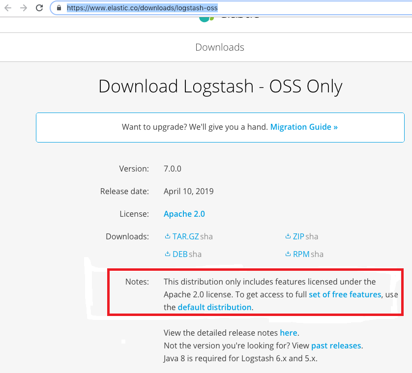

Lab 5. Analyzing Log Data
--------------------------------------


In this lab, we will be exploring Logstash, another key component of
the Elastic Stack that is mainly used as an
**ETL**(Extract, Transform, and Load) engine.
We will also be exploring the following topics:


-   Log Analysis challenges
-   Using Logstash
-   The Logstash architecture
-   Overview of Logstash plugins
-   Ingest node


In the next section, we will explore how Logstash can help us in
addressing the  challenges in logging and thus ease the log analysis
process.


### Installation and configuration


In the following sections, we will take a look at how to
install and configure Logstash on our system.


#### Prerequisites


Java runtime is required to run Logstash.
Logstash requires Java 8. Make sure that `JAVA_HOME` is set as
an environment variable, and to check your Java version, run the
following command:

```
java -version
```

You should see the following output:

```
openjdk version "11.0.9.1" 2020-11-04
OpenJDK Runtime Environment (build 11.0.9.1+1-Ubuntu-0ubuntu1.20.04)
OpenJDK 64-Bit Server VM (build 11.0.9.1+1-Ubuntu-0ubuntu1.20.04, mixed mode, sharing)
```


#### Downloading and installing Logstash


Just like the other components of the Elastic
Stack, downloading and installing Logstash is
pretty simple and straightforward. Navigate
to <https://www.elastic.co/downloads/logstash-oss> and, depending on
your operating system, download the required ZIP/TAR file, as shown in
the following screenshot:





### Note
The Logstash installation folder will be referred to as `LOGSTASH_HOME`.


### Running Logstash


Logstash requires configuration to be specified while running it.
Configuration can be specified directly as an argument using
the `-e` option by specifying the
configuration file (the `.conf` file) using
the `-f` option/flag. 

Using the terminal/command prompt, navigate to
`LOGSTASH_HOME/bin`. Let\'s ensure that Logstash works
fine after installation by running the following command with a simple
configuration (the `logstash` pipeline) as a parameter:

```
logstash -e "input { stdin { } } output { stdout {} }"
```

You should get the following logs:

```
E:\logstash-7.0.0\bin>logstash -e "input { stdin {}} output { stdout{}}"
Sending Logstash logs to E:/logstash-7.0.0/logs which is now configured via log4j2.properties
[2019-03-17T15:17:23,771][INFO ][logstash.setting.writabledirectory] Creating directory {:setting=>"path.queue", :path=>"E:/logstash-7.0.0/data/queue"}
[2019-03-17T15:17:23,782][INFO ][logstash.setting.writabledirectory] Creating directory {:setting=>"path.dead_letter_queue", :path=>"E:/logstash-7
.0.0/data/dead_letter_queue"}
[2019-03-17T15:17:23,942][WARN ][logstash.config.source.multilocal] Ignoring the 'pipelines.yml' file because modules or command line options are specified
[2019-03-17T15:17:23,960][INFO ][logstash.runner ] Starting Logstash {"logstash.version"=>"7.0.0"}
[2019-03-17T15:17:24,006][INFO ][logstash.agent ] No persistent UUID file found. Generating new UUID {:uuid=>"5e0b1f2a-d1dc-4c0b-9c4f-8efded
6c3260", :path=>"E:/logstash-7.0.0/data/uuid"}
[2019-03-17T15:17:32,701][INFO ][logstash.javapipeline ] Starting pipeline {:pipeline_id=>"main", "pipeline.workers"=>4, "pipeline.batch.size"=>125
, "pipeline.batch.delay"=>50, "pipeline.max_inflight"=>500, :thread=>"#<Thread:0x74a9c9ab run>"}
[2019-03-17T15:17:32,807][INFO ][logstash.javapipeline ] Pipeline started {"pipeline.id"=>"main"}
The stdin plugin is now waiting for input:
[2019-03-17T15:17:32,897][INFO ][logstash.agent ] Pipelines running {:count=>1, :running_pipelines=>[:main], :non_running_pipelines=>[]}
[2019-03-17T15:17:33,437][INFO ][logstash.agent ] Successfully started Logstash API endpoint {:port=>9600}
```

Now, enter any text and press [*Enter*] . Logstash adds a
timestamp and IP address information to the
input text message. Exit Logstash by issuing a [*CTRL*]  +
[*C*]  command in the shell where Logstash is running. We just
ran Logstash with some simple configurations (pipeline). In the next
section, we will explore the Logstash pipeline in more detail.

 

To prevent data loss, you can enable Logstash to persist
in-flight events to the disk by making use of persistent queues. 


### Note

Persistent queues can be enabled by setting the
`queue.type: persisted` property in
the `logstash.yml` file, which can be found under the
`LOGSTASH_HOME/config` folder. `logstash.yml` is a
configuration file that contains settings related to Logstash. By
default, the files are stored in `LOGSTASH_HOME/data/queue`.
You can override this by setting the `path.queue` property in
`logstash.yml`.

By default, Logstash starts with a heap size of 1 GB. This can be
overridden by setting the `Xms` and `Xmx` properties
in the `jvm.options` file, which is found under
the `LOGSTASH_HOME/config` folder. 


The Logstash pipeline is stored in a configuration file that ends with
a `.conf` extension. The three sections of the configuration
file are as follows:

```
input
{
}
filter
{
}
output
{
}  
```

Each of these sections contains one or more plugin configurations. A plugin can be configured by providing the
name of the plugin and then its settings as a key-value pair. The value
is assigned to a key using the `=>` operator.

Let\'s use the same configuration that we used in the previous
section, with some little modifications, and store it in a file:

```
#simple.conf
#A simple logstash configuration 

input { 
  stdin { } 
} 

filter {
  mutate {
    uppercase => [ "message" ]
  }
}

output { 
  stdout { 
    codec => rubydebug 
    }
} 
```

Create a `conf` folder under `LOGSTASH_HOME`. Create
a file called `simple.conf` under the
`LOGSTASH_HOME/conf` folder.


### Note

It\'s good practice to place all the configurations in a separate
directory, either under `LOGSTASH_HOME` or outside of it
rather than placing the files in the `LOGSTASH_HOME/bin`
folder. 


You may notice that this file contains two
required elements, `input` and `output`, and that
the `input` section has a plugin named `stdin` which
accepts default parameters. The `output` section has
a `stdout` plugin which accepts the `rubydebug`
codec. `stdin` is used for reading input from the standard
input, and the `stdout` plugin is used for writing the event
information to standard outputs. The `rubydebug` codec will
output your Logstash event data using the Ruby Awesome Print library. It
also contains a filter section that has a `mutate` plugin,
which converts the incoming event message into uppercase.

Let\'s run Logstash using this new pipeline/configuration that\'s stored
in the `simple.conf` file, as follows:

```
E:\logstash-7.0.0\bin>logstash -f ../conf/simple.conf
```

Once Logstash has started, enter any input,
say, `LOGSTASH IS AWESOME`, and you should see the response,
as follows:

```
{
      "@version" => "1",
          "host" => "SHMN-IN",
    "@timestamp" => 2017-11-03T11:42:56.221Z,
       "message" => "LOGSTASH IS AWESOME\r"
}
```

As seen in the preceding code, along with the input message, Logstash
automatically adds the timestamp at which the event was generated, and
information such as the host and version number. The output is pretty
printed due to the use of the `rubydebug` codec. The incoming
event is always stored in the field named
`message`. 


### Note

 Since the configuration was specified using the file note, we used
the `-f` flag/option when running Logstash. 


Overview of Logstash plugins
----------------------------------------------


Logstash has a rich collection of input,
filter, codec, and output plugins. Plugins are available as
self-contained packages called **gems**, and are
hosted on `RubyGems.org`. By
default, as part of the Logstash distribution, many common plugins are
available out of the box. You can verify the list of plugins that are
part of the current installation by executing the following command:

```
E:\logstash-7.0.0\bin>logstash-plugin list
```


### Note

By passing the `--verbose` flag to the preceding command, you
can find out the version information of each plugin.


Using the `--group` flag, followed by either
`input`, `filter`, `output`, or
`codec`, you can find the list of installed input, filters,
output, codecs, and plugins, respectively. For example:[]

```
E:\logstash-7.0.0\bin>logstash-plugin list --group filter
```

You can list all the plugins containing a name fragment by passing the
name fragment to `logstash-plugin list`. For example:

```
E:\logstash-7.0.0\bin>logstash-plugin list 'pager'
```


### Installing or updating plugins


If the required plugin is not bundled by
default, you can install it using the
`bin\logstash-plugin install` command. For example, to install
the `logstash-output-email` plugin, execute the following
command:

```
E:\logstash-7.0.0\bin>logstash-plugin install logstash-output-email
```

By using the `bin\logstash-plugin update` command and passing
the plugin name as a parameter to the command, you
can get the latest version of the plugin:

```
E:\logstash-oss-7.0.0\bin>logstash-plugin update logstash-output-s3
```


### Note

Executing just the `bin\logstash-plugin update` command would
update all the plugins.


##### File


The `file` plugin is used to stream
events from file(s) line by line. It works in a similar fashion to
the `tail -0f` Linux\\Unix command. For each file,
it keeps track of any changes in the file,
and the last location from where the file was read, only sends the data
since it was last read. It also automatically detects file rotation.
This plugin also provides the option to read the file from the
beginning of the file.

The `file` plugin keeps account of the current position in
each file. It does so by recording the current position in a separate
file named `sincedb`. This makes it possible as well as
convenient to stop and restart Logstash and have it pick up where it
left off without missing the lines that were added to the file while
Logstash was stopped.

The location of the `sincedb` file is set
to `<path.data>/plugins/inputs/file` by default, which can be
overridden by providing the file path for the `sincedb_path`
plugin parameter. The only required parameter for this plugin is the
`path` parameter, which accepts one or more files to read
from.

Let\'s take some example configurations to understand this plugin
better:

```
#sample configuration 1
#simple1.conf

input
{ file{ 
    path => "/usr/local/logfiles/*"
 }
}
 output 
{ 
 stdout { 
 codec => rubydebug 
 }
}
```

The preceding configuration specifies the streaming of all the new
entries (that is, tailing the files) to the files found under the
`/usr/local/logfiles/` location:

```
#sample configuration 2 
#simple2.conf
input
{
    file{
        path => ["D:\es\app\*","D:\es\logs\*.txt"]
        start_position => "beginning"    
        exclude => ["*.csv] 
        discover_interval => "10s"
        type => "applogs" 
    }
}

output
{ 
  stdout { 
    codec => rubydebug 
    }
} 
```

The preceding configuration specifies the
streaming of all the log entries/lines in the
files found under the `D:\es\app\*` location, and only files
of the `.txt` type. Files found under the
`D:\es\logs\*.txt` location, starting from the
beginning (specified by the
`start_position => "beginning"` parameter), and while looking
for files, it excludes files of the `.csv` type (specified by
the `exclude => ["*.csv]` parameter, which takes an array of
values). Every line that\'s streamed would be stored in the message
field by default. The preceding configuration also specified to add a
new additional field type with the `applogs` value (specified
by the `type => "applogs"` parameter). Adding additional
fields would be helpful while transforming events in filter plugins or
identifying the events in the output. The
`discover_interval` parameter is used to define
how often the `path` will be expanded to search for new files
that are created inside the location specified in
the `path` parameter.


### Note

Specifying the parameter/setting
as `start_position => "beginning"`
or `sincedb_path => "NULL"` would force the file to stream
from the beginning every time Logstash is restarted.


##### Beats


The Beats input plugin allows Logstash to
receive events from the Elastic Beats
framework. Beats are a collection of lightweight daemons that collect
operational data from your servers and ship to configured outputs such
as Logstash, Elasticsearch, Redis, and so on. There are several Beats
available, including Metricbeat, Filebeat, Winlogbeat, and so on.
Filebeat ships log files from your servers, Metricbeat is a server
monitoring agent that periodically collects metrics from the services
and operating systems running on your servers, and Winlogbeat ships
Windows event logs. We will be exploring the Beats framework and some of
these Beats in the upcoming labs. 

By using the `beats` input plugin, we can make Logstash listen
on desired ports for incoming Beats connections:

```
#beats.conf

input { 
  beats {
 port => 1234
  }

} 

output { 
  elasticsearch {
  }
} 
```

`port` is the only required setting for this plugin. The
preceding configuration makes Logstash listen for incoming
Beats connections and index into Elasticsearch. When you start Logstash
with the preceding configuration, you may notice Logstash starting an
input listener on port `1234` in the logs, as follows:

```
E:\logstash-7.0.0\bin>logstash -f ../conf/beats.conf -r
Sending Logstash logs to E:/logstash-7.0.0/logs which is now configured via log4j2.properties
[2019-04-22T10:45:04,551][WARN ][logstash.config.source.multilocal] Ignoring the 'pipelines.yml' file because modules or command line options are spec
ified
[2019-04-22T10:45:04,579][INFO ][logstash.runner ] Starting Logstash {"logstash.version"=>"7.0.0"}
[2019-04-22T10:45:12,622][INFO ][logstash.outputs.elasticsearch] Elasticsearch pool URLs updated {:changes=>{:removed=>[], :added=>[http://127.0.0.1:9
200/]}}
[2019-04-22T10:45:13,008][WARN ][logstash.outputs.elasticsearch] Restored connection to ES instance {:url=>"http://127.0.0.1:9200/"}
[2019-04-22T10:45:13,114][INFO ][logstash.outputs.elasticsearch] ES Output version determined {:es_version=>7}
[2019-04-22T10:45:13,119][WARN ][logstash.outputs.elasticsearch] Detected a 6.x and above cluster: the `type` event field won't be used to determine t
he document _type {:es_version=>7}
[2019-04-22T10:45:13,148][INFO ][logstash.outputs.elasticsearch] New Elasticsearch output {:class=>"LogStash::Outputs::ElasticSearch", :hosts=>["//127
.0.0.1"]}
[2019-04-22T10:45:13,162][INFO ][logstash.outputs.elasticsearch] Using default mapping template
[2019-04-22T10:45:13,186][INFO ][logstash.javapipeline ] Starting pipeline {:pipeline_id=>"main", "pipeline.workers"=>4, "pipeline.batch.size"=>125
, "pipeline.batch.delay"=>50, "pipeline.max_inflight"=>500, :thread=>"#<Thread:0x1bf9b54c run>"}
[2019-04-22T10:45:13,453][INFO ][logstash.outputs.elasticsearch] Index Lifecycle Management is set to 'auto', but will be disabled - Index Lifecycle m
anagement is not installed on your Elasticsearch cluster
[2019-04-22T10:45:13,459][INFO ][logstash.outputs.elasticsearch] Attempting to install template {:manage_template=>{"index_patterns"=>"logstash-*", "v
ersion"=>60001, "settings"=>{"index.refresh_interval"=>"5s", "number_of_shards"=>1}, "mappings"=>{"dynamic_templates"=>[{"message_field"=>{"path_match
"=>"message", "match_mapping_type"=>"string", "mapping"=>{"type"=>"text", "norms"=>false}}}, {"string_fields"=>{"match"=>"*", "match_mapping_type"=>"s
tring", "mapping"=>{"type"=>"text", "norms"=>false, "fields"=>{"keyword"=>{"type"=>"keyword", "ignore_above"=>256}}}}}], "properties"=>{"@timestamp"=>
{"type"=>"date"}, "@version"=>{"type"=>"keyword"}, "geoip"=>{"dynamic"=>true, "properties"=>{"ip"=>{"type"=>"ip"}, "location"=>{"type"=>"geo_point"},
"latitude"=>{"type"=>"half_float"}, "longitude"=>{"type"=>"half_float"}}}}}}}
[2019-04-22T10:45:13,513][INFO ][logstash.outputs.elasticsearch] Installing elasticsearch template to _template/logstash
[2019-04-22T10:45:13,902][INFO ][logstash.inputs.beats ] Beats inputs: Starting input listener {:address=>"0.0.0.0:1234"}
[2019-04-22T10:45:13,932][INFO ][logstash.javapipeline ] Pipeline started {"pipeline.id"=>"main"}
[2019-04-22T10:45:14,196][INFO ][logstash.agent ] Pipelines running {:count=>1, :running_pipelines=>[:main], :non_running_pipelines=>[]}
[2019-04-22T10:45:14,204][INFO ][org.logstash.beats.Server] Starting server on port: 1234
[2019-04-22T10:45:14,695][INFO ][logstash.agent ] Successfully started Logstash API endpoint {:port=>9600}

```

Logstash starts the input listener on the `0.0.0.0` address,
which is the default value of the `host` parameter/setting of
the plugin.

You can start multiple listeners to listen
for incoming Beats connections as follows:

```
#beats.conf

input { 
  beats {
host => "192.168.10.229"
 port => 1234
  } 
  beats {
    host => "192.168.10.229"
 port => 5065
  }

} 

output { 
  elasticsearch {
  }
}
```


### Note

Using the `-r` flag while running Logstash allows you to
automatically reload the configuration whenever changes are made to it
and saved. This would be useful when testing new configurations, as you
can modify them so that Logstash doesn\'t need to be started manually
every time a change is made to the configuration.


##### JDBC


This plugin is used to import data from a
database to Logstash. Each row in the results
set would become an event, and each column would get converted into
fields in the event. Using this plugin, you can import all the data at
once by running a query, or you can periodically schedule the import
using `cron` syntax (using the `schedule`
parameter/setting). When using this plugin, the user would need to
specify the path of the JDBC drivers that\'s appropriate to the
database. The driver library can be specified using
the `jdbc_driver_library` parameter.

The SQL query can be specified using the `statement` parameter
or can be stored in a file; the path of the file can be specified using
the `statement_filepath` parameter. You can use
either `statement` or `statement_filepath` for
specifying the query. It is good practice to store the bigger queries in
a file. This plugin accepts only one SQL statement since multiple SQL
statements aren\'t supported. If the user needs to execute multiple
queries to ingest data from multiple tables/views, then they need to
define multiple JDBC inputs (that is, one JDBC input for one query) in
the input section of Logstash configuration. 

The results set size can be specified by using the
`jdbc_fetch_size` parameter. The plugin will persist the
`sql_last_value` parameter in the form of a metadata file
stored in the configured `last_run_metadata_path` parameter.
Upon query execution, this file will be updated with the current value
of `sql_last_value`. The `sql_last_value` value is
used to incrementally import data from the database every time the query
is run based on the `schedule` set. Parameters to the SQL
statement can be specified using the `parameters` setting,
which accepts a hash of the query parameter.

Let\'s look at an example:

```
#jdbc.conf
input {
jdbc {
            # path of the jdbc driver
            jdbc_driver_library => "/path/to/mysql-connector-java-5.1.36-bin.jar"

            # The name of the driver class 
            jdbc_driver_class => "com.mysql.jdbc.Driver"

     # Mysql jdbc connection string to company database
            jdbc_connection_string => "jdbc:mysql://localhost:3306/company"

            # user credentials to connect to the DB
            jdbc_user => "user"
            jdbc_password => "password"

            # when to periodically run statement, cron format (ex: every 30 minutes)
            schedule => "30 * * * *"

            # query parameters
            parameters => { "department" => "IT" }

            # sql statement 
            statement => "SELECT * FROM employees WHERE department= :department AND
            created_at >= :sql_last_value"
        }
}

output {
    elasticsearch {
      index => "company"
      document_type => "employee"
      hosts => "localhost:9200"
    }
}
```

The previous configuration is used to connect
to the company schema belonging to MySQLdb
and is used to pull employee records from the `IT` department.
The SQL statement is run every 30 minutes to check for new employees
that have been created since the last run. The fetched rows are sent to
Elasticsearch and configured as the output.


### Note

`sql_last_value` is set to Thursday, January 1, 1970 by
default before the execution of the query, and is updated with the
timestamp every time the query is run. You can force it to store a
column value other than the last execution time, by setting
the `use_column_value` parameter to true and specifying the
column name to be used using the `tracking_column` parameter.


##### IMAP


This plugin is used to read emails from an
IMAP server. This plugin can be used to read
emails and, depending on the email context, the subject of the email, or
specific senders, it can be conditionally processed in Logstash and used
to raise JIRA tickets, pagerduty events, and so on. The required
configurations are `host`, `password`,
and `user`. Depending on the settings that are required by the
IMAP server that you want to connect to, you might need to set values
for additional configurations, such as `port`,
`secure`, and so on. `host` is where you would
specify your IMAP server host details, and `user` and
`password` are where you need to specify the user credentials
to authenticate/connect to the IMAP server:

```
#email_log.conf
input { 
    imap {
      host => "imap.fenago.com"
      password => "secertpassword"
      user => "user1@pact.com"
      port => 993
      check_interval => 10
      folder => "Inbox"

    }
} 


output {
    stdout { 
        codec => rubydebug 
    }
    elasticsearch {
      index => "emails"
      document_type => "email"
      hosts => "localhost:9200"
    }

}
```

By default, the `logstash-input-imap` plugin reads from
the `INBOX` folder, and it polls the IMAP server every 300
seconds. In the preceding configuration, when using the
`check_interval` parameter, the interval is
overridden every 10 seconds. Each new email would be considered an
event, and as per the preceding configuration, it would be sent to the
standard output and Elasticsearch.


#### Output plugins


In this section, we will walk through some of
the most commonly used output plugins in
detail.


##### Elasticsearch


This plugin is used for transferring events
from Logstash to Elasticsearch. This plugin
is the recommended approach for pushing events/log data from Logstash to
Elasticsearch. Once the data is in Elasticsearch, it can be easily
visualized using Kibana. This plugin requires no mandatory parameters
and it automatically tries to connect to Elasticsearch, which is hosted
on `localhost:9200`.

The simple configuration of this plugin would be as follows:

```
#elasticsearch1.conf

input { 
  stdin{
  }
 } 

output { 
 elasticsearch {
  }
} 
```

Often, Elasticsearch will be hosted on a different server that\'s
usually secure, and we might want to store the incoming data in specific
indexes. Let\'s look at an example of this:

```
#elasticsearch2.conf

input { 
  stdin{
  }
 } 

output { 
 elasticsearch {
      index => "company"
      document_type => "employee"
      hosts => "198.162.43.30:9200"
user => "elastic"
      password => "elasticpassword"
  }
} 
```

As we can see in the preceding code, incoming events would be stored in
an Elasticsearch index named `company` (specified using
the`index` parameter) under the `employee` type
(specified using the `document_type` parameter). Elasticsearch
is hosted at the `198.162.43.30:9200` address (specified using
the `document_type` parameter), and the user credentials of
Elasticsearch are `elastic` and
`elasticpassword` (specified using the `user` and
`password` parameters). 

If the index is not specified by default, the
index pattern would
be `logstash-%(+YYYY.MM.dd)` and the `document_type`
would be set to the `type` event, if it existed; otherwise,
the document type would be assigned the value of logs/events.

You can also specify the `document_type` index and
the `document_id` dynamically by using
`syntax %(fieldname)`. In the `hosts` parameter, a
list of hosts can be specified too. By default, the protocol that\'s
used would be HTTP, if not specified explicitly while defining hosts.


### Note

It is recommended that you specify either the data nodes or ingest nodes
in the `hosts` field.


##### CSV


This plugin is used for storing output in the
CSV format. The required parameters for this
plugin are the `path` parameter, which is used to specify the
location of the output file, and `fields`, which specifies
the field names from the event that should be written to the CSV
file. If a field does not exist on the event, an empty string will be
written. 

Let\'s look at an example. In the following configuration, Elasticsearch
is queried against the `apachelogs` index for all documents
matching `statuscode:200`, and the `message`,
`@timestamp`, and `host` fields are written to a
`.csv` file: 

```
#csv.conf

input {
 elasticsearch {
    hosts => "localhost:9200"index => "apachelogs"
    query =>'{ "query": { "match": { "statuscode": 200 } }}'
 } 
} 
output {  
csv { 
     fields => ["message", "@timestamp","host"]
     path => "D:\es\logs\export.csv"   
    }
}
```


##### Kafka


This plugin is used to write events to a
Kafka topic. It uses the Kafka Producer API
to write messages to a topic on the broker. The only required
configuration is the `topic_id`.

Let\'s look at a basic Kafka configuration:

```
#kafka.conf

input { 
  stdin{
  }
 } 

output {         
kafka {         
            bootstrap_servers => "localhost:9092"         
            topic_id => 'logstash'         
    }     
}
```

The `bootstrap_servers` parameter takes the
list of all server connections in the form of host1:port1, host2:port2,
and so on, and the producer will only use it for getting metadata
(topics, partitions, and replicas). The socket connections for sending
the actual data will be established based on the broker information
that\'s returned in the metadata. `topic_id` refers to the
topic name where messages will be published.


### Note

**Note**: Only Kafka version 0.10.0.x is compatible with
Logstash versions 2.4.x to 5.x.x and the Kafka output plugin version
5.x.x.


##### PagerDuty


This output plugin will send notifications
based on preconfigured services and
escalation policies. The only required parameter for this plugin is the
`service_key` to specify the Service API Key.

Let\'s look at a simple example with
basic `pagerduty` configuration. In the following
configuration, Elasticsearch is queried against
the `ngnixlogs` index for all documents matching
`statuscode:404`, and `pagerduty` events are raised
for each document returned by Elasticsearch: 

```
#kafka.conf
input {
 elasticsearch {
    hosts => "localhost:9200"index => "ngnixlogs"
    query =>'{ "query": { "match": { "statuscode": 404} }}'
 } 
} 

output {
pagerduty {
    service_key => "service_api_key" 
details => {
        "timestamp" => "%{[@timestamp]}"
        "message" => "Problem found: %{[message]}"
    }
    event_type => "trigger"

    }
}
```


#### Codec plugins


In the following sections, we will take a
look at some of the most commonly used codec
plugins in detail.


##### JSON


This codec is useful if the data consists of
`.json` documents, and is used to
encode (if used in output plugins) or decode (if used in input plugins)
the data in the `.json` format. If the data being sent is a
JSON array at its root, multiple events will be created (that is, one
per element).

The simple usage of a JSON codec plugin is as follows:

```
input{
    stdin{
    codec => "json"
    }
}
```


### Note

If there are multiple JSON records, and those are delimited by
`\n`, then use the `json_lines` codec.


If the `json` codec receives a payload from an input that is
not valid JSON, then it will fall back to plain text and add
a `_jsonparsefailure` tag.

##### Rubydebug 


This codec will output your Logstash event data using the Ruby Awesome Print library.

The simple usage of this codec plugin is as follows:

```
output{
    stdout{
    codec => "rubydebug"
    }
}
```


##### Multiline


This codec is useful for merging multiple lines of data with a single event. This codec
comes in very handy when dealing with stack traces or single event
information that is spread across multiple lines.

The sample usage of this codec plugin is shown in the following snippet:

```
input {
  file {
    path =>"/var/log/access.log"
    codec => multiline {pattern =>"^\s "
      negate =>false
      what =>"previous"}}}
```

The preceding multiline codec combines any line starting with a space
with the previous line. 


#### Filter plugins


Since we will be covering different
ways of transforming and enriching logs using
various filter plugins in the next lab, we won\'t be covering
anything about filter plugins here.


Ingest node
-----------------------------


Prior to Elasticsearch 5.0, if we wanted to
preprocess documents before indexing them to Elasticsearch, then the
only way was to make use of Logstash or preprocess them
programmatically/manually and then index them to Elasticsearch.
Elasticsearch lacked the ability to preprocess/transform the documents,
and it just indexed the documents as they were. However, the
introduction of a feature called ingest node in Elasticsearch 5.x onward
provided a lightweight solution for preprocessing and enriching
documents within Elasticsearch itself before they are indexed.

If an Elasticsearch node is implemented with the default configuration,
by default, it would be master, data, and ingest enabled (that is, it
would act as a master node, data node, and ingest node). To disable
ingest on a node, configure the following setting in the
`elasticsearch.yml` file:

```
node.ingest: false
```

The ingest node can be used to preprocess documents before the actual
indexing is performed on the document. This preprocessing is performed
via an ingest node that intercepts bulk and index requests, applies the
transformations to the data, and then passes the documents back to the
index or bulk APIs. With the release of the new ingest feature,
Elasticsearch has taken out the filter part of Logstash so that we can
do our processing of raw logs and enrichment within Elasticsearch.

To preprocess a document before indexing, we must define the pipeline
(which contains sequences of steps known as processors for transforming
an incoming document). To use a pipeline, we simply specify the
`pipeline` parameter on an index or bulk request to tell the
ingest node which pipeline to use:

```
POST my_index/my_type?pipeline=my_pipeline_id
{"key":"value"}
```

### Defining a pipeline 


A pipeline defines a series of processors.
Each processor transforms the document in some way. Each processor is
executed in the order in which it is defined in the pipeline. A pipeline
consists of two main fields: a description and a list of processors.

The `description` parameter is a non-required field and is
used to store some descriptions/usage of the pipeline; by using
the `processors` parameter, you can list the processors to
transform the document.

The typical structure of a pipeline is as follows:

```
{"description":"...","processors":[...]}
```

The ingest node has around 20 + built-in processors, including gsub,
grok, convert, remove, rename, and so on. These can be used while
building a pipeline. Along with built-in processors, ingest plugins such
as ingest attachment, ingest geo-ip, and ingest user-agent are available
and can be used while building a pipeline. These plugins are not
available by default and can be installed just like any other
Elasticsearch plugin.

### Ingest APIs


The ingest node provides a set of APIs known as ingest APIs, which can
be used to define, simulate, remove, or find information
about pipelines. The ingest API endpoint is
`_ingest`. 


#### Put pipeline API


This API is used to define a
new pipeline. This API is also used to add a
new pipeline or update an existing pipeline.

Let\'s look at an example. As we can see in the following code, we have
defined a new pipeline named `firstpipeline`, which converts
the value present in the `message` field into upper case:

```
curl -X PUT http://localhost:9200/_ingest/pipeline/firstpipeline -H 'content-type: application/json'  
  -d '{
  "description" : "uppercase the incoming value in the message field",
  "processors" : [
    {
      "uppercase" : {
        "field": "message"
      }
    }
  ]
}'
```

When creating a pipeline, multiple processors can be defined, and the
order of the execution depends on the order in which it is defined in
the definition. Let\'s look at an example for this. As we can see in the
following code, we have created a new pipeline called
`secondpipeline` that converts the uppercase value present in
the `message` field and renames the `message` field
to `data`. It creates a new field named `label` with
the `testlabel` value:

```
curl -X PUT http://localhost:9200/_ingest/pipeline/secondpipeline -H 'content-type: application/json'
-d '{
  "description" : "uppercase the incoming value in the message field",
  "processors" : [
    {
      "uppercase" : {
        "field": "message",
        "ignore_failure" : true
      }
    },
    {
      "rename": {
      "field": "message",
      "target_field": "data",
      "ignore_failure" : true
  }
    },
    {
       "set": {
      "field": "label",
      "value": "testlabel",
      "override": false
  }
    }

  ]
}'
```

Let\'s make use of the second pipeline to index a sample document:

```
curl -X PUT 'http://localhost:9200/myindex/mytpe/1?pipeline=secondpipeline' -H 'content-type: application/json' -d '{
  "message":"elk is awesome"
}'
```

Let\'s retrieve the same document and validate the transformation:

```
curl -X GET   http://localhost:9200/myindex/mytpe/1   -H 'content-type: application/json' 

Response:
{
    "_index": "myindex",
    "_type": "mytpe",
    "_id": "1",
    "_version": 1,
    "found": true,
    "_source": {
"label": "testlabel",
        "data": "ELK IS AWESOME"
    }
}
```


### Note

If the field that\'s used in the processor is missing, then the
processor throws an exception and the document won\'t be indexed. In
order to prevent the processor from throwing an exception, we can make
use of the `"ignore_failure" : true` parameter.


#### Get pipeline API


This API is used to retrieve the definition
of an existing pipeline. Using this API, you can find the details of a
single pipeline definition or find the
definitions of all the pipelines.

The command to find the definition of all the pipelines is as follows:

```
curl -X GET http://localhost:9200/_ingest/pipeline -H 'content-type: application/json' 

```

To find the definition of an existing pipeline, pass the pipeline ID to
the pipeline API. The following is an example of finding the definition
of the pipeline named `secondpipeline`:

```
curl -X GET http://localhost:9200/_ingest/pipeline/secondpipeline  -H 'content-type: application/json'
```


#### Delete pipeline API


The delete pipeline API deletes pipelines by ID or
wildcard match. The following is an example of deleting the pipeline named
`firstpipeline`:

```
curl -X DELETE http://localhost:9200/_ingest/pipeline/firstpipeline  -H 'content-type: application/json'
```


#### Simulate pipeline API


This pipeline can be used to simulate the
execution of a pipeline against the set of documents provided in the
body of the request. You can either specify an existing pipeline to
execute against the provided documents or supply a pipeline definition
in the body of the request. To simulate the
ingest pipeline, add the `_simulate` endpoint to the pipeline
API.

The following is an example of simulating an existing pipeline: 

```
curl -X POST  http://localhost:9200/_ingest/pipeline/firstpipeline/_simulate -H 'content-type: application/json' -d '{
  "docs" : [
    { "_source": {"message":"first document"} },
    { "_source": {"message":"second document"} }

  ]
}'
```

The following is an example of a simulated request, with the pipeline
definition in the body of the request itself:

```
curl -X POST http://localhost:9200/_ingest/pipeline/_simulate -H 'content-type: application/json' -d '{
  "pipeline" : {
    "processors":[
      {
 "join": {
          "field": "message",
          "separator": "-"
        }
      }]
  },
  "docs" : [
    { "_source": {"message":["first","document"]} }

  ]
}'
```


Summary
-------------------------


In this lab, we laid out the foundations of Logstash. We walked you
through the steps to install and configure Logstash to set up basic data
pipelines, and studied Logstash\'s architecture.

We also learned about the ingest node that was introduced in Elastic
5.x, which can be used instead of a dedicated Logstash setup. We saw how
the ingest node can be used to preprocess documents before the actual
indexing takes place, and also studied its different APIs.

In the next lab, we will show you how a rich set of filters brings
Logstash closer to the other real-time and near real-time stream
processing frameworks with zero coding.
