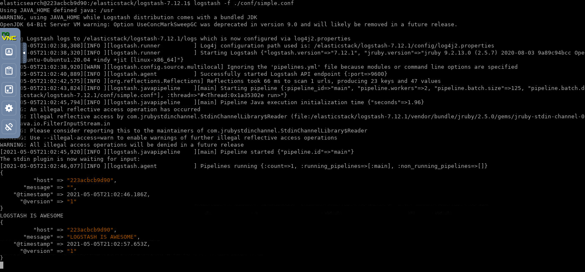
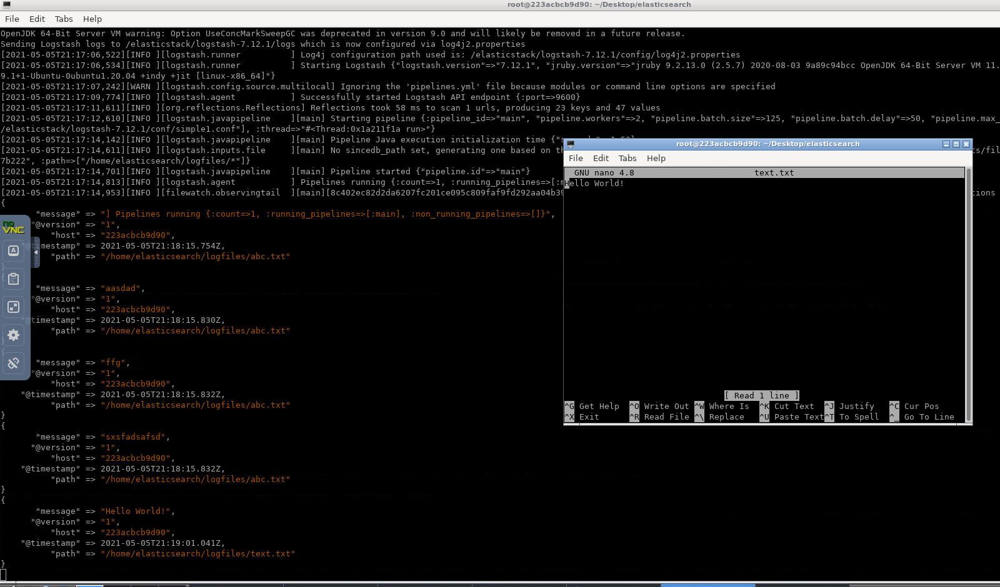
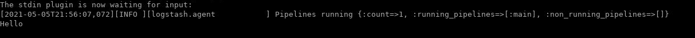
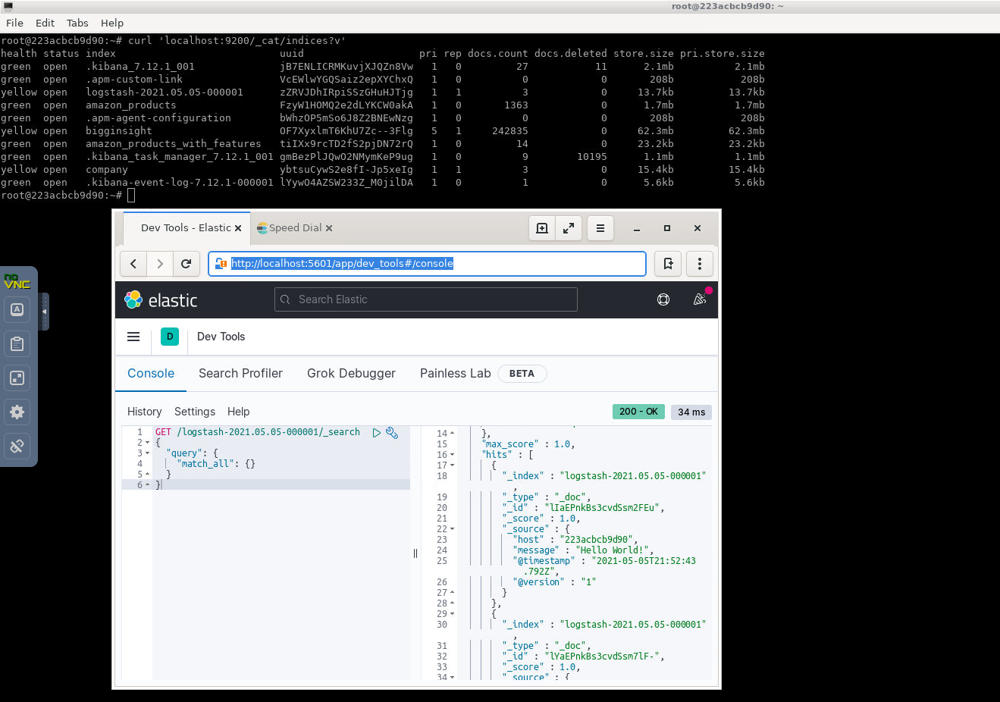

Lab 5. Analyzing Log Data
--------------------------------------


In this lab, we will be exploring Logstash, another key component of
the Elastic Stack that is mainly used as an
**ETL**(Extract, Transform, and Load) engine.
We will also be exploring the following topics:


-   Log Analysis challenges
-   Using Logstash
-   The Logstash architecture
-   Overview of Logstash plugins
-   Ingest node


In the next section, we will explore how Logstash can help us in
addressing the  challenges in logging and thus ease the log analysis
process.


### Logstash Installation


**Prerequisites**

Java runtime is required to run Logstash.
Logstash requires Java 8. Make sure that `JAVA_HOME` is set as
an environment variable, and to check your Java version, run the
following command:

```
java -version
```

You should see the following output:

```
openjdk version "11.0.9.1" 2020-11-04
OpenJDK Runtime Environment (build 11.0.9.1+1-Ubuntu-0ubuntu1.20.04)
OpenJDK 64-Bit Server VM (build 11.0.9.1+1-Ubuntu-0ubuntu1.20.04, mixed mode, sharing)
```

**Running Logstash**

1. Logstash has been already downloaded at following path: `/elasticstack/logstash-7.12.1` and added to `PATH` variable.

2. Important: Switch to `elasticsearch` user first from the terminal.

`su elasticsearch`


**Note:** Environment variable `LOGSTASH_HOME` is already set: `/elasticstack/logstash-7.12.1`.

`echo $LOGSTASH_HOME`


### Running Logstash

Let\'s ensure that Logstash works
fine after installation by running the following command with a simple
configuration (the `logstash` pipeline) as a parameter:


```
logstash -e "input { stdin { } } output { stdout {} }"
```

You should get the following logs:

```
logstash -e "input { stdin {}} output { stdout{}}"

Sending Logstash logs to logstash-7.12.1/logs which is now configured via log4j2.properties
[2021-03-17T15:17:23,771][INFO ][logstash.setting.writabledirectory] Creating directory {:setting=>"path.queue", :path=>"logstash-7.12.1/data/queue"}
[2021-03-17T15:17:23,782][INFO ][logstash.setting.writabledirectory] Creating directory {:setting=>"path.dead_letter_queue", :path=>"E:/logstash-7
.0.0/data/dead_letter_queue"}
[2021-03-17T15:17:23,942][WARN ][logstash.config.source.multilocal] Ignoring the 'pipelines.yml' file because modules or command line options are specified
[2021-03-17T15:17:23,960][INFO ][logstash.runner ] Starting Logstash {"logstash.version"=>"7.0.0"}
[2021-03-17T15:17:24,006][INFO ][logstash.agent ] No persistent UUID file found. Generating new UUID {:uuid=>"5e0b1f2a-d1dc-4c0b-9c4f-8efded
6c3260", :path=>"logstash-7.12.1/data/uuid"}
[2021-03-17T15:17:32,701][INFO ][logstash.javapipeline ] Starting pipeline {:pipeline_id=>"main", "pipeline.workers"=>4, "pipeline.batch.size"=>125
, "pipeline.batch.delay"=>50, "pipeline.max_inflight"=>500, :thread=>"#<Thread:0x74a9c9ab run>"}
[2021-03-17T15:17:32,807][INFO ][logstash.javapipeline ] Pipeline started {"pipeline.id"=>"main"}
The stdin plugin is now waiting for input:
[2021-03-17T15:17:32,897][INFO ][logstash.agent ] Pipelines running {:count=>1, :running_pipelines=>[:main], :non_running_pipelines=>[]}
[2021-03-17T15:17:33,437][INFO ][logstash.agent ] Successfully started Logstash API endpoint {:port=>9600}
```

Now, enter any text and press [*Enter*] . Logstash adds a
timestamp and IP address information to the
input text message. Exit Logstash by issuing a [*CTRL*]  +
[*C*]  command in the shell where Logstash is running. We just
ran Logstash with some simple configurations (pipeline). In the next
section, we will explore the Logstash pipeline in more detail.


### Note

Persistent queues can be enabled by setting the
`queue.type: persisted` property in
the `logstash.yml` file, which can be found under the
`LOGSTASH_HOME/config` folder. `logstash.yml` is a
configuration file that contains settings related to Logstash. By
default, the files are stored in `LOGSTASH_HOME/data/queue`.
You can override this by setting the `path.queue` property in
`logstash.yml`.

By default, Logstash starts with a heap size of 1 GB. This can be
overridden by setting the `Xms` and `Xmx` properties
in the `jvm.options` file, which is found under
the `LOGSTASH_HOME/config` folder. 

**Note:** It is not required to change the above parameters.


Let\'s use the same configuration that we used in the previous
section, with some little modifications, and store it in a file:

```
#simple.conf
#A simple logstash configuration 

input { 
  stdin { } 
} 

filter {
  mutate {
    uppercase => [ "message" ]
  }
}

output { 
  stdout { 
    codec => rubydebug 
    }
} 
```

Create a `conf` folder under `LOGSTASH_HOME`. Create
a file called `simple.conf` under the
`LOGSTASH_HOME/conf` folder.


Let\'s run Logstash using this new pipeline/configuration that\'s stored
in the `simple.conf` file, as follows:

```
cd $LOGSTASH_HOME

logstash -f ./conf/simple.conf
```

Once Logstash has started, enter any input,
say, `LOGSTASH IS AWESOME`, and you should see the response, as follows:





As seen in the preceding code, along with the input message, Logstash
automatically adds the timestamp at which the event was generated, and
information such as the host and version number. The output is pretty
printed due to the use of the `rubydebug` codec. The incoming
event is always stored in the field named
`message`. 


### Note

Since the configuration was specified using the file note, we used the `-f` flag/option when running Logstash. 


Overview of Logstash plugins
----------------------------------------------

You can verify the list of plugins that are part of the current installation by executing the following command in the new terminal:

```
logstash-plugin list
```


### Note

By passing the `--verbose` flag to the preceding command, you
can find out the version information of each plugin.


Using the `--group` flag, followed by either
`input`, `filter`, `output`, or
`codec`, you can find the list of installed input, filters,
output, codecs, and plugins, respectively. For example:[]

```
logstash-plugin list --group filter
```

You can list all the plugins containing a name fragment by passing the
name fragment to `logstash-plugin list`. For example:

```
logstash-plugin list 'xml'
```


### Installing or updating plugins


If the required plugin is not bundled by
default, you can install it using the
`logstash-plugin install` command. For example, to install
the `logstash-output-email` plugin, execute the following
command:

```
logstash-plugin install logstash-output-email
```

By using the `logstash-plugin update` command and passing
the plugin name as a parameter to the command, you
can get the latest version of the plugin:

```
logstash-plugin update logstash-output-s3
```


**Note:** Executing just the `logstash-plugin update` command would update all the plugins.


#### File

Let\'s take some example configurations to understand this plugin better:

```
#sample configuration 1
#simple1.conf

input
{ file{ 
    path => "/home/elasticsearch/logfiles/*"
 }
}
 output 
{ 
 stdout { 
 codec => rubydebug 
 }
}
```


#### Running Logstash with simple1.conf

Close the running logstash instance from command line and then run following commands: 


```
su elasticsearch

mkdir -p ~/logfiles

cd $LOGSTASH_HOME

logstash -f ./conf/simple1.conf
```

**Note:** Open new terminal and create new text file and save it, it will apear in logstash as shown in screenshot below:




The preceding configuration specifies the streaming of all the new
entries (that is, tailing the files) to the files found under the
`/home/elasticsearch/logfiles/` location:

```
#sample configuration 2 
#simple2.conf
input
{
    file{
        path => ["/home/elasticsearch/logfiles/"]
        start_position => "beginning"    
        exclude => ["*.csv] 
        discover_interval => "10s"
        type => "applogs" 
    }
}

output
{ 
  stdout { 
    codec => rubydebug 
    }
} 
```


**Note:** Specifying the parameter/setting as `start_position => "beginning"`
or `sincedb_path => "NULL"` would force the file to stream from the beginning every time Logstash is restarted.


#### Beats

By using the `beats` input plugin, we can make Logstash listen
on desired ports for incoming Beats connections:

```
#beats.conf

input { 
  beats {
 port => 1234
  }

} 

output { 
  elasticsearch {
  }
} 
```

`port` is the only required setting for this plugin. The
preceding configuration makes Logstash listen for incoming
Beats connections and index into Elasticsearch. When you start Logstash
with the preceding configuration, you may notice Logstash starting an
input listener on port `1234` in the logs, as follows:

```
logstash -f ./conf/beats.conf -r
```

Logstash starts the input listener on the `0.0.0.0` address,
which is the default value of the `host` parameter/setting of
the plugin.

You can start multiple listeners to listen for incoming Beats connections as follows:

**Create file: $LOGSTASH_HOME/conf/beats.conf**


```
#beats.conf

input { 
  beats {
host => "127.0.0.1"
 port => 1234
  } 
  beats {
    host => "127.0.0.1"
 port => 5065
  }

} 

output { 
  elasticsearch {
  }
}
```


### Note

Using the `-r` flag while running Logstash allows you to
automatically reload the configuration whenever changes are made to it
and saved. This would be useful when testing new configurations, as you
can modify them so that Logstash doesn\'t need to be started manually
every time a change is made to the configuration.


##### IMAP

The required configurations are `host`, `password`,
and `user`. Depending on the settings that are required by the
IMAP server that you want to connect to, you might need to set values
for additional configurations, such as `port`,
`secure`, and so on. `host` is where you would
specify your IMAP server host details, and `user` and
`password` are where you need to specify the user credentials
to authenticate/connect to the IMAP server:


```
#email_log.conf
input { 
    imap {
      host => "imap.gmail.com"
      password => "secertpassword"
      user => "user1@pact.com"
      port => 993
      check_interval => 30
      folder => "Inbox"

    }
} 


output {
    stdout { 
        codec => rubydebug 
    }
    elasticsearch {
      index => "emails"
      document_type => "email"
      hosts => "localhost:9200"
    }

}
```

<span style="color:red;">Note: Above imap username/password are example values. You can optionally replace to get e-mail in real time. </span>


`logstash -f ./conf/email_log.conf`


By default, the `logstash-input-imap` plugin reads from
the `INBOX` folder, and it polls the IMAP server every 300
seconds. In the preceding configuration, when using the
`check_interval` parameter, the interval is
overridden every 10 seconds. Each new email would be considered an
event, and as per the preceding configuration, it would be sent to the
standard output and Elasticsearch.


#### Output plugins


In this section, we will walk through some of
the most commonly used output plugins in
detail.


##### Elasticsearch


This plugin is used for transferring events
from Logstash to Elasticsearch. This plugin
is the recommended approach for pushing events/log data from Logstash to
Elasticsearch. Once the data is in Elasticsearch, it can be easily
visualized using Kibana. This plugin requires no mandatory parameters
and it automatically tries to connect to Elasticsearch, which is hosted
on `localhost:9200`.

The simple configuration of this plugin would be as follows:

```
#elasticsearch1.conf

input { 
  stdin{
  }
 } 

output { 
 elasticsearch {
  }
} 
```

**Create file: $LOGSTASH_HOME/conf/elasticsearch1.conf**

```
logstash -f ./conf/elasticsearch1.conf -r
```

Wait for Logstash to start and then type messages as show below:



As, we didn't specify index name, data will be stored in index created by elasticsearch. Execute the following command in terminal: 

`curl 'localhost:9200/_cat/indices?v'`


Run the following query in Kibana UI console:

```
GET /update_me/_search
{
  "query": {
    "match_all": {}
  }
}
```




Often, Elasticsearch will be hosted on a different server that\'s
usually secure, and we might want to store the incoming data in specific
indexes. Let\'s look at an example of this:

```
#elasticsearch2.conf

input { 
  stdin{
  }
 } 

output { 
 elasticsearch {
      index => "company"
      document_type => "employee"
      hosts => "127.0.0.1:9200"
      user => "elasticsearch"
      password => "elasticpassword"
  }
} 
```

As we can see in the preceding code, incoming events would be stored in
an Elasticsearch index named `company` (specified using
the`index` parameter) under the `employee` type
(specified using the `document_type` parameter). 


```
logstash -f ./conf/elasticsearch1.conf -r
```

Wait for Logstash to start and then type messages as show below:


Run the following query in Kibana UI console:

```
GET /company/_search
{
  "query": {
    "match_all": {}
  }
}
```


##### CSV


Let\'s look at an example. In the following configuration, Elasticsearch
is queried against the `apachelogs` index for all documents
matching `statuscode:200`, and the `message`,
`@timestamp`, and `host` fields are written to a
`.csv` file: 

```
#csv.conf

input { 
  stdin{
  }
} 

output {  
csv { 
     fields => ["message", "@timestamp","host"]
     path => "/home/elasticsearch/export.csv"   
    }
}
```


#### Codec plugins

In the following sections, we will take a
look at some of the most commonly used codec
plugins in detail.


#### JSON


This codec is useful if the data consists of
`.json` documents, and is used to
encode (if used in output plugins) or decode (if used in input plugins)
the data in the `.json` format. If the data being sent is a
JSON array at its root, multiple events will be created (that is, one
per element).

The simple usage of a JSON codec plugin is as follows:

```
#json.conf

input{
    stdin{
    codec => "json"
    }
}
output { 
  stdout { 
    codec => rubydebug 
    }
}

```


Run following command in the terminal:

`logstash -f ./conf/json.conf`


**Valid Input**

- {"key": "valid"}
- {"count": 1,  "name": "fenago"}


**Invalid Input**

- randomstring
- 1


#### Rubydebug 

This codec will output your Logstash event data using the Ruby Awesome Print library.

The simple usage of this codec plugin is as follows:

```
#rubydebug.conf

input { 
  stdin{
  }
}

output{
    stdout{
    codec => "rubydebug"
    }
}
```


##### Multiline


This codec is useful for merging multiple lines of data with a single event. This codec
comes in very handy when dealing with stack traces or single event
information that is spread across multiple lines.

The sample usage of this codec plugin is shown in the following snippet:

```
input {
  file {
    path =>"/update/path/to/multiline.log"
    codec => multiline {pattern =>"^\s "
      negate =>false
      what =>"previous"}}}
```

The preceding multiline codec combines any line starting with a space with the previous line. 

**Task:** Complete the above exercise.


### Ingest Node

The ingest node provides a set of APIs known as ingest APIs, which can
be used to define, simulate, remove, or find information
about pipelines. The ingest API endpoint is `_ingest`:


#### Put pipeline API


Let\'s look at an example. As we can see in the following code, we have
defined a new pipeline named `firstpipeline`, which converts
the value present in the `message` field into upper case:

```
curl -X PUT http://localhost:9200/_ingest/pipeline/firstpipeline -H 'content-type: application/json' -d '{
  "description" : "uppercase the incoming value in the message field",
  "processors" : [
    {
      "uppercase" : {
        "field": "message"
      }
    }
  ]
}'
```

When creating a pipeline, multiple processors can be defined, and the
order of the execution depends on the order in which it is defined in
the definition. Let\'s look at an example for this. As we can see in the
following code, we have created a new pipeline called
`secondpipeline` that converts the uppercase value present in
the `message` field and renames the `message` field
to `data`. It creates a new field named `label` with
the `testlabel` value:

```
curl -X PUT http://localhost:9200/_ingest/pipeline/secondpipeline -H 'content-type: application/json' -d '{
  "description" : "uppercase the incoming value in the message field",
  "processors" : [
    {
      "uppercase" : {
        "field": "message",
        "ignore_failure" : true
      }
    },
    {
      "rename": {
      "field": "message",
      "target_field": "data",
      "ignore_failure" : true
  }
    },
    {
       "set": {
      "field": "label",
      "value": "testlabel",
      "override": false
  }
    }

  ]
}'
```

Let\'s make use of the second pipeline to index a sample document:

```
curl -X PUT 'http://localhost:9200/myindex/mytpe/1?pipeline=secondpipeline' -H 'content-type: application/json' -d '{
  "message":"elk is awesome"
}'
```

Let\'s retrieve the same document and validate the transformation:

```
curl -X GET   http://localhost:9200/myindex/mytpe/1   -H 'content-type: application/json' 

Response:
{
    "_index": "myindex",
    "_type": "mytpe",
    "_id": "1",
    "_version": 1,
    "found": true,
    "_source": {
        "label": "testlabel",
        "data": "ELK IS AWESOME"
    }
}
```


### Note

If the field that\'s used in the processor is missing, then the
processor throws an exception and the document won\'t be indexed. In
order to prevent the processor from throwing an exception, we can make
use of the `"ignore_failure" : true` parameter.


#### Get pipeline API

Using this API, you can find the details of a
single pipeline definition or find the definitions of all the pipelines.

The command to find the definition of all the pipelines is as follows:

```
curl -X GET http://localhost:9200/_ingest/pipeline -H 'content-type: application/json' 

```

To find the definition of an existing pipeline, pass the pipeline ID to
the pipeline API. The following is an example of finding the definition
of the pipeline named `secondpipeline`:

```
curl -X GET http://localhost:9200/_ingest/pipeline/secondpipeline  -H 'content-type: application/json'
```


#### Simulate pipeline API


This pipeline can be used to simulate the
execution of a pipeline against the set of documents provided in the
body of the request. You can either specify an existing pipeline to
execute against the provided documents or supply a pipeline definition
in the body of the request. To simulate the
ingest pipeline, add the `_simulate` endpoint to the pipeline
API.

The following is an example of simulating an existing pipeline: 

```
curl -X POST  http://localhost:9200/_ingest/pipeline/firstpipeline/_simulate -H 'content-type: application/json' -d '{
  "docs" : [
    { "_source": {"message":"first document"} },
    { "_source": {"message":"second document"} }

  ]
}'
```

The following is an example of a simulated request, with the pipeline
definition in the body of the request itself:

```
curl -X POST http://localhost:9200/_ingest/pipeline/_simulate -H 'content-type: application/json' -d '{
  "pipeline" : {
    "processors":[
      {
 "join": {
          "field": "message",
          "separator": "-"
        }
      }]
  },
  "docs" : [
    { "_source": {"message":["first","document"]} }

  ]
}'
```

#### Delete pipeline API

The delete pipeline API deletes pipelines by ID or
wildcard match. The following is an example of deleting the pipeline named
`firstpipeline`:

```
curl -X DELETE http://localhost:9200/_ingest/pipeline/firstpipeline  -H 'content-type: application/json'
```


Summary
-------------------------

In this lab, we laid out the foundations of Logstash. We walked you
through the steps to install and configure Logstash to set up basic data
pipelines, and studied Logstash\'s architecture.

We also learned about the ingest node can be used instead of a dedicated Logstash setup. 
We saw how the ingest node can be used to preprocess documents before the actual
indexing takes place, and also studied its different APIs.
