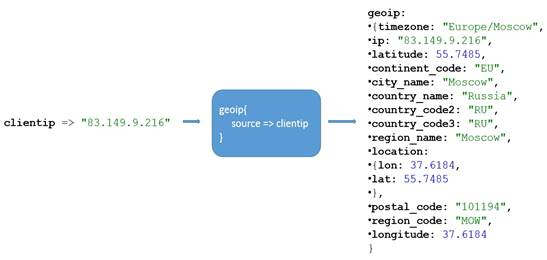
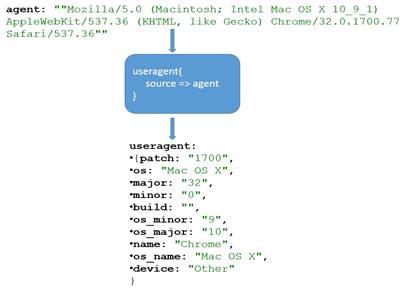
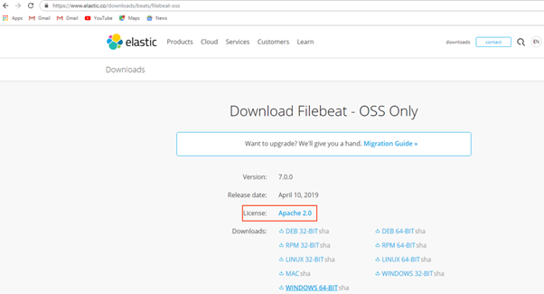
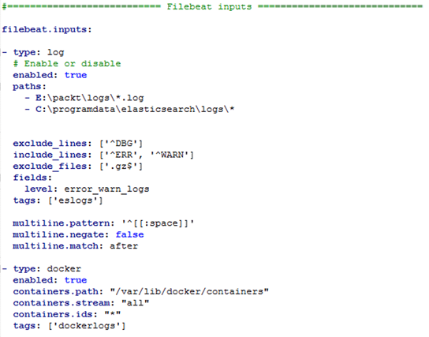

Lab 6. Building Data Pipelines with Logstash
---------------------------------------------------------


In this lab, we will be covering the following topics:


-   Parsing and enriching logs using Logstash
-   The Elastic Beats platform
-   Installing and configuring Filebeats for shipping logs


Parsing and enriching logs using Logstash
-----------------------------------------------------------


Log data is typically made up of two parts, as follows:

```
logdata = timestamp + data
```

`timestamp` is the time when the event occurred and
`data` is the information about the event.
`data` may contain just a single piece of information or it
may contain many pieces of information.


#### CSV filter 

Let\'s take some sample data and use a CSV filter to parse data out of
it. Store the following data in a file named `users.csv`:

```
FName,LName,Age,Salary,EmailId,Gender
John,Thomas,25,50000,John.Thomas,m
Raj, Kumar,30,5000,Raj.Kumar,f
Rita,Tony,27,60000,Rita.Tony,m
```

The following code block shows the usage of the CSV filter plugin. The
CSV plugin has no required parameters. It scans each row of data and
uses default column names such as `column1`,
`column2`, and so on to place the data. By default, this
plugin uses `,` (a comma) as a field separator. The default
separator can be changed by using the `separator` parameter of
the plugin. You can either specify the list of column names using the
`columns` parameter, which accepts an array of column names,
or by using the `autodetect_column_names`parameter, set to
true. In doing so, you can let the plugin know that it needs to detect column names automatically, as follows:

```
#csv_file.conf
input { 
   file{
      path => "D:\es\logs\users.csv"
      start_position => "beginning"
      }
} 

filter {
    csv{
    autodetect_column_names => true 
}
}

output { 
  stdout { 
    codec => rubydebug 
         }
}
```


#### Mutate filter


You can perform general mutations on fields using this filter. The
fields in the event can be renamed, converted, stripped, and modified.

Let\'s enhance the
`csv_file.conf` file we created in
the previous section with the `mutate` filter and understand
its usage. The following code block shows the use of the
`mutate` filter:

```
#csv_file_mutuate.conf
input { 
   file{
      path => "D:\es\logs\users.csv"
      start_position => "beginning"
      sincedb_path => "NULL"
   }

} 

filter {
  csv{
    autodetect_column_names => true 
  }

mutate {
    convert => {
        "Age" => "integer"
        "Salary" => "float"
      } 
    rename => { "FName" => "Firstname" 
                 "LName" => "Lastname" } 
    gsub => [
       "EmailId", "\.", "_"
      ]
    strip => ["Firstname", "Lastname"] 
    uppercase => [ "Gender" ]
  }
}

output { 
  stdout { 
    codec => rubydebug 
    }
}
```

As we can see, the `convert` setting within the
`filter` helps to change the datatype of a field. The valid
conversion targets are `integer`, `string`,
`float`, and `boolean`. 


#### Grok filter


This is a powerful and often used plugin for
parsing the unstructured data into structured
data, thus making the data easily queryable/filterable. In simple terms,
Grok is a way of matching a line against a pattern (which is based on a
regular expression) and mapping specific parts of the line to dedicated
fields. The general syntax of a `grok` pattern is as follows:

```
%{PATTERN:FIELDNAME}
```

`PATTERN` is the name of the pattern that will match the text.
`FIELDNAME` is the identifier for the piece of text being
matched. 

By default, groked fields are strings. To cast either to
`float` or `int` values, you can use the following
format:

```
%{PATTERN:FIELDNAME:type}
```

Logstash ships with about 120 patterns by default. These patterns are
reusable and extensible. You can create a custom pattern by combining
existing patterns. These patterns are based on the Oniguruma regular
expression library.

Patterns consist of a label and a `regex`. For example:

```
USERNAME [a-zA-Z0-9._-]+
```

Patterns can contain other patterns, too; for example:

```
HTTPDATE %{MONTHDAY}/%{MONTH}/%{YEAR}:%{TIME} %{INT}
```


### Note

The complete list of patterns can be found
at <https://github.com/logstash-plugins/logstash-patterns-core/blob/master/patterns/grok-patterns>.


If a pattern is not available, then you can use a regular expression by
using the following format:

```
(?<field_name>regex)
```

For example, `regex (?<phone>\d\d\d-\d\d\d-\d\d\d\d)` would
match telephone numbers, such as 123-123-1234, and place the parsed
value into the `phone` field.

Let\'s look at some examples to understand `grok` better:

```
#grok1.conf

input { 
   file{
      path => "D:\es\logs\msg.log"
      start_position => "beginning"
      sincedb_path => "NULL"
   }

} 

filter {
  grok{
  match => {"message" => "%{TIMESTAMP_ISO8601:eventtime} %{USERNAME:userid}  %{GREEDYDATA:data}" }
  } 
}

output { 
  stdout { 
    codec => rubydebug 
    }

} 
```

If the input line is of the
`"2017-10-11T21:50:10.000+00:00 tmi_19 001 this is a random message"` format,
then the output would be as follows:

```
{
          "path" => "D:\\es\\logs\\msg.log",
    "@timestamp" => 2017-11-24T12:30:54.039Z,
"data" => "this is a random message\r",
      "@version" => "1",
          "host" => "SHMN-IN",
"messageId" => 1,
"eventtime" => "2017-10-11T21:50:10.000+00:00",
       "message" => "2017-10-11T21:50:10.000+00:00 tmi_19 001 this is a random message\r",
"userid" => "tmi_19"
}
```


### Note

If the pattern doesn\'t match the text, it will add a
`_grokparsefailure` tag to the `tags` field.


There is a tool hosted at
[http://grokdebug.herokuapp.com](http://grokdebug.herokuapp.com/)
which helps build `grok` patterns that match the log.


### Note

X-Pack 5.5 onward contains the Grok Debugger utility and is
automatically enabled when you install X-Pack in Kibana. It is located
under the `DevTools `tab in Kibana.


#### Date filter


This plugin is used for parsing the dates
from the fields. This plugin is very handy
and useful when working with time series events. By default, Logstash
adds a `@timestamp` field for each event, representing the
time it processed the event. But the user might be interested in the
actual timestamp of the generated event rather than the processed
timestamp. So, by using this filter, you can parse the date/timestamp
from the fields and then use it as the timestamp of the event.

We can use the plugin like so:

```
filter {
    date {
    match => [ "timestamp", "dd/MMM/YYYY:HH:mm:ss Z" ]
         }
}
```

By default, the date filter overwrites the `@timestamp`
field, but this can be changed by providing an explicit target field, as
shown in the following code snippet. Thus, the user can keep the event
time processed by Logstash, too:

```
filter {
    date {
    match => [ "timestamp", "dd/MMM/YYYY:HH:mm:ss Z" ]
target => "event_timestamp"
         }
}
```


### Note

By default, the timezone will be the server local time, unless specified
otherwise. To manually specify the timezone, use the
`timezone` parameter/setting of the plugin. Valid timezone
values can be found
at [http://joda-time.sourceforge.net/timezones.html.](http://joda-time.sourceforge.net/timezones.html)


If the time field has multiple possible time formats, then those can be
specified as an array of values to the `match` parameter:

```
match => [ "eventdate", "dd/MMM/YYYY:HH:mm:ss Z", "MMM dd yyyy HH:mm:ss","MMM d yyyy HH:mm:ss", "ISO8601" ]
```


#### Geoip filter


This plugin is used to enrich the log
information. Given the IP address, it adds the geographical location of
the IP address. It finds the geographical
information by performing a lookup against the GeoLite2 City database
for valid IP addresses and populates fields with results. The GeoLite2
City database is a product of the Maxmind organization and is available
under the CCA-ShareAlike 4.0 license. Logstash comes bundled with
the GeoLite2 City database, so when performing a lookup, it doesn\'t
need to perform any network call; this is why the lookup is fast.

The only required parameter for this plugin is `source`, which
accepts an IP address in string format. This plugin creates a
`geoip` field with geographical details such as country,
postal code, region, city, and so on. A `[geoip][location]`
field is created if the GeoIP lookup returns a latitude and longitude,
and it is mapped to the `geo_point` type when indexing to
Elasticsearch. `geop_point` fields can be used for
Elasticsearch\'s geospatial query, facet, and filter functions, and can
be used to generate Kibana\'s map visualization, as shown in the
following screenshot:





### Note

The Geoip filter supports both IPv4 and IPv6 lookups.


#### Useragent filter


This filter parses user agent strings into
structured data based on BrowserScope
(<http://www.browserscope.org/>) data. It adds information about
the user agent, such as family, operating
system, version, device, and so on. To extract the user agent details,
this filter plugin makes use of the `regexes.yaml` database
that is bundled with Logstash. The only required parameter for this
plugin is the `source` parameter, which accepts strings
containing user agent details, as shown in the following screenshot:





Filebeat
--------------------------


Filebeat is an open source, lightweight log
shipping agent that is installed as an agent to ship logs from local
files. It monitors log directories, tails the files, and sends them to
Elasticsearch, Logstash, Redis, or Kafka. It allows us to send logs from
different systems to a centralized server. The logs can then be parsed
or processed from here.


### Downloading and installing Filebeat


Navigate to <https://www.elastic.co/downloads/beats/filebeat-oss> and,
depending on your operating system, download
the `.zip`/`.tar` file. The installation of Filebeat
is simple and straightforward:





#### Installing on Linux


Unzip the `tar.gz` package and
navigate to the newly created folder, as
follows:

```
$> tar -xzf filebeat-7.0.0-linux-x86_64.tar.gz
$> cd filebeat
```


### Configuring Filebeat


Configurations related to Filebeat are stored
in a configuration file named `filebeat.yml`. They use the
YAML syntax. 

The `filebeat.yml` file contains the following important
sections:


-   Filebeat inputs
-   Filebeat modules
-   Elasticsearch template settings
-   Filebeat general/global options
-   Kibana dashboard settings
-   Output configuration 
-   Processors configuration 
-   Logging configuration


### Note

The `filebeat.yml` file will be present in the installation
directory if `.zip` or `.tar` files are used. If
`dep` or `rpm` is used for installation, then it
will be present in the `/etc/filebeat` location.


Some of these sections are common for all
type of Beats. Before we look into some of these, let\'s see what a
simple configuration would look like. As we can see in the following
configuration, when Filebeat is started, it looks for files ending with
the `.log` extension in the `E:\fenago\logs\` path.
It ships the log entries of each file to Elasticsearch, which is
configured as the output, and is hosted at `localhost:9200`:

```
#filebeat.yml
#=========================== Filebeat inputs =============================

filebeat.inputs:

- type: log

  # Change to true to enable this input configuration.
  enabled: true

  # Paths that should be crawled and fetched. Glob based paths.
  paths:
    - E:\fenago\logs\*.log

#================================ Outputs =====================================

#-------------------------- Elasticsearch output ------------------------------
output.elasticsearch:
 # Array of hosts to connect to.
 hosts: ["localhost:9200"]
```


### Note

Any changes made to `filebeat.yml` require restarting Filebeat
to pick up the changes.


Place some log files in `E:\fenago\logs\`. To get Filebeat to
ship the logs, execute the following command:

```
Windows:
E:\>filebeat-7.0.0-windows-x86_64>filebeat.exe

Linux:
[locationOfFilebeat]$ ./filebeat
```


### Note

To run the preceding example, please replace the content of the default
`filebeat.yml` file with the configuration provided in the
preceding snippet.


To validate whether the logs were shipped to
Elasticsearch, execute the following command:

```
E:\>curl -X GET http://localhost:9200/filebeat*/_search?pretty

Sample Response:
{
  "took" : 2,
  "timed_out" : false,
  "_shards" : {
    "total" : 1,
    "successful" : 1,
    "skipped" : 0,
    "failed" : 0
  },
  "hits" : {
    "total" : {
      "value" : 3,
      "relation" : "eq"
    },
    "max_score" : 1.0,
    "hits" : [
      {
        "_index" : "filebeat-7.0.0-2019.04.22",
        "_type" : "_doc",
        "_id" : "bPnZQ2oB_501XGfHmzJg",
        "_score" : 1.0,
        "_source" : {
          "@timestamp" : "2019-04-22T07:01:30.820Z",
          "ecs" : {
            "version" : "1.0.0"
          },
          "host" : {
            "id" : "254667db-4667-46f9-8cf5-0d52ccf2beb9",
            "name" : "madsh01-I21350",
            "hostname" : "madsh01-I21350",
            "architecture" : "x86_64",
            "os" : {
              "platform" : "windows",
              "version" : "6.1",
              "family" : "windows",
              "name" : "Windows 7 Enterprise",
              "kernel" : "6.1.7601.24408 (win7sp1_ldr_escrow.190320-1700)",
              "build" : "7601.24411"
            }
          },
          "agent" : {
            "type" : "filebeat",
            "ephemeral_id" : "d2ef4b77-3c46-4af4-85b4-e9f690ce00f1",
            "hostname" : "madsh01-I21350",
            "id" : "29600459-f3ca-4516-8dc4-8a0fd1bd6b0f",
            "version" : "7.0.0"
          },
          "log" : {
            "offset" : 0,
            "file" : {
              "path" : "E:\\fenago\\logs\\one.log"
            }
          },
          "message" : "exception at line1",
          "input" : {
            "type" : "log"
          }
        }
      },
    ...
    ...
    ...
```

 


### Note

Filebeat places the shipped logs under an `filebeat` index,
which is a time-based index based on
the `filebeat-YYYY.MM.DD` pattern. The log data would be
placed in the `message` field.


#### Filebeat inputs


This section will show you how to configure Filebeat manually instead of
using out-of-the-box preconfigured modules for shipping
files/logs/events. This section contains a list of inputs that
Filebeat uses to locate and process log
files. Each input item begins with a dash (`-`) and
contains input-specific configuration options to define the behavior of
the input.

A sample configuration is as follows:





#### Filebeat general/global options


This section contains configuration options and some general/global settings to control the behavior of
Filebeat. 

Some of these configuration options are as follows:


-   `registry_file`: It is used to specify the location of the
    registry file, which is used to maintain information about files,
    such as the last offset read and whether the read lines are
    acknowledged by the configured outputs or not. The default location
    of the registry is `${path.data}/registry`:


```
filebeat.registry_file: /etc/filebeat/registry
```


### Note

You can specify a relative path or an absolute path as a value for this
setting. If a relative path is specified, it is considered relative to
the `${path.data}` setting.


-   `shutdown_timeout`: This setting specifies how long
    Filebeat waits on shutdown for the publisher to finish. This ensures
    that if there is a sudden shutdown while `filebeat` is in
    the middle of sending events, it won\'t wait for the
    output to acknowledge all events before
    it shuts down. Hence, the `filebeat` waits for a certain
    time before it actually shuts down:


```
filebeat.shutdown_timeout: 10s
```


-   `registry_flush`: This setting specifies the time interval
    when registry entries are to be flushed to the disk:


```
filebeat.registry_flush: 5s
```


-   `name`: The name of the shipper that publishes the network
    data. By default, `hostname` is used for this field:


```
name: "dc1-host1"
```


-   `tags`: The list of tags that will be included in the
    `tags` field of every event Filebeat ships. Tags make it
    easy to group servers by different logical properties and aids
    filtering of events in Kibana and Logstash:


```
tags: ["staging", "web-tier","dc1"]
```


-   `max_procs`: The maximum number of CPUs that can be
    executed simultaneously. The default is the number of logical CPUs
    available in the system:


```
max_procs: 2
```


#### Output configuration 


This section is used to configure outputs where events need to be shipped. Events can be sent to single or
multiple outputs simultaneously. The allowed outputs are Elasticsearch,
Logstash, Kafka, Redis, file, and console.

Some outputs that can be configured are as follows:


-   `elasticsearch`: It is used to send the events directly to
    Elasticsearch. 


A sample Elasticsearch output configuration is as follows:

```
output.elasticsearch:
  enabled: true  
  hosts: ["localhost:9200"]
```

By using the `enabled` setting, you can enable or disable the
output. `hosts` accepts one or more Elasticsearch
nodes/servers. Multiple hosts can be defined for failover purposes. When
multiple hosts are configured, the events are distributed to these nodes
in round-robin order. If Elasticsearch is secure, then the credentials
can be passed using the `username` and
`password` settings:

```
output.elasticsearch:
  enabled: true  
  hosts: ["localhost:9200"]
  username: "elasticuser"
  password: "password"
```

To ship an event to the Elasticsearch ingest
node pipeline so that it can be preprocessed before it is stored in
Elasticsearch, the pipeline information can be provided using the
`pipleline` setting:

```
output.elasticsearch:
  enabled: true  
  hosts: ["localhost:9200"]
  pipeline: "apache_log_pipeline"
```


-   `logstash`: This is used to send events to Logstash.


### Note

To use Logstash as output, Logstash needs to be configured with the
Beats input plugin to receive incoming Beats events.


A sample Logstash output configuration is as follows:

```
output.logstash:
  enabled: true  
  hosts: ["localhost:5044"]
```

By using the `enabled` setting, you can enable or disable the
output. `hosts` accepts one or more Logstash servers. Multiple
hosts can be defined for failover purposes. If the configured host is
unresponsive, then the event will be sent to one of the other configured
hosts. When multiple hosts are configured, the events are distributed in
a random order. To enable load balancing of events across the Logstash
hosts, use the `loadbalance` flag, set
to `true`:

```
output.logstash:
hosts: ["localhost:5045", "localhost:5046"]
  loadbalance: true
```


-   `console`: This is used to send the events to
    `stdout`. The events are written in JSON format. It is
    useful during debugging or testing.


A sample console configuration is as follows:

```
output.console:
  enabled: true
pretty: true
```


#### Logging


This section contains the options for configuring the Filebeat logging
output. The logging system can write logs to `syslog` or
`rotate log` files. If logging is not explicitly configured,
file output is used on Windows systems, and
`syslog` output is used on Linux and OS X.

A sample configuration is as follows:

```
logging.level: debug
logging.to_files: true
logging.files:
 path: C:\logs\filebeat
 name: metricbeat.log 
 keepfiles: 10
```

Some available configuration options are as follows:


-   `level`: To specify the logging level.
-   `to_files`: To write all logging output to files. The
    files are subject to file rotation. This is the default value.
-   `to_syslog`: To write the logging output to
    `syslogs` if this setting is set to `true`.


-   `files.path`, `files.name`,
    and `files.keepfiles`: These are used to
    specify the location of the file, the name of the file, and the
    number of most recently rotated log files to keep on the disk,
    respectively.


#### Filebeat modules


Filebeat modules simplify the process of
collecting, parsing, and visualizing logs of common formats. 

A module is made up of one or more filesets. A fileset is made up of the
following:


-   Filebeat input configurations that contain the default paths
    needed to look out for logs. It also provides configuration for
    combining multiline events when needed.
-   An Elasticsearch Ingest pipeline definition to parse and enrich
    logs. 
-   Elasticsearch templates, which define the field definitions so that
    appropriate mappings are set to the fields of the events.
-   Sample Kibana dashboards, which can be used for visualizing logs.


### Note

Filebeat modules require the Elasticsearch Ingest node. The version of
Elasticsearch should be greater that 5.2.


Some of the modules that are shipped with Filebeat are as follows:


-   Apache module
-   Auditd module
-   Elasticsearch module
-   Haproxy module
-   IIS module
-   Kafka module
-   MongoDB module
-   MySQL module
-   Nginx module
-   PostgreSQL module
-   Redis module


The`modules.d` directory contains the default configurations for all the modules that are available in
Filebeat. Any configuration that\'s specific to a module is stored in
a`.yml` file, with the name of the file being the name of the
module. For example, the configuration related to the `redis`
module would be stored in the `redis.yml` file.

Since each module comes with the default configuration, make the
appropriate changes in the module configuration file.

The basic configuration for the `redis` module is as follows:

```
#redis.yml
- module: redis
  # Main logs
  log:
    enabled: true

    # Set custom paths for the log files. If left empty,
    # Filebeat will choose the paths depending on your OS.
    #var.paths: ["/var/log/redis/redis-server.log*"]

  # Slow logs, retrieved via the Redis API (SLOWLOG)
  slowlog:
    enabled: true

    # The Redis hosts to connect to.
    #var.hosts: ["localhost:6379"]

    # Optional, the password to use when connecting to Redis.
    #var.password:
```

To enable modules, execute the `modules enable` command,
passing one or more module names:

```
Windows:
E:\filebeat-7.0.0-windows-x86_64>filebeat.exe modules enable redis mysql

Linux:
[locationOfFileBeat]$./filebeat modules enable redis mysql
```


### Note

If a module is disabled, then in the `modules.d` directory the
configuration related to the module will be stored
with `.disabled` extension.


To disable modules, execute
the `modules disable` command, passing one or more module
names to it. For example:

```
Windows:
E:\filebeat-7.0.0-windows-x86_64>filebeat.exe modules disable redis mysql

Linux:
[locationOfFileBeat]$./filebeat modules disable redis mysql
```

Once the module is enabled, to load the recommended index template for
writing to Elasticsearch, and to deploy sample dashboards for
visualizing data in Kibana, execute the`setup` command, as
follows:

```

Linux:
[locationOfFileBeat]$./filebeat -e setup 
```

The `-e` flag specifies logging the output to
`stdout`. Once the modules are enabled and the
`setup` command is run, to load index templates and sample
dashboards, start Filebeat as usual so that it can start shipping logs
to Elasticsearch.


### Note

The `setup` command has to be executed while installating or
upgrading Filebeat, or after a new module is enabled.

Most modules have dependency plugins such as `ingest-geoip`
and `ingest-user-agent`, which need to be installed on
Elasticsearch prior to setting up the modules, otherwise the setup will
fail.


Rather than enabling the modules by passing them as command-line
parameters, you can enable the modules in
the `filebeat.yml` configuration file itself, and start
Filebeat as usual:

```
filebeat.modules:
-module: nginx
-module: mysql
```

Each of the modules has associated filesets which contain certain
variables that can be overridden either using the configuration file or
by passing it as a command-line parameter using the `-M` flag
when running Filebeat.

For the configuration file, use the following code:

```
filebeat.modules:
-module: nginx
  access:
    var.paths: ["C:\ngnix\access.log*"]
```

For the command line, use the following code:

```
Linux:
[locationOfFileBeat]$./filebeat-e-modules=nginx-M"nginx.access.var.paths=[\var\ngnix\access.log*]"
```


Summary
-------------------------


In this lab, we covered the powerful filter section of Logstash,
which can be used for parsing and enriching log events. We have also
covered some commonly used filter plugins. Then, we covered the Beats
framework and took an overview of various Beats, including Filebeat,
Heartbeat, Packetbeat, and so on, covering Filebeat in detail.

In the next lab, we will be covering the various features of X-Pack,
a commercial offering by Elastic.co which contains features such as
securing the Elastic Stack, as well as monitoring, alerting, graphs, and
reporting.
