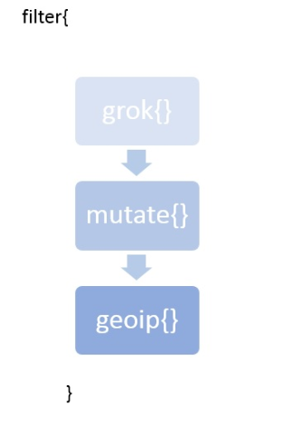
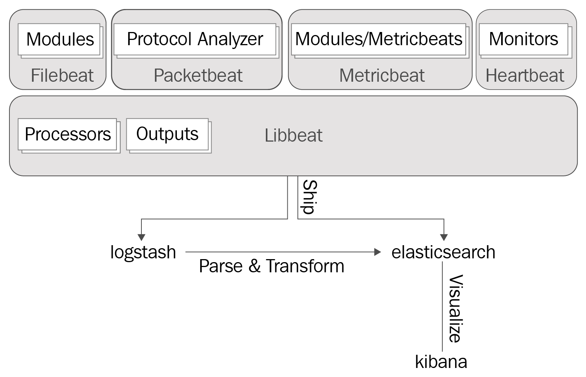
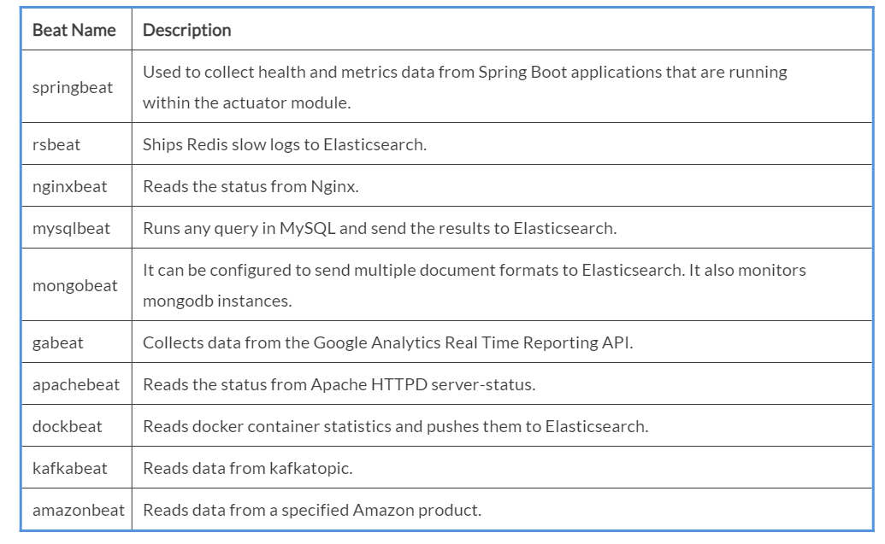
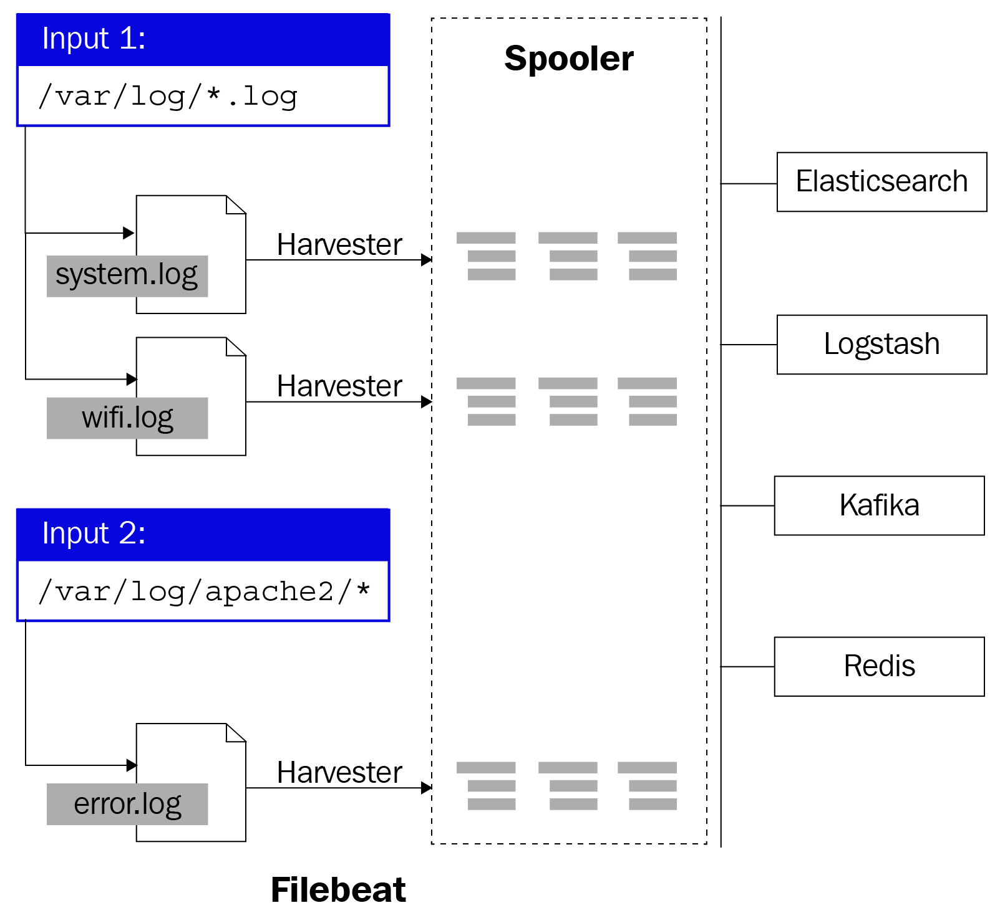

Lab 6. Building Data Pipelines with Logstash
---------------------------------------------------------


In this lab, we will be covering the following topics:


-   Parsing and enriching logs using Logstash
-   The Elastic Beats platform
-   Installing and configuring Filebeats for shipping logs


Parsing and enriching logs using Logstash
-----------------------------------------------------------


The analysis of structured data is easier
and helps us find meaningful/deeper analysis,
rather than trying to perform analysis on unstructured data. Most
analysis tools depend on structured data. Kibana, which we will be
making use of for analysis and visualization,
can be used effectively if the data in Elasticsearch is right (the
information in the log data is loaded into
appropriate fields, and the datatypes of the fields are more appropriate
than just having all the values of the log data in a single field). 

Log data is typically made up of two parts, as follows:

```
logdata = timestamp + data
```

`timestamp` is the time when the event occurred and
`data` is the information about the event.
`data` may contain just a single piece of information or it
may contain many pieces of information. For example, if we take
`apache-access` logs, the data piece will contain the response
code, request URL, IP address, and so on. We would need to have a
mechanism for extracting this information from the data and thus
converting the unstructured data/event into a structured data/event.
This is where the filter section of the Logstash pipeline comes in
handy. The filter section is made up of one or more filter plugins that
assist in parsing and enriching the log data.


### Filter plugins


A filter plugin is used to perform transformations on data. It allows us
to combine one or more plugins, and the order of the
plugins defines the order in which the data
is transformed. A sample filter section in a Logstash pipeline would
look as follows:





The generated event from the input plugin goes through each of the
plugins defined in the filter section, during which it transforms the
event based on the plugins defined. Finally, it is sent to the output
plugin to send the event to the appropriate destination.

In the following sections, we will explore some common filter plugins
that are used for transformation.


#### CSV filter 


This filter is useful for parsing
`.csv` files. This plugin takes an
event containing CSV data, parses it, and stores it as individual
fields.

Let\'s take some sample data and use a CSV filter to parse data out of
it. Store the following data in a file named `users.csv`:

```
FName,LName,Age,Salary,EmailId,Gender
John,Thomas,25,50000,John.Thomas,m
Raj, Kumar,30,5000,Raj.Kumar,f
Rita,Tony,27,60000,Rita.Tony,m
```

The following code block shows the usage of the CSV filter plugin. The
CSV plugin has no required parameters. It scans each row of data and
uses default column names such as `column1`,
`column2`, and so on to place the data. By default, this
plugin uses `,` (a comma) as a field separator. The default
separator can be changed by using the `separator` parameter of
the plugin. You can either specify the list of column names using the
`columns` parameter, which accepts an array of column names,
or by using the `autodetect_column_names`parameter, set to
true. In doing so, you can let the plugin know that it needs to detect column names automatically, as follows:

```
#csv_file.conf
input { 
   file{
      path => "D:\es\logs\users.csv"
      start_position => "beginning"
      }
} 

filter {
    csv{
    autodetect_column_names => true 
}
}

output { 
  stdout { 
    codec => rubydebug 
         }
}
```


#### Mutate filter


You can perform general mutations on fields using this filter. The
fields in the event can be renamed, converted, stripped, and modified.

Let\'s enhance the
`csv_file.conf` file we created in
the previous section with the `mutate` filter and understand
its usage. The following code block shows the use of the
`mutate` filter:

```
#csv_file_mutuate.conf
input { 
   file{
      path => "D:\es\logs\users.csv"
      start_position => "beginning"
      sincedb_path => "NULL"
   }

} 

filter {
  csv{
    autodetect_column_names => true 
  }

mutate {
    convert => {
        "Age" => "integer"
        "Salary" => "float"
      } 
    rename => { "FName" => "Firstname" 
                 "LName" => "Lastname" } 
    gsub => [
       "EmailId", "\.", "_"
      ]
    strip => ["Firstname", "Lastname"] 
    uppercase => [ "Gender" ]
  }
}

output { 
  stdout { 
    codec => rubydebug 
    }
}
```

As we can see, the `convert` setting within the
`filter` helps to change the datatype of a field. The valid
conversion targets are `integer`, `string`,
`float`, and `boolean`. 


### Note

If the conversion type is `boolean`, these are the possible
values:**True**: true, t, yes, y, and 1.**False**:
false, f, no, n, and 0.


The `rename` setting within the `filter` helps
rename one or more fields. The preceding example renames the
`FName` field to `Firstname` and
`LName` to `Lastname`.

`gsub` matches a regular expression against a field value and
replaces all matches with a replacement string. Since regular
expressions work only on strings, this field can only take a field
containing a string or an array of strings. It takes an array consisting
of three elements per substitution (that is, it takes the field
name,`regex`, and the replacement string). In the preceding
example, `.` in the `EmailId` field is replaced with
`_`.


### Note

Make sure to escape special characters such as `\`,
`.`, `+`, and `?` when building
`regex`.


`strip` is used to strip the leading and training white
spaces. 


### Note

The order of the settings within the `mutate` filter matters.
The fields are mutated in the order the settings are defined. For
example, since the `FName` and `LName` fields in the
incoming event were renamed to `Firstname` and
`Lastname` using the `rename` setting, other
settings can no longer refer to `FName` and `LName`.
Instead, they have to use the newly renamed fields.


`uppercase` is used to convert the
string into upper case. In the preceding example, the value in the `Gender` field is
converted into upper case.

Similarly, by using various settings of the `mutate` filter,
such as `lowercase`, `update`, `replace`,
`join`, and `merge`, you can lower-case a string,
update an exiting field, replace the value of a field, join an array of
values, or merge fields. 

#### Grok filter


This is a powerful and often used plugin for
parsing the unstructured data into structured
data, thus making the data easily queryable/filterable. In simple terms,
Grok is a way of matching a line against a pattern (which is based on a
regular expression) and mapping specific parts of the line to dedicated
fields. The general syntax of a `grok` pattern is as follows:

```
%{PATTERN:FIELDNAME}
```

`PATTERN` is the name of the pattern that will match the text.
`FIELDNAME` is the identifier for the piece of text being
matched. 

By default, groked fields are strings. To cast either to
`float` or `int` values, you can use the following
format:

```
%{PATTERN:FIELDNAME:type}
```

Logstash ships with about 120 patterns by default. These patterns are
reusable and extensible. You can create a custom pattern by combining
existing patterns. These patterns are based on the Oniguruma regular
expression library.

Patterns consist of a label and a `regex`. For example:

```
USERNAME [a-zA-Z0-9._-]+
```

Patterns can contain other patterns, too; for example:

```
HTTPDATE %{MONTHDAY}/%{MONTH}/%{YEAR}:%{TIME} %{INT}
```


### Note

The complete list of patterns can be found
at <https://github.com/logstash-plugins/logstash-patterns-core/blob/master/patterns/grok-patterns>.


If a pattern is not available, then you can use a regular expression by
using the following format:

```
(?<field_name>regex)
```

For example, `regex (?<phone>\d\d\d-\d\d\d-\d\d\d\d)` would
match telephone numbers, such as 123-123-1234, and place the parsed
value into the `phone` field.

Let\'s look at some examples to understand `grok` better:

```
#grok1.conf

input { 
   file{
      path => "D:\es\logs\msg.log"
      start_position => "beginning"
      sincedb_path => "NULL"
   }

} 

filter {
  grok{
  match => {"message" => "%{TIMESTAMP_ISO8601:eventtime} %{USERNAME:userid}  %{GREEDYDATA:data}" }
  } 
}

output { 
  stdout { 
    codec => rubydebug 
    }

} 
```

If the input line is of the
`"2017-10-11T21:50:10.000+00:00 tmi_19 001 this is a random message"` format,
then the output would be as follows:

```
{
          "path" => "D:\\es\\logs\\msg.log",
    "@timestamp" => 2017-11-24T12:30:54.039Z,
"data" => "this is a random message\r",
      "@version" => "1",
          "host" => "SHMN-IN",
"messageId" => 1,
"eventtime" => "2017-10-11T21:50:10.000+00:00",
       "message" => "2017-10-11T21:50:10.000+00:00 tmi_19 001 this is a random message\r",
"userid" => "tmi_19"
}
```


### Note

If the pattern doesn\'t match the text, it will add a
`_grokparsefailure` tag to the `tags` field.


There is a tool hosted at
[http://grokdebug.herokuapp.com](http://grokdebug.herokuapp.com/)
which helps build `grok` patterns that match the log.


### Note

X-Pack 5.5 onward contains the Grok Debugger utility and is
automatically enabled when you install X-Pack in Kibana. It is located
under the `DevTools `tab in Kibana.


#### Date filter


This plugin is used for parsing the dates
from the fields. This plugin is very handy
and useful when working with time series events. By default, Logstash
adds a `@timestamp` field for each event, representing the
time it processed the event. But the user might be interested in the
actual timestamp of the generated event rather than the processed
timestamp. So, by using this filter, you can parse the date/timestamp
from the fields and then use it as the timestamp of the event.

We can use the plugin like so:

```
filter {
    date {
    match => [ "timestamp", "dd/MMM/YYYY:HH:mm:ss Z" ]
         }
}
```

By default, the date filter overwrites the `@timestamp`
field, but this can be changed by providing an explicit target field, as
shown in the following code snippet. Thus, the user can keep the event
time processed by Logstash, too:

```
filter {
    date {
    match => [ "timestamp", "dd/MMM/YYYY:HH:mm:ss Z" ]
target => "event_timestamp"
         }
}
```


### Note

By default, the timezone will be the server local time, unless specified
otherwise. To manually specify the timezone, use the
`timezone` parameter/setting of the plugin. Valid timezone
values can be found
at [http://joda-time.sourceforge.net/timezones.html.](http://joda-time.sourceforge.net/timezones.html)


If the time field has multiple possible time formats, then those can be
specified as an array of values to the `match` parameter:

```
match => [ "eventdate", "dd/MMM/YYYY:HH:mm:ss Z", "MMM dd yyyy HH:mm:ss","MMM d yyyy HH:mm:ss", "ISO8601" ]
```


#### Geoip filter


This plugin is used to enrich the log
information. Given the IP address, it adds the geographical location of
the IP address. It finds the geographical
information by performing a lookup against the GeoLite2 City database
for valid IP addresses and populates fields with results. The GeoLite2
City database is a product of the Maxmind organization and is available
under the CCA-ShareAlike 4.0 license. Logstash comes bundled with
the GeoLite2 City database, so when performing a lookup, it doesn\'t
need to perform any network call; this is why the lookup is fast.

The only required parameter for this plugin is `source`, which
accepts an IP address in string format. This plugin creates a
`geoip` field with geographical details such as country,
postal code, region, city, and so on. A `[geoip][location]`
field is created if the GeoIP lookup returns a latitude and longitude,
and it is mapped to the `geo_point` type when indexing to
Elasticsearch. `geop_point` fields can be used for
Elasticsearch\'s geospatial query, facet, and filter functions, and can
be used to generate Kibana\'s map visualization, as shown in the
following screenshot:


### Note

The Geoip filter supports both IPv4 and IPv6 lookups.


#### Useragent filter


This filter parses user agent strings into
structured data based on BrowserScope
(<http://www.browserscope.org/>) data. It adds information about
the user agent, such as family, operating
system, version, device, and so on. To extract the user agent details,
this filter plugin makes use of the `regexes.yaml` database
that is bundled with Logstash. The only required parameter for this
plugin is the `source` parameter, which accepts strings
containing user agent details, as shown in the following screenshot:


Introducing Beats
-----------------------------------


**Beats** are lightweight data shippers that are installed as agents on edge servers to ship operational
data to Elasticsearch. Just like Elasticsearch, Logstash, Kibana, and
Beats are open source products too. Depending on the use case, Beats can
be configured to ship the data to Logstash to transform events prior to
pushing the events to Elasticsearch. 

The Beats framework is made up of a library called `libbeat`,
which provides an infrastructure to simplify the process of shipping
operation data to Elasticsearch. It offers the API that all Beats can
use to ship data to an output (such as Elasticsearch, Logstash, Redis,
Kafka, and so on), configure the input/output options, process events,
implement logging, and more. The `libbeat` library is built
using the Go programming language. Go was chosen to build Beats because
it\'s easy to learn, very resource-friendly, and, since it\'s statically
compiled, it\'s easy to deploy.

Elastic.co has built and maintained several Beats, such as Filebeat,
Packetbeat, Metricbeat, Heartbeat, and Winlogbeat. There are several
community Beats, including amazonbeat, mongobeat, httpbeat, and
nginxbeat, which have been built into the Beats framework by the open
source community. Some of these Beats can be extended to meet business
needs, as some of them provide extension points. If a Beat for your
specific use case is not available, then custom Beats can be easily
built with the `libbeat` library:




### Beats by Elastic.co


Let\'s take a look at some used Beats
commonly used by Elastic.co in the following sections.


#### Filebeat


Filebeat is an open source, lightweight log shipping
agent that ships logs from local files.
Filebeat runs as a binary and no runtime, such as JVM, is needed, hence
it\'s very lightweight, executable, and also
consumes fewer resources. It is installed as an agent on the edge
servers from where the logs need to be shipped. It is used to monitor
log directories, tail the files, and send them to Elasticsearch,
Logstash, Redis, or Kafka. It is easily scalable and allows us to send
logs from different systems to a centralized server, where the logs can
then be parsed and processed. 

#### Metricbeat


Metricbeat is a lightweight shipper that
periodically collects metrics from the
operating system and from services running on the server. It helps
you monitor servers by collecting metrics from the system and services
such as Apache, MondoDB, Redis, and so on, that are running on the
server. Metricbeat can push collected metrics directly into
Elasticsearch or send them to Logstash, Redis, or Kafka. To monitor
services, Metricbeat can be installed on the edge server where services
are running; it provides you with the ability to collect metrics from a
remote server as well. However, it\'s recommended to have it installed
on the edge servers where the services are running. 

#### Packetbeat


Packetbeat captures the network traffic
between applications and servers. It is a packet analyzer that works in
real-time. It does tasks such as decoding the application
layer protocols, namely HTTP, MySQL,
Memcache, and Redis. It also correlates the requests to responses and
records the different transaction fields that may interest you.
Packetbeat is used to sniff the traffic between different servers and
parses the application-level protocol; it also converts messages into
transactions. It also notices issues with the backend application, such
as bugs or other performance-related problems, and so it makes
troubleshooting tasks easy. Packetbeat can run on the same server which
contains application processes, or on its own servers. Packetbeat ships
the collected transaction details to the configured output, such
as Elasticsearch, Logstash, Redis, or Kafka. 

#### Heartbeat


Heatbeat is a new addition to the Beat
ecosystem and is used to check if a service
is up or not, and if the services are reachable. Heartbeat is a
lightweight daemon that is installed on a remote server to periodically
check the status of services running on the host. Heartbeat supports
ICMP, TCP, and HTTP monitors for checking hosts/services.

#### Winlogbeat


Winlogbeat is a Beat dedicated to the Windows
platform. Winlogbeat is installed as a
Windows service on Windows XP or later versions. It reads from
many event logs using Windows APIs. It can also filter events on the
basis of user-configured criteria. After this, it sends the event data
to the configured output, such as Elasticsearch or Logstash. Basically,
Winlogbeat captures event data such as application events, hardware
events, security events, and system events.

#### Auditbeat


Auditbeat is a new addition to the Beats
family, and was first implemented in the Elastic Stack 6.0. Auditbeat is
a lightweight shipper that is installed on servers in order to monitor user activity. It analyzes and processes
event data in the Elastic Stack without using Linux\'s auditd. It works
by directly communicating with the Linux audit framework and collects
the same data that the auditd collects. It also does the job of sending
events to the Elastic Stack in real time. By using auditbeat, you can
watch the list of directories and identify whether there were any
changes as file changes are sent to the configured output in real time.
This helps us identify various security policy violations.

#### Journalbeat


Journalbeat is one of the latest additions to the Beats family, starting with Elastic Stack 6.5. Journalbeat is a
lightweight shipper that is installed as
agents on servers to collect and ship systemd journals to either
Elasticsearch or Logsatsh. Journalbeat requires systemd v233 or later to
function properly.

#### Functionbeat


As lot of organizations are adopting
serverless computing. Functionbeat is one of
the latest additions to the Beats family, starting with the Elastic
Stack 6.5, and is used to collect events on serverless environments and
ship these events to Elasticsearch. At the time of writing, these events
can only be sent to Elasticsearch. 

 


### Community Beats


These are Beats that are developed by the
open source community using the Beats
framework. Some of these open source Beats are as follows:



 
A complete list of community Beats can be
found
at <https://www.elastic.co/guide/en/beats/devguide/current/community-beats.html>.


### Note

Elastic.co doesn\'t support or provide warranties for community Beats.
The Beats Developer guide provides the necessary information to create a
custom Beat. The developer guide can be found
at <https://www.elastic.co/guide/en/beats/devguide/current/index.html>.


### Logstash versus Beats


After reading through the Logstash and Beats introduction, you might
be confused as to whether Beats is a replacement for Logstash, the
difference between them, or when to use one over the other. Beats are lightweight agents and consume fewer
resources, and hence are installed on the edge servers where the
operational data needs to be collected and shipped. Beats lack the
powerful features of Logstash for parsing and
transforming events. Logstash has many options in terms of inputs,
filters, and output plugins for collecting, enriching, and transforming
data. However, it is very resource-intensive and can also be used as an
independent product outside of the Elastic Stack. Logstash is
recommended to be installed on a dedicated server rather than edge
servers, and listens for incoming events for processing. Beats and
Logstash are complementary products, and depending on the use case, both
of them can be used or just one of them can be used, as described in the
[*Introducing*] [*Beats*]  section.


Filebeat
--------------------------


Filebeat is an open source, lightweight log
shipping agent that is installed as an agent to ship logs from local
files. It monitors log directories, tails the files, and sends them to
Elasticsearch, Logstash, Redis, or Kafka. It allows us to send logs from
different systems to a centralized server. The logs can then be parsed
or processed from here.


### Downloading and installing Filebeat


Navigate to <https://www.elastic.co/downloads/beats/filebeat-oss> and,
depending on your operating system, download
the `.zip`/`.tar` file. The installation of Filebeat
is simple and straightforward:


### Note

In this course, we will be using the Apache 2.0 version of Beats. Beats
version 7.0.x is compatible with Elasticsearch 6.7.x and 7.0.x, and
Logstash 6.7.x and 7.0.x. The compatibility matrix can be found
at <https://www.elastic.co/support/matrix#matrix_compatibility>. When
you come across Elasticsearch and Logstash examples with Beats in this
lab, make sure that you have compatible versions of Elasticsearch
and Logstash installed. 

#### Installing on Windows


Unzip the downloaded file and navigate to
the extracted location, as follows:

```
E:> cd E:\filebeat-7.0.0-windows-x86_64
```

To install Filebeat as a service on Windows, refer to the following
steps:


1.  Open Windows PowerShell as an administrator and navigate to the
    extracted location.
2.  Run the following commands from the PowerShell prompt to install
    Filebeat as a Windows service:


```
PS >cd E:\filebeat-7.0.0-windows-x86_64
 PS E:\filebeat-7.0.0-windows-x86_64>.\install-service-filebeat.ps1
```

In the event script execution is disabled on your system, you will have
to set the execution policy for the current session:

```
 PowerShell.exe -ExecutionPolicy UnRestricted -File .\install-service-filebeat.ps1
```


#### Installing on Linux


Unzip the `tar.gz` package and
navigate to the newly created folder, as
follows:

```
$> tar -xzf filebeat-7.0.0-linux-x86_64.tar.gz
$> cd filebeat
```

To install using `dep` or `rpm`, execute the
appropriate commands in the Terminal:

`deb`:

```
curl -L -O https://artifacts.elastic.co/downloads/beats/filebeat/filebeat-7.0.0-amd64.deb
sudo dpkg -i filebeat-7.0.0-amd64.deb
```

`rpm`:

```
curl -L -O https://artifacts.elastic.co/downloads/beats/filebeat/filebeat-7.0.0-x86_64.rpm
sudo rpm -vi filebeat-7.0.0-x86_64.rpm
```

Filebeat will be installed in the `/usr/share/filebeat`
directory. The configuration files will be present
in `/etc/filebeat`. The `init` script will be
present in `/etc/init.d/filebeat`. The `log` files
will be present within the `/var/log/filebeat` directory.


### Architecture


Filebeat is made up of key components called **inputs**,
**harvesters**, and **spoolers**. These
components work in unison in order to tail
files and allow you to send event data to the specified output. The
input is responsible for identifying the list of files to read logs
from. The input is configured with one or
many file paths, from which it identifies the
files to read logs from; it starts a harvester for each file. The harvester reads the contents of the file.
In order to send the content to the output, it reads each file, line by
line. It also opens and closes the file, This implies that the
descriptor is always open when the harvester runs. Once the harvester
starts for one file, it sends the read content -- also known as the
events -- to the spooler. The spooler aggregates the events to the
configured outputs.

Each instance of Filebeat can be configured with one or more inputs. As
of Filebeat 6.0, there are two types of input the Filebeat supports,
that is, `log` and `stdin`. Later versions of
Filebeats started supporting multiple types of input. As of Filebeat
7.0, the list of inputs that are supported is: Log, Stdin, Redis, UDP,
Docker, TCP, Syslog, and NetFlow. For example, if the log is the input
file, then the input finds all the related files on the drive that match
the predefined glob paths, and then the harvester is started for every
file. Every input uses its own Go routine to run. If the type is
`stdin`, it reads from standard inputs and if the input type
is UDP/TCP, it reads/captures events over UDP/TCP.

Every time Filebeat reads a file, the state of the last read is offset
by the harvester, and if the read line is sent to the output, it is
maintained in a registry file which is flushed periodically to a disk.
If the output (Elasticsearch, Logstash, Kafka, or Redis) is unreachable,
it keeps track of the lines that were sent last and continues to read
the file after the output becomes reachable. This is done by keeping the
state information in memory by each input when the Filebeat is running.
If the Filebeat restarts, the state is built by referring to the
registry file. 

Filebeat will not consider a log line shipped until the output
acknowledges the request. Since the state of the delivery of the lines
to the configured output is maintained in the `registry` file,
you can safely assume that events will be delivered to the configured
outputs at least once and without any data loss:





(Reference: <https://www.elastic.co/guide/en/beats/filebeat/7.0/images/filebeat.png>)


### Note

The location of `registry-js` is as follows:
`data/registry` for `.tar.gz` and
`.zip` archives, `/var/lib/filebeat/registry` for
DEB and RPM packages,
and `C:\ProgramData\filebeat\registry` for the Windows
`.zip` file (if Filebeat is installed as a service).


### Configuring Filebeat


Configurations related to Filebeat are stored
in a configuration file named `filebeat.yml`. They use the
YAML syntax. 

The `filebeat.yml` file contains the following important
sections:


-   Filebeat inputs
-   Filebeat modules
-   Elasticsearch template settings
-   Filebeat general/global options
-   Kibana dashboard settings
-   Output configuration 
-   Processors configuration 
-   Logging configuration


### Note

The `filebeat.yml` file will be present in the installation
directory if `.zip` or `.tar` files are used. If
`dep` or `rpm` is used for installation, then it
will be present in the `/etc/filebeat` location.


Some of these sections are common for all
type of Beats. Before we look into some of these, let\'s see what a
simple configuration would look like. As we can see in the following
configuration, when Filebeat is started, it looks for files ending with
the `.log` extension in the `E:\fenago\logs\` path.
It ships the log entries of each file to Elasticsearch, which is
configured as the output, and is hosted at `localhost:9200`:

```
#filebeat.yml
#=========================== Filebeat inputs =============================

filebeat.inputs:

- type: log

  # Change to true to enable this input configuration.
  enabled: true

  # Paths that should be crawled and fetched. Glob based paths.
  paths:
    - E:\fenago\logs\*.log

#================================ Outputs =====================================

#-------------------------- Elasticsearch output ------------------------------
output.elasticsearch:
 # Array of hosts to connect to.
 hosts: ["localhost:9200"]
```


### Note

Any changes made to `filebeat.yml` require restarting Filebeat
to pick up the changes.


Place some log files in `E:\fenago\logs\`. To get Filebeat to
ship the logs, execute the following command:

```
Windows:
E:\>filebeat-7.0.0-windows-x86_64>filebeat.exe

Linux:
[locationOfFilebeat]$ ./filebeat
```


### Note

To run the preceding example, please replace the content of the default
`filebeat.yml` file with the configuration provided in the
preceding snippet.


To validate whether the logs were shipped to
Elasticsearch, execute the following command:

```
E:\>curl -X GET http://localhost:9200/filebeat*/_search?pretty

Sample Response:
{
  "took" : 2,
  "timed_out" : false,
  "_shards" : {
    "total" : 1,
    "successful" : 1,
    "skipped" : 0,
    "failed" : 0
  },
  "hits" : {
    "total" : {
      "value" : 3,
      "relation" : "eq"
    },
    "max_score" : 1.0,
    "hits" : [
      {
        "_index" : "filebeat-7.0.0-2019.04.22",
        "_type" : "_doc",
        "_id" : "bPnZQ2oB_501XGfHmzJg",
        "_score" : 1.0,
        "_source" : {
          "@timestamp" : "2019-04-22T07:01:30.820Z",
          "ecs" : {
            "version" : "1.0.0"
          },
          "host" : {
            "id" : "254667db-4667-46f9-8cf5-0d52ccf2beb9",
            "name" : "madsh01-I21350",
            "hostname" : "madsh01-I21350",
            "architecture" : "x86_64",
            "os" : {
              "platform" : "windows",
              "version" : "6.1",
              "family" : "windows",
              "name" : "Windows 7 Enterprise",
              "kernel" : "6.1.7601.24408 (win7sp1_ldr_escrow.190320-1700)",
              "build" : "7601.24411"
            }
          },
          "agent" : {
            "type" : "filebeat",
            "ephemeral_id" : "d2ef4b77-3c46-4af4-85b4-e9f690ce00f1",
            "hostname" : "madsh01-I21350",
            "id" : "29600459-f3ca-4516-8dc4-8a0fd1bd6b0f",
            "version" : "7.0.0"
          },
          "log" : {
            "offset" : 0,
            "file" : {
              "path" : "E:\\fenago\\logs\\one.log"
            }
          },
          "message" : "exception at line1",
          "input" : {
            "type" : "log"
          }
        }
      },
    ...
    ...
    ...
```

 


### Note

Filebeat places the shipped logs under an `filebeat` index,
which is a time-based index based on
the `filebeat-YYYY.MM.DD` pattern. The log data would be
placed in the `message` field.

To start Filebeat on `deb` or `rpm` installations,
execute the `sudo service filebeat start` command. If
installed as a service on Windows, then use Powershell to execute the
following command:

`PS C:\> Start-Service filebeat`

#### Filebeat inputs


This section will show you how to configure Filebeat manually instead of
using out-of-the-box preconfigured modules for shipping
files/logs/events. This section contains a list of inputs that
Filebeat uses to locate and process log
files. Each input item begins with a dash (`-`) and
contains input-specific configuration options to define the behavior of
the input.

A sample configuration is as follows:


As of Filebeat 7.0, inputs supported are Log,
Stdin, Redis, UDP, Docker, TCP, Syslog, and NetFlow. Depending on the
type of input configured, each input has specific configuration
parameters that can be set to define the behavior of log/file/event
collection. You can configure multiple input types and
selectively enable or disable them before running Filebeat by setting
the `enabled` parameter to `true` or
`false`.

Since logs are one commonly used input, let\'s look into some of the
configurations that can be set to define the behavior of Filebeat to
collect logs.

`log` input-specific configuration options are as follows:


-   `type`: It has to be set to `log` in order to
    read every log line from the file. 
-   `paths`: It is used to specify one or more paths to look
    for files that need to be crawled. One path needs to be specified
    per line, starting with a dash (`-`). It accepts Golang
    glob-based paths, and all patterns Golang
    glob (<https://golang.org/pkg/path/filepath/#Glob>) supports are
    accepted by the `paths` parameter.
-   `exclude_files`: This parameter takes `regex` to
    exclude file patterns from processing.
-   `exclude_lines`: It accepts a list of
    regular expressions to match. It drops the lines that match any
    regular expression from the list. In the preceding configuration
    example, it drops all the lines beginning with `DBG`. 
-   `include_lines`: It accepts a list of
    regular expressions to match. It exports the lines that match any
    regular expressions from the list. In the preceding configuration
    example, it exports all the lines beginning with either
    `ERR` or `WARN`.


### Note

Regular expressions are based on RE2. You can refer to the following
link for all supported `regex` patterns:
<https://godoc.org/regexp/syntax>.


-   `tags`: It accepts a list of tags that will be included in
    the `tags` field of every event Filebeat ships.
    `tags` aid conditional filtering of events in Kibana or
    Logstash. In the preceding configuration example,
    `java_logs` is appended to the `tags` list.
-   `fields`: It is used to specify option
    fields that need to be included in each event Filebeat ships. Like
    `tags`, it helps with the conditional filtering of events
    in Kibana or Logstash. Fields can be scalar values, arrays,
    dictionaries, or any nested combination of these. By default, the
    fields that you specify will be grouped under a
    `fields` sub-dictionary in the output document. In the preceding configuration example, a new
    field called `env` with the `staging` value
    would be created under the `fields` field.


### Note

To store custom fields as top-level fields, set the
`fields_under_root` option to `true`.


-   `scan_frequency`: It is used to specify the
    time interval after which the input checks for any new files under
    the configured paths. By default, `scan_frequency` is set
    to `10` seconds.
-   `multiline`: It specifies how logs that are
    spread over multiple lines need to be processed. This is very
    beneficial for processing stack traces/exception messages. It is
    made up of a `pattern` that specifies the
    regular expression pattern to match; `negate`, which
    specifies whether or not the pattern is negated; and
    `match`, which specifies how Filebeat combines matching
    lines with an event. The values for the `negate` setting
    are either `true` or `false`; by
    default, `false` is used. The values for
    the `match` setting are either `after`
    or `before`. In the preceding configuration example, all
    consecutive lines that begin with the space pattern are appended to
    the previous line that doesn\'t begin with a space. 


### Note

The `after` setting is similar to
the `previous` Logstash multi-line setting, and
`before` is similar to the `next` Logstash
multi-line setting.


Let\'s look into another frequently used input type, `docker`,
which is used to read logs from docker containers. It also contain many
overlapping configuration parameters for the `log` input type.

`docker` input-specific configuration options are as follows:


-   `type`: It has to be set to `docker` in order to
    read container logs.
-   `containers.ids`: This parameter is used to specify the
    list of containers to read logs from. In order to read logs from all
    containers, you can specify `*`. This is a required
    parameter.
-   `containers.path`: The base path where logs are present so
    that Filebeat can read from them. If the location is not specified,
    it defaults to `/var/lib/docker/` containers.
-   `containers.stream`: The stream to read the file from. The
    list of streams available is: `all`, `stdout`,
    and `stderr`. `all` is the default option.


-   `exclude_lines`: It accepts a list of
    regular expressions to match. It drops lines that match any regular
    expression from the list. In the preceding configuration example, it
    drops all lines beginning with `DBG`. 
-   `include_lines`: It accepts a list of
    regular expressions to match. It exports lines that match any
    regular expressions from the list. In the preceding configuration
    example, it exports all lines beginning with either `ERR`
    or `WARN`.
-   `tags`: It accepts a list of tags that will be included in
    the `tags` field of every event Filebeat
    ships. `tags` aids conditional filtering of events in
    Kibana or Logstash. In the preceding configuration
    example, `java_logs` is appended to
    the `tags` list.
-   `fields`: It is used to specify option
    fields that need to be included in each event Filebeat ships.
    Like `tags`, it aids conditional filtering of events in
    Kibana or Logstash. Fields can be scalar values, arrays,
    dictionaries, or any nested combination of these. By default, the
    fields that you specify will be grouped under
    a `fields` sub-dictionary in the output document. In the preceding configuration example, a new
    field called `env` with the `staging` value
    would be created under the `fields` field.


### Note

To store custom fields as top-level fields, set the
`fields_under_root` option to `true`.


-   `scan_frequency`: It is used to specify the
    time interval after which the input checks for any new files under
    the configured paths. By default, `scan_frequency` is set
    to `10` seconds.


#### Filebeat general/global options


This section contains configuration options and some general/global settings to control the behavior of
Filebeat. 

Some of these configuration options are as follows:


-   `registry_file`: It is used to specify the location of the
    registry file, which is used to maintain information about files,
    such as the last offset read and whether the read lines are
    acknowledged by the configured outputs or not. The default location
    of the registry is `${path.data}/registry`:


```
filebeat.registry_file: /etc/filebeat/registry
```


### Note

You can specify a relative path or an absolute path as a value for this
setting. If a relative path is specified, it is considered relative to
the `${path.data}` setting.


-   `shutdown_timeout`: This setting specifies how long
    Filebeat waits on shutdown for the publisher to finish. This ensures
    that if there is a sudden shutdown while `filebeat` is in
    the middle of sending events, it won\'t wait for the
    output to acknowledge all events before
    it shuts down. Hence, the `filebeat` waits for a certain
    time before it actually shuts down:


```
filebeat.shutdown_timeout: 10s
```


-   `registry_flush`: This setting specifies the time interval
    when registry entries are to be flushed to the disk:


```
filebeat.registry_flush: 5s
```


-   `name`: The name of the shipper that publishes the network
    data. By default, `hostname` is used for this field:


```
name: "dc1-host1"
```


-   `tags`: The list of tags that will be included in the
    `tags` field of every event Filebeat ships. Tags make it
    easy to group servers by different logical properties and aids
    filtering of events in Kibana and Logstash:


```
tags: ["staging", "web-tier","dc1"]
```


-   `max_procs`: The maximum number of CPUs that can be
    executed simultaneously. The default is the number of logical CPUs
    available in the system:


```
max_procs: 2
```


#### Output configuration 


This section is used to configure outputs where events need to be shipped. Events can be sent to single or
multiple outputs simultaneously. The allowed outputs are Elasticsearch,
Logstash, Kafka, Redis, file, and console.

Some outputs that can be configured are as follows:


-   `elasticsearch`: It is used to send the events directly to
    Elasticsearch. 


A sample Elasticsearch output configuration is as follows:

```
output.elasticsearch:
  enabled: true  
  hosts: ["localhost:9200"]
```

By using the `enabled` setting, you can enable or disable the
output. `hosts` accepts one or more Elasticsearch
nodes/servers. Multiple hosts can be defined for failover purposes. When
multiple hosts are configured, the events are distributed to these nodes
in round-robin order. If Elasticsearch is secure, then the credentials
can be passed using the `username` and
`password` settings:

```
output.elasticsearch:
  enabled: true  
  hosts: ["localhost:9200"]
  username: "elasticuser"
  password: "password"
```

To ship an event to the Elasticsearch ingest
node pipeline so that it can be preprocessed before it is stored in
Elasticsearch, the pipeline information can be provided using the
`pipleline` setting:

```
output.elasticsearch:
  enabled: true  
  hosts: ["localhost:9200"]
  pipeline: "apache_log_pipeline"
```


-   `logstash`: This is used to send events to Logstash.


### Note

To use Logstash as output, Logstash needs to be configured with the
Beats input plugin to receive incoming Beats events.


A sample Logstash output configuration is as follows:

```
output.logstash:
  enabled: true  
  hosts: ["localhost:5044"]
```

By using the `enabled` setting, you can enable or disable the
output. `hosts` accepts one or more Logstash servers. Multiple
hosts can be defined for failover purposes. If the configured host is
unresponsive, then the event will be sent to one of the other configured
hosts. When multiple hosts are configured, the events are distributed in
a random order. To enable load balancing of events across the Logstash
hosts, use the `loadbalance` flag, set
to `true`:

```
output.logstash:
hosts: ["localhost:5045", "localhost:5046"]
  loadbalance: true
```


-   `console`: This is used to send the events to
    `stdout`. The events are written in JSON format. It is
    useful during debugging or testing.


A sample console configuration is as follows:

```
output.console:
  enabled: true
pretty: true
```


#### Logging


This section contains the options for configuring the Filebeat logging
output. The logging system can write logs to `syslog` or
`rotate log` files. If logging is not explicitly configured,
file output is used on Windows systems, and
`syslog` output is used on Linux and OS X.

A sample configuration is as follows:

```
logging.level: debug
logging.to_files: true
logging.files:
 path: C:\logs\filebeat
 name: metricbeat.log 
 keepfiles: 10
```

Some available configuration options are as follows:


-   `level`: To specify the logging level.
-   `to_files`: To write all logging output to files. The
    files are subject to file rotation. This is the default value.
-   `to_syslog`: To write the logging output to
    `syslogs` if this setting is set to `true`.


-   `files.path`, `files.name`,
    and `files.keepfiles`: These are used to
    specify the location of the file, the name of the file, and the
    number of most recently rotated log files to keep on the disk,
    respectively.


#### Filebeat modules


Filebeat modules simplify the process of
collecting, parsing, and visualizing logs of common formats. 

A module is made up of one or more filesets. A fileset is made up of the
following:


-   Filebeat input configurations that contain the default paths
    needed to look out for logs. It also provides configuration for
    combining multiline events when needed.
-   An Elasticsearch Ingest pipeline definition to parse and enrich
    logs. 
-   Elasticsearch templates, which define the field definitions so that
    appropriate mappings are set to the fields of the events.
-   Sample Kibana dashboards, which can be used for visualizing logs.


### Note

Filebeat modules require the Elasticsearch Ingest node. The version of
Elasticsearch should be greater that 5.2.


Some of the modules that are shipped with Filebeat are as follows:


-   Apache module
-   Auditd module
-   Elasticsearch module
-   Haproxy module
-   IIS module
-   Kafka module
-   MongoDB module
-   MySQL module
-   Nginx module
-   PostgreSQL module
-   Redis module


The`modules.d` directory contains the default configurations for all the modules that are available in
Filebeat. Any configuration that\'s specific to a module is stored in
a`.yml` file, with the name of the file being the name of the
module. For example, the configuration related to the `redis`
module would be stored in the `redis.yml` file.

Since each module comes with the default configuration, make the
appropriate changes in the module configuration file.

The basic configuration for the `redis` module is as follows:

```
#redis.yml
- module: redis
  # Main logs
  log:
    enabled: true

    # Set custom paths for the log files. If left empty,
    # Filebeat will choose the paths depending on your OS.
    #var.paths: ["/var/log/redis/redis-server.log*"]

  # Slow logs, retrieved via the Redis API (SLOWLOG)
  slowlog:
    enabled: true

    # The Redis hosts to connect to.
    #var.hosts: ["localhost:6379"]

    # Optional, the password to use when connecting to Redis.
    #var.password:
```

To enable modules, execute the `modules enable` command,
passing one or more module names:

```
Windows:
E:\filebeat-7.0.0-windows-x86_64>filebeat.exe modules enable redis mysql

Linux:
[locationOfFileBeat]$./filebeat modules enable redis mysql
```


### Note

If a module is disabled, then in the `modules.d` directory the
configuration related to the module will be stored
with `.disabled` extension.


To disable modules, execute
the `modules disable` command, passing one or more module
names to it. For example:

```
Windows:
E:\filebeat-7.0.0-windows-x86_64>filebeat.exe modules disable redis mysql

Linux:
[locationOfFileBeat]$./filebeat modules disable redis mysql
```

Once the module is enabled, to load the recommended index template for
writing to Elasticsearch, and to deploy sample dashboards for
visualizing data in Kibana, execute the`setup` command, as
follows:

```
Windows:
E:\filebeat-7.0.0-windows-x86_64>filebeat.exe -e setup 

Linux:
[locationOfFileBeat]$./filebeat -e setup 
```

The `-e` flag specifies logging the output to
`stdout`. Once the modules are enabled and the
`setup` command is run, to load index templates and sample
dashboards, start Filebeat as usual so that it can start shipping logs
to Elasticsearch.


### Note

The `setup` command has to be executed while installating or
upgrading Filebeat, or after a new module is enabled.

Most modules have dependency plugins such as `ingest-geoip`
and `ingest-user-agent`, which need to be installed on
Elasticsearch prior to setting up the modules, otherwise the setup will
fail.


Rather than enabling the modules by passing them as command-line
parameters, you can enable the modules in
the `filebeat.yml` configuration file itself, and start
Filebeat as usual:

```
filebeat.modules:
-module: nginx
-module: mysql
```

Each of the modules has associated filesets which contain certain
variables that can be overridden either using the configuration file or
by passing it as a command-line parameter using the `-M` flag
when running Filebeat.

For the configuration file, use the following code:

```
filebeat.modules:
-module: nginx
  access:
    var.paths: ["C:\ngnix\access.log*"]
```

For the command line, use the following code:

```
Windows:
E:\filebeat-7.0.0-windows-x86_64>filebeat.exe-e-modules=nginx-M"nginx.access.var.paths=[C:\ngnix\access.log*]"

Linux:
[locationOfFileBeat]$./filebeat-e-modules=nginx-M"nginx.access.var.paths=[\var\ngnix\access.log*]"
```


Summary
-------------------------


In this lab, we covered the powerful filter section of Logstash,
which can be used for parsing and enriching log events. We have also
covered some commonly used filter plugins. Then, we covered the Beats
framework and took an overview of various Beats, including Filebeat,
Heartbeat, Packetbeat, and so on, covering Filebeat in detail.

In the next lab, we will be covering the various features of X-Pack,
a commercial offering by Elastic.co which contains features such as
securing the Elastic Stack, as well as monitoring, alerting, graphs, and
reporting.
