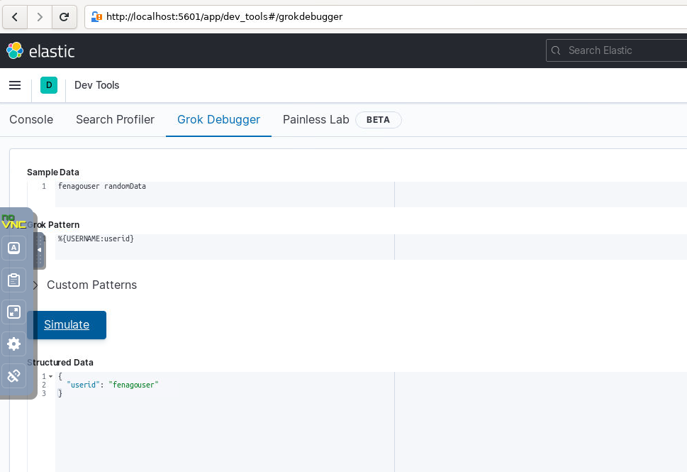

Lab 6. Building Data Pipelines with Logstash
---------------------------------------------------------


In this lab, we will be covering Parsing and enriching logs using Logstash.


Parsing and enriching logs using Logstash
-----------------------------------------------------------


Log data is typically made up of two parts, as follows:

```
logdata = timestamp + data
```

`timestamp` is the time when the event occurred and `data` is the information about the event.
`data` may contain just a single piece of information or it may contain many pieces of information.


#### CSV filter 

Let\'s take some sample data and use a CSV filter to parse data out of
it. Store the following data in a file named `users.csv`:

<span style="color:red;">Note: csv file exists at following path: home/elasticsearch/Lab06/users.csv</span>


```
FName,LName,Age,Salary,EmailId,Gender
John,Thomas,25,50000,John.Thomas,m
Raj, Kumar,30,5000,Raj.Kumar,f
```

The following code block shows the usage of the CSV filter plugin. You can either specify the list of column names using the
`columns` parameter, which accepts an array of column names,
or by using the `autodetect_column_names`parameter, set to
true. In doing so, you can let the plugin know that it needs to detect column names automatically, as follows:


```
#csv_file.conf
input { 
   file{
      path => "/home/elasticsearch/Lab06/users.csv"
      start_position => "beginning"
      }
} 

filter {
    csv{
    autodetect_column_names => true 
}
}

output { 
  stdout { 
    codec => rubydebug 
         }
}
```


Let\'s run Logstash using this new configuration that\'s stored in the `csv_file.conf` file, as follows:

```
cd $LOGSTASH_HOME

logstash -f ./conf/csv_file.conf
```

#### Mutate filter


You can perform general mutations on fields using this filter. The
fields in the event can be renamed, converted, stripped, and modified.

Let\'s enhance the
`csv_file.conf` file we created in
the previous section with the `mutate` filter and understand
its usage. The following code block shows the use of the
`mutate` filter:

```
#csv_file_mutuate.conf
input { 
   file{
      path => "/home/elasticsearch/Lab06/users.csv"
      start_position => "beginning"
      sincedb_path => "NULL"
   }

} 

filter {
  csv{
    autodetect_column_names => true 
  }

mutate {
    convert => {
        "Age" => "integer"
        "Salary" => "float"
      } 
    rename => { "FName" => "Firstname" 
                 "LName" => "Lastname" } 
    gsub => [
       "EmailId", "\.", "_"
      ]
    strip => ["Firstname", "Lastname"] 
    uppercase => [ "Gender" ]
  }
}

output { 
  stdout { 
    codec => rubydebug 
    }
}
```

As we can see, the `convert` setting within the
`filter` helps to change the datatype of a field. The valid
conversion targets are `integer`, `string`,
`float`, and `boolean`. 


```
cd $LOGSTASH_HOME

logstash -f ./conf/csv_file_mutuate.conf
```


#### Grok filter


Let\'s look at some examples to understand `grok` filter:

```
#grok1.conf

input { 
   file{
      path => "/home/elasticsearch/Lab06/msg.log"
      start_position => "beginning"
      sincedb_path => "NULL"
   }

} 

filter {
  grok{
  match => {"message" => "%{USERNAME:userid}" }
  } 
}

output { 
  stdout { 
    codec => rubydebug 
    }

} 
```

<span style="color:red;">Note: msg.log file exists at following path: home/elasticsearch/Lab06/</span>


If the input line is of the `fenagouser randomData` format, then the output would be as follows:

```
{
      "path" => "/home/elasticsearch/Lab06/msg.log",
      "@timestamp" => 2021-11-24T12:30:54.039Z,
      "@version" => "1",
      "host" => "SHMN-IN",
      "messageId" => 1,
      "message" => "fenagouser randomData\r",
      "userid" => "fenagouser"
}
```


```
cd $LOGSTASH_HOME

logstash -f ./conf/grok1.conf
```


### Note

If the pattern doesn\'t match the text, it will add a `_grokparsefailure` tag to the `tags` field.


Grok Debugger utility is automatically enabled in Kibana. It is located
under the `DevTools `tab in Kibana.




Summary
-------------------------


In this lab, we covered the powerful filter section of Logstash,
which can be used for parsing and enriching log events. We have also
covered some commonly used filter plugins.

In the next lab, we will be covering the various features of X-Pack,
a commercial offering by Elastic.co which contains features such as
securing the Elastic Stack, as well as monitoring, alerting, graphs, and
reporting.
