Lab 7. Visualizing Data with Kibana
------------------------------------------------


Kibana is an open source
web-based analytics and visualization tool that lets you visualize the
data stored in Elasticsearch using a variety of tables, maps, and
charts. Using its simple interface, users can easily explore large
volumes of data stored in Elasticsearch and perform advanced analysis of
data in real time. In this lab, let\'s explore the various
components of Kibana and explore how you can use it for data analysis.

We will cover the following topics in this lab:


-   Downloading and installing Kibana
-   Preparing data
-   Kibana UI
-   Timelion
-   Using plugins


### Running Kibana


Switch to `elasticsearch` user and type `kibana` to start the service if not running already.

```
$  su elasticsearch
$  kibana
```


Kibana is a web application and, unlike Elasticsearch and Logstash,
which run on the JVM, Kibana is powered by Node.js. During bootup,
Kibana tries to connect to Elasticsearch running on
`http://localhost:9200`. Kibana is started on the default port
`5601`. Kibana can be accessed from a web browser using the
`http://localhost:5601` URL. You can navigate to the
`http://localhost:5601/status` URL to find the Kibana server
status.

The status page displays information about
the server\'s resource usage and lists the installed plugins, as shown in the following screenshot:


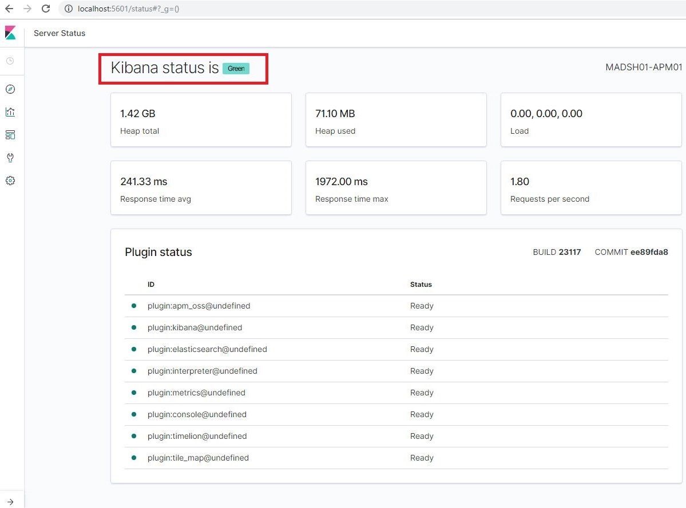


### Configuring Kibana


When Kibana was started, it started on port `5601`, and it
tried to connect to Elasticsearch running on
port `9200`. What if we want to change some of these settings?
All the configurations of Kibana are stored in a file called
`kibana.yml`, which is present under
the `config` folder, under `$KIBANA_HOME`.


Preparing data
--------------------------------


When you launch Kibana, it comes with predefined options to enable
loading of data to Elasticsearch with a few clicks and you can start
exploring Kibana right away. When you launch Kibana by accessing
the `http://localhost:5601`link in your browser for the first
time, you will see the following screen:


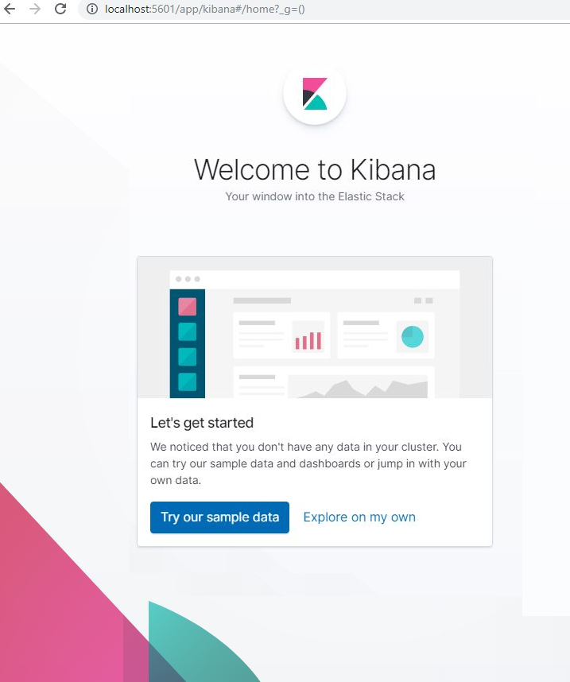


Clicking on the `Try our sample data` button will take you to the following screen:


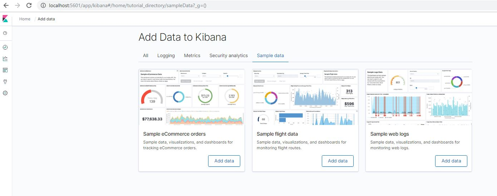


#### ProTip:


You can search Kibana features from the search menu:

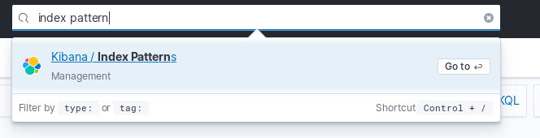


Go ahead and click on `Add data` for `Sample eCommerce orders`.
It should load data, visualizations, and dashboards in the background.
Once ready, you can click on `View data`, which will take you to the
eCommerce dashboard: 


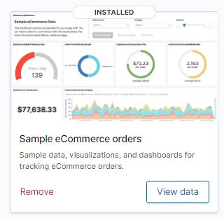


The following screenshot shows the dashboard:


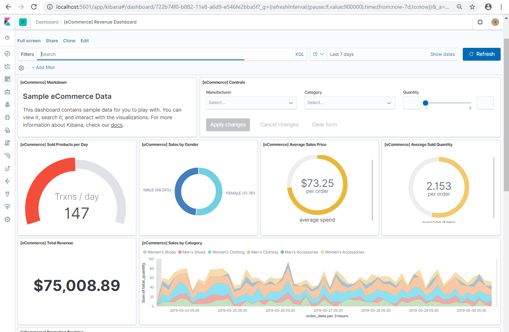


The actual data that is powering these dashboards/visualizations can be
verified in Elasticsearch by executing the following command. As seen,
the sample data is loaded into
the `kibana_sample_data_ecommerce` index, which has `4675` docs:

```
curl localhost:9200/_cat/indices/kibana_sample*?v
```


### Note

If you click on the `Remove` button, all the dashboards and data
will be deleted. Similarly, you can click on the `Add data` button
for the other two widgets if you want to explore sample flight and
sample logs data.


If you want to navigate back to the home page, you can always click on
this icon 


### Loading Custom Data

In this lab, rather than relying on the sample default data shipped
out of the box, we will load custom data which we will use to follow the
tutorial. One of the most common use cases is
**log analysis**. For this tutorial, we will be loading
Apache server logs into Elasticsearch using Logstash and will then use
it in Kibana for analysis/building visualizations.

<https://github.com/elastic/elk-index-size-tests> hosts a dump of Apache
server logs that were collected for
the [www.logstash.net](http://www.logstash.net/) site during the
period of May 2014 to June 2014. It contains 300,000 log events.


Create a config file named `apache.conf` in the `$LOGSTASH_HOME/bin` folder, as shown in the following code block:

```
input 
{ 
 file {
 path => ["/home/elasticsearch/Lab07/data/logs"]
 start_position => "beginning"
 sincedb_path => "NUL"
 }
}

filter 
{
 grok {
 match => {
 "message" => "%{COMBINEDAPACHELOG}"
 }
 }
 mutate {
 convert => { "bytes" => "integer" }
 }
 date {
 match => [ "timestamp", "dd/MMM/YYYY:HH:mm:ss Z" ]
 locale => en
 remove_field => "timestamp"
 }
 geoip {
 source => "clientip"
 }
 useragent {
 source => "agent"
 target => "useragent"
 }
}

output 
{ 

 stdout { 
 codec => dots
 } 
 elasticsearch { 
 index => "logstash-%{+yyyy-MM-dd}"
  }
}
```

Start Logstash, shown as follows, so that it can begin processing the
logs, and index them to Elasticsearch. Logstash will take a while to
start and then you should see a series of dots (a dot per processed log
line):

```
cd $LOGSTASH_HOME/bin

logstash -f apache.conf
```

<span style="color:red;">Note: Logstash will take few minutes to import the data. Please wait for import to complete</span>


Let\'s verify the total number of documents (log events) indexed into
Elasticsearch:

```
curl -X GET http://localhost:9200/logstash-*/_count
```

In the response, you should see a count of 300,000.


Kibana UI
---------------------------


In this section, let\'s understand how data
exploration and analysis is typically performed and how to create
visualizations and a dashboard to derive insights about data.


### Configuring the index pattern


Open up Kibana from the browser using
the [http://localhost:5601](http://localhost:5601/) URL. In the
landing page, search  `Index pattern` and click it. 

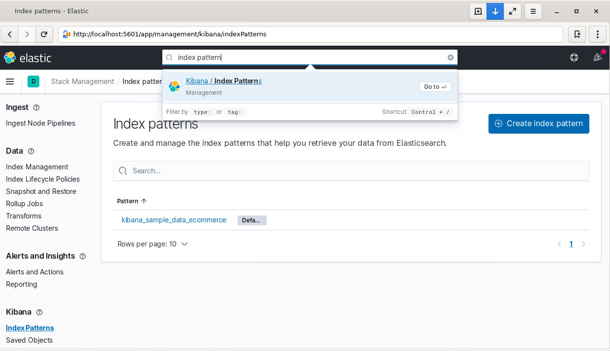


Click "Create Index" button and type in `logstash-*` in the `Index pattern` text field and click on the `Next step` button, as shown in the following screenshot:


On the `Create Index Pattern` screen, during the configuration of an
index pattern, if the index has a datetime field (that is, it is a
time-series index), the `Time Filter field name` dropdown is visible
and allows the user to select the appropriate datetime field; otherwise,
the field is not visible. As the data that we loaded in the previous
section contains time-series data, in the `Time Filter field name`,
select `@timestamp` and click `Create`, as follows:


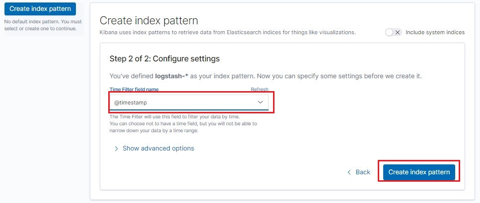


Once the index pattern is successfully created, you should see the
following screen:


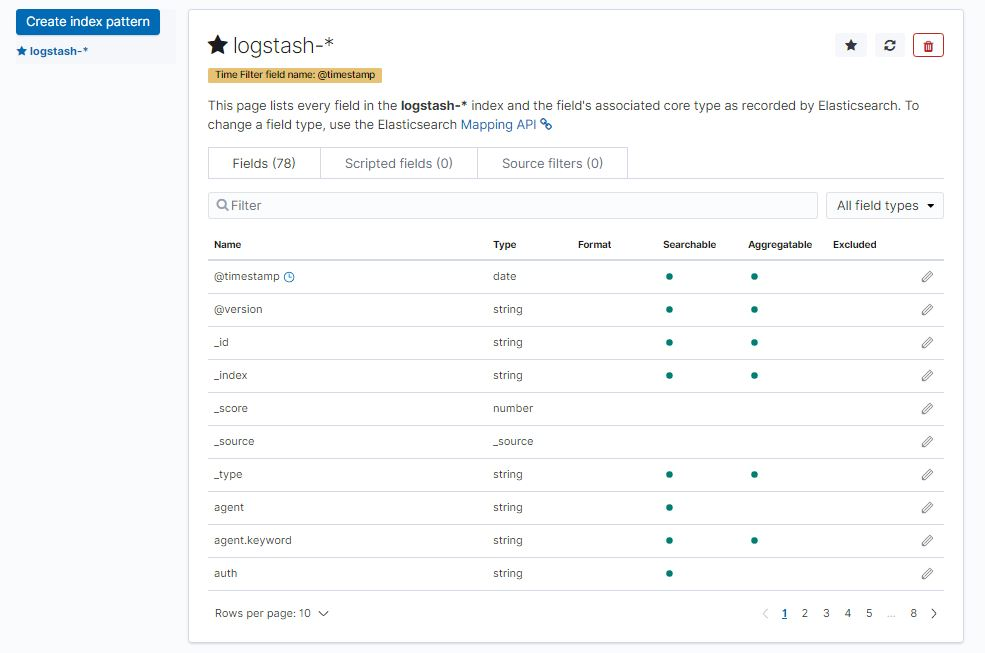


### Discover


By default, the `Discover` page displays the events of the last 15
minutes. As the log events are from the period May 2014 to June 2014,
set the appropriate date range in the time filter. Navigate to
`Time Filter` \| `Absolute Time Range` and set `From` as
`2014-05-28 00:00:00.000` and \>`To `to
`2014-07-01 00:00:00.000`. Click `Update`, as shown in the
following screenshot:


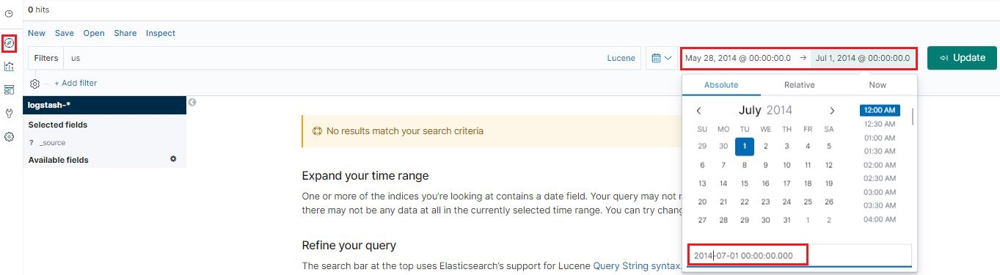


The `Discover` page contains the sections shown in the following screenshot:


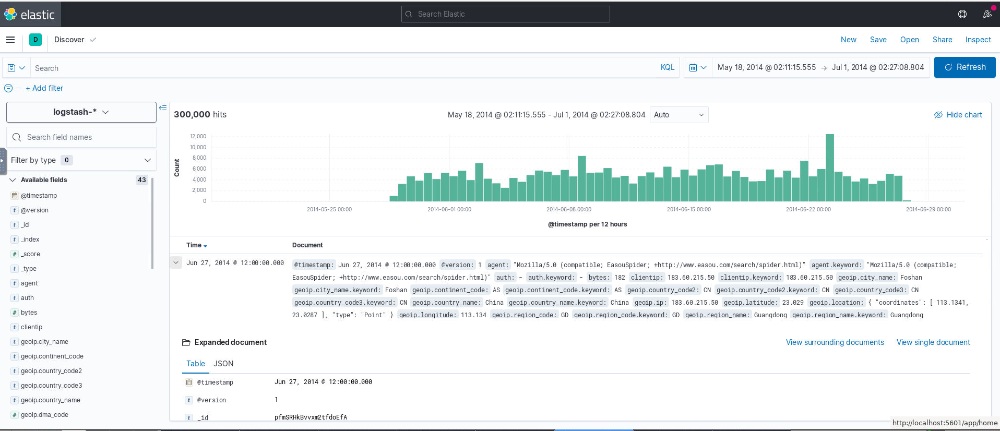


**Document Table**: This section shows the actual
    document data. The table shows the **500** most recent
    documents that match the user-entered query/filters, sorted by
    timestamp (if the field exists). By clicking the `Expand` button
    found to the left of the document\'s table entry, data can be
    visualized in table format or JSON format, as follows:


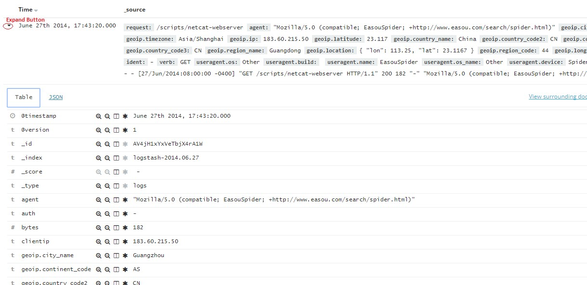


Added field columns replace the **\_source** column in the
**Documents** table. Field columns in the table can be
shuffled by clicking the right or left arrows found when hovering over
the column name. Similarly, by clicking the remove button,
**x**, columns can be removed from the table, as follows:


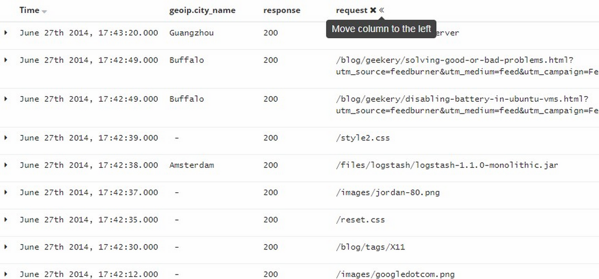


#### Elasticsearch query string/Lucene query


This provides the ability to perform various
types of queries ranging from simple to complex queries that adhere to
the Lucene query syntax. In the query bar, by default, KQL will be the
query language. Go ahead and disable it as shown in the following
screenshot. Once you disable it, `KQL` changes to `Lucene` in
the query bar, as follows:


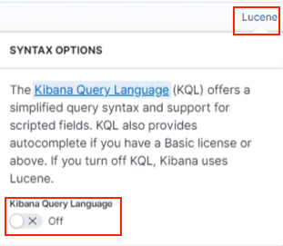


Let\'s see some examples:

**Free Text search**: To search for text present in any of the fields, simply enter a text string in
the query bar:


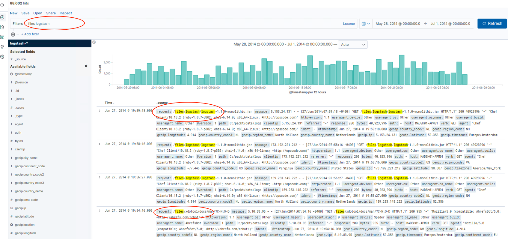


If you are doing an exact phrase search, that is, the documents should
contain all the words given the search criteria, and the words should be
in the same order, then surround the phrase with quotes. For
example, `file logstash` or `files logstash`.

**Field search**: To search for values against a specific field, use the `syntax` field: `value`:


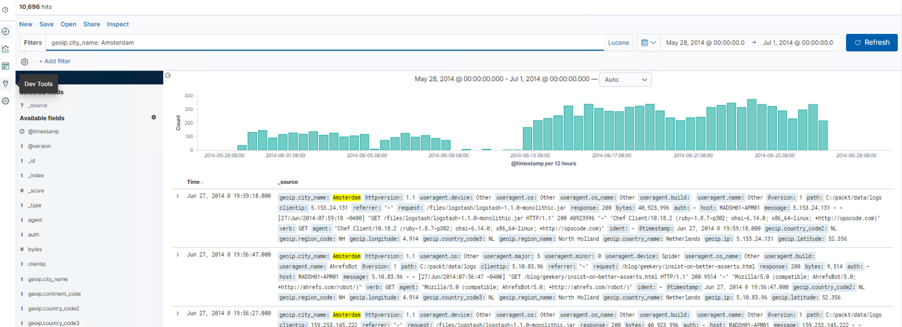


**Boolean search**: You canmakeuse of Boolean operators such as `AND`,
`OR`, and `-` (Must Not match) to build complex
queries. Using Boolean operators, you can combine the
field:`value`and free text as well.

`Must Not` match: The following is a screenshot of a
`Must Not` operator with a field:


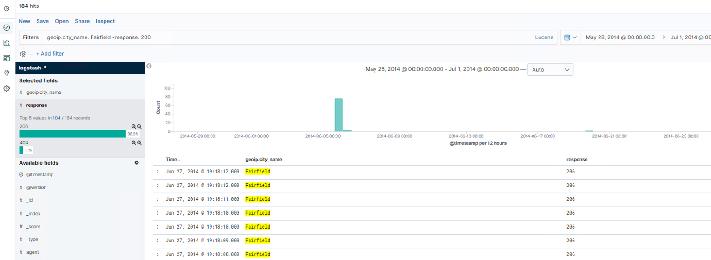


The following is an example of a `Must Not` operator with free
text:


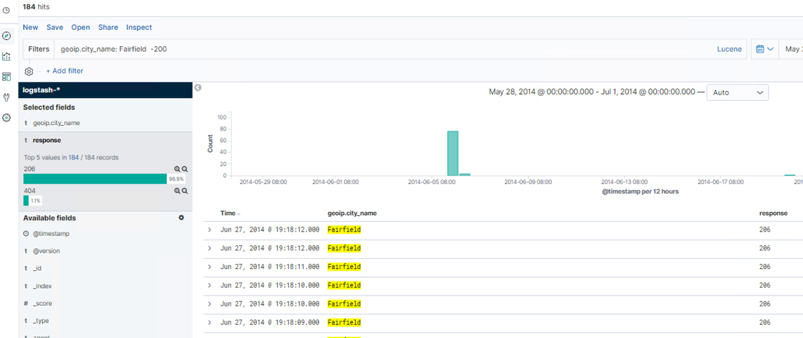


### Note

There should be no space between the `-` operator and the
search text/field.


**Grouping searches**: When we want to build complex queries, often, we have to group the search
criteria. Grouping both by field and value is supported, as shown in the
following screenshot:


**Range search**: This allows you
to search within a range of values. Inclusive ranges are specified with
square brackets---for example, `[START_VALUE TO END_VALUE]`,
and exclusive ranges with curly brackets---for
example, `{ START _VALUE TO END_VALUE }`. Ranges can be
specified for dates and numeric or string fields, as follows:


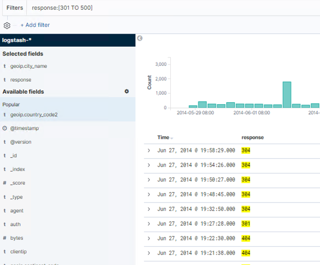


### Note

The `TO` operator is case-sensitive and its range values
should be numeric values.


**Wildcard and Regex search**: By using the `*` and `?` wildcards
with search text, queries can be
executed; `*` denotes zero or more matches and `?`
denotes zero or one match, as shown in the following screenshot:


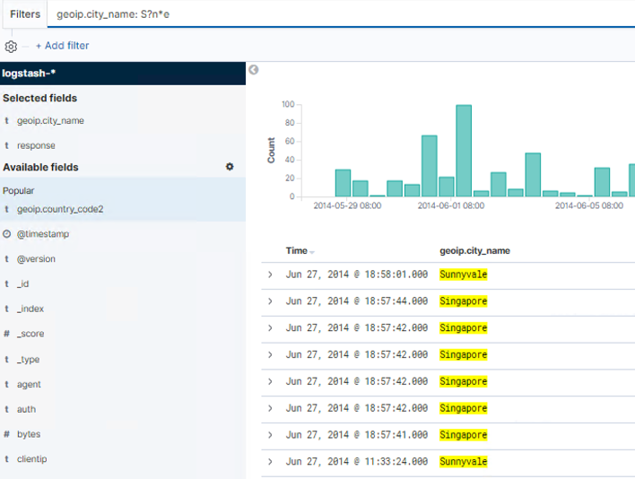


#### Elasticsearch DSL query


By using a DSL query, queries can be
performed from the query bar. The query part of a DSL query can be used
to perform searches.

The following screenshot is an example of searching for documents that
have `IE` in the `useragent.name` field and
`Washington` in the `geoip.region_name` field:


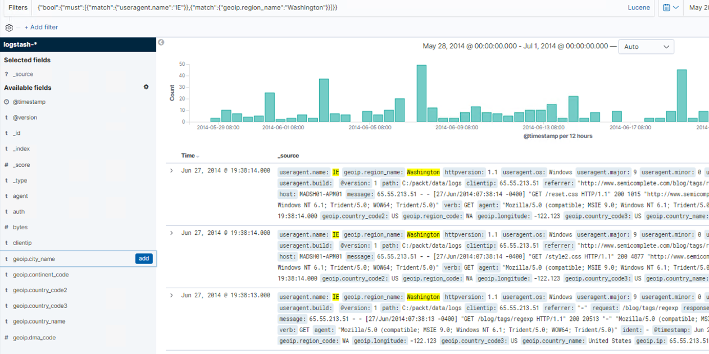


**Hits**: Hits represent the total number of documents that
match the user-entered input query/criteria.


#### KQL

KQL doesn\'t allow spaces between expressions and the same thing would
have to be written as
`response:200 or geoip.city_name:Diedorf`, as shown in the
following screenshot:


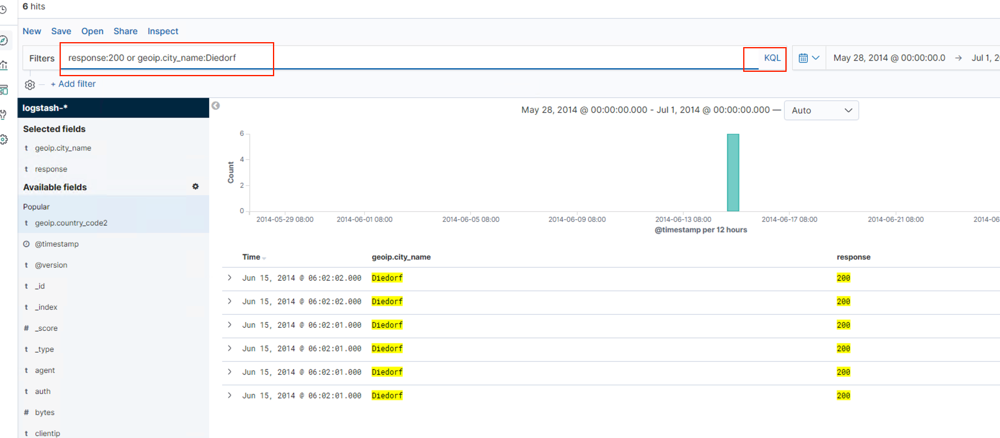


Similarly, you can have `and not` expressions too and group
expressions as shown in the following screenshot:


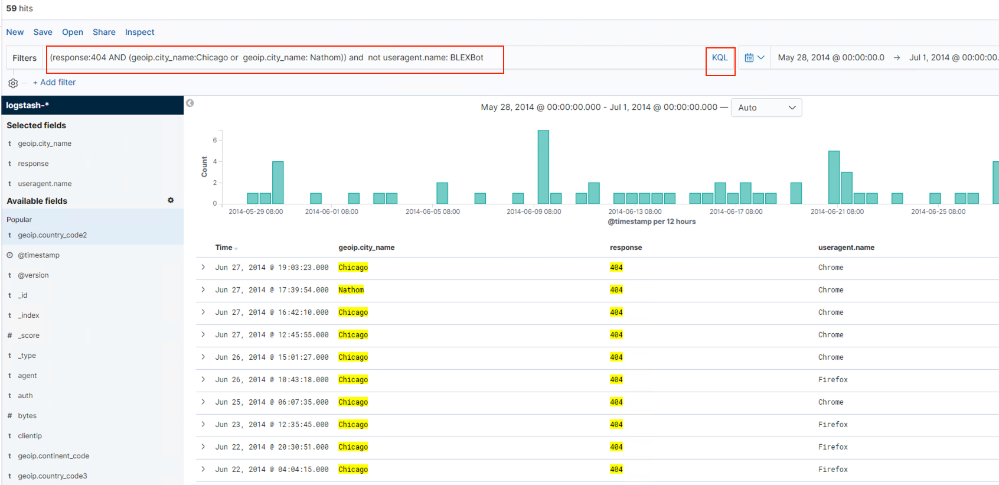


### Note

The operators `and`, `or`, and `not` are
case-insensitive.


**Histogram**


**Toolbar**

The user can refer to existing stored searches later and modify the
query, and they can either overwrite the existing search or save it as a
new search (by toggling the `Save as new search` option in the
`Save Search` window), as follows:


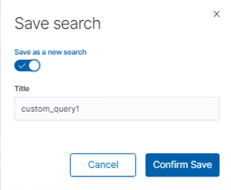


Clicking the **Open** button displays the saved searches, as shown in the following screenshot:


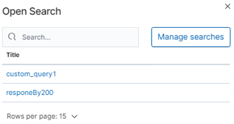


In Kibana, the state of the current page/UI is stored in the URL itself,
thus allowing it to be easily shareable. Clicking the
`Share` button allows you to share the
`Saved Search`, as shown in the following screenshot:


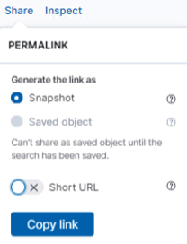


The **Inspect** button allows to view query statistics such
as total hits, query time, the actual query fired against ES, and the
actual response returned by ES. This would be useful to understand how
the Lucene/KQL query we entered in the query bar translates to an actual
ES query, as shown in the following screenshot:


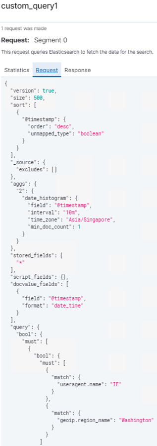


**Time Filter** provides the following options to
select time periods. Click
on `Time Filter` (`calendar icon`)/ **Date fields**
to access the following options:


-   **Quick time filter**: This helps you to filter quickly based on some already available
    time ranges:


-   **Relative time filter**: This helps you to filter based on the relative time with respect to
    the current time. Relative times can be in the past or the future. A
    checkbox is provided to round the time:


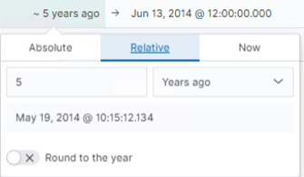


-   **Absolute time filter**: This helps you to filter based on input start and end times:


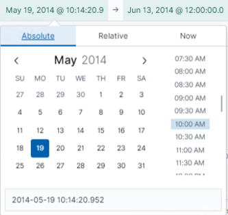


-   **Auto Refresh**: During the
    analysis of real-time data or data that is continuously generated, a
    feature to automatically fetch the latest data would be very useful.
    Auto Refresh provides such a functionality. By default, the refresh
    interval is turned off. The user can choose the appropriate refresh
    interval that assists their analysis and click
    the **Start** button, as shown in the following
    screenshot:


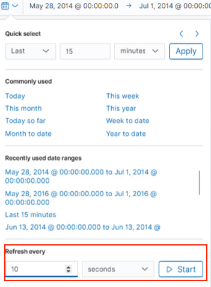


You can add field filters from **Fields list** or
**Documents table**, and even manually add a filter. In
addition to creating positive and negative filters, **Documents table** enables you to determine whether a field is present. 

To add a positive or negative filter, in `Fields List` or
`Documents Table`, click on the positive icon or negative icon
respectively. Similarly, to filter a search according to whether a field
is present, click on the  `*`  icon (the exists
filter), as follows:


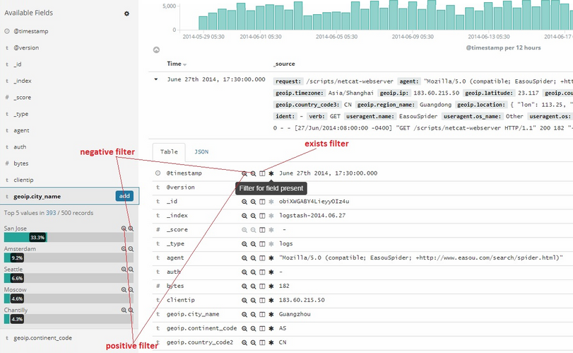


You can also add filters manually by clicking the
`Add a Filter` button found below the query bar. Clicking on the
button will launch a popup in which filters can be specified and applied
by clicking the `Save` button, as follows:


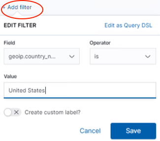


The following screenshot displays the preceding actions that can be
applied:


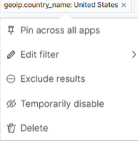


You can perform the preceding actions across multiple filters at once
rather than one at a time by clicking on the filter settings icon, as
follows:


### Visualize


All visualizations in Kibana are based on the aggregation queries of
Elasticsearch. Aggregations provide the multi-dimensional grouping of
results---for example, finding the top user agents by device and by
country. Kibana provides a variety of visualizations, shown as follows:


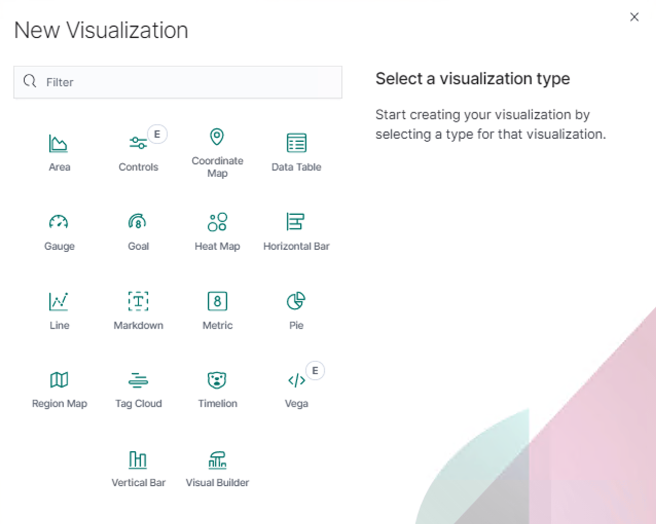


### Creating a visualization


The following are the steps to create visualizations:


1.  Navigate to the `Visualize` page and click
    the `Create a new Visualization` button or the `+`  button
2.  Select a visualization type
3.  Select a data source
4.  Build the visualization


The **Visualize** Interface looks as follows:


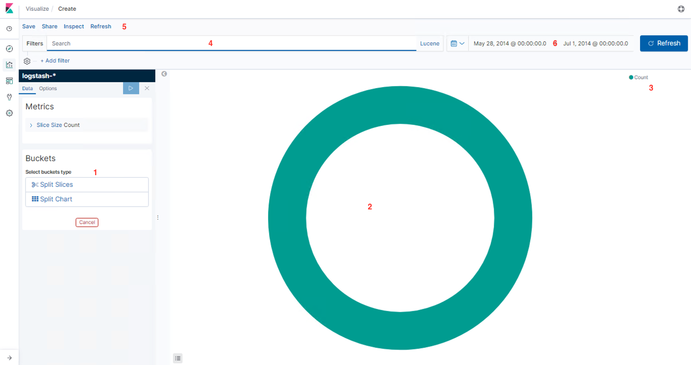


### Visualizations in action


Let's see how different visualizations can
help us in doing the following:


-   Analyzing response codes over time
-   Finding the top 10 requested URLs
-   Analyzing the bandwidth usage of the top five countries over time
-   Finding the most used user agent


### Note

As the log events are from the period May 2014 to June 2014, set the
appropriate date range in the time filter. Navigate to **Time
Filter** \| **Absolute Time Range** and set
**From** as `2014-05-28 00:00:00.000` and
**To** to `2014-07-01 00:00:00.000`; click
`Go`.


#### Response codes over time


This can be visualized easily using a bar
graph.

Create a new visualization:


1.  Click on `New` and select `Vertical Bar`
2.  Select `Logstash-*` under `From a New Search`,
    `Select Index`
3.  On the [*x*]  axis, select `Date Histogram` and
    `@timestamp` as the field
4.  Click `Add sub-buckets` and select `Split Series`
5.  Select **Terms** as the `Sub Aggregation`
6.  Select **response.keyword** as the field
7.  Click the `Play` (Apply Changes) button


The following screenshot displays the steps to create a new
visualization for response codes over time:


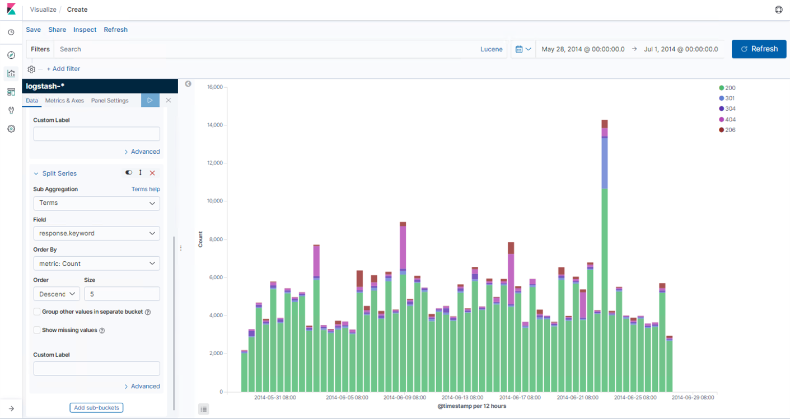


Save the visualization as`Response Codes By Time`.

As seen in the visualization, on a few days, such as June 9, June 16,
and so on, there is a significant amount of **404**. Now, to
analyze just the **404** events, from the
**labels**/**keys** panel, click on `404 `and
then click `positive filter`:


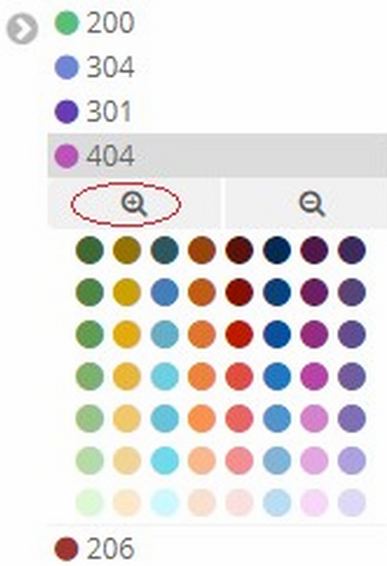


The resulting graph is shown in the following
screenshot:


### Note

You can expand the labels/keys and choose the colors from the color
palette, thus changing the colors in the visualization. Pin the filter
and navigate to the `Discover` page to see the requests resulting in
**404**s.

 


#### Top 10 requested URLs


This can be visualized easily using a data
table.

The steps are as follows:


1.  Create a new visualization
2.  Click on `New` and select `Data Table`
3.  Select `Logstash-*` under
    `From a New Search, Select Index`
4.  Select **Buckets** type as `Split Rows`
5.  Select `Aggregation` as **Terms**


6.  Select the **request.keyword** field
7.  Set the `Size` to `10`
8.  Click the `Play` (Apply Changes) button


The following screenshot displays the steps to create a new
visualization for the top 10 requested URLs:


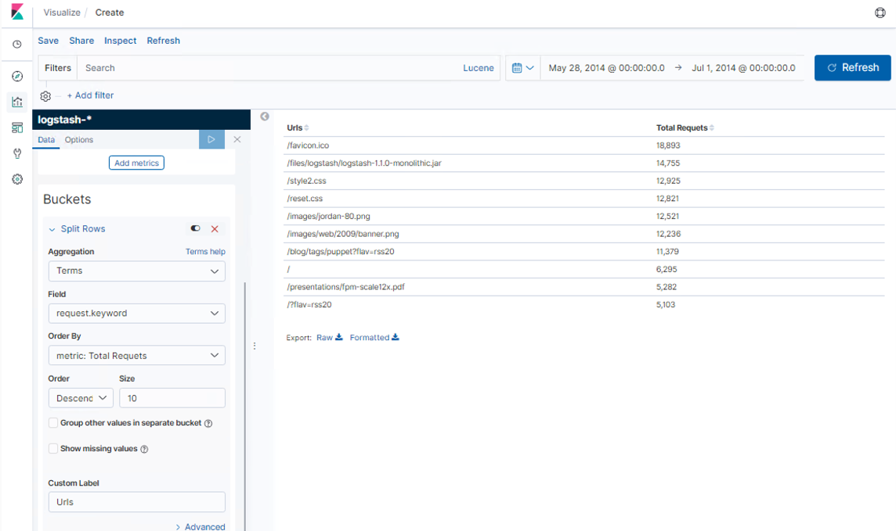


Save the visualization as`Top 10 URLs`.


### Note

`Custom Label` fields can be used to provide meaningful names
for aggregated results. Most of the visualizations support custom
labels. Data table visualizations can be exported as a `.csv`
file by clicking the `Raw` or `Formatted` links found under the
data table visualization.


#### Bandwidth usage of the top five countries over time


The steps to demonstrate this are as follows:


1.  Create a new visualization
2.  Click on `New` and select `Area Chart`
3.  Select `Logstash-*` under
    `From a New Search, Select Index`
4.  In `Y axis`, select **Aggregation** type and **Sum
    of bytes** as the field
5.  In `X axis`, select `Date Histogram` and `@timestamp` as
    the field
6.  Click `Add sub-buckets` and select `Split Series`
7.  Select **Terms** as the `Sub Aggregation`
8.  Select **geoip.country\_name.keyword** as the field
9.  Click the `Play` (Apply Changes) button


The following screenshot displays the steps to create a new
visualization for the bandwidth usage of the top five countries over
time:


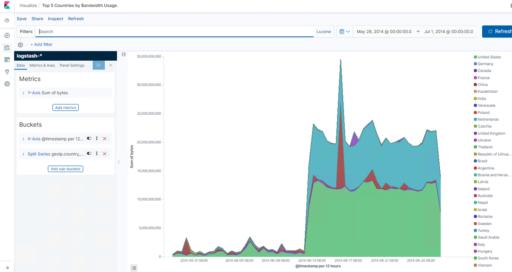


Save the visualization
as `Top 5 Countries by Bandwidth Usage`.

What if we were not interested in finding only the top five countries?
Rearrange the aggregation and click `Play`, as follows:


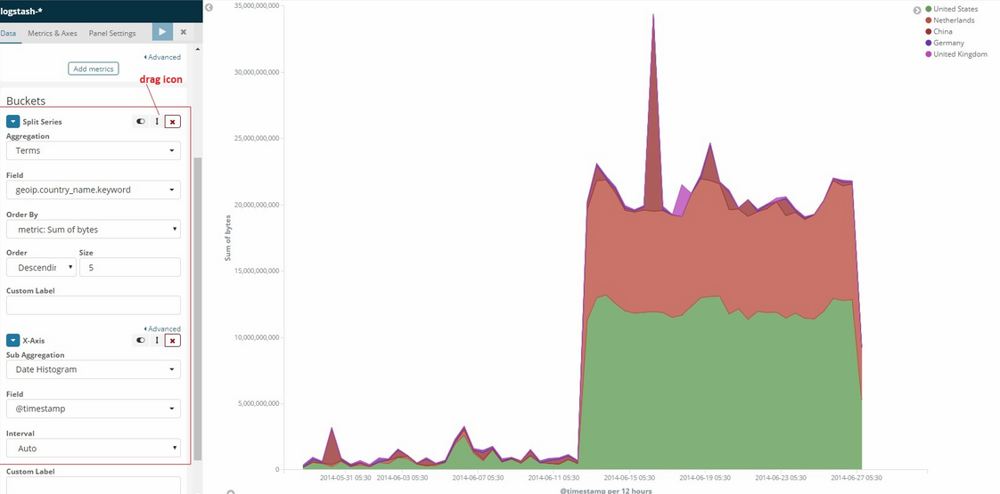


### Note

The order of aggregation is important.


#### Web traffic originating from different countries


This can be visualized easily using a
coordinate map.

The steps are as follows:


1.  Create a new visualization
2.  Click on `New` and select `Coordinate Map`
3.  Select `logstash-*` under
    `From a New Search, Select Index`
4.  Set the bucket type as` Geo Coordinates`
5.  Select the **Aggregation** as **Geohash**
6.  Select the **geoip.location** field
7.  In the **Options** tab, select `Map Type` as
    `Heatmap`
8.  Click the `Play` (`Apply Changes`) button:


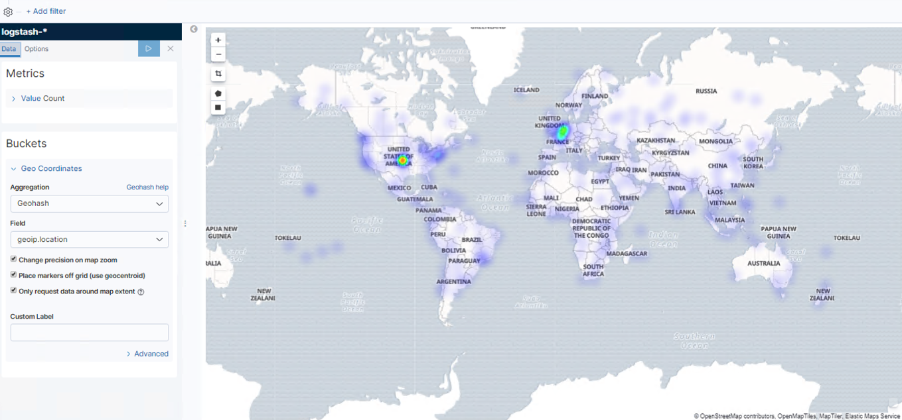


Save the visualization as `Traffic By Country`.

Based on this visualization, most of the traffic is originating from
California.

For the same visualization, if the metric is changed to `bytes`, the
resulting visualization is as follows:


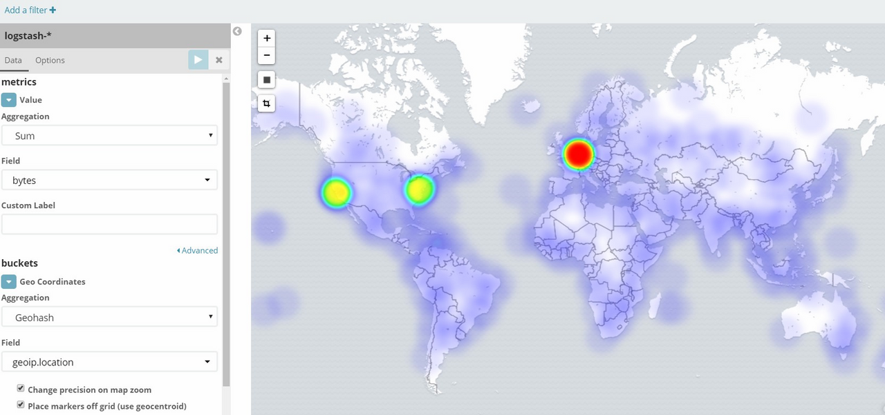


### Note

You can click on the `+/-` button found at the top-left of the map
and zoom in/zoom out. Using the `Draw Rectangle` button found at the
top-left, below the zoom in and zoom out buttons, you can draw a region
for filtering the documents. Then, you can pin the filter and navigate
to the `Discover` page to see the documents belonging to that
region.


#### Most used user agent


This can be visualized easily using a variety
of charts. Let\'s use **Tag Cloud**.

The steps are as follows:


1.  Create a new visualization
2.  Click on `New` and select `Tag Cloud`
3.  Select `logstash-*` under `From a New Search, Select Index`
4.  Set the bucket type to **Tags**
5.  Select the **Terms** aggregation
6.  Select the **useragent.name.keyword** field
7.  Set the `Size` to `10` and click
    the `Play` (`Apply Changes`) button:


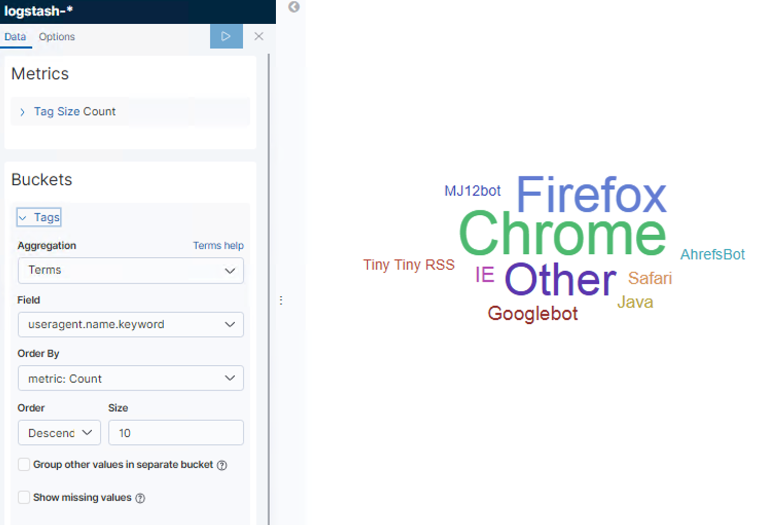


Save the visualization as`Most used user agent`. Chrome,
followed by Firefox, is the user agent the majority of traffic is
originating from.


### Dashboards


**Dashboards** help you bring
different visualizations into a single page. By using previously stored
visualizations and saved queries, you can
build a dashboard that tells a story about the data.

A sample dashboard would look like the following screenshot:


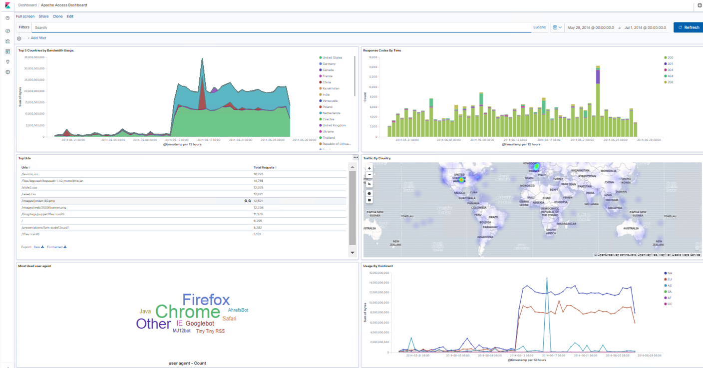


Let\'s see how we can build a dashboard for our log analysis use case.


#### Creating a dashboard


In order to create a new dashboard, navigate
to the `Dashboard` page and click the `Create a Dashboard`
button:


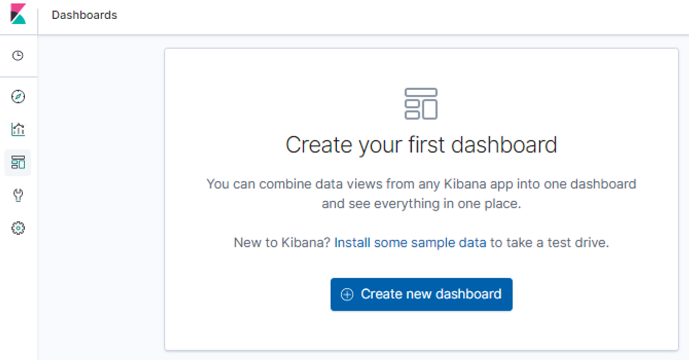


On the resulting page, the user can click the `Add` button, which
shows all the stored visualizations and saved searches that are
available to be added. Clicking on
`Saved search`/`Visualization` will result in them getting added
to the page, as follows:


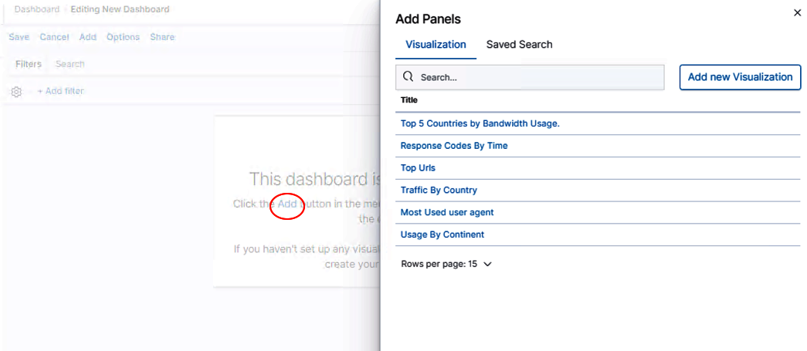


The user can expand, edit, rearrange, or remove visualizations using the buttons available at the top corner
of each visualization, as follows:


### Note

By using the query bar, field filters, and time filters, search results
can be filtered. The dashboard reflects those changes via the changes to
the embedded visualizations. For example, you might be only interested
in knowing the top user agents and top devices by country when the
response code is **404**. Usage of the query bar, field
filters, and time filters is explained in the [*Discover*] 
section.


#### Saving the dashboard 


Once the required visualizations are added to
the dashboard, make sure to save the dashboard by clicking the
`Save` button available on the toolbar and provide a title. When a
dashboard is saved, all the query criteria and filters get saved, too.
If you want to save the time filters, then, while saving the dashboard,
select the `Store time with dashboard` toggle button. Saving the
time along with the dashboard might be useful when you want to
share/reopen the dashboard in its current state, as follows:


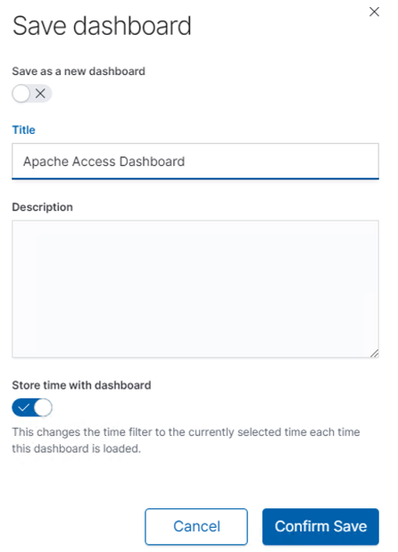


#### Cloning the dashboard


Using the **Clone** feature, you can copy the current dashboard, along with its queries and
filters, and create a new dashboard. For example, you might want to
create new dashboards for continents or countries, as follows:


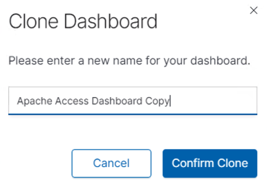


### Note

The dashboard background theme can be changed from light to dark. When
you click the `Edit` button in the toolbar, it provides a button
called `Options`, which provides the feature to change the dashboard
theme.


#### Sharing the dashboard 


Using the **Share** feature, you can either share a direct link to a Kibana dashboard with
another user or embed the dashboard in a web page as aniframe:

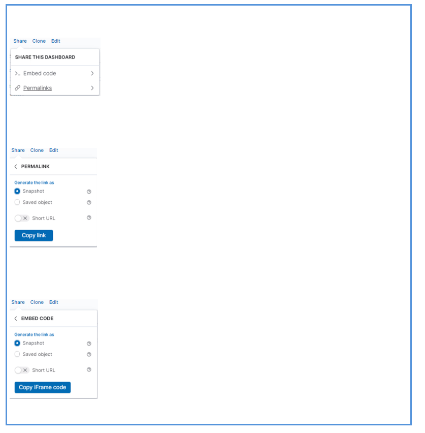


### Timelion 


`Timelion` is available just like any other
visualization in the **New Visualization** window, as follows:


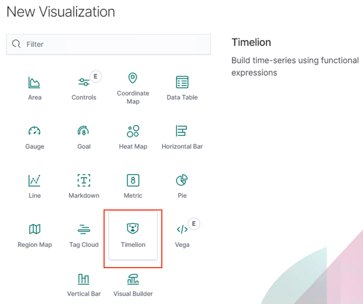


The main components/features of Timelion visualization
are `Timelion expressions,` which allow you to define expressions
that influence the generation of graphs. They allow you to define
multiple expressions separated by commas, and also allow you to chain
functions.

### Timelion expressions


The simplest Timelion expression used for generating graphs is as follows:

```
.es(*) 
```


If you\'d like to restrict Timelion to data within a specific index (for
example, `logstash-*`), you can specify the index within the
function as follows: 

```
.es(index=logstash-*) 
```

As Timelion is a time-series visualizer, it uses
the `@timestamp` field present in the index as the time field
for plotting the values on an [*x *] axis. You can change it
by passing the appropriate time field as a value to
the `timefield` parameter.

Timelion\'s helpful autocompletion feature will help you build the
expression as you go along, as follows:


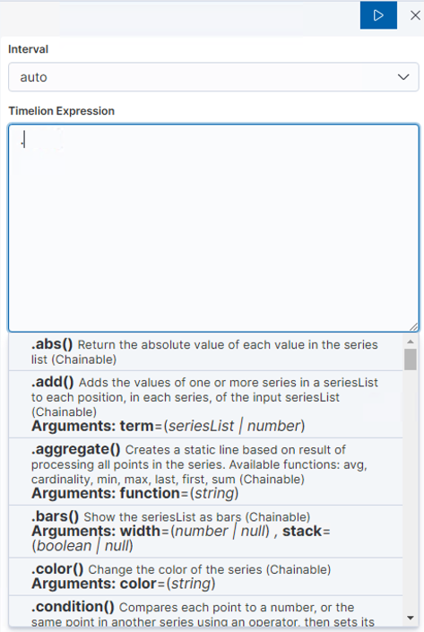


Let\'s see some examples in action to understand Timelion better. 


### Note

As the log events are from the period May 2014 to June 2014, set the
appropriate date range in the time filter. Navigate to `Time Filter`
\| `Absolute Time Range` and set `From` to
`2014-05-28 00:00:00.000` and `To` to
`2014-07-01 00:00:00.000`; click `Go.`


Let\'s find the average bytes usage over time for the US. The expression
for this would be as follows:

```
.es(q='geoip.country_code3:US',metric='avg:bytes')
```

The output is displayed in the following screenshot:


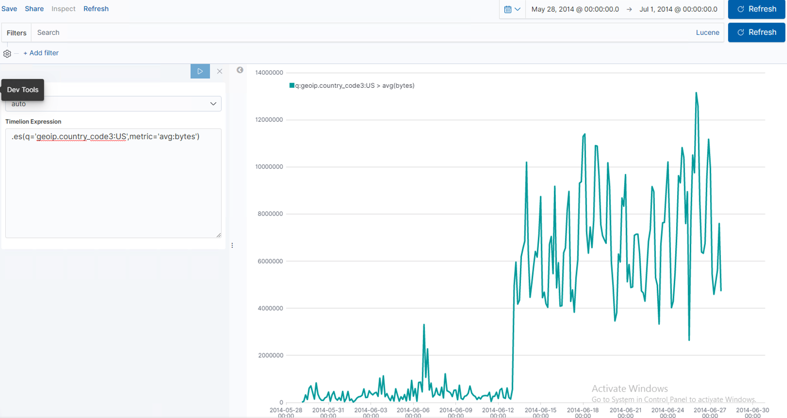


Timelion allows for the plotting of multiple graphs in the same chart as
well. By separating expressions with commas, you can plot multiple
graphs.

Let\'s find the average bytes usage over time for the US and the average
bytes usage over time for China. The expression for this would be as
follows:

```
 es(q='geoip.country_code3:US',metric='avg:bytes'), .es(q='geoip.country_code3:CN',metric='avg:bytes')
```

The output is displayed in the following
screenshot:


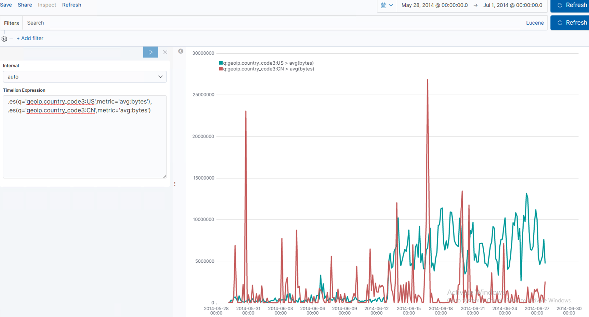


Timelion also allows for the chaining of functions. Let\'s change the
label and color of the preceding graphs. The expression for this would
be as follows:

```
.es(q='geoip.country_code3:US',metric='avg:bytes').label('United States').color('yellow'), .es(q='geoip.country_code3:CN',metric='avg:bytes').label('China').color('red')
```

The output is displayed in the following
screenshot:


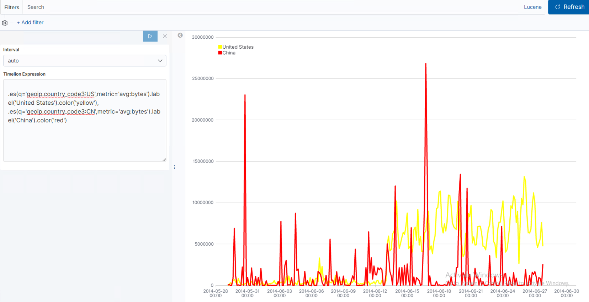


One more useful option in Timelion is using offsets to analyze old data.
This is useful for comparing current trends to earlier patterns. Let\'s
compare the sum of bytes usage to the previous week for the US. The
expression for this would be as follows:

```
.es(q='geoip.country_code3:US',metric='sum:bytes').label('Current Week'), .es(q='geoip.country_code3:US',metric='sum:bytes', offset=-1w).label('Previous Week')
```

The output is displayed in the following screenshot:


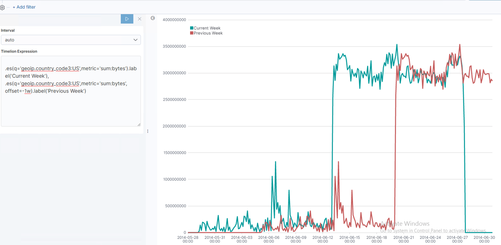


Timelion also supports the pulling ofdatafrom
external data sources using a public API. Timelion has a native API for
pulling data from the World Bank, Quandl, and Graphite.


Using plugins
-------------------------------


**Plugins** are a way to enhance the
functionality of Kibana. All the plugins that
are installed will be placed in the `$KIBANA_HOME/plugins`
folder. Elastic, the company behind Kibana, provides many plugins that
can be installed, and there are quite a number of public plugins that
are not maintained by Elastic that can be installed, too.


### Installing plugins


Navigate to `KIBANA_HOME` and execute
the `install` command, as shown in the following code, to
install any plugins. During installation, either the name of the plugin can be given (if it\'s hosted by Elastic
itself), or the URL of the location where the plugin is hosted can be
given:

```
$ KIBANA_HOME>bin/kibana-plugin install <package name or URL>
```

For example, to install `x-pack`, a plugin developed and
maintained by Elastic, execute the following command:

```
$ KIBANA_HOME>bin/kibana-plugin install x-pack
```

To install a public plugin, for example, LogTrail
(<https://github.com/sivasamyk/logtrail>), execute the following
command:

```
$ KIBANA_HOME>bin/kibana-plugin install https://github.com/sivasamyk/logtrail/releases/download/v0.1.31/logtrail-6.7.1-0.1.31.zip 
```


### Removing plugins


To remove a plugin, navigate to `KIBANA_HOME` and execute the
`remove` command followed by the
plugin name:

```
$ KIBANA_HOME>bin/kibana-plugin remove x-pack
```


Summary
-------------------------

In this lab, we covered how to effectively use Kibana to build
beautiful dashboards for effective storytelling about your data.

We learned how to configure Kibana to visualize data from Elasticsearch.
We also looked at how to add custom plugins to Kibana.
