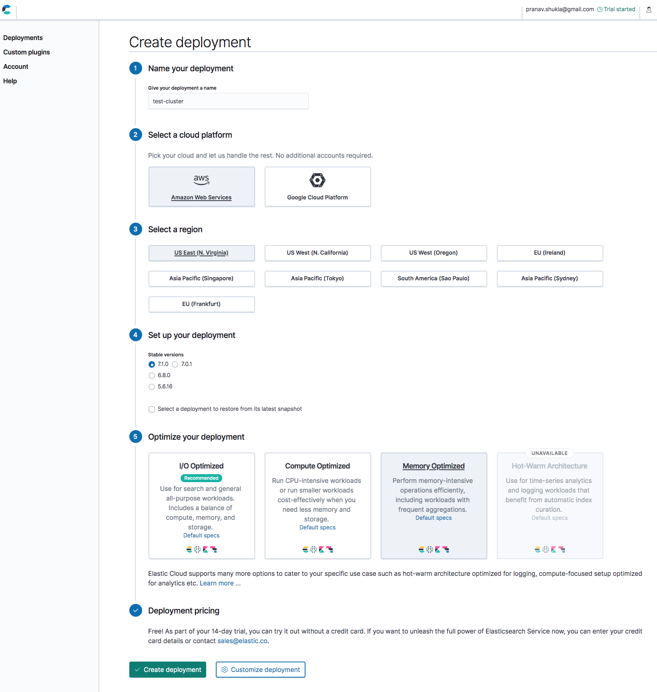
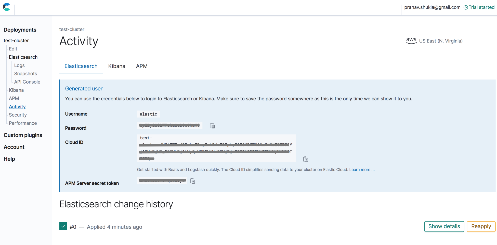
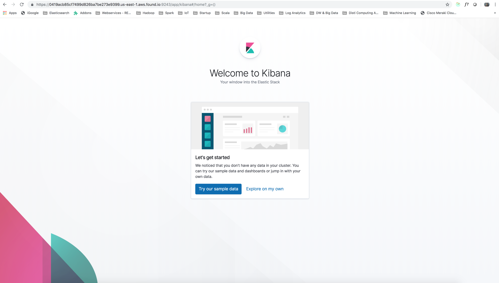
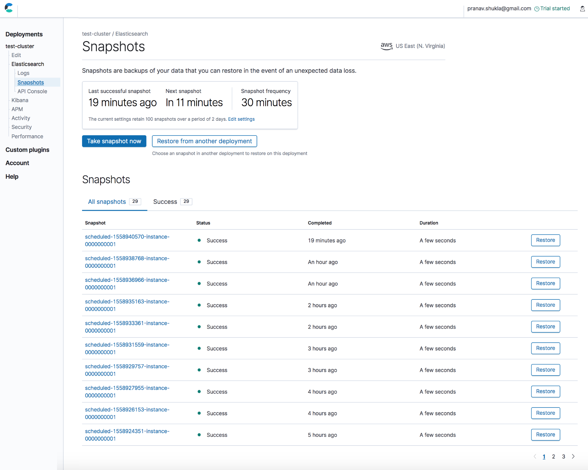
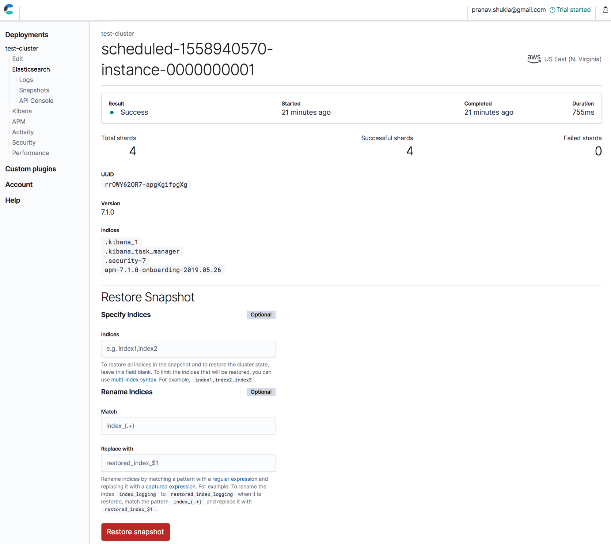

Lab 9. Running Elastic Stack in Production
-------------------------------------------------------


We will start with Elasticsearch and then move on to other
components. There are various ways to run Elasticsearch in production.
There may be various factors that influence your decision on how you
should deploy. We will cover the following topics to help you take your
next Elastic Stack project to production: 


-   Hosting Elastic Stack on a managed cloud
-   Hosting Elastic Stack on your own, that is, self-hosting
-   Backing up and restoring
-   Setting up index aliases
-   Setting up index templates
-   Modeling time series data


Let\'s first understand how we can go about taking Elastic Stack to
production with one of the managed cloud providers. This option requires
a minimum amount of work to set up a production-ready cluster.


Hosting Elastic Stack on a managed cloud
----------------------------------------------------------


Cloud providers make the process of setting up a production-ready cluster much easier. As a user, we
don\'t have to do low-level configuration or the selection and
management of hardware, an operating system, and many of the
Elasticsearch and Kibana configuration parameters. 

There are multiple cloud providers that provide managed clusters for Elastic Stack, such as Elastic Cloud, QBox.io,
Bonsai, and many more. In this section, we will go through how to
get started with **Elastic
Cloud**. Elastic Cloud is the official cloud offering by the
company Elastic.co, which is the main company
contributing to the development of Elasticsearch and other Elastic Stack
components. We will cover the following topics while working with
Elastic Cloud:


-   Getting up and running on Elastic Cloud
-   Using Kibana
-   Overriding configuration
-   Recovering from a snapshot

### Getting up and running on Elastic Cloud


Sign up for Elastic Cloud
using <https://www.elastic.co/cloud/as-a-service/signup>,
provide your email address, and verify your
email. You will be asked to set your initial
password.

After your initial password is set, you can log in to the Elastic Cloud
console
at [https://cloud.elastic.co](https://cloud.elastic.co/). The
Elastic Cloud console offers an easy-to-use user interface to manage
your clusters. Since you just signed up for a trial account, you can
create a free cluster during the trial period.

We can choose a name for your trial cluster. You will also be able to
choose **AWS** (Amazon Web Services)
or **GCE** (Google Compute Engine) while
launching the cluster. Upon logging in, you
can create a cluster from the following
screen:





Fig-9.1: Creating a new cluster on Elastic Cloud

After selecting the cloud platform, you can choose a region for your cluster. 

Select the version to be the latest 7.x version that is available. At
the time of writing this book, version 7.1.0 is the latest version
available on Elastic Cloud. You have the option of choosing either
**I/O Optimized**, **Compute Optimized**,
**Memory Optimized**, or **Hot-Warm
Architecture** deployment. Different types of clusters are
suitable for different use cases.

When you click the the **`Create deployment`** button, your cluster will
be created and started with production-grade configuration. The cluster
will be secured. It will also start with a Kibana instance. At this
point, it should provide you with a username/password to be used for
logging into your Elasticsearch and Kibana nodes. Please note it down.
It also provides a **`Cloud ID`**, which is a helpful string when
connecting to your cloud cluster from your Beats agents and Logstash
servers.

You can click under the **Deployments** text where you will
see the name with which you created your deployment. In this case, we
called it `test-cluster`. If you click on that, you should see
a screen that has a summary of your deployment:





Fig-9.2: Deployment Overview screen on Elastic Cloud

As you can see, the cluster is up and running. In the
second tab, **Kibana**, you can
get the URL at which it is accessible. The Elasticsearch cluster is
available at the given secured HTTPS URL.

The cluster has two nodes: one in each AWS availability zone and one
tiebreaker node. The tiebreaker node helps to elect a master node.
Tiebreaker nodes are special nodes on Elastic Cloud that help in the
re-election of masters whenever some nodes become unreachable in the
cluster.

Now that we have the cluster up and running with a Kibana instance,
let\'s use it!

### Using Kibana


The link to the Kibana instance is already made available to us
on the cluster overview page on Elastic Cloud. You can click on it to
launch the Kibana UI. Unlike the local instance of Kibana that we initially created, this instance is secured by
X-Pack security. You will have to log in using the credentials provided
to you after you created the Elastic Cloud cluster in the previous
section.

After logging in, you should see the **Kibana** UI, as
follows:





Fig-9.3 Kibana UI on Elastic Cloud after logging in

You can view all indexes, analyze data on your Elasticsearch cluster,
and monitor your Elasticsearch cluster from this Kibana UI.

### Overriding configuration 


It is possible to override the configuration
of your Elasticsearch nodes via the **`Edit`** menu in the navigation
panel on the left side under the **Deployments**. Elastic
Cloud doesn\'t allow you to edit the `elasticsearch.yml` file
directly. However, it provides a section called **User
Settings**, which allows you to override a subset of the
configuration parameters.

The configuration parameters that can be overridden are documented in the Elastic Cloud reference documentation
at <https://www.elastic.co/guide/en/cloud/current/ec-add-user-settings.html>.

### Recovering from a snapshot


Elastic Cloud automatically creates a snapshot of
all indexes in your cluster periodically
(every 30 minutes) and keeps them for recovery purposes, if required.
This happens automatically without doing any additional setup or code.
You can visit the **`Snapshots`** link under your
**Deployments** \> **Elasticsearch** to view the
available list of **Snapshots**, as follows:





Fig-9.4: Listing of snapshots on Elastic Cloud

You can choose the snapshot that you want to restore from, and you will
be presented with the following screen:





Fig-9.5: Snapshot details and restoring from a specific snapshot

The snapshot contains the saved state for all indexes in the cluster. It
is possible to choose a subset of the indexes for restoring and also to
rename it while restoring it. It is also possible to restore the
snapshot on a separate cluster. 

Next, we will see how to get started with Elastic Stack if you are
planning to manage the Elastic Stack components yourself. This is also
called **self-hosting**, in that you will be hosting and
managing it on your own.


Hosting Elastic Stack on your own
---------------------------------------------------


Hosting Elastic Stack on your own, that is, self-hosting Elastic Stack,
requires you to install, configure, and manage Elasticsearch and your
other Elastic Stack products. This can be done in one of two ways:


-   Self-hosting on-premise
-   Self-hosting on a cloud


Regardless of whether you run Elastic Stack on-premise (in your own data
center) or run it on one of the cloud providers, such as AWS, Azure, or
GCE, there are some common aspects that you should take into
consideration. While self-hosting, you will be faced with the following
choices:


-   Selecting hardware
-   Selecting the operating system
-   Configuring Elasticsearch nodes
-   Managing and monitoring Elasticsearch nodes
-   Special considerations while self-hosting on a cloud


Except for the last item, which is applicable only if you are
self-hosting on a cloud, the others are equally applicable for cloud and
on-premise deployments.


### Selecting hardware


Elasticsearch primarily has memory-bound tasks which rely on the inverted index. The more data that it can fit in
the RAM, the faster the performance will be. But this statement cannot
always be generalized. It depends on the nature of your data and the
type of operations or workload that you are going to have.

Using Elasticsearch doesn\'t mean that it has to perform all operations
in-memory. Elasticsearch also uses on-disk data very efficiently,
especially for aggregation operations.


### Note

All datatypes (except analyzed strings) support a special data structure
called `doc_values`, which organizes the data on the disk in a
columnar fashion. `doc_values` is useful for sorting and
aggregation operations. Since `doc_values` is enabled by
default for all datatypes except analyzed strings, it makes sorts and
aggregations run mostly off the disk. Those fields do not need to be
loaded in memory to aggregate or sort by them.


As Elasticsearch can scale horizontally, this is a
relatively easy decision to make. It is fine
to start with nodes of around 16 or 32 GB RAM, with around 8 CPU cores.
As we will see in the coming sections, you cannot have Elasticsearch JVM
with more than 32 GB of heap; effectively, there is no point in having a
machine with more than 64 GB RAM. SSD hard disks are recommended if you
are planning to do heavy aggregations.

It is important to benchmark with the initial hardware and then add more
nodes or upgrade your nodes.

### Selecting an operating system


Linux is the preferred choice when deploying
Elasticsearch and the Elastic Stack components. Your choice of operating
system will mostly depend on the preferred technologies of your
organization. Elastic Stack can also be deployed on Windows if your
organization prefers the Microsoft stack.

### Configuring Elasticsearch nodes


Elasticsearch, which is the heart of Elastic
Stack, needs some configuration before starting it in production. Most
of the configuration should work out of the box, but will require the
following things to be reviewed at the OS level or JVM level.


#### JVM heap size


Set -Xms and -Xmx to be the same. More heap means Elasticsearch can keep more data in memory for faster
access. But more heap also means that when the Java heap is close to full, the JVM\'s garbage collector will run a
full garbage collection. At that point, all other processing within the
Elasticsearch node experiences a pause. So, the larger the heap, the
longer the pauses will be. The maximum heap size that you can configure
is around 32 GB. Another recommendation to keep in mind is that we
should allocate no more than 50% of the total available RAM on the
machine to the Elasticsearch JVM. The reason is that the system needs
enough memory for the filesystem cache for Apache Lucene. Ultimately,
all the data stored on the Elasticsearch node is managed as Apache
Lucene indexes, which needs RAM for fast access to the files.

So, if you are planning to store huge amounts of data in Elasticsearch,
there is no point in having one single node with more than 64 GB RAM
(50% of which is 32 GB, the maximum heap size). Instead, add more nodes
if you want to scale. 

#### Disable swapping


When swapping is enabled, an OS generally has a tendency
to reclaim the memory from an application by
swapping the data to disk to make more memory available for other
programs.

On the Elasticsearch node, this can result in the OS swapping out the
heap memory of Elasticsearch. This process of swapping out from memory
to disk and then swapping back from disk to memory can slow down the
process. This is why swapping should be disabled on the node that is
running Elasticsearch.

#### File descriptors


On Linux and macOS operating systems, there is a limit to the number of open file handles or file descriptors that
a process can keep. This often needs to be increased in the case of
Elasticsearch, as the default value is generally quite low for the open
file descriptor limit.

#### Thread pools and garbage collector


Elasticsearch does many types of operations,
such as indexing, searching, sorting, and aggregations, and uses JVM
thread pools to accomplish its tasks. It is advisable
to not tune the settings related to thread
pools in Elasticsearch. They generally do more harm than help to improve
performance. Another thing not to tune in Elasticsearch is the garbage
collector settings.


### Managing and monitoring Elasticsearch


When you self-host Elasticsearch, the entire monitoring and management
activities for the cluster are on you. It is
necessary to monitor your Elasticsearch node process status, memory, and
disk space on the node. If a node crashes for
any reason, or becomes unavailable, it needs to be started back again.

The snapshots of the Elasticsearch indexes need to be taken regularly
for taking backups. We will discuss the snapshot/restore functionalities
for backing up. Most of the monitoring can be achieved via X-Pack and
Kibana, but management processes need to be set up manually.

### Running in Docker containers


Docker is a popular way of containerizing and
shipping software. The advantage of Docker is that the software that is
dockerized and runs inside a light-weight container that has a small overhead compared to a virtual machine. As
a result of its reduced overhead and large pool of publicly available
Docker images, Docker is a great way to run software in production in a
predictable way without the need of much configuration.

Official Elasticsearch Docker images are available for download in
different flavors:


-   Elasticsearch with basic X-Pack license
-   Elasticsearch with full X-Pack license and 30-day evaluation
-   Open source version of Elasticsearch without X-Pack


Getting started with an Elasticsearch instance running inside Docker is
as easy as installing Docker and running
the `docker pull` command with the Elasticsearch image of your
choice. The following simple commands will get your single-node
Elasticsearch 7.0.1 up and running if you have Docker installed on your
system:

```
docker pull docker.elastic.co/elasticsearch/elasticsearch:7.0.1

docker run -p 9200:9200 -p 9300:9300 -e "discovery.type=single-node" docker.elastic.co/elasticsearch/elasticsearch:7.0.1
```

Docker is a highly recommended way of running applications in a
predictable way in production. You can find out more about how to run
Elasticsearch in Docker in a production environment
in the documentation---<https://www.elastic.co/guide/en/elasticsearch/reference/7.0/docker.html>.

### Special considerations while deploying to a cloud


While self-hosting on a cloud, you may choose
one of the cloud providers, such as AWS, Microsoft Azure, or GCE. They
provide compute resources, networking capabilities, virtual private
clouds, and much more, to get control over your servers. Using a cloud
provider as opposed to running on your own hardware comes with the
following advantages:


-   No upfront investment in hardware
-   Ability to upgrade/downgrade servers
-   Ability to add or remove servers as and when needed


It is typical to not be sure how much CPU, RAM, and so on, is required
for your nodes when you start. Choosing the cloud gives the flexibility
to benchmark on one type of configuration and then upgrade/downgrade or
add/remove nodes as needed without incurring upfront costs. We will take
EC2 as an example and try to understand the considerations to take into
account. Most of the considerations should remain similar for other
cloud providers as well. The following are some of the aspects to
consider on AWS EC2:


-   Choosing instance type
-   Changing the ports; do not expose ports!
-   Proxy requests
-   Binding HTTP to local addresses
-   Installing EC2 discovery plugin


-   Installing S3 repository plugin
-   Setting up periodic snapshots


Let\'s focus on them one by one.


#### Choosing instance type


EC2 offers different types of instances to meet different requirements.
A typical starting point for Elasticsearch is to consider
the `m5d.large` or `m5d.2xlarge` instance; they have
has 4 CPU cores and 8 CPU cores with 16 and 32 GB RAM respectively, and
SSD storage. It is always good to benchmark on your data and
monitor the resource usage on your nodes. You
can upgrade or downgrade the nodes as per your findings.

#### Changing default ports; do not expose ports!


Running any type of service in a cloud involves different security
risks. It is important that none of the ports used by Elasticsearch are
exposed and accessible from the public
internet. EC2 allows detailed control over which ports are accessible
and from which IP addresses or subnets. Generally, you should not need
to make any ports accessible from outside anywhere other than
port `22` in order to log in remotely.

By default, Elasticsearch uses port `9200` for HTTP traffic
and `9300` for inter-node communication. It is advisable to
change these default ports by editing `elasticsearch.yml` on
all nodes.

#### Proxy requests


Use a reverse proxy such as nginx
(pronounced **engine x) or Apache to proxy your requests to
Elasticsearch/Kibana.

#### Binding HTTP to local addresses


You should run your Elasticsearch nodes in
a **VPC** (Virtual Private Cloud). More
recently, AWS creates all nodes in a VPC. The
nodes that do not need to interface with the clients accept the queries from clients over HTTP. This can
be done by setting `http.host`
in `elasticsearch.yml`. You can find out more about the HTTP
host/port bindings in the reference documentation
at <https://www.elastic.co/guide/en/elasticsearch/reference/current/modules-http.html>.

#### Installing EC2 discovery plugin


Elasticsearch nodes discover their peers via multicast when they are
in the same network. This works very well in
a regular LAN. When it comes to EC2, the network is shared and the node
to node communication and automatic discovery don\'t work. It requires
the installation of the EC2 discovery plugin on all nodes to be able to
discover new nodes.

To install the EC2 discovery plugin, follow the instructions
at <https://www.elastic.co/guide/en/elasticsearch/plugins/current/discovery-ec2.html> and
install it on all nodes.

#### Installing the S3 repository plugin


It is important to back up your data in Elasticsearch regularly to
restore the data if a catastrophic event
occurs or if you want to revert to a last known healthy state. We will
look at how to backup and restore using the snapshot/restore APIs of
Elasticsearch in the next section. In order to take regular backups and
store them in centralized and resilient data storage, we need to set up
a snapshot mechanism. When you are running Elasticsearch in EC2, it
makes sense to store snapshots in an AWS S3
bucket.


### Note

**S3** stands for **Simple Storage Service**. It
is a scalable, durable, and reliable storage service to store large
amounts of data. It provides comprehensive security for your data and
accessibility from many different platforms. It can meet very stringent
compliance requirements due to its comprehensive security support. It is
often the preferred solution for storing long-term data, especially when
systems that generate the data are hosted on AWS.


The S3 repository plugin can be installed using the following command;
it needs to be installed on every node of your Elasticsearch cluster:

```
sudo bin/elasticsearch-plugin install repository-s3
```


#### Setting up periodic snapshots


Once you have a repository set up on S3, we need to ensure that actual snapshots are taken periodically. What
this means is that we need a scheduled job that triggers the command to
take a snapshot at regular intervals. The interval could be 15 minutes,
30 minutes, one hour, and so on, depending on the sensitivity of your
data. We will see how to establish the snapshot/restore process for your
cluster in depth later in this lab.

These are some of the considerations that you have to address while
running Elasticsearch in production on AWS or other clouds. 

So far, we have covered how to get your production up and running on a
managed cloud or self-hosted environment. If you opted to self-host, you
will need to set up a backup and restore process so that you don\'t lose
your data. The next section is only applicable if you are self-hosting
your Elasticsearch cluster.


Backing up and restoring
------------------------------------------


Taking regular backups of your data to recover in the event of
catastrophic failures is absolutely critical. It is important that all
of your data is saved periodically at fixed time intervals and a
sufficient number of such backups are preserved.

A common strategy is to take a full backup of
your data at regular intervals and keep a fixed number of backups. Your
cluster may be deployed on-premise in your own data center or it may be
deployed on a cloud hosted service such as AWS, where you may be
managing the cluster yourself.

We will look at the following topics on how to manage your backups and restore a specific backup if it is needed:


-   Setting up a repository for snapshots
-   Taking snapshots
-   Restoring a specific snapshot


Let\'s look at how to do these one by one.


### Setting up a repository for snapshots


The first step in setting up a regular backup
process is setting up a repository for storing snapshots. There are different places where we could
store snapshots:


-   A shared filesystem
-   Cloud or distributed filesystems (S3, Azure, GCS, or HDFS)


Depending upon where the Elasticsearch cluster is deployed, and which
storage options are available, you may want to set up the repository for
your snapshots in a certain way.

Let\'s first understand how you would do this in the simplest of
scenarios, when you want to store it in a shared filesystem directory.


#### Shared filesystem


When your cluster has a shared filesystem
accessible from all the nodes of the cluster,
you have to ensure that the shared filesystem is accessible on a common
path. You should mount that shared folder on all nodes and add the path
of the mounted directory. The shared, mounted filesystem\'s path should
be added to each node\'s `elasticsearch.yml` as follows:

```
path.repo: ["/mount/es_backups"]
```


### Note

If you are running a single node cluster and haven\'t set up a real
distributed cluster, there is no need for a mounted shared drive.
The `path.repo` parameter can be set to a local directory of
your node. It is not recommended to run a production server on a single
node cluster.


Once this setting is added to `config/elasticsearch.yml` on
all nodes, please restart all the nodes of your cluster.

The next step is to register a named repository under this registered
folder. This is done using the following `curl` command, where
we are registering a named repository with the name `backups`:

```
curl -XPUT 'http://localhost:9200/_snapshot/backups' -H 'Content-Type: application/json' -d '{
    "type": "fs",
    "settings": {
        "location": "/mount/es_backups/backups",
        "compress": true
    }
}'
```

You will need to replace `localhost` with the hostname or IP
address of one of the nodes on your cluster.
The `type` parameter set to `fs` is for the shared
filesystem. The `settings` parameter\'s body depends on
the `type` parameter\'s value.

Since we are currently looking at a shared filesystem snapshot
repository, the body of the `settings` parameter has specific
parameters to set up the shared filesystem-based repository. If
the `location` parameter is specified as an absolute path, it
must be under one of the folders registered with
the `path.repo` parameter in `elasticsearch.yml`. If
the `location` parameter is not an absolute path,
Elasticsearch will assume it is a relative path from
the `path.repo` parameter.
The `compress` parameter saves the snapshots in compressed
format.


### Cloud or distributed filesystems


When you are running your Elasticsearch cluster on AWS, Azure, or Google
Cloud, it makes sense to store the snapshots in one of the alternatives
provided by the cloud platform to store the data in robust, fault
tolerant storage, rather than storing it on a shared drive.

Elasticsearch has official
plugins that allow you to store the snapshots
in S3. All you need to do is install the
repository---`s3` plugin on all nodes of your cluster and set
up the repository settings in a similar way to how we set up the shared
filesystem repository:

```
curl -XPUT 'http://localhost:9200/_snapshot/backups' -H 'Content-Type: application/json' -d '{
    "type": "s3",
    "settings": {
        "bucket": "bucket_name",
        "region": "us-west",
        ...
    }
}'
```

The `type` should
be `s3` and `settings` should have relevant values
for `s3`.

### Taking snapshots


Once the repository is set up, we can put named snapshots into a specific repository:

```
curl -XPUT 'http://localhost:9200/_snapshot/backups/backup_201905271530?pretty' -H 'Content-Type: application/json' -d'
{
  "indices": "bigginsight,logstash-*",
  "ignore_unavailable": true,
  "include_global_state": false
}
'
```

In this command, we specified that we want a snapshot to be taken in the
repository `backups` with the
name `backup_201905271530`[*. *] The name of the
snapshot could be anything, but it should help you identify the snapshot
at a later stage. One typical strategy would be to take a snapshot every
30 minutes and set snapshot names with prefixes such
as `backup_yyyyMMddHHmm`. In the event of any failure, you
could then identify the snapshot that can be restored.

Snapshots are incremental by default. They don\'t store all the
redundant data in all snapshots.

Having taken the snapshots periodically, you would want to list all the
snapshots that exist in a repository. This can be done using the
following command:

```
curl -XGET 'http://localhost:9200/_snapshot/backups/_all?pretty'
```


### Restoring a specific snapshot


If the need arises, you can restore the state
from a specific snapshot using the following command:

```
curl -XPOST 'http://localhost:9200/_snapshot/backups/backup_201905271530/_restore'
```

This will restore the `backup_201905271530` snapshot from
the `backups` repository. 

Once we have set up a periodic job that takes and stores a snapshot, we
are safe in the event of any failure. We now have a cluster that is
recoverable from any disaster-like situation. Remember, the output
of snapshots should be stored in resilient
storage. At least, it should not be saved on the same Elasticsearch
cluster; it should be saved on different storage, preferably a robust
filesystem that is highly available, such as S3, HDFS, and so on.

So far in this lab, we have got up and running with a cluster that
is reliable and is backed up regularly. In the upcoming sections, we
will see how to address some common scenarios in data modeling. We will
see some common strategies for setting up aliases for indexes, index
templates, modeling time-series data, and so on.


Setting up index aliases
------------------------------------------


Index aliases let you create aliases for one or more indexes or index name patterns. We will cover the
following topics in order to learn how index aliases work:


-   Understanding index aliases
-   How index aliases can help

### Understanding index aliases


An index alias just provides an extra name to refer to an index; it can be defined in the following way:

```
POST /_aliases
{
  "actions" : [
    { "add" : { "index" : "index1", "alias" : "current_index" } }
  ]
}
```

Here, `index1` can be referred to with the
alias `current_index`. Similarly, the index alias can be
removed with the `remove` action of
the `_aliases` REST API:

```
POST /_aliases
{
  "actions" : [
    { "remove" : { "index" : "index1", "alias" : "current_index" } }
  ]
}
```

The preceding call will remove the alias `current_index`. Two
actions can be combined in a single invocation of
the `_aliases` API. When two calls are combined, the
operations are done automatically. For example, the following call would
be completely transparent to the client:

```
POST /_aliases
{
  "actions" : [
    { "remove" : { "index" : "index1", "alias" : "current_index" } },
    { "add" : { "index" : "index2", "alias" : "current_index" } }
  ]
}
```

Before the call, the alias `current_index` was referring to
the index `index1`[*, *] and after the call, the
alias will refer to the index `index2`[*. *] 

### How index aliases can help


Once in production, it often happens that we need to reindex data from one index to another. We might have one
or more applications developed in Java, Python, .NET, or other
programming environments that may be referring to these indexes. In the
event that the production index needs to be changed
from `index1`[* *] to `index2`, it will
require a change in all client applications.

Aliases come to the rescue here. They offer extra flexibility, and
hence, they are a recommended feature to use in production. The key
thing is to create an alias for your production index and use the alias
instead of the actual index name in the client applications that use
them.

In the event that the current production index needs to change, we just
need to update the alias to point to the new index instead of the old
one. Using this feature, we can achieve zero downtime in production in
the case of data migration or the need for reindexing. Aliases use a
famous principle in computer science---an extra layer of
indirection can solve most problems in
computer science---<https://en.wikipedia.org/wiki/Indirection>.

Apart from the ones discussed here, there are more features that aliases
offer; these include the ability to use index patterns, routing, the
ability to specify filters, and many more. We will see how index aliases
can be leveraged when creating time-based indexes later in the lab.


Setting up index templates
--------------------------------------------


One important step while setting up your index is defining the mapping for the types, number of
shards, replica, and other configurations. Depending upon the complexity
of the types within your index, this step can involve a substantial
amount of configuration.

Index templates allow you to create indexes based on a given template,
rather than creating each index manually beforehand. Index templates
allow you to specify settings and mappings for the index to be created.
Let\'s understand this by going through the following points:


-   Defining an index template
-   Creating indexes on the fly


Let\'s say we want to store sensor data from various devices and we want
to create one index per day. At the beginning of every day, we want a
new index to be created whenever the first sensor reading is indexed for
that day. We will look into the details of why we should use such
time-based indexes in the next section.


### Defining an index template


We start by defining an index template:

```
PUT _template/readings_template                 1
{
  "index_patterns": ["readings*"],              2
  "settings": {                                 3
    "number_of_shards": 1
  },
  "mappings": {                                 4
    "properties": {
      "sensorId": {
        "type": "keyword"
      },
      "timestamp": {
        "type": "date"
      },
      "reading": {
        "type": "double"
      }
    }
  }
}
```

In this `_template` call, we define the following things:


-   A template with the name `readings_template`.
-   The index name patterns that will match this template. We configured
    `readings*` as the one and only index pattern. Any attempt
    to index into an index that does not exist but matches this pattern
    would use this template.
-   The settings to be applied to the newly created index from this
    template.
-   The mappings to be applied to the newly created index from this
    template.


Let\'s try to index data into this new index.

### Creating indexes on the fly


When any client tries to index the data for a
particular sensor device, it should use the index name with the current
day appended in `yyyy-mm-dd` format
after `readings`. A call to index data
for `2019-05-01` would look like the following:

```
POST /readings-2019-05-01/_doc
{
  "sensorId": "a11111",
  "timestamp": 1483228800000,
  "reading": 1.02
}
```

When the first record for the date `2019-05-01` is being
inserted, the client should use the index
name `readings-2019-05-01`. Since this index doesn\'t exist
yet, and we have an index template in place, Elasticsearch creates a new
index using the index template we defined. As a result, the settings
and mappings defined in our index template get applied to this new
index.

This is how we create indexes based on index templates. In the next
section, let\'s understand why these types of time-based indexes are
useful and how to use them in production with your time-series data.


Modeling time series data
-------------------------------------------


Often, we have a need to store time series data in Elasticsearch.
Typically, one would create a single index to hold all documents. This
typical approach of one big index to hold all
documents has its own limitations, especially for the following reasons:


-   Scaling the index with an unpredictable volume over time
-   Changing the mapping over time
-   Automatically deleting older documents


Let\'s look at how each problem manifests itself when we choose a single
monolithic index.


### Scaling the index with unpredictable volume over time


One of the most difficult choices when creating an Elasticsearch cluster
and its indexes is deciding how many primary shards should be created
and how many replica shards should be
created.

Let\'s understand how the number of shards becomes important in the
following sub-sections:


-   Unit of parallelism in Elasticsearch:
    
    -   The effect of the number of shards on the relevance score
    -   The effect of the number of shards on the accuracy of
        aggregations
    

#### Unit of parallelism in Elasticsearch


We have to decide the number of shards at the
time of creating the index. The number of shards cannot be changed once
the index has been created. There is no golden rule that will help you
decide how many shards should be created at the time of creating an
index. The number of shards actually decides
the level of parallelism in the index. Let\'s understand this by taking
an example of how a search query might be executed.

When a search or aggregation query is sent by a client, it is first
received by one of the nodes in the cluster. That node acts as a
coordinator for that request. The coordinating node sends requests to
all the shards on the cluster and waits for the response from all
shards. Once the response is received by the coordinating node from all
shards, it collates the response and sends it back to the original
client.

What this means is, when we have a greater number of shards, each shard
has to do relatively less work and parallelism can be increased. 

But can we choose an arbitrarily big number of shards? Let\'s look at
this in the next couple of sub-sections.


##### The effect of the number of shards on the relevance score


A large number of small shards is not always
the solution, as it can affect the relevance of the search results. In
the context of search queries, the relevance score is calculated within
the context of a shard. The relative frequencies of documents are
calculated within the context of each shard and not across all shards.
This is why the number of shards can affect the overall scores observed
for a query. In particular, having too many shards to address the future scalability problem is not a solution.

##### The effect of the number of shards on the accuracy of aggregations


Similar to the execution of the search query, an aggregation query is
also coordinated by a coordinating node. Let\'s say that the client has
requested terms aggregation on a field that can take a large number of
unique values. By default, the terms aggregation returns the top 10
terms to the client.

To coordinate the execution of terms aggregation, the coordinator node
does not request all the buckets from all shards. All shards are
requested to give their top [*n*]  buckets. By default, this
number, [*n,*]  is equal to the `size` parameter of
the terms aggregation, that is, the number of top buckets that the
client has requested. So, if the client requested the top 10 terms, the
coordinating node in turn requests the top 10 buckets from each shard.

Since the data can be skewed across the shards to a certain extent, some
of the shards may not even have certain buckets, even though those
buckets might be one of the top buckets in some shards. If a particular
bucket is in the top [*n*]  buckets returned by one of the
shards and that bucket is not one of the top [*n*]  buckets by
one of the other shards, the final count aggregated by the coordinating
node will be off for that bucket. A large number of shards, just to
ensure future scalability, does not help the accuracy of aggregations.

We have understood why the number of shards is important and how
deciding the number of shards upfront is difficult. Next, we will see
how changing the mapping of indexes becomes difficult over a period of
time.


### Changing the mapping over time


Once an index is created and documents start
getting stored, the requirements can change. There is only one thing
that is constant, **change**. 

When the schema changes, the following types of change may happen with
respect to the schema:


-   New fields get added
-   Existing fields get removed

#### New fields get added


When the first document with a new field gets indexed, the new field\'s
mapping is automatically created if it
doesn\'t already exist. Elasticsearch infers the datatype of the field
based on the value of that field in the first document in order to
create the mapping. The mappings of one particular type of document can
grow over a period of time.

Once a document with a new field is indexed, the mapping is created for
that new field and its mapping remains.

#### Existing fields get removed


Over a period of time, the requirements of a project can change. Some
fields might become obsolete and may no longer be used. In the case of
Elasticsearch indexes, the fields that are no longer used are not
removed automatically; the mapping remains in the index for all the
fields that were ever indexed. Each extra field in the Elasticsearch
index carries an overhead; this is especially true if you have hundreds
or thousands of fields. If, in your use case, you have a very high
number of fields that are not used, it can increase the burden on your
cluster.


### Automatically deleting older documents


No cluster has an infinite capacity to retain data forever. With the volume growing over a period of time,
you may decide to only store necessary data in Elasticsearch. Typically,
you may want to retain data for the past few weeks, months, or years in
Elasticsearch, depending on your use case.

Prior to Elasticsearch 2.x, this was achieved
using **TTL** (Time to Live) set on individual
documents. Each document could be configured to remain in the index for
a configurable amount of time. But, the TTL feature was deprecated with
the 2.x version because of its overheads in maintaining time-to-live on
a per-document basis.

We have seen some problems that we might face while dealing with time
series data. Now, let\'s look at how the use of **time-based indexes **addresses these issues.
Time-based indexes are also called **index-per-timeframe**:


-   How index-per-timeframe solves these issues
-   How to set up index-per-timeframe


### How index-per-timeframe solves these issues


Instead of going with one big monolithic
index, we now create one index per timeframe.
The timeframe could be one day, one week, one month, or any arbitrary
time duration. For example, in our example in the [*Index
Template*]  section, we chose index-per-day. The names of the
index would reflect that---we had indexes such
as `readings-2019-05-01`, `readings-2019-05-02`, and
so on. If we had chosen index-per-month, the index names would look
like `readings-2019-04`, `readings-2019-05`, `readings-2019-06`,
and so on.

Let\'s look at how this scheme solves the issues we saw earlier one by
one.


#### Scaling with index-per-timeframe


Since we no longer have a monolithic index that needs to hold all historic data, scaling up or scaling
down according to the recent volumes becomes easier. The choice of the
number of shards is not an upfront and permanent decision. Start with an
initial estimated number of shards for the given time period. This
number, the chosen number of shards, can be put in the index template.

Since that choice of shards can be changed before the next timeframe
begins, you are not stuck with a bad choice. With each time period, it
gives a chance to adjust the index template to increase or decrease the
number of shards for the next index to be created.

#### Changing the mapping over time


Changing the mapping becomes easier, as we could just update the index
template that is used for creating new indexes. When the index template
is updated, the new index that is created for
the new timeframe uses the new mappings in the template.

Again, each timeframe gives us an opportunity to change.

#### Automatically deleting older documents


With time-based indexes, deleting the older
documents becomes easier. We could just drop older indexes rather than
delete individual documents. If we were using monthly indexes and wanted
to enforce six-month retention of data, we could delete all indexes
older than 6 months. This may be set up as a scheduled job to look for
and delete older indexes.

As we have seen in this section, setting up index-per-timeframe
has obvious advantages when we are dealing with time-series data. 


Summary
-------------------------


In this lab, we have seen essential techniques necessary to take
your next Elastic Stack application to production. We have seen various
deployment options, including cloud-based and on-premise. We have seen
how to use a managed cloud service provider such as Elastic Cloud and
have also covered how to self-host Elastic Stack. We have covered some
common concerns and decision choices that you will face, whether you
self-host or use a managed cloud provider.

Additionally, we have seen various techniques useful in a
production-grade Elastic Stack deployment. These include the usage of
index aliases, index templates, and modeling time-series data. This is
definitely not a comprehensive guide covering all the nuances of running
Elastic Stack in production, but we have definitely covered enough for
you to comfortably take your next Elastic Stack project to production.

Equipped with all these techniques, we will build a sensor data
analytics application in the next lab, Lab 10[*, Building a
Sensor Data Analytics Application*] .
